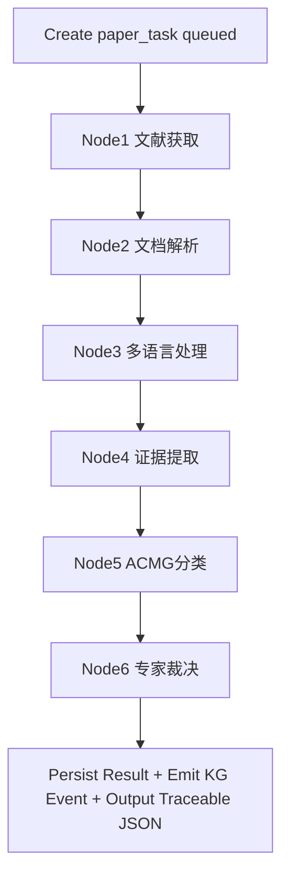
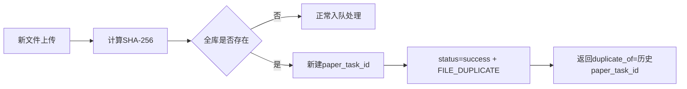

# ACMG-Lingua 应用流程（APP_FLOW）

## 1. 总览
系统由两个工作流组成：
1. 主工作流（业务闭环）：文献获取 -> 文档解析 -> 多语言处理 -> 证据提取 -> ACMG 分类 -> 专家裁决
2. KG 工作流（独立服务）：从 PostgreSQL 读取结构化证据，构建/更新 Neo4j 图谱

主工作流最小执行单元是“单篇文献”，由 Celery 执行。请求级通过 `request_id` 聚合多个 `paper_task_id`。

## 2. 入口流程
### 2.1 交互 Agent 任务澄清
1. 用户输入模糊需求。
2. 交互 Agent 最多追问 2 轮。
3. 产出自然语言任务单（字段：目标、疾病、国家、语种）。
4. 任务单落库（永久保存文本+结构化元数据）。
5. 生成 `request_id`（UUIDv4）。

### 2.2 分支选择
1. 用户上传文献（PDF/DOCX）：直接进入解析流程，跳过文献获取。
2. 用户不上传：进入文献获取（多源 API + 爬取）。
3. 候选列表返回最多 20 条，分页 `default=5, max=5`。
4. 用户至少选择 1 条、最多选择 5 条。
5. 用户未选择且未上传：返回 `failed + INPUT_INVALID`，流程终止。

## 3. 主工作流（单篇文献）

## 4. 节点执行细则
### 4.1 Node1 文献获取
- 支持数据源：
1. API：`biopython/pubmed`、`pmc`、`crossref`、`doaj`、`jstage`、`unpaywall`
2. 爬取：`hans_publishers`、`pubscholar`、`cyberleninka`
- 调用顺序由调度智能体动态决定。
- 国家过滤依赖 ISO 映射表，不允许降级到语种近似。
- 国家无命中：`FETCH_NO_RESULT`。
- 全文不可得：标记 `fulltext_unavailable`，降级摘要证据继续。

### 4.2 Node2 文档解析（`pdf-parser-service`）
- 输入：PDF/DOCX。
- PDF：优先 MinerU，失败回退 PaddleOCR-VL-1.5。
- DOCX：解析失败直接 `PARSE_FAILED`。
- 输出：结构化 `md` 与抽取图片 `jpg`，写入 MinIO。

### 4.3 Node3 多语言处理（`translation-service`）
- 原文英文：直接跳过。
- 非英文：全文翻译为英文。
- 输出：英文 `md` 写入 MinIO。
- 向量化：`BGE-M3` 写入 Qdrant。
- 对齐信息：写入 PostgreSQL alignment 表。

### 4.4 Node4 证据提取（`evidence-extraction-service`）
- 基础框架：`scispaCy + LlamaIndex`。
- 实体识别：基因、变异、蛋白、疾病、实验术语。
- 关系抽取：基因-变异-疾病关系。
- 实验信息抽取：方法、结果、结论。
- 检索策略：关键词检索 + 向量检索 + `juniper-bge-reranker-large_v2` 精排。

### 4.5 Node5 ACMG 分类
- 基于 ACMG 指南知识库（RAG）进行分类。
- 输出分类结果、关键证据与推理过程。
- v1.0 范围：仅 PS3/BS3。

### 4.6 Node6 专家裁决
- 基于 RAG 汇总多源证据。
- 输出证据强度与裁决说明。

## 5. 去重与重复文件流程

规则：
1. 重复文件不执行处理节点。
2. `FILE_DUPLICATE` 计入成功率分子和分母。
3. 请求中全部重复时，请求状态为 `success`。

## 6. 请求级状态聚合
### 6.1 状态集合
- `queued`
- `running`
- `partial_failed`
- `failed`
- `success`

### 6.2 判定规则
1. `partial_failed`：至少 1 篇成功且至少 1 篇失败。
2. `success`：全部文献成功，或全部为 `FILE_DUPLICATE` 成功跳过。
3. `failed`：无成功文献且存在失败。

## 7. 调度与重试
1. 节点顺序固定为 6 节点。
2. 源级调用顺序与源级重试由 LLM 调度策略动态决定。
3. 节点级默认重试模板与兜底上限见 [`docs/CONSTANTS.md`](CONSTANTS.md)。
4. 节点最终失败：`paper_task=failed`，不自动重跑。
5. 运维通过脚本重开，复用原 `paper_task_id`，记录 `reopened_by_ops_script`。

## 8. 错误与日志链路
1. API 失败响应固定：`failed + error_code + log_link`
2. `log_link` 为签名 URL，24h 有效。
3. 过期后可重签发。
4. 重签发限流：每 `task_id` 每分钟 1 次。
5. 任意已登录用户可重签发。

## 9. KG 独立工作流
1. 主工作流完成后通过 Celery 事件触发 KG 更新。
2. 事件最小载荷、幂等键见 [`docs/CONSTANTS.md`](CONSTANTS.md)。
3. 首次全量回灌由脚本触发，支持断点续跑。

## 10. 输出与导出
1. JSON 返回完整溯源链（节点输入输出、证据定位、来源元数据）。
2. 渲染“对照阅读页”（双语同时高亮）。
3. 渲染“证据表 + ACMG 分类 + 专家裁决 + 冲突说明”页。
4. 合并为单个 PDF 输出。

## 11. 生命周期与清理
1. 任务单文本+结构化元数据：永久保存。
2. 原始文件：不自动删除（允许运维手动清理）。
3. 解析中间文件：7 天后清理。
4. 运行日志：7 天后清理。
