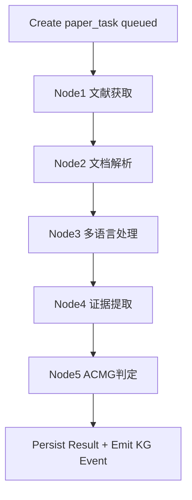
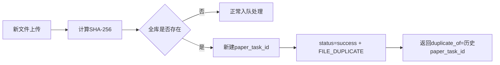

# 多语种证据平台应用流程（APP_FLOW）

## 1. 总览
系统由两个工作流组成：
1. 主工作流（业务闭环）：文献获取 -> 文档解析 -> 多语言处理 -> 证据提取 -> ACMG 判定
2. KG 工作流（独立服务）：从 PostgreSQL 读取结构化证据，构建/更新 Neo4j 图谱

主工作流最小执行单元是“单篇文献”，由 Celery 执行。请求级通过 `request_id` 聚合多个 `paper_task_id`。

## 2. 入口流程
### 2.1 交互 Agent 任务澄清
1. 用户输入模糊需求。
2. 交互 Agent 最多追问 2 轮。
3. 产出自然语言任务单（字段：目标、疾病、国家、语种）。
4. 任务单落库（永久保存文本+结构化元数据）。
5. 生成 `request_id`（UUIDv4）。

### 2.2 分支选择
1. 用户上传文献：直接进入解析流程，跳过文献获取。
2. 用户不上传：进入文献获取（MVP 仅 PubMed）。
3. 候选列表返回最多 15 条，分页 `default=10, max=50`。
4. 用户至少选择 1 条、最多选择 10 条。
5. 用户未选择且未上传：返回 `failed + INPUT_INVALID`，流程终止。

## 3. 主工作流（单篇文献）

## 4. 节点执行细则
### 4.1 Node1 文献获取
- MVP 仅 PubMed。
- 国家过滤依赖 ISO 映射表，不允许降级到语种近似。
- 国家无命中：`FETCH_NO_RESULT`。
- 付费墙全文不可得：标记 `fulltext_unavailable`，降级摘要证据继续。

### 4.2 Node2 文档解析
- 输入：PDF/DOCX。
- PDF：优先 MinerU，失败回退 PaddleOCR-VL-1.5。
- DOCX：解析失败直接 `PARSE_FAILED`。
- 抽取范围：正文、表格、图注。

### 4.3 Node3 多语言处理
- 原文英文：直接跳过。
- 非英文：全文翻译为英文。
- 保留术语英文表达，构建 alignment 记录。
- 翻译破坏 HGVS/基因符号时自动纠正。
- 自动纠正失败：添加 `HGVS_AUTOCORRECT_FAILED`，流程继续。

### 4.4 Node4 证据提取
- 句级关系抽取。
- 支持跨句合并推理。
- 显式标注否定/不确定表达。
- 标准化：HGVS + HGNC + 疾病本体（MONDO>OMIM>MeSH）。

### 4.5 Node5 ACMG 判定
- MVP 仅输出 PS3/BS3。
- 全自动判定。
- 输出规则触发明细。
- 冲突证据全部保留并按文献并列展示。

## 5. 去重与重复文件流程

规则：
1. 重复文件不执行处理节点。
2. `FILE_DUPLICATE` 计入成功率分子和分母。
3. 请求中全部重复时，请求状态为 `success`。

## 6. 请求级状态聚合
### 6.1 状态集合
- `queued`
- `running`
- `partial_failed`
- `failed`
- `success`

### 6.2 判定规则
1. `partial_failed`：至少 1 篇成功且至少 1 篇失败。
2. `success`：全部文献成功，或全部为 `FILE_DUPLICATE` 成功跳过。
3. `failed`：无成功文献且存在失败。

## 7. 重试与终止流程
### 7.1 节点级重试配置
1. 获取：`2 / 300s / 900s`
2. 解析：`1 / 600s / 1800s`
3. 翻译：`2 / 120s / 1200s`
4. 提取：`2 / 300s / 1800s`
5. ACMG：`1 / 180s / 900s`

### 7.2 失败终止与重开
1. 节点最终失败：`paper_task=failed`，不自动重跑。
2. 业务用户无手动重开权限。
3. 运维通过脚本重开，复用原 `paper_task_id`。
4. 状态流：`failed -> queued -> running -> ...`
5. 记录普通任务日志：`reopened_by_ops_script`。

## 8. 错误与日志链路
1. API 失败响应固定：`failed + error_code + log_link`
2. `log_link` 为签名 URL，24h 有效。
3. 过期后可重签发。
4. 重签发限流：每 `task_id` 每分钟 1 次。
5. 任意已登录用户可重签发。

## 9. KG 独立工作流
### 9.1 触发方式
- 主工作流完成后通过 Celery 事件触发 KG 更新。

### 9.2 事件最小载荷
- `request_id`
- `paper_id`
- `step`
- `status`
- `timestamp`
- `idempotency_key`

### 9.3 幂等键
1. `req:{request_id}`
2. `req:{request_id}:paper:{paper_sha256}`
3. `req:{request_id}:paper:{paper_sha256}:step:{step}:v{schema_version}`

### 9.4 首次上线与失败恢复
1. 首次全量回灌由脚本触发。
2. 支持断点续跑。
3. 失败进入重试队列，重试参数沿用 ACMG 节点级策略。

## 10. 报告导出流程
1. 先渲染“对照阅读页”（双语同时高亮）。
2. 再渲染“证据表 + ACMG + 冲突说明”页。
3. 合并为单个 PDF 输出。

## 11. 生命周期与清理
1. 任务单文本+结构化元数据：永久保存。
2. 原始文件：不自动删除（允许运维手动清理）。
3. 解析中间文件：7 天后清理。
4. 运行日志：7 天后清理。
