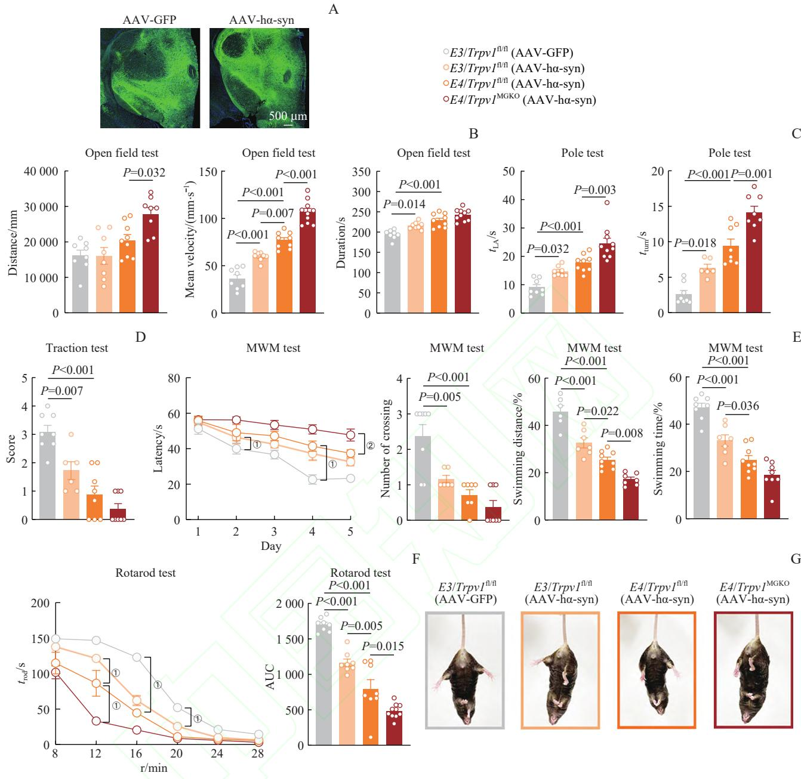
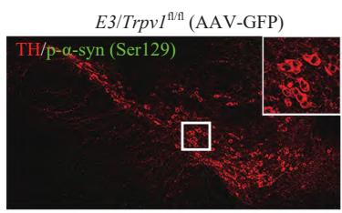
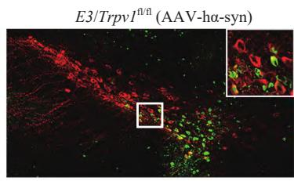
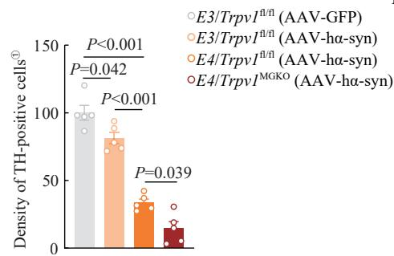
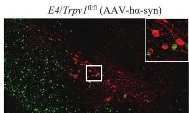
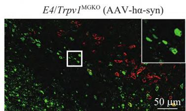
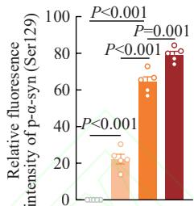
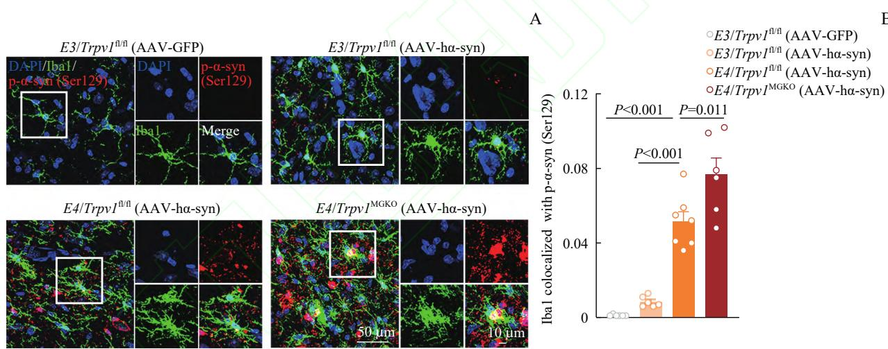
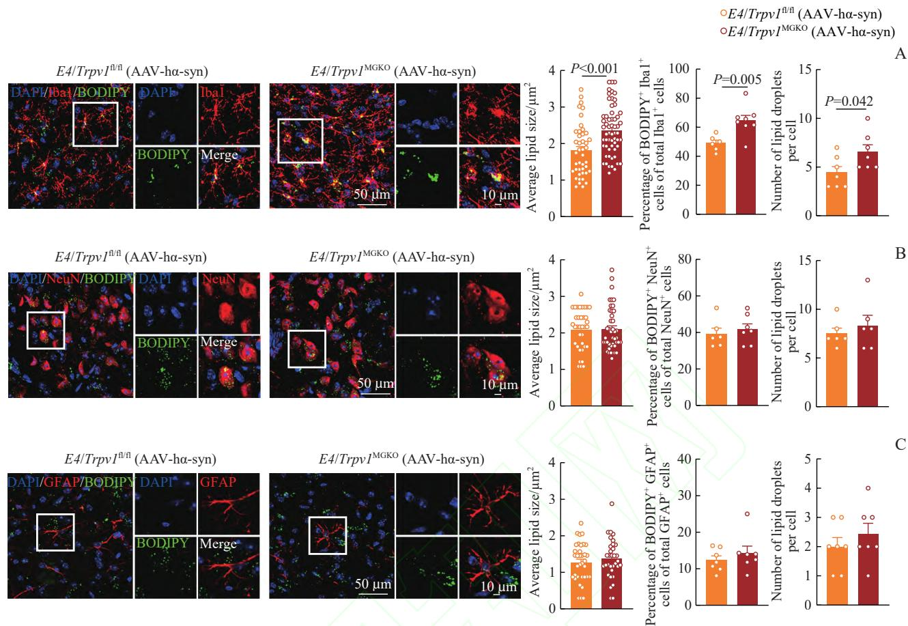

# Thesis · Basic Research

## Role of microglia TRPV1 in apolipoprotein E4 associated Parkinson's disease

Wu Kexin, Lu Jia, Wu Xingyu, Yu Zhihua

Department of Pharmacology and Chemical Biology, School of Basic Medical Sciences, Shanghai Jiaotong University, Shanghai 201318, China

### [Abstract]

**Objective**: To investigate the regulation of microglia transient receptor potential vanilloid subtype 1 (transient receptor potential vanilloid 1, TRPV1) on the pathological process of apolipoprotein E4 (apolipoprotein E4, ApoE4)-related Parkinson's disease (Parkinson's disease, PD).

**Methods**: APOE3/Trpv1flox/flox (E3/Trpv1f/f), APOE4/Trpv1flox/flox (E4/Trpv1f/f) and microglia-specific Trpv1 knockout mice Cx3cr1Cre (E4/Trpv1MGKO) were bred and injected with human A53T α-synuclein (AAV-hα-syn) into the substantia nigra pars compacta (SNpc). AAV-GFP (green fluorescent protein) was injected into the SNpc of E3/Trpv1f/f mice as a control. After 30 days, motor function, coordination, and muscle endurance were evaluated using the open field test, traction test, pole test, rotarod test, and tail suspension test, while spatial learning and memory were assessed using the Morris water maze test. The immunofluorescence technique was used. The survival of dopaminergic neurons and pathological α-syn deposition in the SNpc were detected using tyrosine hydroxylase (TH) and phosphorylated Ser129 α-synuclein [p-α-syn (Ser129)] antibodies. The phagocytosis of microglia in the midbrain was detected using ionized calcium-binding adapter molecule 1 (Iba1) co-staining with p-α-syn (Ser129), while the accumulation of lipid droplets in microglia, neurons, and astrocytes was observed by BODIPY 493/503 staining.

**Results**: In traction tests, E4/Trpv1MGKO (AAV-hα-syn) mice showed no significant differences in grip strength compared to E4/Trpv1f/f (AAV-hα-syn) group. However, these mice exhibited increased mean velocity and total distance in open field tests, significantly prolonged time to turn ($t_{\text{turn}}$) and time for lateral ambulation ($t_{\text{LA}}$) in pole tests, shortened latency to remain on the rotarod, and induced stronger dystonic postures during tail suspension, indicating aggravated motor dysfunction in ApoE4-associated PD mice. The Morris water maze demonstrated that E4/Trpv1MGKO (AAV-hα-syn) mice exhibited significantly prolonged escape latency and a reduced proportion of travel distance in the target quadrant, indicating that TRPV1 deficiency in microglia significantly impaired spatial learning ability in ApoE4-associated PD mice. Immunofluorescence revealed that the loss of dopaminergic neurons in the SNpc was aggravated in E4/Trpv1MGKO (AAV-hα-syn) mice, and the p-α-syn deposition in the SNpc was increased. The phagocytosis of microglia in the mesencephalon was enhanced, and the accumulation of lipid droplets was increased. However, the deficiency of TRPV1 in microglia did not aggravate the accumulation of lipid droplets in astrocytes and neurons.

**Conclusion**: TRPV1 deficiency in microglia accelerates the pathological progression of ApoE4-associated PD and disrupts lipid metabolic homeostasis in microglia.

**[Key words]** transient receptor potential vanilloid subtype 1; microglia; apolipoprotein E4; Parkinson's disease
**[DOI]** 10.3969/j.issn.1674-8115.2026.02.001
**[Chinese figure classification number]** R964
**[Document marker code]** A

---

## Role of microglial TRPV1 in apolipoprotein E4-associated Parkinson's disease

Wu Kexin, Lu Jia, Wu Xingyu, Yu Zhihua

Department of Pharmacology and Chemical Biology, Shanghai Jiao Tong University College of Basic Medical Sciences, Shanghai 201318, China

### [Abstract]

**Objective**: To investigate the regulatory role of microglial transient receptor potential vanilloid 1 (TRPV1) in the pathological progression of apolipoprotein E4 (ApoE4)-associated Parkinson's disease (PD).

**Methods**: APOE3/Trpv1flox/flox (E3/Trpv1f/f), APOE4/Trpv1flox/flox (E4/Trpv1f/f), and microglia-specific Trpv1 knockout Cx3cr1Cre (E4/Trpv1MGKO) mice were bred and injected with human A53T α-synuclein (AAV-hα-syn) into the substantia nigra pars compacta (SNpc). AAV-GFP was injected into the SNpc of E3/Trpv1f/f mice as a control. After 30 days, motor function, coordination, and muscle endurance were evaluated using the open field test, traction test, pole test, rotarod test, and tail suspension test, while spatial learning and memory were assessed using the Morris water maze test. The immunofluorescence technique was used. The survival of dopaminergic neurons and pathological α-syn deposition in the SNpc were detected using tyrosine hydroxylase (TH) and phosphorylated Ser129 α-synuclein [p-α-syn (Ser129)] antibodies. The phagocytosis of microglia in the midbrain was detected using ionized calcium-binding adapter molecule 1 (Iba1) co-staining with p-α-syn (Ser129), while the accumulation of lipid droplets in microglia, neurons, and astrocytes was observed by BODIPY 493/503 staining.

**Results**: In traction tests, E4/Trpv1MGKO (AAV-hα-syn) mice showed no significant differences in grip strength compared to E4/Trpv1f/f (AAV-hα-syn) group. However, these mice exhibited increased mean velocity and total distance in open field tests, significantly prolonged time to turn ($t_{\text{turn}}$) and time for lateral ambulation ($t_{\text{LA}}$) in pole tests, shortened latency to remain on the rotarod, and induced stronger dystonic postures during tail suspension, indicating aggravated motor dysfunction in ApoE4-associated PD mice. The Morris water maze demonstrated that E4/Trpv1MGKO (AAV-hα-syn) mice exhibited significantly prolonged escape latency and a reduced proportion of travel distance in the target quadrant, indicating that TRPV1 deficiency in microglia significantly impaired spatial learning ability in ApoE4-associated PD mice. Immunofluorescence revealed that the loss of dopaminergic neurons in the SNpc was aggravated in E4/Trpv1MGKO (AAV-hα-syn) mice, and the p-α-syn deposition in the SNpc was increased. The phagocytosis of microglia in the mesencephalon was enhanced, and the accumulation of lipid droplets was increased. However, the deficiency of TRPV1 in microglia did not aggravate the accumulation of lipid droplets in astrocytes and neurons.

**Conclusion**: TRPV1 deficiency in microglia accelerates the pathological progression of ApoE4-associated PD and disrupts lipid metabolic homeostasis in microglia.

**[Key words]** transient receptor potential vanilloid 1 (TRPV1); microglia; apolipoprotein E4 (ApoE4); Parkinson's disease (PD)

---

### Background Introduction

Apolipoprotein E (apolipoprotein E, ApoE) is a single-chain polypeptide glycoprotein composed of 299 amino acids with a molecular weight of $34\,\mathrm{kD}$[1]. As the major lipid transporter in the brain, ApoE carries out lipid transfer between neurons and glial cells, which is essential for maintaining the metabolic integrity of neurons[2]. ApoE synthesis is regulated by three alleles located in the same gene locus, namely APOE2, APOE3 and APOE4. The ApoE proteins encoded by these three alleles have different amino acid compositions at positions 112 and 158. The amino acid changes determine the isoform types of ApoE proteins, namely ApoE2 (Cys112, Cys158), ApoE3 (Cys112, Arg158) and ApoE4 (Arg112, Arg158). These ApoE isomers have differences in lipid binding, receptor binding, oligomerization tendency and stability[1].

Parkinson's disease (Parkinson's disease, PD) is a common, age-related neurodegenerative disease[3], its incidence increases rapidly with age, has a variety of causes and clinical manifestations[4], and can eventually develop into Parkinson's disease dementia[5]. Among the three alleles of ApoE, APOE4 is not significantly associated with the risk of PD, that is, it does not significantly increase the probability of PD[6], however, it is closely related to the accelerated decline of cognitive function and early onset of dementia in PD patients[7–8]. Research[6] shows that the risk of cognitive impairment in PD patients with ε4/ε4 genotype is twice that of other genotypes (ε2/ε2, ε2/ε3, ε2/ε4, ε3/ε3, ε3/ε4), suggesting that ApoE4 plays an important regulatory role in the progression of PD. Although ApoE4 does not directly induce PD, it may exacerbate the disease pathological process through a variety of mechanisms. First of all, ApoE4 may promote the abnormal aggregation of α-synuclein (α-syn)[9], transmission and clearance of obstacles[10], thus aggravating the pathological changes of Lewy bodies[11]. Secondly, ApoE4 is closely related to lysosomal lipid metabolism disorders, which may impair the ability of cells to clear abnormal proteins[12]. Again, ApoE4 interferes with lipid transport and cholesterol metabolism that are critical to dopaminergic neuronal function[13]. Notably, ApoE4 also acts by altering cholesterol homeostasis within microglia[14], resulting in decreased cholesterol accumulation and lipid clearance, and impaired HDL-mediated cholesterol efflux. These changes may contribute to microglial dysfunction, thereby affecting the neuroinflammatory and neurodegenerative processes of PD. However, the current research on whether and how ApoE4 affects the pathological development of PD through microglia is still limited and needs further exploration.

Transient receptor potential vanilloid 1 (transient receptor potential vanilloid 1, TRPV1), also known as capsaicin receptor, is a ligand-gated non-selective cation channel with $\mathrm{Ca^{2+}}$ permeability. It has a neuroprotective effect[15] and has shown potential as a therapeutic target in neurodegenerative diseases[16]. TRPV1 is widely distributed in the central nervous system, and more and more evidences reveal that it is functionally expressed in glial cells, involved in regulating the activities of neurons and glial cells, and then affecting a variety of biological processes[17]. It has been shown that TRPV1 participates in microglia-mediated inflammation by regulating interleukin-1β (IL-1β) and nuclear factor-κB (NF-κB) pathways[18], and regulates a variety of microglial functions, including phagocytosis and cytokine production[19]. In addition, TRPV1 can regulate microglial activation. After immunostaining of Trpv1 mice, it was found that the staining intensity of ionic calcium binding linker molecule 1 (ionized calcium binding adaptor molecule 1, Iba1) was stronger than that of wild-type mice[20]. However, it is unclear whether TRPV1 induces the activation of microglia in the ApoE4-associated PD mouse model and has an effect on the pathological process of PD. This study intends to systematically explore the regulatory role of microglia TRPV1 in the pathological process of ApoE4-related PD by constructing a mouse model of ApoE4-related PD with microglia specific knockout Trpv1, and to provide a new experimental basis for revealing the pathogenesis of the disease.

---

## 1 Materials and methods

### 1.1 Experimental animals

The mice used in this study were all in C57BL/6 background. Trpv1flox/flox mice were purchased from Shanghai Southern Model Biotechnology Co., Ltd. with the license number of SCXK (Shanghai) 2018-0007. Cx3cr1Cre mice were purchased from Jackson Laboratory in the United States. Human APOE3 and APOE4 transgenic mice were donated by Professor Qiu Yu from the Department of Pharmacology and Chemical Biology, Medical College of Shanghai Jiaotong University. Trpv1flox/flox mice were crossed with Cx3cr1Cre mice to obtain microglia-specific Trpv1 knockout mice. Human APOE3 or APOE4 transgenic mice were crossed with microglia-specific Trpv1 knockout mice, respectively, to obtain APOE3/Trpv1flox/flox (E3/Trpv1f/f), APOE4/Trpv1flox/flox (E4/Trpv1f/f), and APOE4/Trpv1flox/flox; Cx3cr1Cre (E4/Trpv1MGKO) mice. The mice were raised in the Department of Laboratory Animal Science, School of Medicine, Shanghai Jiaotong University, and the license number for laboratory animals is SYXK (Shanghai) 2018-0027.

Tamoxifen was dissolved in a mixture of 30% polyoxyethylene ether castor oil and 70% normal saline with a mass concentration of $7.5\,\mathrm{mg/mL}$. Mice were intraperitoneally injected with tamoxifen $10\,\mu\mathrm{L}/(\mathrm{g} \cdot \mathrm{d})$ for 5 consecutive days to activate Cre recombinase in 4-week-old E4/Trpv1MGKO mice[21]. All mice were housed in separate cages (4–5 per cage) and fed and drank freely under the conditions of $21\sim23^\circ\mathrm{C}$, $12\,\mathrm{h}$ light-$12\,\mathrm{h}$ dark cycle.

### 1.2 Main reagents and instruments

Human A53T α-syn [AAV-hα-syn; N-terminal with green fluorescent protein (GFP) tag] and control AAV-GFP were purchased from Shenggong (Shanghai) Engineering Co., Ltd. Sodium chloride (A610476) and sucrose (A502792) were purchased from Shenggong Biology (Shanghai) Engineering Co., Ltd., and 4% paraformaldehyde (G1101) was purchased from Wuhan Xavier Biotechnology Co., Ltd. Rabbit anti-tyrosine hydroxylase (tyrosine hydroxylase, TH) antibody (ab112) was purchased from Abcam Company in the United Kingdom, rabbit anti-p-α-syn (Ser129) antibody (23706) was purchased from Cell Signaling Technology Company in the United States, and mouse anti-p-α-syn (Ser129) antibody (825701) was purchased from BioLegend Company in the United States. Rat anti-Iba1 antibody (ab283346), Alexa Fluor 647-goat anti-rat antibody (ab150159) were purchased from Abcam Company of the United Kingdom, Cy3-goat anti-rabbit antibody (GB21303) was purchased from Wuhan Xavier Biotechnology Co., Ltd., and Alexa Fluor 647-goat anti-mouse antibody (A32728) was purchased from Invitrogen Company of the United States. BODIPY 493/503 (D3922) was purchased from Invitrogen, USA, 4′,6-diamino-2-phenylindole (4′,6-diamidino-2-phenylindole, DAPI) (D9542) was purchased from Thermo Fisher Scientific, USA, and Tamoxifen (sc-208414) was purchased from Santa Cruz Biotechnology, USA. Polyoxyethylene ether castor oil (61791-2-6) was purchased from Millipore, Germany.

Brain stereotactic injection instrument and inhalation gas anesthesia machine were purchased from Shenzhen Reward Life Technology Co., Ltd. Micro-syringes were purchased from Hamedon (Shanghai) Laboratory Equipment Co., Ltd. The rotating rod was purchased from IITC Life Sciences Company in the United States, and the animal motion tracking system (EthoVision XT18) was purchased from Noldus Company in the Netherlands. Cryostat (CM1950) was purchased from Leica, Germany. The confocal microscope (AXR) was purchased from Nikon Corporation of Japan.

### 1.3 Brain stereotactic injection

The above 3 types of 2–3 month-old mice were selected and fixed to the brain stereotactic injection instrument after anesthesia. The mouse nigra pars compacta (substantia nigra pars compacta, SNpc) was injected with $1\,\mu\mathrm{L}$ AAV-hα-syn using a syringe pump at a speed of $0.2\,\mu\mathrm{L/min}$ [coordinates: -3.1 mm in the anteroposterior direction (anteroposterior, AP), ±1.2 mm in the medial-lateral (mediolateral, ML), and -4.25 mm in the dorsoventral direction (dorsoventral, DV, relative to the anterior-lateral)]. After the end of the injection, the needle was kept for 5 min to avoid regurgitation, and then the incision was closed with tissue glue. AAV-GFP was injected in the SNpc of E3/Trpv1f/f mice in the same way.

### 1.4 Behavior experiment

After virus injection $30\,\mathrm{d}$, mice were subjected to standardized behavioral tests to assess motor coordination, balance, and spatial learning and memory. The experiments were tracked and analyzed using an animal motion trajectory tracking system.

- **Open field experiment**: used to assess spontaneous activity in mice[22]. Mice were adapted to the experimental environment one day before the experiment, and the test was carried out in a white square box ($40\,\mathrm{cm} \times 40\,\mathrm{cm} \times 40\,\mathrm{cm}$) under dim light. Each mouse was placed in a corner and allowed to explore freely $5\,\mathrm{min}$, and the white box was cleaned with $70\%$ ethanol between experiments. The total moving distance, moving time and average speed of mice were recorded.

- **Traction test**: used to evaluate muscle strength and balance ability in mice. Both front paws of the mouse were placed on a horizontal wire (diameter $1\,\mathrm{mm}$) at a height $30\,\mathrm{cm}$ from the ground, and $10\,\mathrm{s}$ was observed. Score range $0\sim4$ points (0 points: immediately fall; 4 points: all limbs are firmly grasped). Each mouse was tested three times, and the average score was taken for statistical analysis.

- **Rod-climbing experiment**: used to assess motor coordination and balance in mice. The mice were placed on a vertical metal rod (surface-wrapped cloth tape) with a diameter of $1\,\mathrm{cm}$ and a length of $50\,\mathrm{cm}$, and the time required for turnover ($t_{\mathrm{turn}}$) and descent ($t_{\mathrm{LA}}$) were recorded. Each mouse was tested twice (upper limit $120\,\mathrm{s}$).

- **Rotary bar experiment**: for further evaluation of motor coordination and balance in mice. Mice were trained for $2\,\mathrm{d}$ before formal testing. During this period, they were placed on the rotating rod with a speed of $8\,\mathrm{r/min}$ and $12\,\mathrm{r/min}$ for $150\,\mathrm{s}$. The formal test period is $7\,\mathrm{d}$, and the speed is gradually increased (8, 12, 16, 20, 24 and $28\,\mathrm{r/min}$). Each mouse was tested twice daily at $30\,\mathrm{min}$ intervals, with the maximum duration of each follow-up being $150\,\mathrm{s}$, and the mouse residence time was recorded. Take the daily average of the residence time at each speed, draw the curve of speed (X-axis) and residence time (Y-axis) and calculate the area under the curve (AUC).

- **Tail suspension test**: used to evaluate the tension posture of mice. The mice that have been adapted to the behavior test room for 3 days are gently taken out of the cage, and the tip of the mouse tail $1\,\mathrm{cm}$ is fixed on the hanging tail test box with medical tape. The height between the tip of the tail and the ground is about $30\,\mathrm{cm}$, so that the mouse is in a head-down position. Adjust the camera lens to a position horizontally aligned with the mouse body and record $6\,\mathrm{min}$. After completion, tear off the medical tape to carefully remove the mice, put them in the cage and make records.

- **Morris water maze test**: used to evaluate spatial learning and memory ability in mice. Pool diameter $120\,\mathrm{cm}$, depth $50\,\mathrm{cm}$, water temperature to maintain $21\sim23^\circ\mathrm{C}$. The escape platform (diameter $4.5\,\mathrm{cm}$) is concealed under water $1\,\mathrm{cm}$. The training phase was continuous $5\,\mathrm{d}$, 4 times a day (upper limit $60\,\mathrm{s}$, interval $30\,\mathrm{min}$), and the escape latency was recorded. On the 6th day, the platform was removed, and the space exploration experiment was carried out. The number of mouse crossings was recorded, and the proportion of the residence time and distance in the target quadrant in the total swimming time and distance was recorded.

### 1.5 Immunofluorescence staining and image analysis

After anesthesia, the mice were perfused with $0.9\%$ sodium chloride, and the left hemisphere was fixed with $4\%$ paraformaldehyde overnight, followed by gradient dehydration with $20\%$ and $30\%$ sucrose solutions. Serial coronal sections of SNpc ($20\,\mu\mathrm{m}$ vs. $-2.80\sim-3.80\,\mathrm{mm}$) were collected, and six sections were selected every $120\,\mu\mathrm{m}$ for immunostaining. After the slices were permeabilized with $0.3\%$ Triton X-100, $10\%$ sheep serum was used to block $1\,\mathrm{h}$ at room temperature, and then $4^\circ\mathrm{C}$ the following primary antibodies were incubated overnight: rabbit anti-TH antibody (1:200), rabbit anti-p-α-syn (Ser129) antibody (1:1000), mouse anti-p-α-syn (Ser129) antibody (1:500), rat anti-Iba1 antibody (1:1000). The secondary antibodies include Alexa Fluor 647-goat anti-rat antibody (1:1000), Cy3-goat anti-rabbit antibody (1:2000), and Alexa Fluor 647-goat anti-mouse antibody (1:500). Sections were stained with $1\,\mu\mathrm{g/mL}$ BODIPY 493/503 for $10\,\mathrm{min}$ to visualize lipid droplets, and then incubated with DAPI (1:1000) for $10\,\mathrm{min}$ at room temperature. Confocal microscopy was used for image acquisition and Fiji software was used for analysis.

### 1.6 Statistical analysis

Data were statistically analyzed and plotted using GraphPad Prism 10.0 software. All data were tested for normality using Shapiro-Wilk. The quantitative data of normal distribution is represented by $\bar{x} \pm s$, using t-test to compare 2 sets of independent samples, using Sidak multiple comparison single-factor ANOVA analysis or Bonferroni post-hoc two-factor ANOVA analysis to compare 4 independent groups. $P < 0.05$ indicates that the difference is statistically significant.

---

## 2 Results

### 2.1 Trpv1 Knockout Intensified Behavioral Defects in ApoE4-Associated PD Mice

In order to investigate the role of microglia TRPV1 in ApoE4-associated PD, this study injected AAV-GFP into the SNpc of E3/Trpv1f/f mice as control, and AAV-hα-syn into E3/Trpv1f/f, E4/Trpv1f/f, and E4/Trpv1MGKO mice. After 30 days, mice developed PD-like motor deficits after injection of AAV-hα-syn compared to AAV-GFP controls, and ApoE4 exacerbated these behavioral impairments: compared to E3/Trpv1f/f (AAV-hα-syn) mice, E4/Trpv1f/f (AAV-hα-syn) mice showed a higher average speed ($P = 0.007$) in the open field experiment, and E4/Trpv1MGKO (AAV-hα-syn) mice showed further increased average speed and travel distance (both $P < 0.05$) (Figure 1B). Compared with E4/Trpv1f/f (AAV-hα-syn) mice, the $t_{\mathrm{turn}}$ and $t_{\mathrm{LA}}$ of E4/Trpv1MGKO (AAV-hα-syn) mice were significantly prolonged (both $P < 0.05$), indicating that their motor defects were aggravated. However, there was no significant difference in grip strength between E4/Trpv1MGKO (AAV-hα-syn) mice and E4/Trpv1f/f (AAV-hα-syn) mice (Figure 1D). The residence time of E4/Trpv1MGKO (AAV-hα-syn) mice was shortened. When the rotation speed was $12\,\mathrm{r/min}$, the difference was statistically significant ($P < 0.001$), further demonstrating the aggravation of motor damage due to TRPV1 deficiency (Figure 1F). Additionally, E4/Trpv1MGKO (AAV-hα-syn) mice exhibited stronger dystonic postures during the tail suspension test (Figure 1G). In the Morris water maze experiment, after 5 days of training, the escape latency of E4/Trpv1MGKO (AAV-hα-syn) mice was significantly prolonged ($P = 0.001$), indicating a more severe impairment of spatial learning ability. Furthermore, compared to E3/Trpv1f/f (AAV-hα-syn) mice, E4/Trpv1f/f (AAV-hα-syn) mice showed reduced time and distance spent in the target quadrant (both $P < 0.05$), and E4/Trpv1MGKO (AAV-hα-syn) mice showed a significantly greater reduction in the proportion of travel distance in the target quadrant (Figure 1E). Overall, these results indicate that microglia-specific TRPV1 deletion exacerbates behavioral deficits in ApoE4-associated PD mice.

**Figure 1 Effects of Trpv1 knockout on behavioral disorders in ApoE4-associated PD mice**
*Fig 1 Effects of Trpv1 knockout on behavioral disorders in ApoE4-associated PD mice*

*Note: A. Representative images showing the distribution of adeno-associated viruses (AAV-GFP and AAV-hα-syn) in the midbrain region of mice. B. Open field test. C. Pole test. D. Traction test. E. Escape latency, number of platform crossings, and the proportion of time and distance spent in the target quadrant relative to the total swimming time and distance in the Morris water maze (MWM). F. Rotarod test. G. Representative images from the tail suspension test. ①P < 0.001, ②P = 0.001.*

---

### 2.2 Trpv1 Knockout Impairs Dopaminergic Neurons in ApoE4-Associated PD Mice

Analysis of mouse SNpc by immunofluorescence staining showed that compared with E3/Trpv1f/f (AAV-hα-syn) mice, E4/Trpv1f/f (AAV-hα-syn) mice had a significant decrease in the number of TH-positive dopaminergic neurons, while E4/Trpv1MGKO (AAV-hα-syn) mice showed further aggravation of dopaminergic neuron loss and increased deposition of p-α-syn (Figure 2).

---

### 2.3 Trpv1 Knockout Enhances Phagocytosis of Microglia in ApoE4-Associated PD Mice

The phagocytosis of microglia in the midbrain of ApoE4-associated PD mice was detected by immunofluorescence staining. The results showed that the phagocytosis of p-α-syn (Ser129) by Iba1+ microglia of E4/Trpv1f/f (AAV-hα-syn) mice was significantly increased compared with E3/Trpv1f/f (AAV-hα-syn) mice. In addition, the phagocytic ability of E4/Trpv1MGKO (AAV-hα-syn) mice was further enhanced (Figure 3).

*A*

**Figure 2 Effects of Trpv1 knockout on dopaminergic neurons in ApoE4-associated PD mice**
*Fig 2 Effects of Trpv1 knockout on dopaminergic neurons in ApoE4-associated PD mice*

*Note: A/B. Representative images (A) and quantitative analysis (B) of TH-positive (red) and p-α-syn (Ser129)-positive (green) cells in E3/Trpv1f/n, E4/Trpv1f/n, and E4/Trpv1MGKO mice following AAV-GFP or AAV-hα-syn infusion into the SNpc. ①Percentage relative to E3/Trpv1f/n (AAV-GFP).*

**Figure 3 Effects of Trpv1 knockout on the phagocytic ability of microglia in ApoE4-associated PD mice**
*Fig 3 Effects of Trpv1 knockout on the phagocytic ability of microglia in ApoE4-associated PD mice*

*Note: A/B. Representative images (A) and quantitative analysis (B) of p-α-syn (Ser129) (red)/Iba1 (green) in E3/Trpv1fl/fl (AAV-GFP), E3/Trpv1fl/fl (AAV-hα-syn), E4/Trpv1fl/fl (AAV-hα-syn), and E4/Trpv1MGKO (AAV-hα-syn) mice.*

---

### 2.4 Trpv1 Knockout Intensified Lipid Droplet Accumulation in Microglia of ApoE4-Associated PD Mice

Finally, the accumulation of lipid droplets in microglia of ApoE4-associated PD mice was analyzed. BODIPY immunostaining showed that in E4/Trpv1MGKO (AAV-hα-syn) mice, the neutral lipid inclusions in microglia were significantly increased, and the accumulation of lipid droplets was more significant than that in E4/Trpv1f/f (AAV-hα-syn) mice, and the number of lipid droplets in each cell was also significantly increased (Figure 4A). Further, the accumulation of lipid droplets in neurons and astrocytes in the same model was detected. As shown in Figure 4B and C, compared with E4/Trpv1f/f (AAV-hα-syn) mice, E4/Trpv1MGKO (AAV-hα-syn) mice had no significant changes in the size and number of neutral lipid inclusions in neurons and astrocytes, and no significant increase in lipid droplet accumulation was observed. These results suggest that the abnormal lipid droplet metabolism caused by microglia-specific TRPV1 deletion mainly occurs in microglia, not neurons or astrocytes.

*Note: A. Representative images and quantitative analysis of Iba1 (red)/co-localized with BODIPY (green) in E4/Trpv1fl/fl and E4/TRPV1MGKO mice following AAV-hα-syn infusion into the SNpc. B. Representative images and quantitative analysis of neuronal nuclei (NeuN) (red) co-localized with BODIPY (green) in E4/Trpv1fl/fl and E4/TRPV1MGKO mice following AAV-hα-syn infusion into the SNpc. C. Confocal images and quantitative analysis of glial fibrillary acidic protein (GFAP) (red) co-localized with BODIPY (green) in E4/Trpv1fl/fl and E4/TRPV1MGKO mice following AAV-hα-syn infusion into the SNpc. DAPI (blue) indicates cell nuclei.*
**Figure 4 Effects of Trpv1 knockout on microglial lipid droplet accumulation in ApoE4-associated PD mice**
*Fig 4 Effects of Trpv1 knockout on microglial lipid droplet accumulation in ApoE4-associated PD mice*

---

## 3 Discussion

PD is a common progressive neurodegenerative disease[23], its main clinical features include tremor, bradykinesia and myotonia, and can progress to Parkinson's disease dementia as the disease progresses. ApoE is a major lipid transporter in the brain, with 3 common alleles of ε2, ε3 and ε4. Among them, the ε4 variant is recognized as the most important genetic risk factor for late-onset PD. However, there is increasing evidence that APOE ε4 may also play an important role in other age-related neurodegenerative diseases. Recent evidence suggests that APOE ε4 is associated with increased risk and earlier age of onset of frontotemporal dementia, PD, and amyotrophic lateral sclerosis; in addition, APOE ε4 carriers exhibit faster cognitive decline and higher risk of Parkinson's disease dementia in the PD population[24]. Although these clinical observations suggest that APOE4 plays an important role in the progression of PD, the specific molecular mechanism of APOE4 in accelerating the pathological evolution of PD is not clear.

Studies[24] have shown that APOE4 triggers pro-inflammatory immune dysregulation in neurodegenerative diseases and that this dysregulation persists in the brain, cerebrospinal fluid, and plasma. As an important innate immune cell of the central nervous system, microglia are involved in maintaining immune homeostasis[25]. In the early pathological stage of PD, the activation of microglia may be the key factor leading to the damage of dopaminergic neurons[26–27]. Notably, while microglial activation may contribute to the clearance of pathogenic proteins such as α-syn[28], chronically activated microglia undergo functional changes that lead to the development of neuroinflammatory responses that further promote PD-associated dopaminergic neuronal damage[29].

TRPV1 is a ligand-gated non-selective cation channel activated by temperature, capsaicin, acid and ATP, which is widely expressed in the central nervous system. Studies[30] have reported that capsaicin-activated TRPV1 can regulate the energy metabolism of microglia, enhance their autophagy and phagocytosis, and inhibit the polarization of M1 microglia. TRPV1 plays an important role in the activation of microglia and is involved in the occurrence of a variety of neuroimmune diseases[31], which makes it a potential therapeutic target for neurological diseases. However, it is still unclear whether microglia TRPV1 plays a protective role in the pathological process of PD mediated by ApoE4.

In this study, Trpv1f/f mice carrying human APOE3 or APOE4 gene were constructed, and microglia-specific Trpv1 knockout mice were obtained by crossing them with Cx3cr1Cre mice. The ApoE4-associated PD mouse model and its control group were constructed by injecting AAV-hα-syn and AAV-GFP to study the effect of microglia TRPV1 on ApoE4-mediated PD pathology.

Behavioral tests (open field test, pole climbing test, traction test, rotating rod test and tail suspension test) showed that the absence of microglia TRPV1 aggravated the damage of movement and coordination ability of PD mice induced by ApoE4. Morris water maze experiment further proved that the loss of microglia TRPV1 aggravated the damage of spatial memory ability of PD mice induced by ApoE4. Overall, deletion of microglia TRPV1 exacerbated the behavioral deficits in ApoE4-associated PD mice. Next, this study analyzed the density of mouse SNpc dopaminergic neurons and the deposition of p-α-syn by immunofluorescence technology, and confirmed that the loss of microglia TRPV1 further promoted the loss of SNpc dopaminergic neurons and the deposition of p-α-syn in ApoE4-associated PD mice. Since the phagocytic ability of microglia was enhanced after activation, the study further examined the phagocytic function of microglia in the midbrain region of mice for p-α-syn. The results showed that deletion of TRPV1 enhanced ApoE4-induced phagocytosis of p-α-syn by mesencephalic microglia in PD mice. Studies[14] have shown that ApoE4 leads to the accumulation of cholesterol in microglia and disrupts the lipid clearance process. To this end, lipid droplet levels within microglia were also measured in this study. Immunofluorescence staining analysis showed that microglia-specific Trpv1 knockout significantly increased the accumulation of lipid droplets in the microglia of PD mice induced by ApoE4, but had no significant effect on the accumulation of lipid droplets in neurons and astrocytes. The above results indicate that the deletion of TRPV1 mainly leads to the disorder of lipid metabolism in microglia.

In summary, this study showed that the deletion of microglia TRPV1 further accelerated the pathological process of ApoE4-related PD by disrupting lipid metabolism and enhancing the phagocytosis of microglia, promoted the loss of SNpc dopaminergic neurons and the accumulation of p-α-syn, and aggravated the spatial learning and motor function defects of ApoE4-related PD mice. The results provide an important basis for microglia TRPV1 as a potential target for the treatment of PD. However, the protective effect of TRPV1 agonists (such as capsaicin) on ApoE4-related PD pathology still needs to be further studied, and the protective mechanism of activating TRPV1 on microglia and its mechanism of alleviating ApoE4-related PD pathology still needs to be further explored.

---

## Conflict of interest statement / Conflict of Interests

All authors declare no conflict of interest.

All authors disclose no relevant conflict of interests.

---

## Ethical Approval and Animal Rights Statement / Ethics Approval and Animal Right

All animal experiments involved in this study have been approved by the Animal Ethics Committee of Shanghai Jiao Tong University School of Medicine (approval number A-2023-123). All experimental procedures were carried out in accordance with GB/T 35892-2018.

All experimental animal protocols in this study were reviewed and approved by the Animal Care and Use Committee of Shanghai Jiao Tong University School of Medicine (Approval Letter No. A-2023-123), and all experimental animal protocols were carried out by following the guidelines of GB/T 35892—2018.

---

## Authors' Contributions

Zhihua Yu is responsible for the experimental design. Wu Kexin participated in the experimental design and was responsible for data analysis and thesis writing. Lu Jia and Wu Xingyu participated in the experimental design and data analysis. All authors read and agree to the submission of the final manuscript.

Yu Zhihua was responsible for the experimental design. Wu Kexin participated in the experimental design and was responsible for data analysis and manuscript preparation. Lu Jia and Wu Xingyu participated in the experimental design and data analysis. All authors have read the final version of the manuscript and agreed to the submission.

Received: 2025-09-12
Accepted: 2025-10-30

---

## References

[1] Raulin A C, Doss S V, Trottier Z A, et al. ApoE in Alzheimer's disease: pathophysiology and therapeutic strategies[J]. Mol Neurodegener, 2022, 17(1): 72.
[2] Shi H, Belbin O, Medway C, et al. Genetic variants influencing human aging from late-onset Alzheimer's disease (LOAD) genomewide association studies (GWAS)[J]. Neurobiol Aging, 2012, 33(8): 1849.e5-1849.e18.
[3] Cabreira V, Massano J. Parkinson's disease: clinical review and update[J]. Acta Med Port, 2019, 32(10): 661-670.
[4] Bloem B R, Okun M S, Klein C. Parkinson's disease[J]. Lancet, 2021, 397(10291): 2284-2303.
[5] Morris H R, Spillantini M G, Sue C M, et al. The pathogenesis of Parkinson's disease[J]. Lancet, 2024, 403(10423): 293-304.
[6] Okubadejo N U, Okunoye O, Ojo O O, et al. APOE E4 is associated with impaired self-declared cognition but not disease risk or age of onset in Nigerians with Parkinson's disease[J]. NPJ Parkinsons Dis, 2022, 8(1): 155.
[7] Pang S S, Li J, Zhang Y Y, et al. Meta-analysis of the relationship between the APOE gene and the onset of Parkinson's disease dementia[J]. Parkinsons Dis, 2018, 2018: 9497147.
[8] Tunold J A, Geut H, Rozemuller J M A, et al. APOE and MAPT are associated with dementia in neuropathologically confirmed Parkinson's disease[J]. Front Neurol, 2021, 12: 631145.
[9] Emamzadeh F N, Aojula H, Mchugh P C, et al. Effects of different isoforms of ApoE on aggregation of the α-synuclein protein implicated in Parkinson's disease[J]. Neurosci Lett, 2016, 618: 146-151.
[10] Kang S J, Kim S J, Noh H R, et al. Neuronal ApoE regulates the cell-to-cell transmission of α-synuclein[J]. Int J Mol Sci, 2022, 23(15): 8311.
[11] Khedr E M, William M B, Elhosseiny A A, et al. APOE genetic variability in an Egyptian cohort of PD[J]. Front Neurosci, 2025, 19: 1579968.
[12] Miranda A M, Ashok A, Chan R B, et al. Effects of APOE4 allelic dosage on lipidomic signatures in the entorhinal cortex of aged mice[J]. Transl Psychiatry, 2022, 12(1): 129.
[13] Fernández-calle R, Konings S C, Frontiñán-Rubio J, et al. APOE in the bullseye of neurodegenerative diseases: impact of the APOE genotype in Alzheimer's disease pathology and brain diseases[J]. Mol Neurodegener, 2022, 17(1): 62.
[14] Tew J, Qian L, Pipalia N H, et al. Cholesterol and matrisome pathways dysregulated in astrocytes and microglia[J]. Cell, 2022, 185(13): 2213-2233.e25.
[15] Lu J, Zhou W, Dou F F, et al. TRPV1 sustains microglial metabolic reprogramming in Alzheimer's disease[J]. EMBO Rep, 2021, 22(6): e52013.
[16] Talbot S, Foster S L, Woolf C J. Neuroimmunity: physiology and pathology[J]. Annu Rev Immunol, 2016, 34: 421-447.
[17] Martins D, Tavares I, Morgado C. "Hotheaded": the role of TRPV1 in brain functions[J]. Neuropharmacology, 2014, 85: 151-157.
[18] Talbot S, Dias J P, Lahjouji K, et al. Activation of TRPV1 by capsaicin induces functional kinin B₁ receptor in rat spinal cord microglia[J]. J Neuroinflammation, 2012, 9: 16.
[19] Marrone M C, Morabito A, Giustizieri M, et al. TRPV1 channels are critical brain inflammation detectors and neuropathic pain biomarkers in mice[J]. Nat Commun, 2017, 8: 15292.
[20] Chen Y, Willcockson H H, Valtschanoff J G. Influence of the vanilloid receptor TRPV1 on the activation of spinal cord glia in mouse models of pain[J]. Exp Neurol, 2009, 220(2): 383-390.
[21] Lu J, Wu K X, Sha X D, et al. TRPV1 alleviates APOE4-dependent microglial antigen presentation and T cell infiltration in Alzheimer's disease[J]. Transl Neurodegener, 2024, 13(1): 52.
[22] Lu J, Dou F F, Yu Z H. The potassium channel KCa3.1 represents a valid pharmacological target for microgliosis-induced neuronal impairment in a mouse model of Parkinson's disease[J]. J Neuroinflammation, 2019, 16(1): 273.
[23] Hayes M T. Parkinson's disease and Parkinsonism[J]. Am J Med, 2019, 132(7): 802-807.
[24] Shvetcov A, Johnson E C B, Winchester L M, et al. APOE ε4 carriers share immune-related proteomic changes across neurodegenerative diseases[J]. Nat Med, 2025, 31(8): 2590-2601.
[25] Leng F D, Edison P. Neuroinflammation and microglial activation in Alzheimer disease: where do we go from here?[J]. Nat Rev Neurol, 2021, 17(3): 157-172.
[26] Gerhard A, Pavese N, Hotton G, et al. In vivo imaging of microglial activation with [¹¹C](R)-PK11195 PET in idiopathic Parkinson's disease[J]. Neurobiol Dis, 2006, 21(2): 404-412.
[27] Ouchi Y, Yoshikawa E, Sekine Y, et al. Microglial activation and dopamine terminal loss in early Parkinson's disease[J]. Ann Neurol, 2005, 57(2): 168-175.
[28] George S, Rey N L, Tyson T, et al. Microglia affect α-synuclein cell-to-cell transfer in a mouse model of Parkinson's disease[J]. Mol Neurodegener, 2019, 14(1): 34.
[29] Dickson D W. Parkinson's disease and Parkinsonism: neuropathology[J]. Cold Spring Harb Perspect Med, 2012, 2(8): a009258.
[30] Lv Z Y, Xu X Q, Sun Z Y, et al. TRPV1 alleviates osteoarthritis by inhibiting M1 macrophage polarization via Ca²⁺/CaMK signaling pathway[J]. Cell Death Dis, 2021, 12(6): 504.
[31] Kong W L, Peng Y Y, Peng B W. Modulation of neuroinflammation: role and therapeutic potential of TRPV1 in the neuro-immune axis[J]. Brain Behav Immun, 2017, 64: 354-366.

---

[Editor] Bao Ling