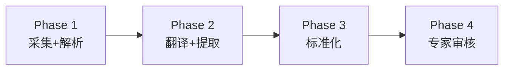

# Backend

> Lingua Seeker 后端——基于 FastAPI 的多语言医学遗传学文献自动化管线平台。

## Overview

Lingua Seeker 后端是一个完整的管线编排系统，用于自动化医学遗传学文献的采集、解析、翻译、证据提取、实体标准化和专家审核。核心架构是一个 4 阶段管线：

| Phase | 模块 | 职责 |
|-------|------|------|
| Phase 1 | `src/core/ingest_and_digitize_data/` | 文献采集（在线/本地）+ MinerU 文档解析 |
| Phase 2 | `src/core/cross_lingual_process_and_extract_evidence/` | 跨语言翻译 + 双轨证据提取 |
| Phase 3 | `src/core/standardize_entities_and_align_knowledge/` | 实体标准化 + 术语知识对齐 |
| Phase 4 | `src/core/visualize_evidence_with_expert_in_loop/` | 专家审核、AI 聊天、审计溯源 |

Phase 1-3 由 LangGraph 有向图编排器自动执行，Phase 4 是交互式请求-响应服务。

## Structure

```
backend/
├── app/                     # FastAPI 应用入口
│   └── main.py              #   应用创建、生命周期管理、中间件注册
├── config/                  # 分层配置管理
│   ├── defaults/            #   基础默认值
│   ├── environments/        #   环境特定覆盖
│   ├── vault/               #   敏感信息（git-ignored）
│   └── templates/           #   配置渲染模板
├── src/                     # 核心源码
│   ├── core/                #   业务逻辑（Phase 1-4 实现）
│   ├── agents/              #   管线编排（LangGraph、运行器、调度器）
│   ├── api/                 #   HTTP API（路由、认证、限流）
│   ├── dao/                 #   数据访问（PostgreSQL、Redis）
│   └── utils/               #   工具函数（日志、LLM 适配、异常）
├── scripts/                 # 独立脚本（E2E 测试、配置渲染）
├── tests/                   # 测试套件
├── data/                    # 运行时数据（git-ignored）
├── output/                  # 管线输出（git-ignored）
├── alembic/                 # 数据库迁移
├── libs/                    # 本地库（Rust 扩展、配置加载器）
├── docker-artifacts/        # Docker 构建产物
├── Dockerfile               # 容器化构建
├── pyproject.toml           # 项目配置和依赖
└── uv.lock                  # 依赖锁文件
```

## Key Components

### 管线编排



- **编排器** (`src/agents/orchestrator.py`) — LangGraph StateGraph，3 节点有向图
- **运行器** (`src/agents/runner.py`) — asyncio 后台任务管理，内存缓存 + DB 持久化
- **调度器** (`src/agents/dispatcher.py`) — 单任务轮询，`SELECT FOR UPDATE SKIP LOCKED`
- **状态持久化** (`src/agents/state_persistence.py`) — 崩溃恢复，状态转换守卫
- **处理缓存** (`src/agents/processing_cache.py`) — L1 Redis + L2 PostgreSQL 两级缓存

### API 层

- **认证** — X-API-Key 头 + HMAC-SHA256 会话 Cookie（8 小时有效期）
- **限流** — Redis 存储（生产）/ 内存存储（开发），per-endpoint 配置
- **中间件** — 安全头（HSTS/CSP）、请求体大小限制（100MB）、请求监控

### 数据层

- **PostgreSQL** — SQLAlchemy 2.0 异步 ORM，Alembic 迁移
- **Redis** — 异步缓存客户端（读缓存、限流、L1 处理缓存）
- **pgvector** — 术语嵌入向量存储和余弦距离查询

### LLM 集成

- **密钥池轮转** (`src/utils/llm_adapter.py`) — Round-robin 分配 + 认证错误自动故障转移
- **四类模型** — Fast LLM（通用）、Reasoning（推理）、Chat（对话）、Translation（翻译）
- **LangSmith 追踪** — 管线节点级追踪和日志

## Usage / Patterns

### 启动服务

```bash
cd backend
uv sync                            # 安装依赖
uv run uvicorn app.main:app --host 0.0.0.0 --port 8000 --reload
```

### 运行测试

```bash
uv run pytest tests/ -v            # 全部测试
uv run pytest tests/agents/ -v     # 管线编排器测试
uv run pytest tests/api/ -v        # API 测试
```

### 端到端管线

```bash
uv run python scripts/e2e_full.py --stages parse,translate,extract,standardize downloads/paper.pdf
```

### 配置管理

```bash
uv run python scripts/render_config.py --env development
```

## Dependencies

| 类别 | 依赖 |
|------|------|
| Web 框架 | FastAPI, uvicorn, Starlette |
| ORM / 数据库 | SQLAlchemy 2.0, asyncpg, pgvector, Alembic |
| 缓存 | redis (asyncio) |
| LLM | LangChain, LangGraph, LangSmith |
| 文档解析 | MinerU (本地/远程), PyMuPDF |
| 向量嵌入 | BAAI/bge-m3, BAAI/bge-reranker-v2-m3 |
| 搜索 | Firecrawl, Tavily, SerpAPI |
| 限流 | slowapi |
| 日志 | loguru |
| 本地扩展 | rust-io (files-io, net-io) |
| 配置 | acmg-config-loader, PyYAML, pydantic-settings |
