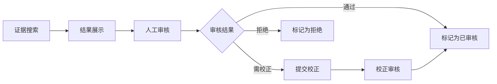
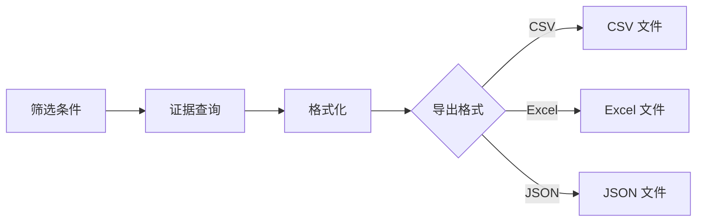
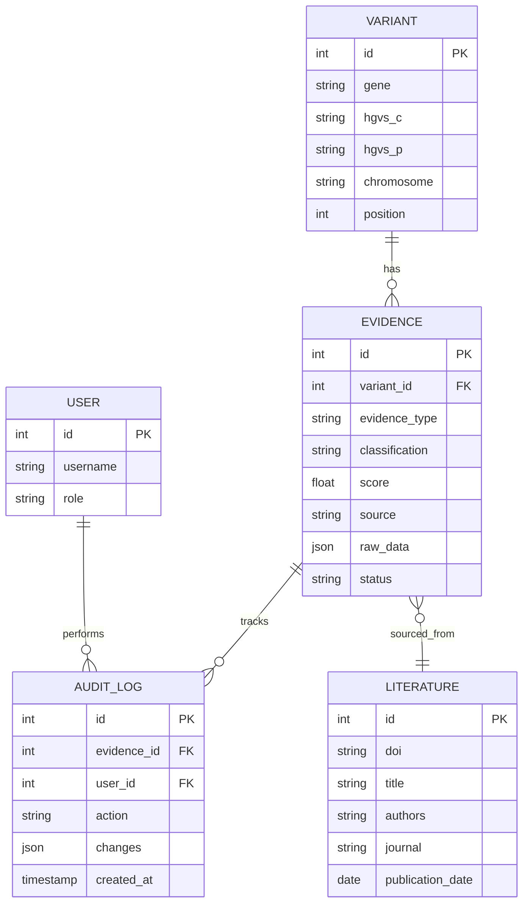

# Phase 3/4: 证据管理与数据访问层

> 子代理专长：证据审核、校正、导出流程及 DAO（数据访问对象）层实现。

## 职责范围

Phase 3/4 负责证据的全生命周期管理：搜索、审核、校正、导出，以及底层数据访问层的设计与实现。

### 核心模块

| 模块 | 路径 | 说明 |
|------|------|------|
| 证据服务 | `app/services/evidence.py` | 证据业务逻辑 |
| 证据 API 端点 | `app/api/evidence.py` | REST API 接口 |
| 证据模型 | `app/models/evidence.py` | SQLAlchemy ORM 模型 |
| 变异模型 | `app/models/variant.py` | 变异 ORM 模型 |
| 数据库会话 | `app/db/session.py` | 会话管理与连接池 |
| 数据库迁移 | `app/db/migrations/` | Alembic 迁移脚本 |

### 关键流程

#### 证据审核流程



#### 证据导出流程



### 数据访问层（DAO）

#### 设计原则

1. **仓储模式**：每个实体一个 Repository 类
2. **单元工作**：通过 SQLAlchemy Session 管理事务
3. **查询构建器**：支持动态条件组合
4. **分页支持**：统一的分页查询接口

#### Repository 接口

```python
class BaseRepository(Generic[T]):
    async def get_by_id(self, id: int) -> Optional[T]
    async def list(self, filters: dict, page: int, page_size: int) -> PaginatedResult[T]
    async def create(self, data: dict) -> T
    async def update(self, id: int, data: dict) -> T
    async def delete(self, id: int) -> bool
```

#### 实体关系



### ACMG 分类引擎

| 分类 | 说明 |
|------|------|
| Pathogenic | 致病 |
| Likely Pathogenic | 可能致病 |
| Uncertain Significance | 意义未明 |
| Likely Benign | 可能良性 |
| Benign | 良性 |

ACMG 证据类型：
- **PVS1**：功能缺失变异
- **PS1-PS4**：强致病证据
- **PM1-PM6**：中等致病证据
- **PP1-PP5**：支持性致病证据
- **BA1**：独立良性证据
- **BS1-BS4**：强良性证据
- **BP1-BP7**：支持性良性证据

### API 端点

| 方法 | 路径 | 说明 |
|------|------|------|
| GET | `/api/evidence/search` | 搜索证据（支持基因、变异类型、分类等筛选） |
| GET | `/api/evidence/{id}` | 获取证据详情 |
| POST | `/api/evidence/{id}/audit` | 审核证据 |
| POST | `/api/evidence/{id}/correct` | 校正证据 |
| GET | `/api/evidence/export` | 导出证据（CSV/Excel/JSON） |
| GET | `/api/evidence/{id}/audit-history` | 查询审核历史 |

### 关键配置

| 配置项 | 说明 |
|--------|------|
| `DATABASE_URL` | PostgreSQL 连接字符串 |
| `EVIDENCE_PAGE_SIZE` | 默认分页大小（20） |
| `EVIDENCE_MAX_EXPORT` | 单次最大导出条数（10000） |
| `ACMG_RULES_PATH` | ACMG 分类规则文件路径 |

### 测试

```bash
# 证据服务测试
uv run pytest tests/test_evidence_service.py -v

# DAO 层测试
uv run pytest tests/test_dao.py -v

# ACMG 分类测试
uv run pytest tests/test_acmg_classifier.py -v

# 数据库迁移测试
uv run alembic upgrade head
uv run alembic downgrade -1
uv run alembic upgrade head
```
