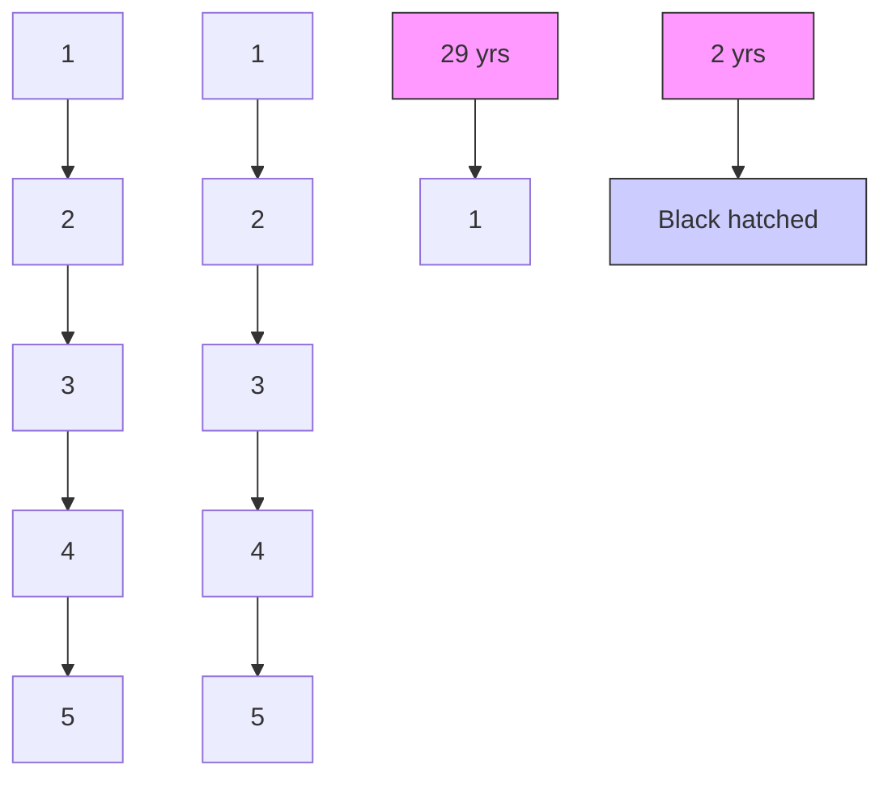

## CASE REPORT

## Open Access

# A rare case of a male child with post-zygotic de novo mosaic variant c.538C >T in MECP2 gene: a case report of Rett syndrome

Jhanvi Shah1 , Harsh Patel2 , Deepika Jain3 , Frenny Sheth1\*† and Harsh Sheth1\*†

## Abstract

Background: Rett syndrome (RTT) is characterized by a normal perinatal period with a normal head size at birth followed by normal development for the frst 6 months of life followed by gradual deceleration of head growth, loss of acquired purposeful hand skills, severe expressive and receptive language impairment, severe intellectual disability and gait and truncal apraxia/ ataxia. It is caused due to mutations in the MECP2 gene and follows an X-linked dominant mode of inheritance. It was observed exclusively in females and was believed to be lethal in males. In contrast to this belief, several males were identifed with RTT upon genetic analysis, however, most males expired by the age of 2 years due to neonatal encephalopathy. The ones that survived beyond the age of 2 years, were attributed to the presence of an extra X chromosome (co-occurrence of Klinefelter and RTT) or the ones having mosaic cell lines. Only 11 males with somatic mosaicism are known till date.

Case presentation: This case reports an ultra-rare case of a male afected with RTT surviving beyond the age of 2 years due to post-zygotic de novo somatic mosaicism. He was identifed with a known pathogenic variant c.538C >T (p.R180\*), which to the best of our knowledge is exclusively seen in females and has never been reported in a male before.

Conclusion: The present case is the frst report of a mosaic male afected with RTT from India. The present report also carried out genotype-phenotype correlations across surviving mosaic males with RTT. We also postulate the efect of variant type, position along the gene and the variant allele fraction in diferent tissue types to be correlated with disease severity.

Keywords: Rett syndrome, Male, Post-zygotic, de novo variant, Mosaic, MECP2

## Background

In 1966, Andreas Rett, a neurologist, described a syndrome namely “cerebral atrophy and hyperammonemia” which was observed to confne to girls; which eventually came to be known as Rett syndrome (RTT). Tis syndrome was clinically characterized by autistic behavior,

gait apraxia, stereotyped hand movements and loss of facial expression, having an age of onset between 6 and 18 months [1]. By the time the underlying cause of RTT was identifed, over a 1000 cases of girls showing the described phenotype were known. Most of the female probands had European ancestry and a prevalence of 1:10,000 to 1:15,000 girls was estimated [2]. Even in the absence of a cause at the molecular level, a diagnosis of RTT could be made by its striking phenotype and natural course as described in the consensus data [3]. Te consensus described a necessary and supportive criterion for the diagnosis of RTT. Te necessary criteria included a \*Correspondence: frenny.sheth@frige.co.in; harsh.sheth@frige.co.in † Frenny Sheth and Harsh Sheth contributed equally to this work. 1 FRIGE’s Institute of Human Genetics, FRIGE House, Jodhpur Gam Road, Satellite, 380015 Ahmedabad, India Full list of author information is available at the end of the article

BMC

© The Author(s) 2021. Open Access This article is licensed under a Creative Commons Attribution 4.0 International License, which permits use, sharing, adaptation, distribution and reproduction in any medium or format, as long as you give appropriate credit to the original author(s) and the source, provide a link to the Creative Commons licence, and indicate if changes were made. The images or other third party material in this article are included in the article’s Creative Commons licence, unless indicated otherwise in a credit line to the material. If material is not included in the article’s Creative Commons licence and your intended use is not permitted by statutory regulation or exceeds the permitted use, you will need to obtain permission directly from the copyright holder. To view a copy of this licence, visit http://creativecommons.org/licenses/by/4.0/. The Creative Commons Public Domain Dedication waiver (http://creativeco mmons.org/publicdomain/zero/1.0/) applies to the data made available in this article, unless otherwise stated in a credit line to the data.

normal perinatal period with a normal head size at birth and normal development for the frst 6 months of life, followed by gradual deceleration of head growth, loss of acquired purposeful hand skills, severe expressive and receptive language impairment, severe intellectual disability and gait and truncal apraxia/ ataxia. Whereas, breathing difculties, seizures, spasticity, scoliosis and growth retardation were included in the supportive criteria. At this point, although no males were reported, the consensus took males into account as well [3]. Occurrence of RTT was by and large sporadic (95%) with a few familial cases being reported. Linkage analysis in familial cases led to the suggestion of Xq28 as the critical region associated with RTT [4]. Te presence of asymptomatic carrier females was attributed to non-random X-skewed inactivation [5]. With no males reported with the same phenotype, an X-linked dominant inheritance with lethality in males was hypothesized [6]. Te frst male to be afected with RTT was identifed in a familial case that further supported an X-linked gene as the cause of RTT [6]. Mutations in the MECP2 gene were identifed as the cause of RTT in 1999, three decades after its frst clinical description [7]. Te gene encodes methyl-CpG-binding protein 2 (MeCP2) that encompasses two critical domains, a highly conserved 85 amino acid long methyl-binding domain (MBD) and a 104 amino acid long transcription repression domain (TRD). Functionally, MeCP2 acts as a transcriptional repressor by selectively binding to the CpG dinucleotides in the genome [8, 9]. Point mutations (SNVs and indels), exon(s) deletion and MECP2 gene duplication seen in male probands expanded the mutational spectrum of RTT. Eleven males have been reported worldwide till date with RTT as a result of somatic mosaicism [10–17]. An ultra-rare case of RTT in a male child with autism and an additional phenotype of polydactyly due to somatic mosaicism is presented here, adding to the limited repertoire of surviving males afected with RTT. Tis is the frst case report of a male with RTT as a result of somatic mosaicism from India.

## Case presentation

A 2 years 7 months male proband was born to a nonconsanguineous young couple (Fig.  1A). He was born prematurely at 32 weeks by cesarean section. He weighed 2.1 kg at birth and cried soon thereafter. He presented with apnea as a result of prematurity and was kept under observation in the NICU. Furthermore, he had a clinical history of global developmental delay and attained smiling, head holding, sitting and standing at 3, 7, 12 and 29 months respectively. He had difculty standing for periods longer than ten minutes and currently he can only walk with support. He could only communicate via babbling. At 1 year 9 months’ age, he was admitted for an episode of febrile seizure and was started on an antiepileptic treatment soon thereafter. On examination, his head circumference, height and weight measured 48 cm, 87 cm and 12 kg respectively, all of which were normal for his age. Detailed clinical phenotyping suggested sudden tightening of the body, unilateral pre-axial polydactyly (Fig. 1B) and simian crease on the right hand along with autism spectrum disorder diagnosed according to DSM-5 criteria. His MRI of the brain was normal, whereas, EEG soon after the frst episode of seizure revealed abnormal background activity with occasional right anterior epileptiform activity. Currently however, EEG suggests abnormal slow background for his age with occasional bihemispheric anterior dominant epileptiform activity.

Chromosomal microarray (CMA) and whole exome sequencing (WES) were performed on the genomic DNA extracted from peripheral blood of the proband to identify the genetic cause of his condition, subsequent to receiving institutional ethics committee approval as per the Helsinki declaration and a written consent from his guardians. No copy number variations i.e. deletions and/ or duplications of pathogenic signifcance were detected using Afymetrix Cytoscan 750 k GeneChip (Afymetrix, USA). Tus, cytogenetic aberrations with resolution of 150 kb or greater were unlikely to be responsible for clinical features. Simultaneously, whole exome sequencing (WES) was performed. Agilent SureSelect v6 enrichment kit (Agilent, USA) was used for capturing of the exons and exon-intron boundaries. Te library prepared was sequenced to mean > 80-100x coverage on Illumina HiSeq platform (Illumina, USA). Sequences obtained were aligned to the human reference genome (GRCh37/ hg19) using BWA [18]. SNVs and indels were called using GATK v4.1 [19]. Gene annotation was performed with JANNOVAR [20]. Phenotype driven variant fltration and prioritization was performed using Exomiser v12.1.0 [21] with available phenotype information translated in HPO terminologies. A likely heterozygous single base pair substitution in exon 3 of the MECP2 gene c.538C > T (chrX:g.153296777G > A; Depth: 92x) that results in a stop codon and premature truncation of the protein at codon 180 (p.Arg180Ter; ENST00000453960.2) was detected in approximately 32% of the sequencing reads (92x) suggesting mosaicism (Fig. 1C). It is a known pathogenic, nonsense variant (SCV001447189.1). Tis variant has not been reported in the 1000Genomes [22] and gnomAD [23] databases. Te observed variation lies in the Methyl-CpG binding domain of the MeCP2 protein and has previously been reported in multiple patients afected with Rett syndrome (SCV001447189.1). Validation of the variant and parental segregation analysis by Sanger sequencing showed the variant to be present in the child $\mathsf { c . } [ 5 3 8 { \mathsf { C } } = / 5 3 8 { \mathsf { C } } > \mathrm { T } ] \ [ { \mathsf { p . R } } 1 8 0 = / \mathrm { R } 1 8 0 ^ { \ast } ]$ . His parents were identifed to carry the wildtype allele, confrming a post-zygotic de novo event in the proband (Fig. 1D). Te variant was classifed as pathogenic according to the ACMG-AMP classifcation system [24] and ClinGen framework [25] considering the following criteria: PVS1 (very strong), PP5 (very strong), PS3 (strong), PM2 (moderate), and PP3 (supporting).

flowchart

natural_image

Close-up of two children's hands on a black surface, showing skin texture and fingers (no text or symbols visible)

genomic annotation table

| Gene | Value |
|---|---|
| chrX | 153,296,777 |
| Total count | 92 |
| A : 29 (32%, 14+, 15-) | |
| C : 0 | |
| G : 63 (68%, 25+, 38-) | |
| T : 0 | |
| N : 0 | |
| ....... | ... |

text_image

D
Proband
Mother
Father

Fig. 1 Pedigree chart of present case (1A). Afected individual is shaded in grey stripes. Unilateral right pre-axial polydactyly (1B). IGV depicts the causative variant in only 32% of the reads (1C) and Sanger sequencing chromatograms of the proband and his parents (1D)

To the best of our knowledge, this is the frst time the aforementioned variant has been identifed in a male, moreover in a mosaic state. Only 11 males with somatic mosaicism for mutations in the MECP2 gene afected by RTT are known till date. Te genotype and phenotype of all 12 males (including the child in the present study), showing somatic mosaicism were compared and have been described in Table. 1. Te age at the time of evaluation ranged from 2 years 5 months to 14 years. All of these males had survived beyond the age of 2 years. Of these, most were diagnosed as classical RTT. Additional features included hypospadias and cryptorchidism that was seen in one child, otitis media and urinary tract infections seen in another case and polydactyly seen as an additional manifestation in the present case. Autism has been associated with RTT since the 1980s [1]. It was the frst autism spectrum disorder (ASD) to have a genetic basis [7]. Autism was also a feature seen in the present case and has been reported in only one individual of the previously reported 11 cases, although, stereotypic hand movements which is a known phenotypic indication for autism was observed in most cases. Six individuals were found to have loss of function (LoF) variants and six had missense variants. Seizure phenotype was present in all cases that harboured LoF variants except in case 10 where the outcome of the variant afected amino acid residue 437.

<table><tr><td rowspan="2" colspan="2"></td><td colspan="12">Case</td></tr><tr><td>1</td><td>2</td><td>3</td><td>4</td><td>5</td><td>6</td><td>7</td><td>8</td><td>9</td><td>10</td><td>11</td><td>12</td></tr><tr><td colspan="2">Reference</td><td>Clayton-Smith et al. 2000</td><td>Armstrong et al. 2001</td><td>Topcu et al. 2002</td><td>Kleefstra et al. 2004</td><td>Psoni et al. 2010</td><td>Pieras et al. 2011</td><td>Zhang et al. 2018</td><td></td><td></td><td colspan="2">Schönewolf-Greulich et al. 2018</td><td>Present case</td></tr><tr><td colspan="2">Age</td><td>6y</td><td>14y</td><td>12y</td><td>11y</td><td>14y</td><td>4y</td><td>4y 4m</td><td>2y 7m</td><td>2y 5m</td><td>8y</td><td>9y</td><td>2y 7m</td></tr><tr><td colspan="2">Phenotype</td><td>Classical</td><td>Classical</td><td>Classical</td><td>Classical</td><td>Classical</td><td>Atypical</td><td>Rett like</td><td>Classical</td><td>Classical</td><td>Classical</td><td>Classical</td><td>Classical</td></tr><tr><td colspan="2">Regression</td><td>Yes</td><td>Unknown</td><td>Yes</td><td>Yes</td><td>Yes</td><td>No</td><td>No</td><td>Yes</td><td>Yes</td><td>Yes</td><td>Yes</td><td>No</td></tr><tr><td rowspan="4">Main Criteria</td><td>Language &amp; speech</td><td>Present</td><td>Unknown</td><td>None</td><td>None</td><td>Poor</td><td>None</td><td>Poor</td><td>Lost</td><td>Lost</td><td>Lost</td><td>None</td><td>None</td></tr><tr><td>Hand skills</td><td>Poor</td><td>Unknown</td><td>Lost</td><td>Lost</td><td>Lost</td><td>None</td><td>Poor</td><td>Lost</td><td>Lost</td><td>Poor</td><td>Poor</td><td>Poor</td></tr><tr><td>Stereotypic hand movements</td><td>Present</td><td>Unknown</td><td>Present</td><td>Present</td><td>Present</td><td>Present</td><td>None</td><td>Present</td><td>Present</td><td>Present</td><td>Present</td><td>Present</td></tr><tr><td>Gait</td><td>Ataxic</td><td>Unknown</td><td>None</td><td>Lost</td><td>Present</td><td>Ataxic</td><td>Poor</td><td>None</td><td>Poor</td><td>Ataxic</td><td>Poor</td><td>Poor</td></tr><tr><td rowspan="11">Supportive Criteria</td><td>Breathing disturbance</td><td>Present</td><td>Unknown</td><td>Absent</td><td>Unknown</td><td>Unknown</td><td>Absent</td><td>Unknown</td><td>Unknown</td><td>Unknown</td><td>Present</td><td>Present</td><td>Present</td></tr><tr><td>Bruxism</td><td>Present</td><td>Unknown</td><td>Present</td><td>Present</td><td>Unknown</td><td>Present</td><td>Unknown</td><td>Unknown</td><td>Unknown</td><td>Present</td><td>Present</td><td>Unknown</td></tr><tr><td>Impaired sleep pattern</td><td>Absent</td><td>Unknown</td><td>Unknown</td><td>Present</td><td>Unknown</td><td>Present</td><td>Unknown</td><td>Unknown</td><td>Unknown</td><td>Present</td><td>Present</td><td>Unknown</td></tr><tr><td>Abnormal muscle tone</td><td>Present</td><td>Unknown</td><td>Present</td><td>Present</td><td>Present</td><td>Present</td><td>Unknown</td><td>Unknown</td><td>Unknown</td><td>Present</td><td>Present</td><td>Absent</td></tr><tr><td>Peripheral vasomotor disturbance</td><td>Present</td><td>Unknown</td><td>Present</td><td>Unknown</td><td>Absent</td><td>Unknown</td><td>Unknown</td><td>Unknown</td><td>Unknown</td><td>Present</td><td>Absent</td><td>Unknown</td></tr><tr><td>Scoliosis/ kyphosis</td><td>Present</td><td>Unknown</td><td>Present</td><td>Unknown</td><td>Absent</td><td>Unknown</td><td>Unknown</td><td>Unknown</td><td>Unknown</td><td>Absent</td><td>Present</td><td>Absent</td></tr><tr><td>Growth retardation</td><td>Present</td><td>Unknown</td><td>Present</td><td>Unknown</td><td>Absent</td><td>Unknown</td><td>Unknown</td><td>Unknown</td><td>Unknown</td><td>Present</td><td>Present</td><td>Absent</td></tr><tr><td>Small cold hands and feet</td><td>Present</td><td>Unknown</td><td>Present</td><td>Present</td><td>Absent</td><td>Unknown</td><td>Unknown</td><td>Unknown</td><td>Unknown</td><td>Present</td><td>Present</td><td>Unknown</td></tr><tr><td>Inappropriate laugh/screening spells</td><td>Unknown</td><td>Unknown</td><td>Present</td><td>Present</td><td>Absent</td><td>Present</td><td>Unknown</td><td>Unknown</td><td>Unknown</td><td>Present</td><td>Absent</td><td>Present</td></tr><tr><td>Diminished response to pain</td><td>Unknown</td><td>Unknown</td><td>Unknown</td><td>Unknown</td><td>Unknown</td><td>Unknown</td><td>Unknown</td><td>Unknown</td><td>Unknown</td><td>Present</td><td>Present</td><td>Absent</td></tr><tr><td>Intense eye communication</td><td>Unknown</td><td>Unknown</td><td>Unknown</td><td>Unknown</td><td>Absent</td><td>Present</td><td>Unknown</td><td>Unknown</td><td>Unknown</td><td>Absent</td><td>Absent</td><td>Unknown</td></tr></table>

<table><tr><td rowspan="2"></td><td colspan="12">Case</td></tr><tr><td>1</td><td>2</td><td>3</td><td>4</td><td>5</td><td>6</td><td>7</td><td>8</td><td>9</td><td>10</td><td>11</td><td>12</td></tr><tr><td>Seizure</td><td>Present</td><td>Absent</td><td>Present</td><td>Present</td><td>Absent</td><td>Present</td><td>Absent</td><td>Absent</td><td>Absent</td><td>Absent</td><td>Present</td><td>Present</td></tr><tr><td>Seizure onset age</td><td>3y</td><td>NA</td><td>5y</td><td>2y 9m</td><td>NA</td><td>2y</td><td>NA</td><td>NA</td><td>NA</td><td>NA</td><td>1y</td><td>1y 9m</td></tr><tr><td>Additional manifestations</td><td>Nil</td><td>Nil</td><td>Hypospadias, cryptorchidism</td><td>Nil</td><td>Otitis media</td><td>Nil</td><td>Nil</td><td>Nil</td><td>Nil</td><td>Nil</td><td>Nil</td><td>Polydactyly</td></tr><tr><td>Autism</td><td>No</td><td>No</td><td>No</td><td>No</td><td>Yes</td><td>No</td><td>No</td><td>No</td><td>No</td><td>No</td><td>No</td><td>Yes</td></tr><tr><td>Genotype</td><td>c.241_242del (p.Gly81 Glnfs*9)</td><td>c.398G&gt;A (p.Arg133His)</td><td>c.808C&gt;T (p.Arg270*)</td><td>c.473C&gt;T (p.Thr158Met)</td><td>c.316C&gt;T (p.Arg106Trp)</td><td>c.360T&gt;G (p.Tyr120*)</td><td>c.317G&gt;A (p.Arg106Gln)</td><td>c.316C&gt;T (p.Arg106Trp)</td><td>c.353G&gt;A (p.Gly118Val)</td><td>c.1308dup (p.Gln437Serfs*50)</td><td>c.808C&gt;T (p.Arg270*)</td><td>c.538C&gt;T (p.Arg180*)</td></tr><tr><td>Percentage of variant allele fraction</td><td>Unknown</td><td>Unknown</td><td>36%</td><td>~25%</td><td>Unknown</td><td>~10%</td><td>6.50%</td><td>26.32%</td><td>20.11%</td><td>9% (blood) and 24.8% (muscle biopsy)</td><td>37%</td><td>32%</td></tr></table>

Te observation of the absence seizures in case 10 could be due to the presence of the variant in a non-critical domain; an observation which is supported by diferential efects of amino acid 270 and 273 in the MeCP2 protein, which are associated with causing neonatal encephalopathy with eventual death and survival with co-morbidities, respectively [26]. Probands harbouring missense variants were not detected with seizures, except in case 4.

## Discussion and conclusion

RTT was originally known to be restricted to females with a presumption of lethality in males. Only after the identifcation of a familial case of RTT in male, was the hypothesis of male lethality disregarded. Since then, many males afected with RTT have been reported in the literature with most of them expiring before the age of 2 years. Many revisions in the phenotype and genotype were made once the variants in the MECP2 gene were identifed as the cause of RTT. At present, RTT in females range from a classical RTT phenotype to a variant/ atypical RTT that could either be more severe or mild than the classical form and females with isolated learning difculties. In contrast, the phenotypic spectrum in males range from the most common severe neonatal encephalopathy to pyramidal signs, parkinsonism, and macroorchidism (PPM-X) syndrome to severe syndromic/ nonsyndromic intellectual disability. In mosaic males, the phenotype has previously been suggested to bear a resemblance with females afected with RTT harbouring heterozygous mutations in MECP2 gene. Interestingly, our case also presented with a unilateral pre-axial polydactyly, a phenotype which has not been observed in any other mosaic male RTT cases previously.

Tere are 4 potential scenarios where a male could have RTT: (1) sporadic cases due to germline de novo mutation; (2) males with Klinefelter syndrome; (3) males with mosaicism due to post-zygotic somatic event/s and; (4) familial cases with neonatal encephalopathy in males due to gonadal mosaicism in the mother. Most males with RTT expire by the age of 2 years. Surviving males with classical RTT have been attributed to somatic mosaicism or the presence of an extra copy of X chromosome [14]. Te surviving male in the present case report was detected with a known pathogenic variant. Tis variant was frst identifed in the year of 1999, in multiple females [27]. However, to the best of our knowledge, no male has ever been reported with the same mutation. Tis variant has previously been observed exclusively in females with classical RTT. Te presence of the same variant in the surviving male of the present case can be attributed to somatic mosaicism caused by a post zygotic event.

protein sequence alignment chart

| Position | Mutation Site | Annotation |
|--------|---------------|---------------------------------|
| 1 | c.241_242del | (p.Gly81Glnfs*9) |
| 78 | c.360T>G | (p.Tyr120*) |
| 162 | c.538C>T | (p.Arg180*) |
| 207 | c.808C>T | (p.Arg270*) |
| 310 | c.1308dup | (p.Gln437Serfs*50) |
| 486 | C-terminal | |

Fig. 2 Schematic representation of MECP2 protein along with the corresponding domains and variants observed in mosaic males. Variant highlighted in red corresponds to the present case. Solid and broken arrows correspond to the variants associated with and without seizure phenotype, respectively

A prior study on the mutational spectrum in males with a germline mutation suggests that the location of the variant infuences disease onset and severity [26]. Of the total 12 cases, all except one with the mutation afecting codon 437 and amino acids downstream to it, harboured mutations before or at amino acid 270 of the MECP2 gene. LoF variants present before or at amino acid 270 were observed to be associated with seizures which was not observed in most cases with missense variants (n 5 v/s 1; Table  1; Fig.  2). Based on this observation we hypothesize that not only the position but also the type of variant could contribute to the phenotype and severity of the disease in somatic mosaic males with RTT. Furthermore, the proportion of variant allele fraction in diferent cell lineages could also infuence disease phenotype and severity. Mathematical modeling and simulation has shown mosaic variants to be shared among various tissues when mutant alleles were present in greater proportion [28, 29]. Whilst correlation between disease severity and variant allele fraction in the peripheral blood leukocyte has not been observed, assessment of variant allele fraction in other tissue types and correlation with phenotypic spectrum and severity in these patients remains to be explored. Comparison of the genotype and phenotype also suggests that despite mosaicism, most males have classical RTT phenotype. Tis case adds to the literature of surviving males with RTT attributable to post-zygotic de novo somatic mosaicism.

In conclusion, males with RTT have long since been observed once the initial hypothesis of male lethality was disregarded. However, most males with RTT were known to have severe neonatal encephalopathy and expire by the age of 2 years. RTT males seen surviving beyond the age of 2 years were attributed to presence of an extra X chromosome (Klinefelter syndrome – 47,XXY) or the presence of mosaic cell lines with a balanced chromosomal constitution. Herewith, we reported an ultra-rare case of male with RTT surviving beyond the age of 2 years. Te present report also carried out genotype-phenotype correlations across surviving males with RTT. We also postulate the efect of variant type, position along the gene and the variant allele fraction in diferent tissue types to be correlated with disease severity.

## Abbreviations

RTT: Rett syndrome; MeCP2: Methyl-CpG-binding protein 2; MBD: Methylbinding domain; TRD: Transcription repression domain; CMA: Chromosomal microarray; WES: Whole exome sequencing; ASD: Autism spectrum disorder; DSM-5: Diagnostic and Statistical Manual of Mental Disorders – 5; Lof: Loss of function.

## Acknowledgements

We are grateful to the family of the patient for kind cooperation and permission.

## Authors’ contributions

FS, HP, DJ and HS: conception and collection. JS, HS and FS: analysis and interpretation of data. JS and HS: drafting the manuscript. All the authors reviewed and approved the fnal version of the manuscript.

## Funding

This work was partly funded by Gujarat State Biotech Mission (GSBTM) project No. GSBTM/JDR&D/608/2020/456–458. JS is partially funded by the Council of Scientifc and Industrial Research (CSIR) fellowship (File no. 09/1331(0001)/2021).

## Availability of data and materials

Data generated and analyzed during the study are included in the article.

## Declarations

## Ethics approval and consent to participate

Present case under submission has been approved by the institutional ethics committee of FRIGE’s Institute of Human Genetics and was in accordance with the Helsinki declaration. A written informed consent was obtained from the parents before enrolling for the investigations [This was in accordance with the requirement of the institutional ethics committee].

## Consent for publication

Written informed consent was obtained from parents for publication of identifying images and clinical details since the patient was under the age of 18 years.

## Competing interests

The authors declare that they have no confict of interests and that the research was conducted in the absence of any commercial or fnancial relationships that could be construed as a potential confict of interest.

## Author details

1 FRIGE’s Institute of Human Genetics, FRIGE House, Jodhpur Gam Road, Satellite, 380015 Ahmedabad, India. 2 Zydus Hospital, Ahmedabad, India. 3 Shishu Child Development and Early Intervention Centre, Ahmedabad, India.

Received: 2 October 2021 Accepted: 21 November 2021

Published online: 02 December 2021

## References

1. Hagberg B, Aicardi J, Dias K, Ramos O. A progressive syndrome of autism, dementia, ataxia, and loss of purposeful hand use in girls: Rett’s syndrome: report of 35 cases. Ann Neurol. 1983;14(4):471–9. 
2. Hagberg B, Witt-Engerström I. Rett syndrome: epidemiology and nosology--progress in knowledge 1986--a conference communication. Brain Dev. 1987;9(5):451–7. 
Diagnostic criteria for Rett syndrome. The Rett Syndrome Diagnostic Criteria Work Group. Ann Neurol. 1988;23(4):425-8. https://doi.org/10.1002/ ana.410230432. 
4. Webb T, Clarke A, Hanefeld F, Pereira JL, Rosenbloom L, Woods CG. Linkage analysis in Rett syndrome families suggests that there may be a critical region at Xq28. J Med Genet. 1998;35(12):997–1003. 
5. Zoghbi HY, Percy AK, Schultz RJ, Fill C. Patterns of X chromosome inactivation in the Rett syndrome. Brain Dev. 1990;12(1):131–5. 
6. Schanen C, Francke U. A severely afected male born into a Rett syndrome kindred supports X-linked inheritance and allows extension of the exclusion map. Am J Hum Genet. 1998;63(1):267–9. 
7. Amir RE, Van den Veyver IB, Wan M, Tran CQ, Francke U, Zoghbi HY. Rett syndrome is caused by mutations in X-linked MECP2, encoding methyl-CpG-binding protein 2. Nat Genet. 1999;23(2):185–8. 
8. Nan X, Ng HH, Johnson CA, Laherty CD, Turner BM, Eisenman RN, et al. Transcriptional repression by the methyl-CpG-binding protein MeCP2 involves a histone deacetylase complex. Nature. 1998;393(6683):386–9. 
9. Jones PL, Veenstra GJ, Wade PA, Vermaak D, Kass SU, Landsberger N, et al. Methylated DNA and MeCP2 recruit histone deacetylase to repress transcription. Nat Genet. 1998;19(2):187–91. 
10. Clayton-Smith J, Watson P, Ramsden S, Black G. Somatic mutation in MECP2 as a non-fatal neurodevelopmental disorder in males. Lancet. 2000;356(9232):830–2. 
11. Armstrong J, Pineda M, Aibar E, Geán E, Monrós E. Classic Rett syndrome in a boy as a result of somatic mosaicism for a MECP2 mutation. Ann Neurol. 2001;50(5):692. 
12. Topçu M, Akyerli C, Sayi A, Törüner GA, Koçoğlu SR, Cimbiş M, et al. Somatic mosaicism for a MECP2 mutation associated with classic Rett syndrome in a boy. Eur J Hum Genet EJHG. 2002;10(1):77–81. 
13. Kleefstra T, Yntema HG, Nillesen WM, Oudakker AR, Mullaart RA, Geerdink N, et al. MECP2 analysis in mentally retarded patients: implications for routine DNA diagnostics. Eur J Hum Genet EJHG. 2004;12(1):24–8. 
14. Psoni S, Sofocleous C, Traeger-Synodinos J, Kitsiou-Tzeli S, Kanavakis E, Fryssira-Kanioura H. Phenotypic and genotypic variability in four males with MECP2 gene sequence aberrations including a novel deletion. Pediatr Res. 2010;67(5):551–6. 
15. Pieras JI, Muñoz-Cabello B, Borrego S, Marcos I, Sanchez J, Madruga M, et al. Somatic mosaicism for Y120X mutation in the MECP2 gene causes atypical Rett syndrome in a male. Brain Dev. 2011;33(7):608–11. 
16. Zhang Q, Yang X, Wang J, Li J, Wu Q, Wen Y, et al. Correction: genomic mosaicism in the pathogenesis and inheritance of a Rett syndrome cohort. Genet Med Of J Am Coll Med Genet. 2019;21(9):2162. 
17. Schönewolf-Greulich B, Bisgaard A-M, Dunø M, Jespersgaard C, Rokkjaer M, Hansen LK, et al. Mosaic MECP2 variants in males with classical Rett syndrome features, including stereotypical hand movements. Clin Genet. 2019;95(3):403–8. 
18. Li H, Durbin R. Fast and accurate short read alignment with burrows– wheeler transform. Bioinformatics. 2009;25(14):1754–60. 
19. Poplin R, Ruano-Rubio V, DePristo MA, Fennell TJ, Carneiro MO, der Auwera GAV. et al, Scaling accurate genetic variant discovery to tens of thousands of samples. bioRxiv. 2017;201178. 
20. Jäger M, Wang K, Bauer S, Smedley D, Krawitz P, Robinson PN. Jannovar: a Java library for exome annotation. Hum Mutat. 2014;35(5):548–55. 
21. Smedley D, Jacobsen JOB, Jager M, Köhler S, Holtgrewe M, Schubach M, et al. Next-generation diagnostics and disease-gene discovery with the exomiser. Nat Protoc. 2015;10(12):2004–15. 
22. Auton A, Abecasis GR, Altshuler DM, Durbin RM, Abecasis GR, Bentley DR, et al. A global reference for human genetic variation. Nature. 2015;526(7571):68–74. 
23. Karczewski KJ, Francioli LC, Tiao G, Cummings BB, Alföldi J, Wang Q, et al. The mutational constraint spectrum quantifed from variation in 141,456 humans. Nature. 2020;581(7809):434–43. 
24. Biesecker LG, Harrison SM. The ACMG/AMP reputable source criteria for the interpretation of sequence variants. Genet Med. 2018;20(12):1687–8. 
25. Rivera-Muñoz EA, Milko LV, Harrison SM, Azzariti DR, Kurtz CL, Lee K, et al. ClinGen variant Curation expert panel experiences and standardized processes for disease and gene-level specifcation of the ACMG/ AMP guidelines for sequence variant interpretation. Hum Mutat. 2018;39(11):1614–22. 
26. Baker SA, Chen L, Wilkins AD, Yu P, Lichtarge O, Zoghbi HY. A newly char - acterized AT-hook domain in MeCP2 determines clinical course of Rett syndrome and related disorders. Cell. 2013;152(5):984–96. 
27. Wan M, Lee SS, Zhang X, Houwink-Manville I, Song HR, Amir RE, et al. Rett syndrome and beyond: recurrent spontaneous and familial MECP2 mutations at CpG hotspots. Am J Hum Genet. 1999;65(6):1520–9. 
28. Huang AY, Yang X, Wang S, Zheng X, Wu Q, Ye AY, et al. Distinctive types of postzygotic single-nucleotide mosaicisms in healthy individuals revealed by genome-wide profling of multiple organs. PLoS Genet. 2018;14(5):e1007395. 
29. Ye AY, Dou Y, Yang X, Wang S, Huang AY, Wei L. A model for postzygotic mosaicisms quantifes the allele fraction drift, mutation rate, and contribution to de novo mutations. Genome Res. 2018;28(7):943–51.

## Publisher’s Note

Springer Nature remains neutral with regard to jurisdictional claims in published maps and institutional afliations.

## Ready to submit your research? Choose BMC and benefit from:

• fast, convenient online submission 
• thorough peer review by experienced researchers in your field 
• rapid publication on acceptance 
• support for research data, including large and complex data types 
• gold Open Access which fosters wider collaboration and increased citations 
• maximum visibility for your research: over 100M website views per year

At BMC, research is always in progress.

Learn more biomedcentral.com/submissions

BMC