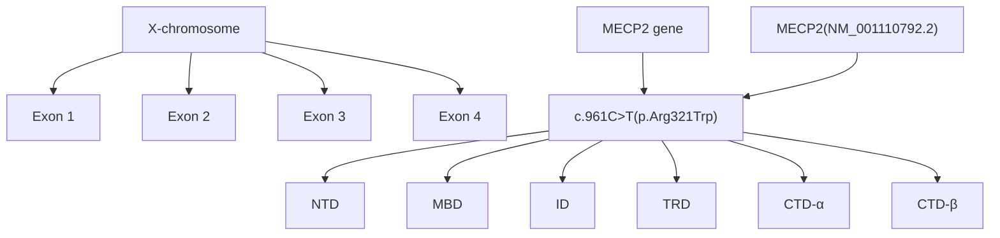

# Neurogenic Bladder: A Rare Autonomic Sign in a Patient with Preserved Speech Variant of the Rett Syndrome (Zappella Variant)

Nörojen Mesane: Konuşmanın Korunduğu Rett Sendromlu (Zappella Varyanti) Bir Hastada Nadir Bir Otonomik Belirti

Özge TANIDIR ARTAN1 , Büşranur ÇAVDARLI2 , Umut Selda BAYRAKCI3 , Bilge KARABULUT4 , Aydan DEĞERLİYURT1

1 Deparment of Pediatric Neurology, Ankara Bilkent City Hospital, Ankara, Türkiye 
2 Deparment of Medical Genetics, Ankara Bilkent City Hospital, Ankara, Türkiye 
3 Deparment of Pediatric Nephrology, Ankara Bilkent City Hospital, Ankara, Türkiye 
4 Deparment of Pediatric Urology, Ankara Bilkent City Hospital, Ankara, Türkiye

## ABSTRACT

Rett syndrome is characterized by the loss of speech and purposeful hand movements, ambulation problems, and typical hand stereotypies. Preserved speech variant of the Rett syndrome (Zappella Variant) is a much less common form where speech is relatively preserved. We aimed to emphasize neurogenic bladder due to autonomic dysfunction in a patient with preserved speech variant of the Rett syndrome.

A 7-year-old female patient who had been diagnosed with severe neurogenic bladder when 11 months old was suspected of suffering from Rett syndrome after observing intense eye contact and the stereotypic movement of hand wringing. The patient could talk with phrases, can walk, and have purposeful hand movements. The presence of the c.961C>T (p.Arg321Trp) heterozygous mutation in the C terminal region of the methyl-CpG-binding protein 2 (MECP2) gene was demonstrated. The patient is currently 13 years old. She continues to be monitored for chronic renal disease.

The presence of hand stereotypies and intense eye pointing could indicate the Zappella variant Rett syndrome since the patient has developmental problems, even though the patient can talk and has purposeful hand skills. The development of intermittent urinary retention associated with neurogenic bladder caused by autonomic dysfunction should be considered in these patients.

Key Words: Autonomic dysfunction, Neurogenic bladder, Preserved speech variant, Rett syndrome, Zappella variant

## ÖZ

Rett sendromu, konuşma ve anlamlı el hareketlerinin kaybı, yürüme sorunları ve tipik el stereotipleri ile karakterizedir. Konuşmanın korunduğu Rett sendromu varyantı (Zappella Variant), çok daha az yaygın bir formdur. Konuşmanın korunduğu varyant Rett sendromlu bir hastada otonomik disfonksiyona bağlı nörojenik mesaneyi vurgulamayı amaçladık.

Onbir aylıkken şiddetli nörojenik mesane tanısı konulan 7 yaşındaki kız hastada, yoğun göz teması ve basmakalıp el ovuşturma hareketi gözlemlendikten sonra Rett sendromundan şüphelenildi. Hasta cümlelerle konuşabiliyor, yürüyebiliyor ve amaçlı el hareketleri yapabiliyordu. MECP2 geninin C terminal bölgesinde c.961C>T (p.Arg321Trp) heterozigot mutasyonunun varlığı gösterildi. Hasta şu anda 13 yaşında olup kronik böbrek hastalığı açısından takip edilmeye devam etmektedir.

Gelişimsel sorunları olan, el sterotipileri ve yoğun göz teması varlığı ile Rett sendromu tanısı almış hastalarda konuşma ve amaçlı el becerilerinin korunmuş olması Zappella varyantı Rett sendromuna işaret edebilir. Bu hastalarda aralıklı idrar retansiyonu gelişiminin otonomik tutuluma bağlı nörojenik mesane ile ilişkili olabileceği akılda tutulmalıdır.

Anahtar Kelimeler: Otonom fonksiyon bozukluğu, Nörojen mesane, Konuşmanın korunduğu variant, Rett sendromu, Zappella variant

0000-0002-9773-5497 : TANIDIR ARTAN Ö 0000-0002-0953-6210:CAVDARLLB 0000-0002-5301-2617 : BAYRAKCI US 0000-0002-5113-7467 : KARABULUT B 0000-0001-9776-9390:DEGERLIYURTA

Conflict of Interest /Çıkar Çatışması: On behalf of all authors, the corresponding author states that there is no conflict of interest.

Financial Disclosure / Finansal Destek: The authors declared that this case has received no financial support.

Confirmation / Onay: The written consent was received from the patient who was presented in this study.

How to cite / Atıf Yazım Şekli : Tanıdır Artan Ö, Çavdarlı B, Bayrakcı US, Karabulut B and Değerliyurt A. Neurogenic Bladder: A Rare Autonomic Sign in a Patient withPreserved Speech Variant of the Rett Syndrome (Zapella Variant). Turkish J Pediatr Dis 2024;18:256-259.

## INTRODUCTION

Rett syndrome (MIM: 312750, ORPHA: 3095) is a neurodevelopmental disorder characterized by the loss of speech and purposeful hand movements, ambulation problems, and emerging typical hand stereotypies (1). It is one of the most common genetic reasons of intellectual and developmental delay in girls with an incidence rate of 1 in 10.000 (2). Girls with typical Rett syndrome present with a regression period characterized by the loss of speech and motor functions that result in intellectual disability and typical hand stereotypic movements, following a relatively normal neurodevelopmental period in the first 6 to 18 months of life (3). The preserved speech variant is a clinically milder form of Rett syndrome. Autistic behavior is common and this variant has frequently been associated with the p.Arg133Cys mutation or C terminal deletion (4, 5).

Loss of function mutations in the MECP2 gene are known to play a role in more than 90% of typical Rett syndrome patients and up to 75% of the Zappella variant patients. The best known function of the MECP2 gene is to regulate the transcription of multiple genes through repression or promotion after binding to methylated DNA (6). MECP2 contributes to the normal development and function of the central nervous system by regulating neuronal development and synaptic and cellular plasticity (6).

Autonomic dysfunction is quite common in Rett syndrome patients, without regard to the location and type of the mutation (7,8). These patients suffer from a severe imbalance between sympathetic and parasympathetic activity due to a very immature vagal tonus and various resultant autonomic problems such as hyperventilation, apnea, breath holding, shallow respiration, prolonged QT intervals, reduced heart rate variability, dysphagia, constipation, abdominal bloating, neurogenic bladder, mood disorders, sleep disorders, and cold and blue extremities caused by peripheral circulatory disorders (9,10).

Although there are many studies on autonomic dysfunction involving various organ systems in Rett syndrome, there are only a few publications on neurogenic bladder and the related problems. This study focuses on a very rare combination of an early onset severe neurogenic bladder, vesicoureteral reflux, and secondary hydronephrosis in a patient with Zappella variant of Rett syndrome developing due to a missense mutation in the C terminal region of the MECP2 gene.

## CASE REPORT

A 7-year-old female patient presented to the pediatric neurology department for epileptic seizures. The patient borned via spontaneous vaginal birth following an uncomplicated delivery from non-consanguineous parents. Her mother reported that the patient had started to walk when she was 2 years old and had started to talk when 5 years old. She had undergone a vesicostomy procedure for neurogenic bladder plus fourth grade vesicoureteral reflux when she was 11 months old due to her inability to urinate. This had been followed by bladder augmentation and the initiation of clean intermittent catheterization. The seizures has first started in this period of illness and she was still on dual antiepileptic treatment. The head circumference was 50 cm (50th percentile) on neurological examination. Excessive activity, echolaly, hand wringing type stereotyped movements of the hand, and intense eye contact were noted. She could form sentences of two or three words, respond in a meaningful manner to questions, and count to five. She has been receiving special education for cognitive impairment. The brain magnetic resonance imaging (MRI) was normal except slightly thick corpus callosum. The spinal MRI, echocardiography, and electrocardiogram (ECG) results were normal. Urinary ultrasound sonography (USG) revealed that the kidney parenchyma on both sides had thinned to a point that could not even be measured in many places and all collecting systems were markedly dilated to include both extrarenal pelvises, calyxes, and ureters in a manner that was consistent with grade 5 hydroureteronephrosis.

Following the consent of the family, the patient’s DNA was extracted from peripheral blood lymphocytes. All the exons and exon-intron boundaries of the MECP2 gene were sequenced by the Sanger method on ABI PRISM 3130 Genetic Analyzer (Applied Biosystems, Foster City, CA, USA). A heterozygous missense c.961C>T (p.Arg321Trp) variant was detected in exon 3 of the MECP2 (NM\_001110792.2) gene. The variant was replaced in a mutational hotspot region of the gene (PM1). The variant was not found in healthy populations (PM2) whereas it was submitted as likely pathogenic to the Clinvar database before (PP5). So the variant is classified as likely pathogenic in the light of these criteria. Also her mother was tested for MECP2 gene pathology but no pathogenic change was found.

The patient was 13 years 6 months old at the last visit and had not suffered from seizures during the last year. She could read and write in syllables but could not perform simple arithmetic calculations. She had problems due to her aggressive behaviors and she sometimes laughed inappropriately. The patient’s serum creatinine level was 1.14 mg/dl and urea level was 39 mg/dL at her last visit. Her estimated GFR (glomerular filtration rate) was 71 ml/min/1.73 m2 revealing grade 2 chronic renal disease. She was followed by the pediatric nephrology department for neurogenic bladder and chronic renal disease. She has been performing intermittent self-catheterization and has been receiving prophylactic antibiotics.

Written informed consent to publication of the case report was received from the family.

## DISCUSSION

The patient presented to the pediatric neurology department with epileptic seizures. She could form sentences, had manual skills, and could walk, in a more limited manner than her peers. She received a diagnosis of preserved speech variant of Rett syndrome with intense eye contact and stereotypies in the hands. The preserved speech variant is known to be less common (5.7%) than classic Rett syndrome (3). These patients have most of the features of classic Rett syndrome but developmental delay, head growth deceleration, and hyperventilation are either absent or less common (11). The clinical picture is milder than the classic Rett syndrome, making the diagnosis more difficult and delayed. Our patient had been followed up at the pediatric neurology department for epileptic seizures that had first started when she was 11 months old. However, she had only been reported with intense eye pointing and hand stereotypies when 7 years old. Hand stereotypies are seen at a rate of 68.1% and intense eye pointing at 87.6% in Rett syndrome patients (3). The presence of hand stereotypies and intense eye pointing may indicate a diagnosis of preserved speech variant of Rett syndrome in a female patient who can talk, has purposeful manual skills, and can walk despite having developmental problems. Similar to the findings of Renieri et al. (4), this patient has shown moderate developmental delay, hand stereotypies and milder reduction of hand skills. This variant has frequently been found to be associated with C terminal region changes, as in our case (Figure 1) (5).

The evaluations performed in this patient due to decreased urinary output and inability to pass urine when she was 11 months old, which had resulted in neurogenic bladder and vesicoureteral reflux detection. However, these evaluations were done before the Rett syndrome clinical picture had appeared. Neurogenic bladder is a condition characterized by detrusor overactivity, detrusor sphincter dyssynergia, or sphincter underactivity and affects both bladder capacity and urination function. The long-term presence of this clinical picture can result in inadequate bladder capacity, incontinence, high postvoid residual volumes, and also future problems that can be life-threatening such as upper urinary tract dysfunction with chronic renal disease and hydronephrosis as in the case (12). Many conditions may result in neurogenic lower urinary tract dysfunction but other etiologies were ruled out in the current patient with the history, examination, and brain-spinal MRI.

The presence of autonomic symptoms related to the cardiac, respiratory, gastrointestinal, and other systems in Rett syndrome patients has been shown both in patients in the clinic and in Rett syndrome mouse models with MECP2 mutations (13). However, only a limited number of cases with neurogenic lower urinary tract dysfunction have been reported. The Rett Syndrome Natural History Study including the clinical information of 1165 Rett syndrome patients reports urinary retention in 11, vesicoureteral reflux in 9 and neurogenic bladder in 3 patients (13). Urinary retention has been found to be 17 times more common in these patients than in the normal population (13, 14). Another study has reported urinary retention in four patients and urinary incontinence in one patient in adult Rett syndrome patients presented for urological evaluation (14). Neurogenic bladder was found in all these patients (14). Another case report concerns a Rett syndrome patient with intermittent urinary retention and overflow incontinence (15). These cases and our own case demonstrate that urological dysfunction is more common in Rett syndrome patients than in the general population, although still rare. Evaluating these results together with those from mouse models indicate that this disorder could cause significant morbidity, such as chronic renal disease and secondary renal failure, and mortality. However, the presence of only a few reports on neurogenic bladder and its complications in this group of patients could show that these clinical conditions are disregarded because of the developmental problems that are at the forefront.

flowchart

Figure 1: Visualization of MECP2 gene exons and MECP2 protein domains. The variant detected is replaced in exon 3 of the MECP2 gene and CTD-α domain of Methyl-CpG-binding protein 2. (NTD: N-terminal domain, MBD: methylated DNA-binding domain, ID: interdomain, TRD: transcription repression domain, CTD-α and β: C-terminal domains)

The expression of the MECP2 gene is regularly increased during the postnatal period where there is a marked cerebral synapse formation and maturation, and its lifelong normal function of the MECP2 gene is required for the maintenance of neurons. MECP2 dysfunction is not a monogenic disorder as it was previously thought. It is a very complex disorder that causes deregulation of the transcription of more than 1000 genes for which it is a repressor or an activator (16). The BDNF (Brain Derived Neurotrophic Factor) gene that plays role in Rett syndrome pathogenesis shows its main effect on the spinal cord in the central nervous system, and its transcription is severely affected in Rett syndrome (17). The expression of BDNF is low in the prenatal period and dramatically increases in the postnatal period, similar to MECP2. BDNF expression is not affected in the early presymptomatic period in MECP2 knockout mice but the level decreases with the appearance of Rett-like symptoms (16). The lower urinary tract dysfunction and neurogenic bladder seen in these patients could be the result of BDNF deficiency in the spinal cord.

## CONLUSION

The presence of hand stereotypies and intense eye pointing can indicate a diagnosis of preserved speech variant of Rett syndrome in a female patient who can talk, has purposeful manual skills, and can walk despite having developmental problems. Autonomic lower urinary tract dysfunction can also be seen in Rett syndrome patients although it is less common than cardiac, respiratory, and gastrointestinal autonomic involvement. It should be remembered that clinical conditions such as intermittent urinary retention and vesicoureteral reflux could be related to neurogenic bladder due to autonomic involvement in these patients and one must be aware of the serious complications like chronic renal disease. Neurogenic lower urinary tract dysfunction can be overlooked in Rett syndrome, one of the most common causes of development delay in girls, due to the severe developmental problems at the forefront and this needs to be evaluated in studies with a large number of subjects.

## REFERENCES

1. Percy AK, Neul JL, Glaze DG, Motil KJ, Skinner SA, Khwaja O, et al. Rett syndrome diagnostic criteria: Lessons from the Natural History Study. Ann Neurol 2010; 68: 944–50. 
2. Fu C, Armstrong D, Marsh E, Lieberman D, Motil K, Witt R, et al. Consensus guidelines on managing Rett syndrome across the lifespan. BMJ Paediatr Open 2020;4: e000717. 
3. Frullanti E, Papa FT, Grillo E, Clarke A, Ben-Zeev B, Pineda M, et al. Analysis of the Phenotypes in the Rett Networked Database. Int J Genomics 2019; 6956934. 
4. Renieri A, Mari F, Mencarelli MA, Scala E, Ariani F, Longo I, et al. Diagnostic criteria for the Zappella variant of Rett syndrome (the preserved speech variant). Brain Dev 2009; 31: 208–216. 
5. Leonard H, Cobb S, Downs J. Clinical and biological progress over 50 years in Rett syndrome. Nat Rev Neurol 2017; 13:37-51. 
6. Ivy AS, Standridge SM. Rett Syndrome: A timely review from recognition to current clinical approaches and clinical study updates. Semin Pediatr Neurol 2021;37:100881. 
7. Singh J, Santosh P. Key issues in Rett syndrome: emotional, behavioural and autonomic dysregulation (EBAD)- a target for clinical trials. Orphanet J Rare Dis 2018;13:128. 
8. Halbach N, Smeets EE, Julu P, Witt-Engerström I, Pini G, Bigoni S et al. Neurophysiology versus clinical genetics in Rett syndrome: A multicenter study. Am J Med Genet A 2016;170:2301-9. 
9. Pini G, Bigoni S, Congiu L, Romanelli AM, Scusa MF, Di Marco P, et al. Rett syndrome: a wide clinical and autonomic picture. Orphanet J Rare Dis 2016;11:132. 
10. Lioy DT, Wu WW, Bissonnette JM. Autonomic dysfunction with mutations in the gene that encodes methyl-CpG-binding protein 2: Insights into Rett syndrome. Auton Neurosci 2011;161:55-62. 
11. Marschik PB, Pini G, Bartl-Pokorny KD, Duckworth M, Gugatschka M, Vollmann R, et al. Early speech-language development in females with Rett syndrome: focusing on the preserved speech variant. Dev Med Child Neurol 2012; 54:451-6. 
12. Doelman AW, Streijger F, Majerus SJA, Damaser MS, Kwon BK. Assessing neurogenic lower urinary tract dysfunction after spinal cord injury:Animal models in preclinical neuro-urology research. Biomedicines 2023;11:1539. 
13. Ward CS, Huang TW, Herrera JA, Samaco RC, Pitcher MR, Herron A, et al. Loss of MECP2 causes urological dysfunction and 
contributes to death by kidney failure in mouse models of Rett syndrome. PLoS One 2016;11: e0165550. 
14. Roth JD, Pariser JJ, Stout TE, Misseri R, Elliot SP. Presentation and management patterns of lower urinary tract symptoms in adults due to rare inherited neuromuscular diseases. Urology 2020;135:165-70. 
15. Park HE, Lee JS, Kim DM, Shin YB. Two pediatric cases of successful management of postictal transient urinary retention. Ann Rehabil Med 2020;44:90-93. 
16. Li W, Pozzo-Miller L. BDNF deregulation in Rett syndrome. Neuropharmacology 2014; 76:737-46. 
17. Frias B, Allen S, Dawbarn D, Charrua A, Cruz F, Cruz CD. Brain derived neurotrophic factor, acting at the spinal cord level, participates in bladder hyperactivity and referred pain during chronic bladder inflammation. Neuroscience 2013; 234:88-102.