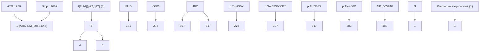

# Phenotypic variability in Rett syndrome associated with FOXG1 mutations in females

C Philippe, D Amsallem, C Francannet, L Lambert, A Saunier, F Verneau, P Jonveaux

## To cite this version:

C Philippe, D Amsallem, C Francannet, L Lambert, A Saunier, et al.. Phenotypic variability in Rett syndrome associated with FOXG1 mutations in females. Journal of Medical Genetics, 2010, 47 (1), pp.59. ⟨10.1136/jmg.2009.067355⟩. ⟨hal-00552697⟩

HAL Id: hal-00552697

https://hal.science/hal-00552697v1

Submitted on 6 Jan 2011

HAL is a multi-disciplinary open access archive for the deposit and dissemination of scientific research documents, whether they are published or not. The documents may come from teaching and research institutions in France or abroad, or from public or private research centers.

L’archive ouverte pluridisciplinaire HAL, est destinée au dépôt et à la diffusion de documents scientifiques de niveau recherche, publiés ou non, émanant des établissements d’enseignement et de recherche français ou étrangers, des laboratoires publics ou privés.

# Phenotypic variability in Rett syndrome associated with FOXG1 mutations in females

C. Philippe1\*, D. Amsallem2 , C. Francannet3 , L. Lambert4 , A. Saunier1 , F. Verneau1 , and P. Jonveaux1

1 : Laboratoire de génétique médicale, Nancy Université, EA 4002, Centre Hospitalier Régional et Universitaire, Rue du Morvan, 54511 cedex 1, Vandoeuvre-les-Nancy, France 
2 : Service de Neuropédiatrie, Hôpital St Jacques, Place St Jacques, 25030 cedex, Besançon, France 
3 : Service de Génétique médicale, CHU Hôtel-Dieu, boulevard Léon Malfreyt, 63058 cedex 1, Clermont-Ferrand I, France 
4 : Service de Médecine infantile 1 , Hôpital d’Enfants, Centre Hospitalier Régional et Universitaire, Rue du Morvan, Vandoeuvre-les-Nancy, France

Running title: FOXG1 and Rett syndrome

## Abstract

## Background

The FOXG1 gene has been recently implicated in the congenital form of Rett syndrome (RTT). It encodes the Forkhead box protein G1, a winged-helix transcriptional repressor with expression restricted to testis and brain where it is critical for forebrain development. So far, only two point mutations in FOXG1 have been reported in females affected by the congenital form of RTT.

## Aim

To assess the implication of FOXG1 in the molecular aetiology of classical RTT syndrome and related disorders.

## Methods

We screened the entire multi-exon coding sequence of FOXG1 for point mutations and large rearrangements in a cohort of 35 MECP2/CDKL5 mutation-negative female individuals including 31 classical and 4 congenital forms of RTT.

## Results

We identified two different de novo heterozygous FOXG1 truncating mutations. The individual with the p.Trp308X mutation presented with a severe RTT-like neurodevelopment disorder, whereas the p.Tyr400X allele was associated with a classical clinical RTT presentation.

## Conclusions

These new cases give additional support to the genetic heterogeneity in RTT, and help to delineate the clinical spectrum in the FOXG1-related phenotypes. FOXG1 screening should be considered in the molecular diagnosis of RTT.

## Key words

FOXG1, atypical Rett syndrome, haploinsufficiency

## Introduction

Rett syndrome (RTT, OMIM 312750) is a disorder of postnatal neurodevelopment mainly caused by de novo mutations in the MECP2 gene encoding methyl-CpG binding protein 2 1, 2. MECP2 has been involved in up to 90% of classical RTT, however its mutation rate is low (around 20%) in variant RTT 3 . RTT is a clinically defined condition with a large spectrum of phenotype. In the last few years, this genetic disease turned out to be genetically heterogeneous. Microdeletions found by CGH-array as well as balanced translocations allowed the identification of genes responsible for phenotypes that overlap strongly with RTT. A translocation that disrupted the Netrin G1 gene (NTNG1) was reported in a patient with the early seizure variant of RTT 4 . However mutations in the NTNG1 gene appear to be a very rare cause of RTT as no additional deleterious mutations were published since then. Mutations in the X-linked cyclin-dependant kinase-like 5 (CDKL5/STK9, OMIM 300203) gene have been identified both in females and males with the Hanelfed variant of RTT and/or X-linked infantile spasms (OMIM 308350) 5-10. More recently, the FoxG1 transcription factor (formerly brain factor 1 [BF1]) was found to be altered in two girls with clinical features consistent with congenital RTT 11. FoxG1 is a DNA-binding transcription factor with a forkhead binding domain (FBD) which represses target genes during development of the brain with a key role in early telencephelon patterning 12. It recruits transcriptional corepressor proteins via two protein-binding domains: JARID1B-binding domain (JBD) and Grouchobinding domain (GBD).

In a diagnostic setting, we have analysed MECP22, 13, 14 and CDKL5 genes9 in a very large cohort of individuals suffering from typical and variant forms of RTT. Here, we report the molecular screening of the FOXG1 gene in a cohort of 35 female individuals with a typical form or a congenital variant of RTT. We described two females heterozygous for a FOXG1 mutated allele.

## Patients and methods

## Patients

In this study we included 35 female individuals who were recruited at different clinical genetic centres through France with a clinical diagnosis of RTT based on revised criteria for this disorder 15. All individuals with classical RTT presented with at least seven necessary criteria together with supportive criteria. Thirty one individuals were considered as typical RTT and 4 as congenital or early-onset RTT when the normal perinatal period was absent or shorter than 6 months without any regression period respectively. Mutations in the MECP2 and the CDKL5 genes could not be detected in these patients by direct sequencing of the entire coding sequences and exon/intron boundaries and by multiplex ligation-dependent PCR amplification (MLPA). Blood samples were obtained from patients after informed consent. Total genomic DNA was extracted from peripheral blood using the NucleonTM BACC genomic DNA extraction kit (GE Healthcare).

## Mutation screening of FOXG1 by direct sequencing of PCR products

We analysed the entire coding sequence by direct sequencing of PCR products. Exons 1 to 5 of the FOXG1 gene were PCR amplified (table I). Primers were modified by the addition of either M13F (5’-tgtaaaacgacggccagt-3’) or M13R (5’-caggaaacagtcatgacc) sequences at their 5’ end. The coding sequence was screened by direct DNA sequencing with M13F and M13R primers as described earlier 13 except for exon 4 for which we used internal primers because of a polyT tract at the end of intron 3 (table I). Sequences were automatically analysed with the Seqscape 2.5 software (Applied Biosystems). Sequence variants are numbered starting from the first base of the ATG codon, numbering based on reference sequence NM\_005249.3. Naming of variants with the Alamut 1.4 software (Interactive Biosoftware) follows the

Human Genome Variation Society (HGVS) nomenclature. Mutations reported in this study have been deposited in the Italian Rett database (http:/www.biobank.unisi.it/).

## Screening for large rearrangements of FOXG1 by QMPSF

Detection of large rearrangements of the FOXG1 gene was performed by QMPSF (quantitative multiplex PCR of short fluorescent fragments). The QMPSF analysis was performed as described earlier 13 with a multiplex PCR amplifying exons 1, 3, 4, and 5 of the FOXG1 gene 16. Primer sequences are depicted in table I. One multiplex PCR with 5 amplicons was performed in a 25 µl reaction with 2mM MgCl2, $2 0 0 \mu \mathrm { M }$ dNTPs, 0.15 to 0.6 $\mu \mathrm { M }$ primers, 2M betaïne, 2.5 U Taq polymerase (Thermoprime, Abgene) and 200 ng of genomic DNA. PCR consisted of an initial denaturation step for 4 min at $9 5 \mathrm { { ^ \circ C } }$ followed by 24 cycles: $9 5 \mathrm { { ^ \circ C } }$ for 30 s, $5 8 \mathrm { { } ^ { \circ } C }$ for 30 s, $7 2 ^ { \circ } \mathbf { C }$ for 30 s. The PCR was ended by an elongation step for 7 min at $7 2 \mathrm { { } ^ { \circ } C }$ .

## RT-PCR of the FOXG1 transcripts

Total RNAs from whole blood were extracted with the PAXgeneTM blood RNA system (PreAnalytiX) or from lymphoblastoïd cells with the TRIzol® reagent (Invitrogen). Prior to RT-PCR, RNAs were treated with DNase I (Sigma) at room temperature for 15 min, DNase I was inactivated at $7 0 \mathrm { { } ^ { \circ } C }$ for 10 min. RT-PCR with primers located in exon(s) of the different alternative transcripts were performed with the QIAGEN OneStep kit.

<table><tr><td>Primer</td><td>Primer sequence (5&#x27; to 3&#x27;)</td><td>PCR product size (bp)</td><td>Primer concentration (μM)</td><td>Annealing temperature/ MgCl2 concentration/Betaine (°C/mM/M)</td></tr><tr><td colspan="5">Sequencing</td></tr><tr><td>Exon 1-1F</td><td>AGC CTG CGG TCC AAC TGC GC</td><td rowspan="2">565</td><td rowspan="16">0,8 μM</td><td rowspan="2">58/1,5/2</td></tr><tr><td>Exon 1-1R</td><td>CAG CCC GTC CGC TTT AGC CC</td></tr><tr><td>Exon 1-2F</td><td>GCC GCC GCA GCA GCA GCA GC</td><td rowspan="2">657</td><td rowspan="2">58/1,5/2</td></tr><tr><td>Exon 1-2R</td><td>CGC AGC TTG CCC GTG GTG CC</td></tr><tr><td>Exon 1-3F</td><td>ACG CTC AAC GGC ATC TAC GA</td><td rowspan="2">621</td><td rowspan="2">65/1,5/0</td></tr><tr><td>Exon 1-3R</td><td>AGA GCA GGG CAC CGA CAG GC</td></tr><tr><td>Exon 1-4F</td><td>TCA GAA CTC GCT GGG CAA CA</td><td rowspan="2">641</td><td rowspan="2">65/1,5/0</td></tr><tr><td>Exon 1-4R</td><td>TCT GAC CAG CTA GAT CCC AC</td></tr><tr><td>Exon 2F</td><td>AAG CCT GTT GGA GAA TTA GA</td><td rowspan="2">390</td><td rowspan="2">61/1,5/0</td></tr><tr><td>Exon 2R</td><td>TCT CTA GCA CCT TTT AAC TC</td></tr><tr><td>Exon 3F</td><td>ATA ACC CAC CTC AGA TTT TG</td><td rowspan="2">439</td><td rowspan="2">61/1,5/0</td></tr><tr><td>Exon 3R</td><td>GCA TCC TTT CAG CTA CGT CT</td></tr><tr><td>Exon 4F</td><td>TTT ATT GAA GTC TGG AGG AG</td><td rowspan="2">587</td><td rowspan="2">63/1,5/0</td></tr><tr><td>Exon 4R</td><td>GTC AAC ACT GTC CAC TAC CC</td></tr><tr><td>Exon 5F</td><td>GGT GAA CTT AAC AAC ATA GC</td><td rowspan="2">690</td><td rowspan="2">61/2,5/0</td></tr><tr><td>Exon 5R</td><td>TTA GCC AGG ATG GTC TCG AT</td></tr><tr><td colspan="5">QMPSFa</td></tr><tr><td>Exon 1 -B-F</td><td>CG GCA AGT ACG AGA AGC CGC</td><td rowspan="2">179</td><td rowspan="2">0,6 μM</td><td rowspan="10">58/2/2</td></tr><tr><td>Exon 1 -B-R</td><td>AT GGA GTT CTG CCA GCC CTG C</td></tr><tr><td>Exon 2 -F</td><td>TT CAC CAG ATA ACC TGC CCC</td><td rowspan="2">230</td><td rowspan="2">0,15 μM</td></tr><tr><td>Exon 2 -R</td><td>AC GTG TGT GCC CAA AAG AGA G</td></tr><tr><td>Exon 4 -F</td><td>GG GCC TTG GGA GAT GGA A</td><td rowspan="2">196</td><td rowspan="2">0,3 μM</td></tr><tr><td>Exon 4-R</td><td>CC TCT TTT CAA CCT TCT GCA AAA C</td></tr><tr><td>Exon 5 -F</td><td>TC AGT GTG CTG TTG TCA ATC AGA</td><td rowspan="2"></td><td rowspan="2">0,4 μM</td></tr><tr><td>Exon 5 -R</td><td>AC CAA GAA TTC AGA CAT AGG AGA GA</td></tr><tr><td>control BCRA1 Ex 20-R</td><td>GC TCC ACT TCC ATT GAA GGA AG</td><td rowspan="2">250</td><td rowspan="2">0,3 μM</td></tr><tr><td>control BCRA1 Ex 20-F</td><td>AG CGG CCC ATC TCT GCA AAG</td></tr></table>

Table I

## Results

Identification of mutations in the FOXG1 gene

This molecular study resulted in the finding of premature stop codons (PTCs) at amino acids 308 (c.924A>G; Figure 1A) and 400 (c.1200C>G; Figure 1C) in patients 1 and 2 respectively. Testing of parents revealed that both mutated alleles were de novo. It was not possible to evaluate the effect of the PTCs on the stability of the FOXG1 mRNAs as we failed to RT-PCR amplify any transcripts for this gene in leucocytes and in lymphoblastoïd cells.

## Clinical reports

Patient 1 is a girl aged 22, she is the unique child of healthy and unrelated parents. She was born by spontaneous delivery after an uneventful pregnancy with Apgar scores of 8 at 1 min and 10 at 5 min. Birth weight (3,400 g), length (54 cm) and head-circumference (34 cm) were normal. Head growth deceleration was noted at two months. She was considered to be a normal child until the age of 4 months when she presented with strabismus, feeding difficulties and interaction dysfunction. She also presented with global hypotonia, foot deformity (equinovarus), choreic movements, sialorrhoea and night screaming fits. At 2 years of age was diagnosed a severe epilepsy with hyperthermia-induced seizures. With age, she developed spontaneous myoclonic seizures. Interictal awaken recordings showed a background activity in the theta frequencies (4-6 Hz), symmetrical, continuous, with a voltage of 20 to $3 0 ~ \mu \mathrm { V } .$ , attenuated by eye opening. Between 4 and 21 years of age, the background activity stayed the same. At age 4 through 10, EEGs showed widespread diphasic waves in the delta or theta frequencies occurring in brief bursts, without clinical signs or sometimes accompanied by clonic jerks of the head. At age 11 some spike-and-waves appeared in these bursts, and became polyspikes at age 15. Common sleep patterns were absent until the age 17 when spindles were first seen. In light and deep sleep, background activities were in the theta then delta frequencies, with slower frequencies on the right hemisphere. EEGs remained organized during slow sleep despite a consistent activation of paroxysmal patterns as well as widespread bisynchronous waves, with high amplitude on anterior regions. These bifrontal waves were asymptomatic when in brief bursts, or followed by conjugate lateral ocular deviations with unilateral clonic jerks of the superior limbs when in longer and rhythmic trains. These patterns were different from those seen in the Lennox-Gastaut syndrome. Two bone fractures of femur and humerus at the ages of 5 and 10 years respectively could be suggestive of osteoporosis. She never acquired speech and purposeful hand skills. Cranial magnetic resonance imaging (MRI) at age 15 showed ventricular enlargement and hypoplasia of the corpus callosum with decreased frontal and occipital white matter volume and paucity of gyral development (Figure 1B). At revaluation at 22 years of age, she presented with inexplicable episodes of laughing, hand stereotypies and bruxism. There were feeding problems resulting from swallowing difficulties with a body weight of 44 kg (body mass index 17). The seizures are controlled by clonozepam and oxcarbamazepine antiepileptic drugs.

Patient 2 is a 10-year-old female who was born by spontaneous delivery after an uneventful pregnancy. She is the first child of healthy and nonconsanguineous parents. Her birth weight was 3,880 g, and her length was 52 cm with a normal head-circumference (34 cm). She was considered to be a normal child until age 6 months, when developmental delay was noticed. She was not able to walk until the age of 30 months. Postnatal deceleration of head growth started at the age of 9 mo, her head circumference was 48,5 cm (-2 SD) at 10 years of age. At the age of 5 years, the clinician noticed repetitive stereotyped hand movements, absence of speech, frequent and inappropriate episodes of laughing, and hemihypotrophy of the left half of the body. A normal methylation pattern at the 15q11-q12 region was not in favour of Angelman syndrome and a diagnosis of Rett syndrome was proposed. At the age of 9 years, she presented with autistic behaviour with poor eye contact, ataxia and abundant drooling in addition to self-abusive behaviour. She was capable of saying a few words (mummy and daddy), and bit her hands. Hand stereotypies were not noted anymore and hand skills were improved. Breathing, sleeping pattern and peripheral vasomotor function were normal. Seizure was never noted by the parents. In addition, she has foot deformity (equinovarus) and minor anomalies with protruding ears, anteverted nostrils and an open mouth appearance. Brain MRI did not reveal any malformation.

## Discussion

FOXG1 located in 14q12 was cloned as a gene containing the fork head domain (HFK1 for Human Fork Head 1) in 199417, it encodes a developmental transcription factor with repressor activities. Its expression profile is restricted to brain and testis. In the mouse, Foxg1 transcription factor is critical for forebrain development. In concert with Fgf (fibroblast growth factor) signalling it participates to early telencephalon patterning at approximately E8.5 in mouse, and is absolutely required for the establishment of ventral identity in the telencephalon12. The Foxg1 transcription factor was also implicated in the development of the olfactory system18 and in sex hormone signalling by interacting with the androgen receptor (AR) protein19. FOXG1 is subject to alternative splicing with the FOXG1B major transcript expressed in foetal and adult brain 16, 17. Four additional FOXG1B splicing variants were

We report on two nonsense mutations in the FOXG1 gene in two female individuals. Patient 1 with a p.Trp308X mutation suffers from a severe RTT-like neurodevelopment disorder with brain malformations whereas the more carboxy-terminal p.Tyr400X stop codon is associated with a classical RTT in patient 2. The overall mutation rate of FOXG1 in our series is 3.2% (1/31) in females with a classic RTT whereas one out of four females with congenital RTT is positive for FOXG1. Patient 1 has a severe RTT-like phenotype suggestive of a congenital RTT with MRI anomalies. The clinical presentation in patient 1 is very similar to that of patients reported by Ariani et al.11. This severe RTT-like phenotype motivated a CDKL5 screening although patient 1 did not show an early-onset epileptic encephalopathy. Patient 2 can be considered as classical RTT (Table II) according to the revised diagnostic criteria for classical and variant RTT15.

The FOXG1B transcript described by the NM\_005249 mRNA sequence is encoded by a single exon. We can speculate that the abnormal FOXG1B mRNAs in patients 1 and 2 are not affected by the nonsense-mediated mRNA decay (NMD) mRNA surveillance pathway and give rise to truncated proteins missing different parts of the carboxy-terminal region of FoxG1. The FoxG1 transcription factor represses the transcription of target genes through recruitment of Groucho and JARID1C co-repressors. The GBD interacts with the Grouch protein that is widely used by many developmentally important repressors for silencing their various targets. The JDB recruits the JARID1C demethylase involved in demethylation of triand dimethylated Lys 4 histone 3 (H3K4). Demethylation of H3K4 is associated with silenced chromatin. In patient 1 the mutated FoxG1 transcription factor misses both the GBD and the JBD essential for recruiting trancriptional co-repressors. The clinical presentation in patient 1 is very similar to that of both cases reported by Ariani et al. with absent or no functional Groucho and JARID1C binding domains11. The premature stop codon is more carboxyterminal in patient 2. The truncated FoxG1 protein contains an intact GBD and therefore may retain residual repression activity in patient 2. This residual activity could explain the milder phenotype in this patient as compared to the more severe RTT in patients heterozygous for a non functional FoxG1 protein incapable of recruiting any co-repressors. FOXG1 alternative transcripts consist of multi-exon mRNAs expressed in foetal brain. In both patients, the PTCs may trigger the NMD for these transcripts in foetal brain. It was not possible to estimate the effect of PTCs on the stability of the FOXG1 splice variants B2 to B5 16 as we failed to amplify these transcripts on total RNAs extracted from leucocytes or lymphoblastoïd cells. Before our study, to the best of our knowledge a total of 15 FOXG1 alterations were described including 12 large deletions, one t(2;14)(p22;q12) with a breakpoint in intron 3 of FOXG1, and 2 nonsenses (Figure 3). Initially, chromosome abnormalities revealed by conventional karyotyping or CGH were reported to affect the FOXG1 locus. Seven large deletions of the 14q proximal region encompassing the FOXG1 locus were not precisely mapped20-24. In these cases, the absence of precise breakpoint mapping and the high number of genes in the deleted region hampered any genotype-phenotype correlations. A 3 Mb deletion was identified by array-CGH analysis in a girl with severe mental retardation and many Rett-like features25. This was the first report to show link between the FOXG1 gene and RTT in a patient initially tested negative for MECP2 and CDKL5. Brain MRIs were normal. In a compilation of 9 patients with a 14q rearrangement, breakpoint mapping showed that two males (n° 3 and n° 5 in the report by Kamnasaran et al., 2001) were heterozygous for deletions encompassing the FOXG1 locus26-28. Case 3 showed autistic-like features, microcephaly and generalized hypotonia together with additional symptoms probably related to other contiguous genes in the 4 Mb deleted area (from D14S275 to D14S975). The 10 Mb deletion in case 5 (from D14S80 to AFM205XG5) was associated with a severe psychomotor retardation, hypotonia, and brain malformations (agenesis of the corpus callosum and asymmetric ventricles). CGH analysis in a girl with a maternally inherited balanced (X,3) translocation revealed an interstitial 14q12 deletion removing FOXG1 29. The deletion had a 2.65 Mb minimal size and was associated with microcephaly, hypermetropia, epilepsy, and facial dysmorphic features. At the age of 14 years, she did show a normally developed brain. Haploinsufficiency of the foetal brain-specific FOXG1 splicing variants, as a result of a t(2;14) with a chromosome 14 breakpoint in intron 3 of the FOXG1 gene, has been associated with severe mental retardation, brain malformations (asymmetrical enlargement of the lateral ventricles and complete agenesis of the corpus callosum) and microcephaly (noted at the age of 6 months)16. Recently, FOXG1-truncating mutations was found in two female patients affected by the congenital variant of Rett syndrome 11. For patients with a large deletion encompassing additional genes, it is not clear to what extent clinical features are the results of FOXG1 haploinsufficiency. A compilation of all phenotypes associated with FOXG1 mutated alleles demonstrates a high prevalence of specific brain anomalies including microcephaly, dysgenesis of corpus callosum, abnormal ventricles, and abnormal white matter11, 16, 20, 21, 23, 27, 30, 31. Foxg1 is mouse has a microcephaly with a reduction in the volume of the neocortex, hippocampus and is also expressed in aeras of postnatal neurogenesis33. The postnatal expression of FoxG1 could explain the acquired microcephaly in patients heterozygous for a mutated allele. The brain phenotype in these mouse models is evocative although not identical to that of patients with a FOXG1-related phenotype. Noteworthy, a complete heterozygous deletion of FOXG1 does not necessarily result in brain malformations in males and in females (Table II, 25, 29).

To date, 4 point mutations in FOXG1 have been found in females initially diagnosed as having a typical RTT, a congenital RTT or a severe RTT-like neurodevelopment disorder. They are associated with a severe phenotype with brain MRI anomalies when the truncated FoxG1 transcription factor is devoid of co-repressors recruiting domains (Table II). Clinical heterogeneity resulting from allelic heterogeneity is frequent in genetic conditions. We report a late-truncating nonsense associated with a classical RTT. This finding highlights the need to analyse the FOXG1 gene not only in congenital RTT with brain anomalies. Missense mutations in FoxG1 functional domains might result in milder phenotypes including typical and atypical RTT, syndromic mental retardations with telencephalon abnormalities, and nonsyndromic mental retardations. FOXG1 mutation screening should be considered in males with a neurological disorder. The FoxG1 protein interacts with the androgen receptor and may regulate sex-hormone signalling19. Abnormal testis development was noticed in two males with an interstitial 14q12 deletion encompassing FOXG120, 26. Therefore, males with brain anomalies, acquired microcephaly, clinical features of the RTT series and testis anomalies would be good candidates for FOXG1 mutation screening.

We applied a two step strategy for the search of point mutations and large rearrangements affecting exons 1 to 5 of FOXG1. A balanced de novo t(2,14) with a 720 kb inversion in

FOGX1 was detected in a female with a syndromic mental retardation, a phenotype reminiscent of clinical pictures in females with PTCs in FOXG1 16. A priori, the chromosome 14 breakpoint located within the FOXG1 gene affects only alternative multi-exon transcripts although we cannot exclude a position effect with a new chromatin environment incompatible with transcription of the intronless FOXG1 transcript. Point mutations or large rearrangements in exons 2 to 5 of FOXG1 may also be responsible of encephalopathies with brain anomalies and clinical features of RTT. We did not find any deleterious alleles (point mutations or large rearrangements) in exons 2 to 5 of the FOXG1 gene in a cohort of 35 females with classical or congenital RTT. Additional patients have to be screened to estimate the potential implication of foetal brain specific FOXG1 transcripts in the molecular aetiology of RTT or RTT-like phenotypes.

In conclusion, our data give additional support to the implication of FOXG1 in the molecular etiology of RTT and help to delineate the clinical spectrum in the FOXG1-related phenotypes.

## Tables and Figure legends

## Figure 1: FOXG1 mutations identified in this study

A) FOXG1 mutation c.924G>A in patient 1

Sequence trace obtained with primer 5’ ACG CTC AAC GGC ATC TAC GA 3’ (amplicon exon 1-3) in patient 1 showing a heterozygous base (G/A) at position c.924 resulting in a stop codon at amino acid 308.

B) Brain MRI data at 15 years in patient 1

Axial (1), and sagittal (2) T1 weighted images: frontal lobes are hypoplasic, corpus callosum is thin. Decreased white matter volume results in an enlarged occipital horns aspect. The cortex is thick with a paucity of gyral development.

C) FOXG1 mutation c.1200C>G in patient 2

Sequence trace obtained with primer 5’ TCA GAA CTC GCT GGG CAA CA 3’ (amplicon exon 1-4) in patient 2 showing a heterozygous base (C/G) at position c.924 resulting in a stop codon at amino acid 400.

## Figure 2: Deleterious mutations identified to date in FOXG1

The 489 amino acids long FoxG1 transcription factor is encoded by the intronless FOXG1 coding region (part of exon 1). Four alternative transcripts involving exons 2-5 have been identified in foetal brain.

Fourteen pathogenic alleles have been described:

\- 1) four nonsenses in exon 1 (11 and this study)

\- 2) nine large deletions encompassing FOXG1 20-23, 25-31

\- 3) one translocation with a breakpoint interrupting the FOXG1 gene 1

(FHD: fork-head domain ; GBD: Groucho- binding domain ; JBD: JARID1B binding domain)

## Table I: Primers in FOXG1 used in this study

a For each amplicon in the QMPSF, forward (F) and reverse (R) primers are equimolar. The sizes of fluorescent PCR products for the QMPSF include the sequences added on the 5’ side: $\mathsf { S } ^ { \prime } \mathrm { - C G T T A G A T A G - } 3 ^ { \prime }$ (forward primers) and $\mathrm { 5 ^ { \prime } - G A T A G G G T T A T } { - 3 ^ { \prime } }$ (reverse primers). For the QMPSF multiplex PCR, forward primers are 5' labelled with the fluorescein 6-FAM dye. We amplified short fragments of the multi-exon coding region of FOXG1 corresponding to exon1, exon 3 (exons 2 and 3 are very close at the genomic level), exon 4 and exon 5. A standard amplicon (exon 20 of BRCA1) was included in the multiplex PCR for analysis of fluorescent profiles.

For sequencing of exon 4, internal primers (F: 5’ TAG AAC GAT AGG GCC T 3’; R: 5’ AAA CTC TCC CTC TGC TC 3’) was used instead of M13F/M13R because of a polyT tract at the end of intron 3.

## Table II: Clinical features in females with alterations of the FOXG1 gene.

Large deletions that were not precisely mapped by means of molecular analysis were not included.

Table II

<table><tr><td rowspan="3"></td><td colspan="2">This study</td><td colspan="8">Armani et al., 2008 (10)</td></tr><tr><td>Patient 1</td><td>Patient 2</td><td>Case 1</td><td>Case 2</td><td>Shoichet et al., 2005 (15)</td><td>Bisgaard et al., 2006 (27)</td><td>Papa et al., 2008 (23)</td><td colspan="3">Kamnassan et al., 2001 (26)</td></tr><tr><td>Mudent</td><td>F</td><td>F</td><td>F</td><td>F</td><td>F</td><td>F</td><td>M</td><td>M</td><td></td></tr><tr><td rowspan="22">Mutation</td><td>p.Tyr308X</td><td>p.Tyr400X</td><td>p.W255X</td><td>p.Ser323fsX325</td><td>t(2,14)(p22,g12) breakpoint in intron 3</td><td>2,65 - 3,5 Mb deletion (and t(X;3))</td><td>3,4 Mb deletion</td><td>~ 4 Mb deletion</td><td>~ 10 Mb deletion</td><td></td></tr><tr><td>Age at last clinical examination</td><td>22 years</td><td>11 years</td><td>22 years</td><td>7 years</td><td>7 years</td><td>7 years</td><td>7 years</td><td>3 years</td><td></td></tr><tr><td>Normal perinatal period</td><td>yes</td><td>yes</td><td>yes</td><td>yes</td><td>7 mo</td><td>6 mo</td><td>few mo</td><td>-</td><td></td></tr><tr><td>Age of onset</td><td>4 mo</td><td>6 mo</td><td>3 mo</td><td>2 weeks</td><td>7 mo</td><td>6 mo</td><td>few mo</td><td>no</td><td></td></tr><tr><td>Acquired microcephaly</td><td>yes</td><td>yes</td><td>yes</td><td>yes</td><td>yes</td><td>yes</td><td>yes</td><td>yes</td><td></td></tr><tr><td>Loss of voluntary hand use</td><td>no</td><td>no</td><td>?</td><td>?</td><td>?</td><td>?</td><td>?</td><td>?</td><td></td></tr><tr><td>Hand stereotypies</td><td>yes</td><td>yes</td><td>yes</td><td>yes</td><td>?</td><td>yes</td><td>?</td><td>yes</td><td></td></tr><tr><td>Cognitive impairment</td><td>yes (severe)</td><td>yes</td><td>yes</td><td>yes</td><td>?</td><td>?</td><td>yes</td><td>yes</td><td></td></tr><tr><td>Aultistic features</td><td>yes</td><td>yes</td><td>?</td><td>?</td><td>no</td><td>?</td><td>yes</td><td>yes</td><td></td></tr><tr><td>Walking</td><td>no</td><td>yes (at 2,5 years)</td><td>no</td><td>no</td><td>no</td><td>?</td><td>no</td><td>?</td><td></td></tr><tr><td>Hypotonia</td><td>yes</td><td>no</td><td>?</td><td>?</td><td>no (muscle rigidity)</td><td>?</td><td>yes</td><td>yes</td><td></td></tr><tr><td>Inappropriate laughing</td><td>yes</td><td>yes</td><td>?</td><td>?</td><td>?</td><td>?</td><td>yes</td><td>yes</td><td></td></tr><tr><td>Growth retardation</td><td>yes</td><td>no</td><td>?</td><td>?</td><td>yes (intaultine)</td><td>?</td><td>yes</td><td>yes</td><td></td></tr><tr><td>Breathing irregularities</td><td>yes</td><td>no</td><td>yes</td><td>yes</td><td>?</td><td>?</td><td>yes</td><td>?</td><td></td></tr><tr><td>Scoliosis</td><td>no</td><td>no</td><td>yes</td><td>yes</td><td>?</td><td>?</td><td>yes</td><td>?</td><td></td></tr><tr><td>Abdominal bloating</td><td>yes</td><td>no</td><td>?</td><td>?</td><td>yes</td><td>?</td><td>yes</td><td>?</td><td></td></tr><tr><td>Abreathing irregularities</td><td>yes</td><td>no</td><td>yes</td><td>yes</td><td>?</td><td>?</td><td>yes</td><td>yes</td><td></td></tr><tr><td>Scoliosis</td><td>no</td><td>no</td><td>yes</td><td>yes</td><td>?</td><td>?</td><td>yes</td><td>yes</td><td></td></tr><tr><td>Corpus callosum</td><td>hyoplasia</td><td>yes</td><td>hyoplasia</td><td>yagesis</td><td>yes</td><td>yes</td><td>yes</td><td>yes</td><td></td></tr><tr><td>Verticles</td><td>enlargement</td><td>no</td><td>yes</td><td>yes</td><td>no</td><td>enlargement</td><td>yes (asymetric)</td><td>yes</td><td></td></tr><tr><td>Epilepsy (age of onset)</td><td>yes (2nd year)</td><td>yes (14 years)</td><td>yes (2 1/2 years)</td><td>yes (? )</td><td>yes (6 mo)</td><td>no</td><td>yes</td><td>no</td><td></td></tr><tr><td>MECP2/CDK5 tested</td><td>yes/yes</td><td>yes/no</td><td>yes/yes</td><td>yes/yes</td><td>no/no</td><td>no/no</td><td>yes/no</td><td>no/no</td><td></td></tr></table>

## Acknowledgements

This study was supported by grant from GIS-Institut des maladies rares. We gratefully acknowledge clinicians who have referred patients for MECP2/CDKL5/FOXG1 analysis.

## Licence for Publication

The Corresponding Author, Dr Christophe PHILIPPE, has the right to grant on behalf of all authors and does grant on behalf of all authors, an exclusive licence (or non exclusive for government employees) on a worldwide basis to the. BMJ Publishing Group Ltd to permit this article (if accepted) to be published in Journal of Medical Genetics and any other BMJPGL products and sublicences such use and exploit all subsidiary rights, as set out in our licence.

## References

1. Amir RE, Van den Veyver IB, Wan M, et al. Rett syndrome is caused by mutations in X-linked MECP2, encoding methyl-CpG-binding protein 2. Nat Genet 1999;23(2):185-8. 
2. Bourdon V, Philippe C, Labrune O, et al. A detailed analysis of the MECP2 gene: prevalence of recurrent mutations and gross DNA rearrangements in Rett syndrome patients. Hum Genet 2001;108(1):43-50. 
3. Webb T, Latif F. Rett syndrome and the MECP2 gene. J Med Genet 2001;38(4):217- 23. 
4. Archer HL, Evans JC, Millar DS, et al. NTNG1 mutations are a rare cause of Rett syndrome. Am J Med Genet A 2006;140(7):691-4. 
5. Tao J, Van Esch H, Hagedorn-Greiwe M, et al. Mutations in the X-linked cyclindependent kinase-like 5 (CDKL5/STK9) gene are associated with severe neurodevelopmental retardation. Am J Hum Genet 2004;75(6):1149-54. 
6. Bahi-Buisson N, Nectoux J, Rosas-Vargas H, et al. Key clinical features to identify girls with CDKL5 mutations. Brain 2008. 
7. Elia M, Falco M, Ferri R, et al. CDKL5 mutations in boys with severe encephalopathy and early-onset intractable epilepsy. Neurology 2008;71(13):997-9. 
8. Kalscheuer VM, Tao J, Donnelly A, et al. Disruption of the serine/threonine kinase 9 gene causes severe X-linked infantile spasms and mental retardation. Am J Hum Genet 2003;72(6):1401-11. 
9. Nemos C, Lambert L, Giuliano F, et al. Mutational spectrum of CDKL5 in early-onset encephalopathies: A study of a large collection of French patients and review of the literature. Clinl Genet 2009;in press. 
10. Weaving LS, Christodoulou J, Williamson SL, et al. Mutations of CDKL5 cause a severe neurodevelopmental disorder with infantile spasms and mental retardation. Am J Hum Genet 2004;75(6):1079-93. 
11. Ariani F, Hayek G, Rondinella D, et al. FOXG1 is responsible for the congenital variant of Rett syndrome. Am J Hum Genet 2008;83(1):89-93. 
12. Hebert JM, Fishell G. The genetics of early telencephalon patterning: some assembly required. Nat Rev Neurosci 2008. 
13. Quenard A, Yilmaz S, Fontaine H, et al. Deleterious mutations in exon 1 of MECP2 in Rett syndrome. Eur J Med Genet 2006;49(4):313-22. 
14. Bourdon V, Philippe C, Martin D, et al. MECP2 mutations or polymorphisms in mentally retarded boys: diagnostic implications. Mol Diagn 2003;7(1):3-7. 
15. Williamson SL, Christodoulou J. Rett syndrome: new clinical and molecular insights. Eur J Hum Genet 2006;14(8):896-903. 
16. Shoichet SA, Kunde SA, Viertel P, et al. Haploinsufficiency of novel FOXG1B variants in a patient with severe mental retardation, brain malformations and microcephaly. Hum Genet 2005;117(6):536-44. 
17. Murphy DB, Wiese S, Burfeind P, et al. Human brain factor 1, a new member of the fork head gene family. Genomics 1994;21(3):551-7. 
18. Duggan CD, Demaria S, Baudhuin A, et al. Foxg1 is required for development of the vertebrate olfactory system. J Neurosci 2008;28(20):5229-39. 
19. Obendorf M, Meyer R, Henning K, et al. FoxG1, a member of the forkhead family, is a corepressor of the androgen receptor. J Steroid Biochem Mol Biol 2007;104(3- 5):195-207. 
20. Chen CP, Lee CC, Chen LF, et al. Prenatal diagnosis of de novo proximal interstitial deletion of 14q associated with cebocephaly. J Med Genet 1997;34(9):777-8. 
21. Govaerts L, Toorman J, Blij-Philipsen MV, et al. Another patient with a deletion 14q11.2q13. Ann Genet 1996;39(4):197-200. 
22. Bruyere H, Favre B, Douvier S, et al. De novo interstitial proximal deletion of 14q and prenatal diagnosis of holoprosencephaly. Prenat Diagn 1996;16(11):1059-60. 
23. Shapira SK, Anderson KL, Orr-Urtregar A, et al. De novo proximal interstitial deletions of 14q: cytogenetic and molecular investigations. Am J Med Genet 1994;52(1):44-50. 
24. Mencarelli MA, Kleefstra T, Katzaki E, et al. 14q12 Microdeletion syndrome andcongenital variant of Rett syndrome. Eur J Med Genet 2009. 
25. Papa FT, Mencarelli MA, Caselli R, et al. A 3 Mb deletion in 14q12 causes severe mental retardation, mild facial dysmorphisms and Rett-like features. Am J Med Genet A 2008;146A(15):1994-8. 
26. Grammatico P, de Sanctis S, di Rosa C, et al. First case of deletion 14q11.2q13: clinical phenotype. Ann Genet 1994;37(1):30-2. 
27. Schuffenhauer S, Leifheit HJ, Lichtner P, et al. De novo deletion (14)(q11.2q13) including PAX9: clinical and molecular findings. J Med Genet 1999;36(3):233-6. 
28. Kamnasaran D, O'Brien PC, Schuffenhauer S, et al. Defining the breakpoints of proximal chromosome 14q rearrangements in nine patients using flow-sorted chromosomes. Am J Med Genet 2001;102(2):173-82. 
29. Bisgaard AM, Kirchhoff M, Tumer Z, et al. Additional chromosomal abnormalities in patients with a previously detected abnormal karyotype, mental retardation, and dysmorphic features. Am J Med Genet A 2006;140(20):2180-7. 
30. Su PH, Chen SJ, Lee IC, et al. Interstitial deletion of chromosome 14q in a Taiwanese infant with microcephaly. J Formos Med Assoc 2004;103(5):385-7. 
31. Ramelli GP, Remonda L, Lovblad KO, et al. Abnormal myelination in a patient withdeletion 14q11.2q13.1. Pediatr Neurol 2000;23(2):170-2. 
32. Eagleson KL, Schlueter McFadyen-Ketchum LJ, Ahrens ET, et al. Disruption of Foxg1 expression by knock-in of cre recombinase: effects on the development of the mouse telencephalon. Neuroscience 2007;148(2):385-99. 
33. Shen L, Nam HS, Song P, et al. FoxG1 haploinsufficiency results in impaired neurogenesis in the postnatal hippocampus and contextual memory deficits. Hippocampus 2006;16(10):875-90.

A) 

line chart

| Position | Peak Label |
| --- | --- |
| 305 | C |
| 310 | G |
| 315 | R |
| 315 | C |
| 315 | C |
| 315 | C |
| 315 | C |
| 315 | C |
| 315 | C |
| 315 | C |
| 315 | C |
| 315 | C |
| 315 | C |
| 315 | S |
| 315 | S |
| 315 | S |
| 315 | S |
| 315 | S |
| 315 | S |
| 315 | S |
| 315 | S |
| 315 | S |
| 315 | S |
| 315 | L |
| 315 | Y |
| 315 | TGG : W |
| 315 | P |
| 315 | M |
| 315 | S |

TGA : X 
c.924G>A – p.Trp308X

B) 

natural_image

MRI brain scan showing axial view of cerebral structures (no text or labels visible)

2 ) 

natural_image

MRI scan of human brain in sagittal view, showing coronal section with visible anatomical structures (no text or labels)

C ) 

line chart

| Position | Peak Label |
|---|---|
| G | 145 |
| T | 150 |
| TAC : Y | 155 |
| S | 160 |
| L | 160 |
| N | 160 |

TAG : X 
c. 1 200C>G – p.TYR400X

Deletions of the whole FOXG 1 gene (2)

flowchart

