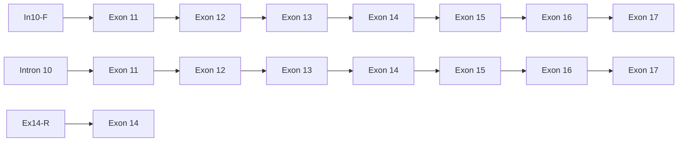

## 厚生労働科学研究費補助金

障害者対策総合研究事業（障害者対策総合研究開発事業（神経・筋疾患分野））

レット症候群の早期診断と治療をめざした統合的研究

平成26年度 総括･分担研究報告書

研究代表者 伊藤 雅之

平成27（2015）年 3月

## 目 次

## I．総括研究報告

レット症候群の早期診断と治療をめざした統合的研究 4伊藤雅之

## II．分担研究報告

1．レット症候群の臨床遺伝学的研究 10高橋 悟

2．レット症候群診療ガイドブックの作成 12青天目 信、伊藤雅之

3． 遺伝子変異の生物学的解析 14伊藤雅之、栗政明弘

4．再生医療技術を利用したレット症候群の病態解明に関する研究 16松石豊次郎、山下裕史朗、高橋知之、原 宗嗣、弓削康太郎

5．レット症候群モデルマウスの呼吸機能異常に関する研究 20白川哲夫

6．非典型レット症候群の原因遺伝子 の遺伝子変異による病態機序の解析 -- 22田中輝幸

7．インプリンティング遺伝子の細胞生物学的解析 24堀家慎一、堀家牧子

III．研究成果の刊行に関する一覧表 27

IV．研究成果の刊行物･別刷 31

## I．総括研究報告

# 厚生労働科学研究費補助金（障害者対策総合研究事業（神経・筋疾患分野））総括研究報告書

レット症候群の早期診断と治療をめざした統合的研究

研究代表者 伊藤雅之 国立精神・神経医療研究センター 室長

## 研究要旨

本研究では、レット症候群（RTT）の臨床および基礎研究を行い、早期診断と治療法の確立を進める。レット症候群は小児期に発症する特異な稀少性発達障害であり、診断が難しい疾患である。

臨床研究では、2010年に改定された米国の診断基準を基に我国の実情にあった診断基準を作成し、これまでの臨床経験および文献的レビューから診療ガイドブックを作成した。これらの取り組みと従来からの遺伝子診断サービスにより、一般臨床医の早期診断を推進する。 遺伝子異常は90%以上の典型的RTT患者で同定され、早期発症てんかん型RTT患者では 異常、先天型RTT患者では異常が同定されている。 と の重複例はすでに報告されているが、新たに 重複例を報告した。精神遅滞を合併した自閉症スペクトラム障害の男性患者で 無症候の母にも重複を有していた。

基礎研究では、生後2週齢のMeCP2欠損マウス（Mecp2-/y）の延髄腹側呼吸核群の プロモーター領域のCpGメチル化レベルに違いがみられた。Mecp2-/yでは野生型母より生まれた野生型に比べ高メチル化状態にあった。また、Mecp2-/yの呼吸異常に延髄腹側呼吸核群の プロモーターのCpGメチル化とヒストンアセチル化が影響していることが示唆された。 欠損マウス、 過剰発現マウスと 欠損マウスとの二重改変マウスを作成し、 過剰により 欠損効果が増強され、 欠損によって回復することが分かった。 欠損マウスの解析の結果、 変異が興奮性シナプス機能異常をもたらすことが分かった。このことは、グルタミン酸受容体作動薬による治療の根拠となる。Mecp2-/y やそのES細胞を用いて神経発生・分化過程におけるMeCP2解析の結果、MeCP2が神経細胞の成熟やグリア細胞の分化に関わることを見出した。また、Mecp2-/yの心臓の生理学的、分子生物学的な解析の結果、Mecp2-/yにQT延長などの心電図の異常を認めた。RTTのQT延長や不整脈などの病態メカニズム解明につながるものと期待される。さらに、MeCP2の

Prader-Willi/Angelman症候群(AS)責任遺伝子座における分子動態を解析し、15q11-q13領域のクロマチン動態が神経特異的な遺伝子発現に重要であることが分かった。

これらの研究成果はRTTの早期診断につなげ、今後の治療法開発へ発展させる基盤が出来たものと評価できる。

分担研究者

<table><tr><td>松石豊次郎</td><td>久留米大学医学部</td><td>教授</td></tr><tr><td>白川 哲夫</td><td>日本大学歯学部</td><td>教授</td></tr><tr><td>高橋 悟</td><td>旭川医科大学医学部</td><td>講師</td></tr><tr><td>青天目 信</td><td>大阪大学医学部</td><td>助教</td></tr><tr><td>堀家 慎一</td><td>金沢大学学術総合センター</td><td>准教授</td></tr><tr><td>田中 輝幸</td><td>東京大学医学部</td><td>准教授</td></tr></table>

研究協力者

<table><tr><td>栗政</td><td>明弘</td><td>鳥取大学医学部</td><td>准教授</td></tr><tr><td>立森</td><td>久照</td><td colspan="2">国立精神・神経医療研究センター室長</td></tr><tr><td>梶浦</td><td>一郎</td><td>大阪発達総合療育センター</td><td>理事長</td></tr><tr><td colspan="2">森崎市治郎</td><td>大阪大学歯学部</td><td>教授</td></tr><tr><td>谷岡</td><td>哲次</td><td>NPOレット症候群支援機構</td><td>理事長</td></tr></table>

## A．研究目的

レット症候群は幼少児期からの多彩で年齢依存性に変化する症状のため、診断に苦慮する代表的疾患である。有効な治療法がなく、早期からの療育が求められる。そこで、最近の診断基準を本邦に適合するように改定し、診療ガイドブックを作成して、疾患認知度の向上と早期診断の推進をはかる。あわせて、遺伝子診断を含む診断・診療支援を行う。レット症候群の原因遺伝子として が同定されて以来、類似した臨床症状を呈する非典型例の存在が知られ、「早期発症てんかん型」の原因遺伝子として 、「先天型」の原因遺伝子として が同定された。ここでは3つの原因遺伝子の機能喪失および重複による臨床像の特徴を明らかにする。

基礎研究では、MeCP2 欠損マウス（Mecp2-/y）の無呼 吸 と 延 髄 腹 側 呼 吸 核 群 の glutamic aciddecarboxylase 1(GAD1) mRNA 発現との関係を分子病理学的に解析する。また、Mecp2-/yおよび 欠損マウスと 過剰発現マウスの二重改変マウスによる機能解析を行い、RTT の分子標的を明らかにする。Cyclin-dependent kinase-like 5 (CDKL5）欠損マウスを作成し、てんかん、記憶障害、情動異常等の発達障害の分子機構の解明と、RTT 発症に関わるMeCP2 の神経系及び心臓発生・分化過程ならびに RTTの突然死の病態の解明を行う。さらに、Angelman 症候群(AS)や Prader-Willi 症候群（PWS）の責任遺伝子座である 15q11-q13 領域の MeCP2 を介したエピゲノム機構を解明する。

## B．研究方法

2010年に発表された米国の診断基準の基づき、診断基準作成責任者と意見交換しながら、本邦に適合した表現への変換と改正、注釈を加えて、新しい診断基準を公表した。また、診療ガイドブックを作成するために、各分野の専門医、研究者へ執筆依頼を行い、編集作業等に取りかかった。

遺伝子解析は、末梢血白血球より抽出したDNAを用いて、塩基配列決定法にて行った。変異が同定されな か っ た 場 合 に は 、 array-based comparativegenomic hybridization (aCGH) 法 、 multiplexligation-dependent probe amplification (MLPA)法、定量的PCR法にて解析した。

動物実験では、①生後 2 週齢の Mecp2-/yと野生型の脳組織を冷却し延髄腹側呼吸核群の組織から DNA を抽出した。bisulfite 処理を行ったのち プロモーター領域の塩基配列を決定し、23 ヶ所の CpG についてメチル化 cytosine を検出した。バルプロ酸あるいは生理食塩水の腹腔内投与を行い、脳組織を固定後アセチル化 H3K9、H3K14、H4K5、H4K8 の抗体と抗NeuN 抗体の二重染色を行った。② 欠損マウスと 過剰発現マウスを作成し、すでにあるMecp2-/yとの二重改変マウスを作成した。これらマウスの行動学的、形態学的解析とIGF-1発現を調べた。行動学的解析は、オープンフィールド、十字迷路を行った。形態学的観察は、ゴルジ法による神経細胞の樹状突起の形態、成熟、免疫組織化学によるシナプス成熟を観察した。また、IGF-1 発現は、ウエスタンブロットおよび ELISA による定量を行った。③欠損マウスについて、神経細胞樹状突起及びスパイン、薬物投与による易けいれん性解析、海馬スライスの電気生理学的解析、海馬・大脳皮質の興奮性シナプスの機能、微細構造、蛋白質解析、 グルタミン酸受容体阻害薬による興奮性アミノ酸誘発性けいれんのレスキューを行った。④Mecp2-/y の ES 細胞の心筋分化マーカー遺伝子や蛋白質の発現、および電子顕微鏡による心臓の刺激伝道系を比較検討することで、心筋分化能、形態異常を評価した。また、Mecp2-/y の心エコーによる心機能と心電図の計測を行った。Mecp2-/y の心臓の遺伝子発現は、30 個の心臓特異的遺伝子の定量 PCR により解析した。

細胞実験では、ヒト染色体工学技術を用いてPWS-IC を欠失させた改変ヒト 15 番染色体を構築し、qRT-PCR、 DNA メチル化解析、DNA-FISH 法、ChIP 法により、15q11-q13 領域のクロマチン動態と遺伝子発現を調べた。

（倫理面への配慮等）

すべての研究は、各研究施設の当該倫理委員会の承認を得て、臨床研究においては患者あるいは保護者への十分な説明と同意を得てのちに行った。また、組み換え DNA 実験安全委員会、実験動物倫理問題等検討委員会等の承認を得たのちに行った。各研究は、当該研究施設の利益相反（COI）に関する審査、承認を得たのちに行った。

## C．研究結果

改正診断基準（図1）を公表した。今後、これによる診断と遺伝子診断の相関を調べる。また、診療ガイドブックを刊行した。このガイドブックを利用することによる疾患認知と早期診断の関係を患者データベース登録システムを利用して追跡する。

精神遅滞を有する男性患者に、Xp22.13 に約 200kbの重複を認め、この領域内に が含まれていた。動物実験では、①延髄腹側呼吸核群における プロモーター領域の CpG メチル化レベルは、Mecp2-/yと同腹の野生型では野生型母から生まれた野生型に比べ高メチル化状態にあった。生後 2 週齢の Mecp2-/yにバルプロ酸の 7 日間投与で、H3K9 と H4K5 のアセチル化レベルの上昇が認められた（p<0.01）。一方、H3K14 と H4K8 ではアセチル化レベルに変化が認められず、野生型ではいずれのアセチル化も変化がなかった。② 欠損マウス、 過剰発現マウス、Mecp2-/yとの二重改変マウスの行動学的、形態学的解析とIGF-1発現はいずれも 欠損によって回復することが分かった。③ 欠損マウスの表現型解析では、海馬 CA1 錐体神経細胞の樹状突起スパインの形態、サブクラスと密度に異常があり、易けいれん誘発性がみられた。④Mecp2-/y の ES 細胞の心筋分化誘導では、自動収縮が観察され、心筋分化特異的な遺伝子発現は4-6日目以降Nkx2.5遺伝子などの心筋分化に必須の転写因子の発現が、6-8 日目以降alphaMHC 遺伝子の発現が認められた。Mecp2-/y の心臓の生理学的解析では、QT 延長がみられ、左心室壁が有意に薄かった。Mecp2-/yの心臓の遺伝子発現では、対象の30遺伝子のうち4遺伝子が高くなる傾向があり、6 遺伝子が低くなる傾向があった。

細胞実験では、父方特異的なMAGEL2遺伝子の発現低下が認められた。さらに、DNA-FISH法により15q11-q13領域のクロマチン動態を解析した結果、父方アレル特異的なクロマチン脱凝集はPWS-ICを欠失したにも関わらずクロマチン脱凝集状態を維持していた。一方、PWS-IC欠失母方染色体では異所的にクロマチン脱凝集が起こっていた。発現MAGEL2遺伝子座は15番染色体テリトリーの外側にループアウトし、未発現MAGEL2遺伝子座は15番染色体テリトリーの内側にあることが分かった。

## D．考察

診断基準の見直しと診療ガイドブックの作成を行った。レット症候群の患者は多彩で変化しやすい症状のため、診断が遅れることが少なくない。今回公表した診断基準と診療ガイドブックの評価はこれからであるが、遺伝子診断と合わせてレット症候群の早期診断に寄与するものと考えられる。

の欠失は乳児期発症の難治性てんかんの原因であるが、 の重複はてんかんはなく自閉症スペクトラム障害に知的障害を合併する表現型であった。中枢神経系の正常な機能発現にはCDKL5の発現量が厳密に調節される必要があることが分かった。

動物実験から、①Mecp2-/yでみられる頻回な無呼吸が延髄腹側呼吸核群の プロモーターの高メチル化とそれによる mRNA の転写抑制、GAD1 発現低下による GABA 合成の減少が推測された。また、バルプロ酸による回復はエピゲノム機構を利用した治療法の開発の基盤となるものと考えられた。②RTT の症状の一部が IGFBP3 によってもたらされ、回復することから、IGFBP3 の量的異常が発症病態に影響していることが分かった。このことから、IGFBP3 が治療のターゲットになりうると考えられる。さらに、IGFBP3が脳内 IGF-1 の量的規制に関与していることが明らかになり、現在行われている IGF-1 治験の実験的根拠になりうる。③ 欠損マウスでは、グルタミン酸シグナリング障害が明らかとなった。NMDA 型グルタミン酸受容体阻害薬による興奮性アミノ酸誘発性けいれんの回復は分子治療法の開発の基盤となると考えられる。④心筋分化に MeCP2 が寄与している可能性が示唆され、RTT の不整脈の発症や病態メカニズム解明につながるものと考えられた。

細胞実験では、15q11-q13領域の父方アレル特異的なクロマチン脱凝集の形成・維持に父性発現を呈する長鎖ノンコーディングRNA、 の転写が必要ないものと考えられた。一方、PWS-IC欠失母方染色体では、MeCP2などのメチル化CpGを認識する分子が正常母方アレルにおけるコンパクトなクロマチン状態の維持に重要であると考えられた。

## E．結論

本邦の実情に合わせたわかりやすいレット症候群の診断基準に改正した。また、診療ガイドブックを作成した。これらを活用することで、レット症候群の早期診断が可能となることが期待される。また、重複は男性の精神遅滞と自閉症スペクトラム障害の原因となることが分かった。

動物実験では、①Mecp2-/yに特徴的な無呼吸の増加に延髄腹側呼吸核群の プロモーターのCpG高メチル化と mRNA 発現量の低下が関与していた。②IGFBP3 の発現異常が RTT の発症病態の一部に寄与していた。③ 欠損マウスでは、海馬の神経細胞樹状突起スパインの形態・密度とシナプスグルタミン酸受容体蛋白質の異常、シナプス機能異常があり、グルタミン酸受容体阻害薬によって興奮性アミノ酸誘発性けいれんをレスキューした。④Mecp2-/y の ES細胞は心筋細胞に分化し、心筋分化マーカーの発現が高くなる傾向が認められた。また、Mecp2-/y に QT延長などの不整脈がみられ、複数の遺伝子発現の変

化が認められた。

細胞実験では、MeCP2 が 15q11-q13 領域のクロマチン脱凝集などの高次クロマチン構造を介して神経細胞特異的な遺伝子発現を制御していた。

## F．健康危険情報なし。

## G．研究発表

## 1.論文発表

1. Sukigara S, Dai H, Nabatame S, Otsuki T, Hanai S, Honda R, Saito T, Nakagawa E, Kaido T, Sato N, Kaneko Y, Takahashi A, Sugai K, Saito Y, Sasaki M, Goto Y, Koizumi S, Itoh M. Expression of Astrocyte-related Receptors in Cortical Dysplasia with Intractable Epilepsy. 2014;73:798-806. 
2. Itoh M, Iwasaki Y, Ohno K, Inoue T, Hayashi M, Ito S, Matsuzaka T, Ide S, Arima M. Nationwide survey of Arima syndrome: new diagnostic criteria from epidemiological analysis. 2014;36:388-393. 
3. Waga C, Asano H, Tsuchiya A, Itoh M, Goto Y, Kohsaka S, Uchino S. Identification of novel SHANK3 transcript in the developing mouse neocortex. 2014;128:280-293. 
4. Jansen F, Simone Mandelstam S, Ho AW, Mohamed I, Sarnat H, Kato M, Fukasawa T, Saitsu H, Matsumoto N, Itoh M, Kalnins R, Chow C, Harvey S, Jackson G, Peter C, Berkovic S, Scheffer I, Leventer R. Is Focal Cortical Dysplasia sporadic? Family evidence for genetic susceptibility. 2014;55(3):e22-e26. doi: 10.1111/epi.12533. 
5. 奥田耕助, 田中輝幸. 難治性てんかんを伴う神経発達障害の原因遺伝子 のシナプス伝達調節機構の解明に向けて.日本薬理学雑誌.2015 (inpress). 
6. Hara M, Nishi Y, Yamashita Y, Hirata R, Takahashi S, Nagamitsu SI, Hosoda H, Kangawa K, Kojima M, Matsuishi T. Relation between circulating levels of GH, IGF-1, ghrelin and somatic growth in Rett syndrome. 2013 Dec 27. doi: 10.1016/j.braindev.2013.11.007. 
7. Meguro-Horike, M., Horike, S. (2015) MMCT-Mediated Chromosome engineering technique applicable to functional analysis of lncRNA and nuclear dynamics. ,1262; 277-289. 
8. 目黒牧子, 堀家慎一「発達障害の遺伝学から明らかとなる多彩なエピジェネティクスの役割」エピジェネティクスの産業応用, シーエムシー出版,2014 年 4 月 
9. Aono Y, Taguchi H, Saigusa T, Uchida T, Takada K, Takiguchi H, Shirakawa T, Shimizu N, Koshikawa N, Cools AR. Simultaneous activation of the α1A-, α1B- and α1D-adrenoceptor subtypes in the nucleus accumbens reduces accumbal dopamine efflux in freely moving rats. Behav Pharmacol 2015;26:73-80. 
10. Yamasaki M, Okada R, Takasaki C, Toki S, Fukaya M, Natsume R, Sakimura K, Mishina M, Shirakawa T, Watanabe M. Opposing role of NMDA receptor GluN2B and GluN2D in somatosensory development and maturation. J Neurosci 2014;34(35):11534-11548.

## 2.学会発表

1. 辻村 啓太，入江 浩一郎，中嶋 秀行，江頭 良明，深尾 陽一郎，藤原 正幸，伊藤 雅之，高森 茂雄，2島 欽一.レット症候群原因因子MeCP2による興奮性シナプス伝達制御の分子基盤. シンポジウムS3-F-1（神経発達障害と正常脳形成：神経分化と移動による脳機能の運命決定）.第37回日本神経科学大会. 2014年9月13日.横浜

2. Itoh M, Kurimasa A. MeCP2\_e2 is required for placenta development. The FEBS-EMBO 2014 Conference. Paris, France, 30 August-4 September, 2014.

3. 田中輝幸. 小児の難治性てんかんとCDKL5. 第70回東海てんかん集談会. (浜松)(2014.2.1).

4. 奥田耕助, 田中輝幸「難治性てんかんを伴う重度発達障害の原因遺伝子 CDKL5 のシナプス伝達調節機能と情動・記憶における役割」(シンポジウム：X-連鎖知的障害の分子病態解明への挑戦)」 第 87回日本薬理学会年会 (仙台) (2014.3.21).

5. 田中輝幸, 渡邉紀, 萩原舞, 村上拓冬, 小林静香, 真鍋俊也, 高雄啓三, 宮川剛, 深谷昌弘, 阪上洋行, 水口雅, 奥田耕助. 神経発達障害原因遺伝子 の機能解析. 第37回日本神経科学大会Neuro 2014 (2014. 9.13).

6. Hara M, Takahashi T, Mitsumasu C, Igata S,Takano M, Okabe,Y, Tanaka E, Matsuishi T.Analysis of cardic arrhythmias and geneexpression in MeCP2-null mouse. 13th Rettsyndrome Symposium, 2014. 6 (Washington, USA)7. 中田昌利、熊倉 啓、高折 徹、中井理恵、岡嶋一樹、髙橋 悟、秦 大資. FOXG1ハプロ不全を認めたcongenital Rett症候群の一男児例. 第56回日本小児神経学会総会、平成26年5月29日（浜松市）

8. 高野亨子、西村貴文、涌井敬子、高橋 悟、稲葉雄二、古庄知己、福嶋義光. CDKL5 遺伝子の重複を認め、発達遅滞、低身長、小頭症を呈した男児. 日本人類遺伝学会第 56 回大会、平成 26 年 11 月 19日（東京都）

9. 堀家慎一，Yasui DH，Powell W，LaSalle JM，目黒ー堀家牧子. PWS-IC is essential for the higherorder chromatin organization of 15q11-q13 andthe location of a paternally expressed genewithin a chromosome 15 territory. 高等研カンファレンス Chromatin Decoding，国際高等研究所，京都，2014 年 5 月 12〜15 日

10. 目黒牧子，堀家慎一. クロマチンダイナミクスを制御する PWS/AS インプリンティングセンターの新たな役割. 第 8 回日本エピジェネティクス研究会，伊藤国際学術センター，東京，2014 年 5 月 25〜27 日

11. 堀家慎一，Yasui DH， LaSalle JM，Resnick JL,目黒牧子. 高次クロマチンダイナミクスを介したPWS-IC による遺伝子発現制御機構の解析. 第 8 回日本エピジェネティクス研究会，伊藤国際学術センター，東京，2014 年 5 月 25〜27 日

12. 堀家慎一. 核内ダイナミクスと遺伝子発現. 名市大エピジェネティクス研究会，ホテル木曽路，南木曽，2014 年 9 月 4〜5 日

13. 堀家慎一. 発達障害におけるエピジェネティクス研究. 第 57 回日本神経化学会大会・第 36 回日本生物学的精神医学会，奈良県文化会館，奈良，2014年 9 月 29〜10 月 1 日

14. 目黒牧子，赤木佐千代，堀家慎一. CRISPR/Casシステムを用いたヒト染色体ドメインの大規模欠失によるクロマチンダイナミクスの解析. 第 4 回ゲノム編集研究会，広島国際会議場，広島，2014年 10 月 6〜7 日

15. Horike S. MeCP2 is required for chromatin higher-order structure and dynamics at the imprinted 15q11-q13 locus. Epigenomics of Common Diseases, Wellcome Trust Conference Centre, Churchill College, Cambridge, UK 2014 年 10 月 28〜31 日

16. S Horike, DH Yasui, W Powell, JM LaSalle, MMeguro-Horike. PWS-IC is essential for thehigher order chromatin organization of15q11-q13 and the location of a paternallyexpressed gene within a chromosome 15 territory.The 4D Nucleome 2014, Hiroshima, 2014 年 12 月17〜20 日

H．知的財産権の出願・登録状況（予定を含む）

1．特許取得なし。

2．実用新案登録なし。

3．その他なし。

## II．分担研究報告

## レット症候群の臨床遺伝学的研究

## 分担研究者 高橋 悟 旭川医科大学小児科

## 研究要旨

レット症候群では3つの原因遺伝子が同定されており、それらの機能喪失性変異が発症原因となる。異常は、「典型例」の90％以上の患者で同定される。非典型例のうち、「早期発症てんかん型」では 異常、「先天型」では 異常が同定されている。 と の重複による臨床像についてはすでに報告があるが、 重複を有する患者の臨床像は不明であった。精神遅滞を合併した自閉症スペクトラム障害の男性患者で 重複が同定された。患者の母親も 重複を有していたが、無症候であった。 重複を有する女性の臨床像は、X 染色体の不活化パターンの影響をうけると考えられた。

## A．研究目的

レット症候群の原因遺伝子として が同定されて以来、類似した臨床症状を呈する非典型例の存在が知られ、「早期発症てんかん型」の原因遺伝子として 、「先天型」の原因遺伝子として が同定された。これらの遺伝子が重複した場合の臨床像は、レット症候群を呈する機能喪失性変異の場合とは異なることが知られている。 重複患者は、難治性てんかん、精神運動発達遅滞、反復性気道感染を合併する。 重複患者は、乳児期発症のてんかん、精神運動発達遅滞を示す。これまでに の重複患者の臨床像は明らかではなかったが、我々は精神遅滞の病因検索中に 重複を有する男性患者を経験した。本研究では、レット症候群の原因遺伝子として同定されている3つの遺伝子の機能喪失および重複による臨床像の特徴を明らかにすることを目的とした。

## B．研究方法

遺伝子解析は、末梢血白血球より抽出したDNAを用いて、塩基配列決定法にて行った。変異が同定されなかった場合には、array-based comparative genomichybridization (aCGH)法、multiplex

ligation-dependent probe amplification (MLPA)法、定量的PCR法にて解析した。遺伝子診断は、旭川医科大学の倫理委員会の承認を得て、患者あるいは保護者への十分な説明と同意が得られた場合に行われた。

## C．結果

精神遅滞を有する男性患者の原因検索中に、aCGH 法にて Xp22.13 に約 200kb の重複を認めた。MLPA 法により、この領域内に が含まれていることを確認した。同様の遺伝子重複は、無症候の母親にも検出された。この男性患者は、自閉症スペクトラム障害を合併していたが、てんかん発作の既往はなかった。母親の X 染色体不活化パターンに偏りはなかった。

## D．考察

の欠失は、乳児期発症の難治性てんかんの原因となるが、 の重複ではてんかん発症はなく、自閉症スペクトラム障害に知的障害を合併していた。この臨床像は、近年報告された7名の患者の臨床像とも一致していた（文献1）。この結果は、中枢神経系の正常な機能発現には CDKL5 の発現量が厳密に調節される必要があることを示している。レット症候群の病因遺伝子として同定された3つの遺伝子、, , の機能喪失あるいは重複による臨床像の特徴を表1にまとめた。

## E．結論

重複は、男性の精神遅滞、自閉症スペクトラム障害の原因となる。 重複を有する女性の臨床像は、X 染色体の不活化パターンの影響をうける。

## F．参考文献

1. Szafranski P, Golla S, Jin W, et al. Neurodevelopmental and neurobehavioral characteristics in males and females with CDKL5 duplications. Eur J Hum Genet 2014. doi: 10.1038/ejhg.2014.217.

## G．研究発表

## 1.論文発表

1. Kumakura A, Takahashi S, Okajima K, Hata D: A haploinsufficiency of FOXG1 identified in a boy with congenital variant of Rett syndrome. Brain Dev 36: 725-729, 2014 
2. Hara M, Nishi Y, Yamashita Y, Hirata R, Takahashi S, Nagamitsu S, Hosoda H, Kangawa K, Kojima M, Matsuishi, T: Relation between circulating levels of GH, IGF-1, ghrelin and somatic growth in Rett Syndrome. Brain Dev 36: 794-800, 2014 
3. 高橋 悟. Rett症候群の病態理解 —病因遺伝子

（ ）変異に関連した臨床的特徴について—. 脳と発達 46; 117-120, 2014

日（東京都）

H．知的財産権の出願・登録状況

## 2.学会発表

1. 中田昌利、熊倉 啓、高折 徹、中井理恵、岡嶋一樹、髙橋 悟、秦 大資. FOXG1ハプロ不全を認めたcongenital Rett症候群の一男児例. 第56回日本小児神経学会総会、平成26年5月29日（浜松市）

2. 高野亨子、西村貴文、涌井敬子、高橋 悟、稲葉雄二、古庄知己、福嶋義光. CDKL5 遺伝子の重複を認め、発達遅滞、低身長、小頭症を呈した男児. 日本人類遺伝学会第 56 回大会、平成 26 年 11 月 19

1. 特許取得

なし

2. 実用新案登録

3.その他

表1レト症候群の病因遺伝子異常による臨床像

<table><tr><td>病因遺伝子</td><td colspan="2">MECP2</td><td>CDKL5</td><td>FOXG1</td></tr><tr><td>遺伝子座</td><td colspan="2">Xq28</td><td>Xp22</td><td>14q12</td></tr><tr><td>遺伝子の機能</td><td colspan="2">エピジェネチイクスによる遺伝子発現調節</td><td>神経細胞のリン酸化酵素</td><td>終脳発生に必須の転写因子</td></tr><tr><td>患者性別</td><td>女児</td><td>男児</td><td>女児/男児</td><td>女児/男児</td></tr><tr><td>機能喪失による臨床像</td><td>典型的レット症候群非典型的レット症候群(言語能力維持型)自閉症精神遅滞</td><td>致死的重症脳症精神遅滞</td><td>非典型的レット症候群(早期発症てんかん型)早期乳児てんかん性脳症</td><td>非典型的レット症候群(先天型)FOXG1関連脳症</td></tr><tr><td>重複による臨床像</td><td>無症候~同症状(skewed XCI)</td><td>乳児筋緊張低下進行性痙性重度精神遅滞自閉症的症候てんかん反復性呼吸器感染</td><td>男児精神遅滞自閉症的症候てんかん(-)女児無症候~同症状(skewed XCI)</td><td>重度精神遅滞自閉症的症候てんかん(乳児期発症、点頭てんかん)小頭症(-)</td></tr></table>

## レット症候群診療ガイドブックの作成

研究分担者 青天目 信 大阪大学大学院医学系研究科小児科学 助教

研究代表者 伊藤雅之 国立精神・神経医療研究センター 室長

## 研究要旨

本研究では、レット症候群の診療に役立つ小児科医向けのガイドブックを作成することを目的とした。レット症候群は、当初原因が不明であったために、診断基準も複雑で、診断基準自体も 6 回もの改訂がなされた。そのため、初学者にとっては診断が容易ではなく、診断されずにいる症例も多いと考えられた。2010 年にアメリカで大規模な臨床研究がなされて、簡便・簡潔な診断基準が提案された。この理解しやすい診断基準を紹介して、レット症候群をより多く診断できるようにするとともに、診断した患者の全身管理を的確に行えるように、レット症候群について現時点で判明している研究成果をまとめて、診療に寄与できるガイドブックを作成することとした。我々の先行研究では、我が国におけるレット症候群の頻度は、1 万人の女性のうち、約 0.9 人と算出されている。レット症候群は、原因がわかる女性の精神発達遅滞の中で 2 番目に多いとされている。その診断と診療に有用な指針を作成することで、国内の小児神経診療に貢献できると考えている。

## A．研究目的

レット症候群(RTT)は、1966 年に Andreas Rett により報告された女児の精神発達遅滞を呈する疾患で、神経症状以外にも多彩な症状を呈する(Wien MedWochenschr 1966;116:723)。当初、原因が不明であったため、固有の症状を組み合わせて診断する診断基準が作成され、臨床の現場で使用されては改訂するということで、計 5 回の改訂が行われている。診断基準の項目は多く、様々な臓器・神経系の症状を含むために、初学者にとっては敷居が高いものとなっている。アメリカで行われた臨床症状と遺伝子診断を基盤にした大規模な臨床研究をもとに、2010 年に、より簡便な診断基準が提案された(Ann Neurol2010;68:944)。

国内において、レット症候群の診療指針は、2 回出版されている(1998 年「レット症候群介護マニュアル」、2013 年「レット症候群ハンドブック II」)。しかし、前者はすでに絶版で入手不能であり、後者は大部で、診療の場で使用するのは困難である。

我々は、より多くの患者が診断されることを目指して、2010 年の簡便な診断基準を国内に紹介し、同時に現時点での最新の診療指針を記載した本を出版して、医療者・患者の双方にとって有用な診療ガイドブックを作成することとした。

## B．研究方法

研究班の構成メンバーのうち、臨床に関わるメンバーと、以前から班会議に出席したことのある研究者・臨床医に、レット症候群の症状や治療について、章を割り振って、分担執筆を依頼した。

## C．研究結果

章立てと執筆者は次のとおりである。

<table><tr><td>I</td><td>レット症候群の概要</td><td></td></tr><tr><td>1</td><td>レット症候群の歴史</td><td>松石豊次郎</td></tr><tr><td>2</td><td>レット症候群の診断基準</td><td>青天目信</td></tr><tr><td>3</td><td>レット症候群の遺伝子</td><td>高橋悟</td></tr><tr><td></td><td>レット症候群の病態</td><td>伊藤雅之</td></tr><tr><td>II</td><td>よくある症状の解説と対処法</td><td></td></tr><tr><td>1</td><td>退行</td><td>高橋悟</td></tr><tr><td>2</td><td>手の合目的的運動の消失</td><td>青天目信</td></tr><tr><td>3</td><td>手の常同運動</td><td>青天目信</td></tr><tr><td>4</td><td>言語コミュニケーションの消失</td><td>青天目信</td></tr><tr><td>5</td><td>歩行障害</td><td>青天目信</td></tr><tr><td>6</td><td>発育障害と小頭症</td><td>原宗嗣</td></tr><tr><td>7</td><td>てんかん</td><td>青天目信</td></tr><tr><td>8</td><td>行動の問題、自閉症</td><td>高橋悟</td></tr><tr><td>9</td><td>筋緊張異常、不随意運動</td><td>青天目信</td></tr><tr><td>10</td><td>睡眠異常</td><td>宮本晶恵</td></tr><tr><td>11</td><td>痛覚鈍麻と自傷行為</td><td>青天目信</td></tr><tr><td>12</td><td>循環器の問題</td><td>原宗嗣</td></tr><tr><td>13</td><td>呼吸異常</td><td>坂田英明・白川哲夫</td></tr><tr><td>14</td><td>嚥下障害</td><td>保母妃美子・田村文誉</td></tr><tr><td>15</td><td>便秘・消化管運動異常</td><td>原宗嗣</td></tr><tr><td>16</td><td>思春期・第二次性徴、内分泌</td><td>松石豊次郎</td></tr><tr><td>17</td><td>整形外科的問題</td><td>梶浦一郎</td></tr><tr><td>18</td><td>歯科・咀嚼・歯ぎしり</td><td>森崎市治郎</td></tr><tr><td>19</td><td>リハビリについて</td><td>梶浦一郎</td></tr><tr><td>III</td><td>社会福祉資源</td><td>青天目信</td></tr><tr><td>IV</td><td>今後期待される治療</td><td>伊藤雅之</td></tr><tr><td colspan="3">以上、大阪大学出版局より出版した。</td></tr></table>

## D．考察

現時点で、レット症候群の病態や遺伝学、診療指針に関する患者向けの文書は、海外の書籍を翻訳したものしかない。

この書籍を作成したことにより、医療者が診療の指針として役立てることに加え、患者・家族が疾患の理解を進め、より積極的に診療に参加できることが期待される。

## E．結論

本研究では、最新の基礎研究と臨床研究の知見を盛り込んだ書籍を作成した。今後の我が国におけるレット症候群の診療に有用なガイドブックを作成できた。

## G．研究発表

1. 論文発表なし

2. 学会発表なし

H. 知的財産権の出願・登録なし

## 遺伝子変異の生物学的解析

研究代表者 伊藤雅之 国立精神・神経医療研究センター 室長

研究協力者 栗政明弘 鳥取大学大学院医学系研究科 准教授

## 研究要旨

欠損マウスあるいは 過剰発現マウスと 欠損マウスとの二重遺伝子改変マウスを作成し、行動学的、形態学的解析とIGF-1発現解析を行なった。その結果、 過剰により欠損効果が増強され、 欠損によって回復することが分かった。レット症候群の発症病態の一部がIGFBP3によることを明らかにした。さらに、分子生物学的な解析を進め、治療法開発へ発展させる。

## A．研究目的

レット症候群の原因遺伝子メチル化CpG結合タンパク2（ ）遺伝子欠損マウスおよび 欠損マウスと 過剰発現マウスの二重遺伝子改変マウスによる機能解析を行い、レット症候群の治療の分子標的を明らかにする。

## B．研究方法

欠損マウスと 過剰発現マウスを作成し、すでにある 欠損マウスとの二重遺伝子改変マウスを作成した。これらマウスの行動学的、形態学的解析とIGF-1発現を調べた。

行動学的解析は、オープンフィールド、十字迷路を行った。形態学的観察は、ゴルジ法による神経細胞の樹状突起の形態、成熟、免疫組織化学によるシナプス成熟を観察した。また、IGF-1発現は、ウエスタンブロットおよびELISAによる定量を行った。

一方、 発現制御マウスを樹立したが、個体数の確保が難しく、本年度の解析を進めることが困難であった。

（倫理面への配慮）本研究では、遺伝子組換えにおいては国立精神・神経医療研究センター組換え DNA実験安全委員会の承認を得た。また、マウスの作成と取扱いは、関連指針等に準拠し、小型実験動物倫理問題等検討委員会の承認ののち行なった。

## C．研究結果

欠損マウス、 過剰発現マウスは個体数を確保でき、 欠損マウスとの二重遺伝子改変マウスを作成した。行動学的、形態学的解析とIGF-1発現はいずれも 欠損によって回復することが分かった。

## D．考察

レット症候群の症状の一部がIGFBP3によってもたらされ、回復することから、IGFBP3の量的異常が発症病態に影響していることがわかった。このことから、IGFBP3が治療のターゲットになりうると考えられる。

さらに、IGFBP3が脳内IGF-1の量的規制に関与していることが明らかになり、現在行われているIGF-1治験の実験的根拠になりうる。

## E．結論

IGFBP3の発現異常がレット症候群の発症病態の一部を説明でき、治療ターゲットになりうるものと考えられた。可能性が示唆された。

## G．研究発表

## 1.論文発表

1. Sukigara S, Dai H, Nabatame S, Otsuki T, Hanai S, Honda R, Saito T, Nakagawa E, Kaido T, Sato N, Kaneko Y, Takahashi A, Sugai K, Saito Y, Sasaki M, Goto Y, Koizumi S, Itoh M. Expression of Astrocyte-related Receptors in Cortical Dysplasia with Intractable Epilepsy. 2014;73:798-806. 
2. Akamatsu T, Dai H, Mizuguchi M, Goto Y, Oka A, Itoh M. LOX-1 Is a Novel Therapeutic Target in Neonatal Hypoxic-Ischemic Encephalopathy. 2014;184:1843-1852. 
3. Itoh M, Iwasaki Y, Ohno K, Inoue T, Hayashi M, Ito S, Matsuzaka T, Ide S, Arima M. Nationwide survey of Arima syndrome: new diagnostic criteria from epidemiological analysis. 2014;36:388-393. 
4. Waga C, Asano H, Tsuchiya A, Itoh M, Goto Y, Kohsaka S, Uchino S. Identification of novel SHANK3 transcript in the developing mouse neocortex. 2014;128:280-293. 
5. Jansen F, Simone Mandelstam S, Ho AW, Mohamed I, Sarnat H, Kato M, Fukasawa T, Saitsu H, Matsumoto N, Itoh M, Kalnins R, Chow C, Harvey S, Jackson G, Peter C, Berkovic S, Scheffer I, Leventer R. Is Focal Cortical Dysplasia sporadic? Family evidence for genetic susceptibility. 2014;55(3):e22-e26.

doi: 10.1111/epi.12533.

placenta development. The FEBS-EMBO 2014 Conference. Paris, France, 30 August - 4 September, 2014.

## 2.学会発表

1. 辻村 啓太，入江 浩一郎，中嶋 秀行，江頭 良明，深尾 陽一郎，藤原 正幸，伊藤 雅之，高森 茂雄，中島 欽一.レット症候群原因因子MeCP2による興奮性シナプス伝達制御の分子基盤. シンポジウムS3-F-1（神経発達障害と正常脳形成：神経分化と移動による脳機能の運命決定）.第37回日本神経科学大会. 2014年9月13日.横浜

2. Itoh M, Kurimasa A. MeCP2\_e2 is required for

H．知的財産権の出願・登録状況

1. 特許取得 なし。

2. 実用新案登録 なし。

3. その他 なし。

再生医療技術を利用したレット症候群の病態解明に関する研究

分担研究者 松石豊次郎 久留米大学医学部小児科学講座・主任教授

研究協力者 山下裕史朗 久留米大学医学部小児科学講座・教授

高橋知之 久留米大学高脳疾患研究所（小児科）・准教授

原 宗嗣 久留米大学高次脳疾患研究所・助教

弓削康太郎 久留米大学医学部小児科学講座・助手

## 研究要旨

申請者はこれまで Mecp2 遺伝子（MeCP2）を欠質した RTT モデル ES 細胞や RTT モデルマウスを用いて神経系の発生・分化過程における MeCP2 の役割の解析を進めてきた。その結果、MeCP2 は神経細胞の成熟やグリア細胞の分化に関わることを見出した。この1年間は、心臓における MeCP2 の機能的役割を調べるために、RTT モデルマウスの心臓病態に着目して生理学的、分子生物学的な解析を行った。その結果、対照コントロールの正常マウスに比較して、MeCP2 を欠損した RTT モデルマウスでは QT 延長などの心電図の異常が認められた。また、RTT モデルマウスと対照コントロールマウスの心臓における遺伝子の発現を解析したところ、有為に発現の異なる遺伝子を見出した。近年、MeCP2 欠損マウスにおいて QT 延長をはじめとする不整脈が報告されており、本成果は RTT の QT 延長や不整脈など、心臓における病態メカニズム解明の一助となることが期待される。

## A．研究目的

本研究は、基礎研究で、RTT 発症メカニズムを解明、更に治療薬物のスクリーニングシステムを樹立することを目的としている。本研究により、RTT 発症に関わる MeCP2 の神経系及び心臓発生・分化過程ならびに、RTT の突然死の病態を解明し、心機能における機能的役割や治療薬スクリーニングの基盤確立の一助とする。

## B．研究方法

RTT モデル ES 細胞における心筋分化の評価

MeCP2 欠損した RTT モデル（RTT-）ES 細胞を、コントロールの wild-type（WT-）ES 細胞から心筋分化誘導と比べ、分化能を比較検討する。マウス

ES 細胞による心筋分化誘導は胚様体（embryoid body）形成法で行い、分化誘導後、分化過程における心筋分化マーカー遺伝子や蛋白質の発現、および電子顕微鏡による心臓の刺激伝道系を比較検討することで、心筋分化能、形態異常を評価する。

RTT モデルマウス心臓の生理学的解析

MeCP2 欠損マウスとコントロールマウスの心エコーによる心機能および、心電図の計測を行った。心電図の測定は、6 および 8 週目の Mecp2 欠損(Mecp2-/y:RTT モデル)マウス、対照コントロールとして

wild-type (Mecp2flox/y: WT-)マウス、C57BL/6 マウス、それぞれ一群あたり 10-14 匹で行った。心機能は、8週目の RTT-マウス、対照コントロールとして WT-マウス、C57BL/6 マウス、それぞれ一群あたり 10、9、11 匹を心エコーによって評価した。

RTT モデルマウスの心臓における遺伝発現

6 および 8 週目の Mecp2 欠損 RTT モデルマウス(Mecp2-/y)、対照コントロールとして wild-type(Mecp2flox/y)マウスの心臓を摘出し、心房心室を含む心臓から全RNA抽出後、逆転写によりcDNAを合成し、心臓特異的な30遺伝子の発現をリアルタイムPCRにより解析した。また、Mecp2 遺伝子の有無により発現の異なる遺伝子に関しては、8 週目のマウスの心室部分における発現の比較解析を行った。

## （倫理面への配慮等）

本研究では、基礎実験は久留米大学の遺伝子組換え実験安全委員会、ならびに動物実験センターに設置する委員会で審査後、実施の承認を受けている。従って第二種使用等に当たって執るべき拡散防止措置が定められている実験として、学内外の種々の指針や法令を尊守し実施されている。

## C．研究結果

## (1) RTT モデル ES 細胞における心筋分化誘導

Mecp2 欠損した RTT-ES 細胞及び、コントロールのWT-ES 細胞から両群において胚様体（EBs）が形成され、7 日目を経過した頃より自動収縮する EBs が観察された。また、EBs を介した心筋分化誘導後、2 日毎に心筋分化特異的な遺伝子の発現を調べたところ、コントロールの WT-ES 細胞群と同様に、RTT-ES 細胞群でも、4-6日目以降 Nkx2.5 遺伝子などの心筋分化に必須の転写因子の発現が、6-8 日目以降 alphaMHC 遺伝子の発現が認められ、MeCP2 欠損した ES 細胞は心筋に分化することが出来ることが示された。また、alphaMHC に関しては、8 日目以降、RTT-EBs 群でその発現が高い傾向が認められた。更に、分化誘導後 6、8、10 日目の EBs をマーカー分子に対する抗体で免疫染色した結果、MeCP2欠損の RTT-EBs 群で、sMHC、Nkx2.5 陽性 EBs の割合が

高い傾向

が認められた。以上の結果から、RTT-ES 細胞は、WT-ES 細胞に比較して、心筋分化にともなう心筋分化マーカーの発現が高くなる傾向があることが示された。更に、電子顕微鏡で心臓の刺激伝道系の異常が確認され現在投稿中で Revise 状態である。

(2) RTT モデルマウス心臓における生理学的解析

6 および 8 週目の RTT モデルマウスと対照コントロールとして、WT-マウス、更には C57BL/6 マウスの心電図を計測した。その結果、6 および 8 週目 RTT モデルマウスの心電図は、QT、cQT 何れも有為に長くなる QT 延長が認められた。その他の指標についても、RTT モデルマウスと対照コントロールのマウスでは有為な違いが認められ、RTT モデルマウスは不整脈を呈することが明らかとなった。心エコーによる心機能解析は、RTTモデルマウス左心室壁の厚さは有為に薄かった。RTTモデルマウスの心臓は、その体重に相関して対照マウスに比較して小さいことから、左室壁の厚さの違いは心臓の大きさの違いに関連するものと考えられる。

(3) RTT モデルマウス心臓における遺伝子発現

6 および 8 週目の RTT モデルマウスと対照コントロールとして WT-マウスの心臓において、心臓の生理機能や構造の維持に関わる転写因子、構造分子、チャネル分子など少なくとも 30 種類以上の遺伝子発現をリアルタイム RT-PCR 法によって解析した。その結果、30種類の遺伝子のうち 4 遺伝子が RTT モデルマウスの心臓で高くなる傾向が認められ、6 遺伝子の発現が低くなる傾向が認められた。以上の結果から、MeCP2 欠損により心臓における遺伝子発現、刺激伝道系の形態学的変化があり、MeCP2 は成体マウスの心臓で遺伝子発現制御に関わる可能性が示された。

D．考察

MeCP2 が心筋分化過程の遺伝子発現を制御することで、心筋分化を調節する可能性が示唆された。MeCP2に着目した心筋細胞の分化研究は、RTT の心臓における病態解明のみならず、心臓の発生・分化におけるエピジェネティックな遺伝子制御の重要性を解明する良い実験系になると考えられる。

ES 細胞を利用した心筋分化特異的遺伝子のエピジェネティックな調節メカニズムを調べることで、RTTにおける不整脈の発症や病態メカニズム解明の一助となることが期待される。

E．結論

1. MeCP2欠損ES細胞は胚葉体形成を介した心筋分化系で心筋細胞に分化し、MeCP2 欠損 EBs では、心筋分化マーカーの発現がコントロール EBs に比較して高くなる傾向が認められた。

2. MeCP2 欠損した RTT モデルマウスでは、心エコーによる心機能評価では大きな問題は無い一方で、QT延長などの不整脈が認められた。

3. RTT モデルマウスの心臓では、コントロールのマウスに比較して、心臓の構造や機能を保つ遺伝子幾つかの遺伝子の発現が有為に変化する遺伝子が認められた。

F．研究発表

1．論文発表

1. Hara M., Ohba C, Yamashita Y., Saitsu H., Matsumoto N., Matsuishi T. mutation causes Rett syndrome -like phenotype in a female patient. A 2015 in press. 
2. Hara M, Nishi Y, Yamashita Y, Hirata R, Takahashi S, Nagamitsu SI, Hosoda H, Kangawa K, Kojima M, Matsuishi T. Relation between circulating levels of GH, IGF-1, ghrelin and somatic growth in Rett syndrome. 2013 Dec 27. doi: 10.1016/j.braindev.2013.11.007. 
3. Matsuoka M, Nagamitsu S, Iwasaki M, Iemura A, Yamashita Y, Maeda M, Kitani S, Kakuma T, Uchimura N, Matsuishi T. High incidence of sleep problems in children with developmental disorders: Results of a questionnaire survey in a Japanese elementary school. 36: 35-44, 2014 
4. Ohya T, Morita K, Yamashita Y, Egami C,Ishii Y, Nagamitsu S, Matsuishi T. Impaired exploratory eye movements in children with Asperger’s syndrome. 36: 241-247, 2014 
5. Shibuya I, Nagamitsu S, Okamura H, Ozono S, Chiba H, Ohya T, Yamashita Y, Matsuishi T. High correlation between salivary cortisol awakening response and the psychometric profiles of healthy children. 8: 9, 2014

2.学会発表

1. Yamashita Y,Ohya T, Kaneko M, Egami C, Tada Y, Anai C, Mukasa A, Nagamitsu S, Iramina K, Matsuishi T. The objective evaluation of diadochokinesia: A comparison between typically developing children and children with ADHD. The 2nd Asian Congress on ADHD, 2014. 3 (Tokyo) 
2. Yamashita Y, Fujita F, Tada Y, Anai C, Mukasa A, Egami C, Okamura H, Yuge K, Ohya T, Iemura A, Nagamitsu S, Matsuishi T. Quality of life (QOL) reported by children with ADHD and their moters participated in summer treatment program. PAS/ASPR Joint Meeting, 2014. 5 (Vancouver) 
3. Hara M, Takahashi T, Mitsumasu C, Igata S, Takano M, Okabe,Y, Tanaka E, Matsuishi T. Analysis of cardic arrhythmias and gene expression in MeCP2-null mouse. 13th Rett syndrome Symposium, 2014. 6 (Washington, USA)

G．知的財産権の出願・登録状況（予定を含む）

1. 特許取得

なし

2. 実用新案登録

特記なし

3．その他

特記なし

# 厚生労働科学研究費補助金（障害者対策総合研究事業（神経・筋疾患分野））分担研究報告書

レット症候群モデルマウスの呼吸機能異常に関する研究

研究分担者 白川哲夫 日本大学歯学部小児歯科学講座 教授

## 研究要旨

MeCP2 が欠損している雄ノックアウトマウス（ ）について，生後 2 週において延髄腹側呼吸群での 近位プロモーター領域の CpG メチル化レベルを調べたところ， では野生型母より生まれた wild に比べ高メチル化状態にあることが明らかになった。これまでのわれわれの研究で，延髄腹側呼吸群での mRNA 発現がバルプロ酸の腹腔内投与により増加したことから，バルプロ酸が延髄腹側呼吸群ニューロンでのコアヒストン H3K9，H3K14，H4K5，H4K8 のアセチル化に及ぼす影響について免疫蛍光染色によって比較した。その結果， ではコントロールに比べ，バルプロ酸投与群で H3K9，H4K5 のアセチル化レベルの上昇が認められた（p<0.01）。以上より，の呼吸異常に，延髄腹側呼吸群での プロモーターの CpG メチル化ならびに同領域のヒストンアセチル化が影響している可能性が示唆された。

## A．研究目的

では生後5週以降に無呼吸の頻度が著しく増加するとの報告があるが，呼吸調節に主要な働きをしている GABA の合成酵素の一つである glutamicacid decarboxylase 1(GAD1)が無呼吸にどのように関わっているかは明確ではない。また延髄腹側呼吸群での mRNA 発現を調節しているメカニズムについても明らかにされていない。

そこで今回， の延髄腹側呼吸群におけるのプロモーターの CpG メチル化，ならびに同部位でのコアヒストン H3K9，H3K14，H4K5，H4K8 のアセチル化について免疫蛍光染色法を用いて研究を行った。

## B．研究方法

①生後 2 週の ならびに wild について，脳組織をとりだし，ただちに冷却したのちクリオスタット上で延髄腹側呼吸群の組織を18ゲージの注射針を用いてパンチアウトし DNA を抽出した。bisulfite処理を行ったのち の近位プロモーター領域について nested PCR を行い，得られた産物をプラスミドにサブクローニングし，塩基配列を決定した。それぞれの群につき 60 クローンを得て，クローニングした領域に含まれる 23 の CpG についてメチル化cytosine を検出した。

②生後 2 週の ならびに wild に，生後 8 日から 7 日間，バルプロ酸あるいは生理食塩水の腹腔内投与を行った。投与終了後に 4％パラフォルムアルデヒドにて灌流固定し，脳組織を摘出した。25μmの厚さで延髄の連続切片を作製後，一次抗体としてアセチル化した H3K9，H3K14，H4K5，H4K8 の各ヒストンに特異性のあるポリクローナル抗体を使用し，抗NeuN モノクローナル抗体とともに 4℃にて一晩インキュベートしたのち蛍光 2 重染色を行った。

DAPI 反応成分を含む封入剤にて封入後，CCD カメラを備えた落射蛍光顕微鏡（Nikon 80i）にてすべての切片について均一な条件下で蛍光画像を取得した。そののち各アセチル化ヒストンの蛍光強度をImagePro7.0 にて細胞単位で定量，比較した。切片間の蛍光測定誤差を補正するため，各ヒストンの蛍光強度は個々の細胞核でのDAPIの測定値に対する比率として計算した。

（倫理面への配慮）

本研究は日本大学歯学部実験動物委員会の承認を得て実施し，実験動物の取扱いは同委員会の指針に従って行った。（承認番号 2013-歯-001，AP10D008）

## C．研究結果

①延髄腹側呼吸群における 近位プロモーター領域のCpGメチル化レベルを23個所について調べたところ， ならびに同腹の wild では，野生型母から生まれたwildに比べ高メチル化状態にあることが明らかになった。②生後2週のMecp2-/yにバルプロ酸を7日間投与したところ，延髄腹側呼吸群ニューロンでの，ヒストン上のリジン残基 H3K9 および H4K5 について，バルプロ酸投与群でコントロール（生理食塩水群）に比べアセチル化レベルの上昇が認められた（p<0.01）。一方，H3K14 と H4K8 ではアセチル化レベルに変化が認められず，wild ではいずれのアセチル化部位においても変化がみられなかった。

## D．考察

本研究では， の近位プロモーターに存在するCpGのメチル化状態を調べ と wild で比較した。その結果， では野生型母から生まれた wildに比べ の mRNA 発現量の低下が認められ，プロモーターの CpG のメチル化レベルが上昇していた。この知見から， で認められた無呼吸頻度の上昇に，延髄腹側呼吸群での プロモーターの

CpG 高メチル化とそれによる mRNA の転写抑制，それらに続く GAD1 活性の低下による GABA 合成の減少が関与していることが推測された。

延髄腹側呼吸群ニューロンでのヒストン上のリジン残基 H3K9 および H4K5 について， のバルプロ酸投与群でアセチル化レベルの上昇が認められたこと，バルプロ酸投与によって の無呼吸が減少し，延髄腹側呼吸群での mRNA 発現量の増加が認められたというこれまでの結果を合わせて考察すると， での無呼吸には，エピジェネティックな GAD1 活性調節異常による GABA 合成の低下が関与していることが強く示唆される。

## E．結論

に特徴的な無呼吸の増加に，延髄腹側呼吸群での プロモーターのCpG高メチル化ならびにそれによる mRNA 発現量の低下が関与しており，プロモーターに対応するコアヒストン H3K9 およびH4K5の修飾もそれらに影響を与えている可能性が示された。

## F．研究発表

## 1．論文発表

1. Sato M, Toriumi T, Watanabe N, Watanabe E, Akita D, Mashimo T, Akiyama Y, Isokawa K, Shirakawa T, Honda M. Characterization of mesenchymal progenitor cells in crown and root pulp from human mesiodentes. Oral Dis 2015;21:e86-e97. doi: 10.1111/odi.12234. 
2. Aono Y, Taguchi H, Saigusa T, Uchida T, Takada 
K, Takiguchi H, Shirakawa T, Shimizu N, Koshikawa N, Cools AR. Simultaneous activation of the α1A-, α1B- and α1D-adrenoceptor subtypes in the nucleus accumbens reduces accumbal dopamine efflux in freely moving rats. Behav Pharmacol 2015;26:73-80. 
3. Yamasaki M, Okada R, Takasaki C, Toki S, Fukaya M, Natsume R, Sakimura K, Mishina M, Shirakawa T, Watanabe M. Opposing role of NMDA receptor GluN2B and GluN2D in somatosensory development and maturation. J Neurosci 2014;34(35):11534-11548. 
4. Nakamura H, Kato R, Shirakawa T, Koshikawa N, Kobayashi M. Spatiotemporal profiles of dental pulp nociception in rat cerebral cortex: An optical imaging study. J Comp Neurol 2015 doi: 10.1002/cne.23692.

## 2．学会発表

該当なし

## G．知的所有権の取得状況

## 1. 特許取得

特になし

## 2. 実用新案登録

特になし

## 3.その他

特になし

非典型レット症候群の原因遺伝子 の遺伝子変異による病態機序の解析

研究分担者 田中輝幸 東京大学大学院医学系研究科発達医科学教室・准教授

## 研究要旨

非典型レット症候群の原因遺伝子 の遺伝子変異による病態機序の解明を目的として、独自に作製した ノックアウト (KO)マウスの神経科学的解析を行った。その結果 KO マウスにおいて、海馬神経細胞樹状突起スパインの形態・密度異常、易痙攣性、シナプスグルタミン酸受容体機能・蛋白質の異常を同定し、グルタミン酸受容体阻害薬による興奮性アミノ酸誘発性けいれんのレスキューに成功した。以上の成果から、 変異に伴う病態が興奮性シナプス機能異常である事が示され、グルタミン酸受容体作動薬による治療の基盤が見出された。

## A．研究目的

Cyclin-dependentkinase-like5(CDKL5）遺伝子は早期発症てんかんを伴う非典型レット症候群の原因遺伝子である。しかしその遺伝子変異による病態機序及び根本的治療法は未解明である。私はこれらの問題解決を目指し、 ノックアウト(KO)マウスを作製し、神経科学的解析を行った。本研究の目的は、KO マウスのてんかん、記憶障害、情動異常等の発達障害のメカニズムの解明である。

## B．研究方法

KO マウスの表現型解析

(1) 神経細胞樹状突起及びスパインの解析 
(2) 薬物投与による易けいれん性解析 
(3) 海馬スライスの電気生理学的解析 
(4) 海馬・大脳皮質の興奮性シナプスの機能、微細構造、蛋白質解析 
(5) グルタミン酸受容体阻害薬による興奮性アミノ酸誘発性けいれんのレスキュー

## C．研究結果

KO マウス異常表現型解析

KO マウスにおいて、海馬 CA1 錐体ニューロンの樹状突起スパインの形態、サブクラス、及び密度に異常が認められた。KO マウスに対する興奮性アミノ酸投与によって、過剰な強いけいれんが誘発された。海馬スライスの電気生理学的解析により、KO マウスにおける長期増強 (LTP)の異常、脱分極の異常等を同定した。生化学的手法及び免疫電子顕微鏡を用いた KO マウスの興奮性シナプス解析により、NMDA型グルタミン酸受容体サブユニットの構成異常及び足場蛋白質の増加を同定した。更に、NMDA 型グルタミン酸受容体の阻害薬投与により、興奮性アミノ酸誘発性けいれんが、野生型と同レベルまで軽減し、致死性のけいれんをレスキューした。

## D．考察

KOマウスでは神経細胞樹状突起において未熟なスパインが有意に増加していることが明らかとなった。興奮性アミノ酸に対する過剰興奮、興奮性ニューロンのNMDA型グルタミン酸受容体蛋白質の異常、電気生理学的異常などから、本KOマウスにおけるグルタミン酸シグナリング障害が明らかとなった。

NMDA型グルタミン酸受容体阻害薬による興奮性アミノ酸誘発性けいれんのレスキューの成功は、上記の病態機序に対する分子治療法の開発の基盤となるものである。本研究結果から、 遺伝子変異による発達障害の病態が興奮性シナプス機能異常であることが示され、治療の方策の一つが見出せた。

## E．結論

KO マウスの神経科学的解析によって、記憶・学習・情動に極めて重要な働きを担う海馬の神経細胞樹状突起スパインの形態・密度とシナプスグルタミン酸受容体蛋白質の異常、シナプス機能異常が同定され、グルタミン酸受容体阻害薬によって KO マウスの興奮性アミノ酸誘発性けいれんをレスキューする事が出来た。

## F．研究発表

## 1．論文発表

1. 奥田耕助, 田中輝幸. 難治性てんかんを伴う神経発達障害の原因遺伝子 のシナプス伝達調節機構の解明に向けて.日本薬理学雑誌.2015 (inpress).

## 2．学会発表

1. 田中輝幸. 小児の難治性てんかんとCDKL5. 第70回東海てんかん集談会. (浜松)(2014.2.1). 
2. 奥田耕助, 田中輝幸「難治性てんかんを伴う重度発達障害の原因遺伝子 CDKL5 のシナプス伝達調節機能と情動・記憶における役割」(シンポジウム：X-連鎖知的障害の分子病態解明への挑戦)」 第 87回日本薬理学会年会 (仙台) (2014.3.21). 
3. 田中輝幸, 渡邉紀, 萩原舞, 村上拓冬, 小林静香, 真鍋俊也, 高雄啓三, 宮川剛, 深谷昌弘, 阪上洋行, 水口雅, 奥田耕助. 神経発達障害原因遺

伝子 の機能解析. 第 37 回日本神経科学大会Neuro 2014 (2014. 9.13).

G．知的所有権の取得状況特許取得、実用新案登録 なし

# 厚生労働科学研究費補助金（障害者対策総合研究事業（神経・筋疾患分野））分担研究報告書

インプリンティング遺伝子の細胞生物学的解析

研究分担者 堀家慎一 金沢大学学際科学実験センター・准教授

研究協力者 堀家牧子 金沢大学学際科学実験センター・博士研究員

## 研究要旨

本研究では、レット症候群（RTT）の原因遺伝子であるメチル化 CpG 結合タンパク 2（MeCP2）のPrader-Willi/Angelman 症候群(AS)責任遺伝子座における分子動態を解明する。最近、自閉症やレット症候群患者の脳神経細胞において、15q11-q13 領域のクロマチン動態が適切な神経特異的な遺伝子発現にとって大変重要であることが示された。そこで、15q11-q13 領域のクロマチン動態がどのように制御されているか明らかにし、新たな治療法の開発へ発展させる。

## A．研究目的

15q11-q13 領域は、類縁疾患である Angelman 症候群(AS)や Prader-Willi 症候群（PWS）の責任遺伝子座であり、メチル化 CpG 結合タンパク 2（MeCP2）を介したエピゲノム機構によって遺伝子発現が制御されている。最近、レット症候群(RTT)や自閉症患者において 15q11-q13 領域のクロマチン動態の異常が報告され、MeCP2 がエピゲノム機構を介したクロマチン動態の制御に重要な役割を果たしている可能性が示唆された。そこで、この 15q11-q13 領域における MeCP2 の分子動態を解明することで、RTT のみならず AS や PWS、自閉症などの類縁疾患の発症病態の解明へも発展させる。

## B．研究方法

親由来の明らかなヒト15番染色体を1本保持したマウス F12 細胞（神経様細胞株）において、15q11-q13 領域のインプリンティングセンター（PWS-IC）がどのように染色体ドメインレベルの遺伝子発現及びクロマチン動態を規定しているか明らかにするため、ヒト染色体工学技術を用いて PWS-IC を欠失させた改変ヒト 15 番染色体を各々構築し、前年度に引き続き qRT-PCR、 DNA メチル化解析、DNA-FISH 法、ChIP法で 15q11-q13 領域のクロマチン動態と遺伝子発現がどのように制御されているか解析する。

（倫理面への配慮）

本研究では、確立された培養細胞を用いた実験であり、遺伝子組み換えにおいては金沢大学遺伝子組換え DNA 安全委員会の承認を得ている。

## C．研究結果

前年度までに、ヒト染色体工学技術を用いて PWS-ICを欠失させた改変母方 15 番染色体および改変父方15 番染色体の構築に成功した。構築した PWS-IC 欠失染色体で、15q11-q13 領域の遺伝子発現を qRT-PCR法で解析したところ、父方特異的な MAGEL2 遺伝子の発現低下が認められた。そこで、本年度は DNA-FISH法により 15q11-q13 領域のクロマチン動態を詳細に解析することで、MAGEL2 遺伝子の発現低下を引き起こしたクロマチン動態を明らかにすることとした。その結果、父方アレル特異的なクロマチン脱凝集はPWS-IC を欠失したにも関わらずクロマチン脱凝集状態を維持していた。一方、PWS-IC 欠失母方染色体では異所的にクロマチン脱凝集が起こっていた。さらに、15 番染色体テリトリーと MAGEL2 遺伝子座の相関関係について解析したところ、発現している MAGEL2遺伝子座は15番染色体テリトリーの外側にループアウトし、発現していない MAGEL2 遺伝子座は 15 番染色体テリトリーの内側にあることが明らかとなった。

## D．考察

15q11-q13 領域は、ゲノム刷り込みを受け、親アレル特異的な遺伝子発現及びクロマチン動態を呈する。PWS-IC 欠失父方染色体において、父方アレル特異的なクロマチン脱凝集が維持されていたことは、父方アレル特異的なクロマチン脱凝集の形成・維持に父性発現を呈する長鎖ノンコーディング RNA、の転写が必要ないことを示唆している。逆に、PWS-IC 欠失母方染色体において異所的にクロマチン脱凝集が生じたことから、MeCP2 などのメチル化CpG を認識する分子が正常母方アレルにおけるコンパクトなクロマチン状態の維持に重要であることが示された。一方、父方 PWS-IC が 1Mb 離れた MAGEL2遺伝子座の核内配置をコントロールしている事実は大変興味深く、今後 15q11-q13 領域のクロマチン状態の形成・維持に関わる因子を同定すると共に、MeCP2 を介した遺伝子発現制御機構を明らかにする。さらに、RTT の治療のターゲットとなる分子の同定を試みると共に、治療法の開発へ発展させる。

## E．結論

MeCP2 による 15q11-q13 領域の遺伝子発現制御機構を明らかにすることは、RTT の複雑な病態を明らかにする上で極めて重要である。本研究では、MeCP2などのメチル化 PWS-IC に結合する因子が 15q11-q13領域のクロマチン脱凝集などの高次クロマチン構造を介して神経細胞特異的な遺伝子発現を制御していることを見出した。この 15q11-q13 領域の高次クロマチン動態には、MeCP2 などのメチル化 CpG 結合蛋白質が中心的役割を担っていると考えられ、その作用機序の解明は RTT のみならず AS や PWS、自閉症など発症機序の解明につながる可能性が示唆された。

## G．研究発表

## 1．論文発表

1. Meguro-Horike, M., Horike, S. (2015)

MMCT-Mediated Chromosome engineering technique applicable to functional analysis of lncRNA and nuclear dynamics. ,1262; 277-289.

2. 目黒牧子, 堀家慎一「発達障害の遺伝学から明らかとなる多彩なエピジェネティクスの役割」エピジェネティクスの産業応用, シーエムシー出版,2014 年 4 月

## 2．学会発表

1. 堀家慎一，Yasui DH，Powell W，LaSalle JM，目黒ー堀家牧子 「PWS-IC is essential for the higherorder chromatin organization of 15q11-q13 and thelocation of a paternally expressed gene within achromosome 15 territory」高等研カンファレンスChromatin Decoding，国際高等研究所，京都，2014年 5 月 12〜15 日

2. 堀家慎一，Yasui DH， LaSalle JM，Resnick JL,目黒牧子「高次クロマチンダイナミクスを制御するPWS-IC の新たな役割」日本生化学会北陸支部 第 32回大会，富山，2014 年 5 月 24 日

3. 目黒牧子，堀家慎一「クロマチンダイナミクスを制御するPWS/ASインプリンティングセンターの新たな役割」 第 8 回日本エピジェネティクス研究会，伊藤国際学術センター，東京，2014 年 5 月 25〜27 日

4. 堀家慎一，Yasui DH， LaSalle JM，Resnick JL,目黒牧子「高次クロマチンダイナミクスを介した

PWS-IC による遺伝子発現制御機構の解析」第 8 回日本エピジェネティクス研究会，伊藤国際学術センター，東京，2014 年 5 月 25〜27 日

5. 堀家慎一【招待講演】「核内ダイナミクスと遺伝子発現」名市大エピジェネティクス研究会，ホテル木曽路，南木曽，2014 年 9 月 4〜5 日

6. 堀家慎一【招待講演】「発達障害におけるエピジェネティクス研究」第 57 回日本神経化学会大会・第36 回日本生物学的精神医学会，奈良県文化会館，奈良，2014 年 9 月 29〜10 月 1 日

7. 目黒牧子，赤木佐千代，＊堀家慎一「CRISPR/Casシステムを用いたヒト染色体ドメインの大規模欠失によるクロマチンダイナミクスの解析」第 4 回ゲノム編集研究会，広島国際会議場，広島，2014 年 10月 6〜7 日

8. Horike S. MeCP2 is required for chromatin higher-order structure and dynamics at the imprinted 15q11-q13 locus. Epigenomics of Common Diseases, Wellcome Trust Conference Centre, Churchill College, Cambridge, UK 2014 年 10 月 28 〜31 日

9. 堀家慎一，Yasui DH， LaSalle JM，Resnick JL,目黒牧子「高次クロマチンダイナミクスを制御するPWS-IC の新たな役割」第 32 回染色体ワークショップ，第 13 回核ダイナミクス研究会，広島，2014 年 12 月15〜17 日

9. S Horike, DH Yasui, W Powell, JM LaSalle, M Meguro-Horike. PWS-IC is essential for the higher order chromatin organization of 15q11-q13 and the location of a paternally expressed gene within a chromosome 15 territory. The 4D Nucleome 2014, Hiroshima, 2014 年 12 月 17〜20 日

## H．知的財産権の出願・登録状況

なし

## III．研究成果の刊行に関する一覧表

書籍

<table><tr><td>著者氏名</td><td>論文タイトル名</td><td>書籍全体の編集者名</td><td>書籍名</td><td>出版社名</td><td>出版地</td><td>出版年</td><td>ページ</td></tr><tr><td>伊藤雅之,青天目信,高橋悟,原宗嗣,白川哲夫,田村文誉,梶浦一郎,森崎市治郎</td><td></td><td>青天目信、伊藤雅之</td><td>レット症候群診療ガイドブック</td><td>大阪大学出版会</td><td>大阪</td><td>2015</td><td></td></tr><tr><td>松石豊次郎</td><td>PCD(一次性〈全身性〉カルニチン欠損症)</td><td>杉江秀夫</td><td>代謝性ミオパチー</td><td>診断と治療社</td><td>東京</td><td>2014</td><td>101-104</td></tr><tr><td>目黒牧子,堀家慎一</td><td>発達障害の遺伝学から明らかとなる多彩なエピジェネティクスの役割</td><td></td><td>エピジェネティクスの産業応用</td><td>シーエムシー出版</td><td></td><td>2014</td><td></td></tr><tr><td>Meguro-Horike M, Horike S.</td><td>MMCT-Mediated Chromosome engineering technique applicable to functional analysis of lncRNA and nuclear dynamics.</td><td>S. Nakagawa, T. Hirose</td><td>Nuclear Bodies and Noncoding RNAs</td><td>Springer New York</td><td>New York</td><td>2015</td><td>277-289</td></tr></table>

雑誌

<table><tr><td>発表者氏名</td><td>論文タイトル名</td><td>発表誌名</td><td>巻号</td><td>ページ</td><td>出版年</td></tr><tr><td>Ohba C, Nabatame S, Iijima Y, Nishiyama K, Tsurusaki Y, Nakashima M, Miyake N, Tanaka F, Ozono K, Saitsu H, Matsumoto N.</td><td>De novo WDR45 mutation in a patient showing clinically Rett syndrome with childhood iron deposition in brain.</td><td>J Hum Genet</td><td>59(5)</td><td>292-5</td><td>2014</td></tr><tr><td>奥田耕助, 田中輝幸</td><td>難治性てんかんを伴う神経発達障害の原因遺伝子CDKL5のシナプス伝達調節機構の解明に向けて</td><td>日本薬理学雑誌</td><td></td><td></td><td>2015 (in press)</td></tr><tr><td>Meguro-Horike M, Horike S.</td><td>MMCT-Mediated Chromosome engineering technique applicable to functional analysis of lncRNA and nuclear dynamics.</td><td>Methods Mol Biol</td><td>1262</td><td>277-289</td><td>2015</td></tr><tr><td>Kumakura A, Takahashi S, Okajima K, Hata D</td><td>A haploinsufficiency of FOXG1 identified in a boy with congenital variant of Rett syndrome.</td><td>Brain Dev</td><td>36</td><td>725-729</td><td>2014</td></tr><tr><td>Hara M, Nishi Y, Yamashita Y, Hirata R, Takahashi S, Nagamitsu S, Hosoda H, Kangawa K, Kojima M, Matsuishi T</td><td>Relation between circulating levels of GH, IGF-1, ghrelin and somatic growth in Rett Syndrome.</td><td>Brain Dev</td><td>36</td><td>794-800</td><td>2014</td></tr><tr><td>高橋 悟</td><td>Rett症候群の病態理解 -病因遺伝子 (MECP2, CDKL5, FOXG1) 変異に関連した臨床的特徴について-</td><td>脳と発達</td><td>46</td><td>117-120</td><td>2014</td></tr><tr><td>Sato M, Toriumi T, Watanabe N, Watanabe E, Akita D, Mashimo T, Akiyama Y, Isokawa K, Shirakawa T, Honda M.</td><td>Characterization of mesenchymal progenitor cells in crown and root pulp from human mesiodentes.</td><td>Oral Dis</td><td>21</td><td>e86-e97</td><td>2015</td></tr><tr><td>Aono Y, Taguchi H, Saigusa T, Uchida T, Takada K, Takiguchi H, Shirakawa T, Shimizu N, Koshikawa N, Cools AR.</td><td>Simultaneous activation of the α1A-, α1B- and α1D-adrenoceptor subtypes in the nucleus accumbens reduces accumbal dopamine efflux in freely moving rats.</td><td>Behav Pharmacol</td><td>26</td><td>73-80</td><td>2015</td></tr><tr><td>Yamasaki M, Okada R, Takasaki C, Toki S, Fukaya M, Natsume R, Sakimura K, Mishina M, Shirakawa T, Watanabe M.</td><td>Opposing role of NMDA receptor GluN2B and GluN2D in somatosensory development and maturation.</td><td>J Neurosci</td><td>34</td><td>11534-11548</td><td>2014</td></tr><tr><td>Nakamura H, Kato R, Shirakawa T, Koshikawa N, Kobayashi M</td><td>Spatiotemporal profiles of dental pulp nociception in rat cerebral cortex: An optical imaging study.</td><td>J Comp Neurol</td><td></td><td></td><td>2015 (in press)</td></tr><tr><td>Waga C, Asano H, Tsuchiya A, Itoh M, Goto Y, Kohsaka S, Uchino S.</td><td>Identification of novel SHANK3 transcript in the developing mouse neocortex.</td><td>J Neurochem</td><td>128</td><td>280-293</td><td>2014</td></tr><tr><td></td><td></td><td></td><td></td><td></td><td></td></tr></table>

## IV．研究成果の刊行物･別刷

## Case report

# A haploinsufficiency of FOXG1 identified in a boy with congenital variant of Rett syndrome

Akira Kumakura a,⇑ , Satoru Takahashi b , Kazuki Okajima b , Daisuke Hata a

a Department of Pediatrics, Kitano Hospital, The Tazuke Kofukai Medical Institute, Osaka, Japan b Department of Pediatrics, Asahikawa Medical University, Asahikawa, Japan

Received 10 November 2012; received in revised form 1 September 2013; accepted 13 September 2013

## Abstract

Background: Forkhead box G1 gene (FOXG1) mutations and deletions are associated with a congenital variant of Rett syndrome (RTT). Nucleotide alterations of the coding region of FOXG1 have never caused dysmorphic features. Patient: An 8-year-old boy with the congenital variant of RTT who showed severe psychomotor deterioration, epilepsy, acquired microcephaly, and involuntary movements including jerky movements of the upper limbs and tongue protrusion. He showed dysmorphic features including round face, anteverted nostrils, and tented upper lips. Brain magnetic resonance imaging showed hypoplasia of the frontal lobes and the rostral part of the corpus callosum. The molecular cytogenetic analysis confirmed a de novo deletion of 14q12 including FOXG1 in this patient. Conclusion: We identified the smallest deletion of 14q12 involving FOXG1 among those previously reported. Dysmorphic facial features are a characteristic for the patients with chromosomal deletion including FOXG1. In our patient, C14orf23 is the only transcript other than FOXG1. Therefore, C14orf23 might be responsible for facial dysmorphism.

\- 2013 The Japanese Society of Child Neurology. Published by Elsevier B.V. All rights reserved.

Keywords: Rett syndrome; Congenital variant; FOXG1; C14orf23; Dismorphic facial features

## 1. Introduction

Rett syndrome (RTT), a severe neurodevelopmental disorder with characteristic clinical features including psychomotor deterioration, acquired microcephaly, seizures, and loss of purposeful hand movements, has incidence of 1:10,000 female births. It is the second most common cause of severe mental retardation in females. About 90% of typical RTT cases are attributable to mutations in the methyl-CpG-binding protein 2 gene (MECP2) located on the X chromosome. Therefore, the affected patients have been exclusively females [1].

Mutational analyses conducted for RTT patients without MECP2 abnormalities have revealed mutations in the cyclin-dependent kinase-like 5 gene (CDKL5) on Xp22 or mutations in the forkhead box G1 gene (FOXG1) on 14q12. CDKL5 mutations are associated with the early onset seizures variant of RTT in both females and males [2,3]. Both loss of function mutations and microdeletions of FOXG1 have been identified in patients with the congenital variant of RTT, accounting for 0.6% in patients with RTT [4–9]. The congenital variant of RTT is characterized by brain malformation that is specific to the forebrain, severe psychomotor deterioration, and involuntary movements including tongue protrusion and stereotyped jerky movements of the upper limbs. FOXG1 is a brain-specific transcriptional factor that is necessary for fetal neurogenesis. Lack of FOXG1 function suppresses neural stem cell self-renewal and promotes premature cortical neural expansion, engendering an insufficient quantity of telencephalic neurons [10–12]. This report describes a Japanese boy who showed postnatal developmental deterioration and arrested head growth after 10 months of age. Moreover, he showed irregular jerky movements of the upper limbs. We initially diagnosed him as having dyskinetic or athetotic cerebral palsy. However, according to the diagnostic criteria for classical and variant RTT [13], this patient was regarded as having a congenital variant of RTT. Therefore, we conducted FOXG1 mutational analysis, which revealed a de novo deletion of FOXG1 at 14q12.

## 2. Case report

The patient, an 8-year-old boy, was born to non-consanguineous, healthy Japanese parents at 38 weeks gestation after an uneventful pregnancy. His birth weight and length were, respectively, 2680 g (-0.78 SD) and 49.0 cm (-0.17 SD). He had normal occipito–frontal circumference (OFC) of 32.0 cm (-0.86 SD) with no auxological abnormality. He showed no asphyxia or jaundice. He had no siblings and no family history of neuromuscular diseases, metabolic disorders, dysmorphic syndrome, or other developmental disorders. He had developed with no complications during the neonatal period. However, he showed developmental delay and deterioration after 3 months of age. His motor skills had progressed to rolling over. Subsequently, his head control deteriorated and he became less able to roll over, being bedridden. He showed severe mental retardation with no explosive language, but with deficient social reciprocal communication including eye contact and eye gaze. His sleep pattern did not acquire circadian rhythm. He needed no enteral tube feeding. Postnatal microcephaly became more evident at 4–8 months of age (Fig. 1a). In addition to acquired microcephaly, he had dysmorphisms including a round face, anteverted nostrils, and tented upper lips. Physical examination revealed severe truncal hypotonia. He demonstrated dyskinesic involuntary movements: peculiar jerky movements of the upper limbs pushed in different directions and tongue protrusion. He showed no stereotypic hand washing or hand mouthing, as patients with RTT typically do. Ophthalmological and audiological examinations yielded normal results. Chromosomal analysis revealed normal karyotype, 46, XY. Extensive metabolic investigations including serum amino-acid quantification, serum acylcarnitine profile quantification, and urine organic acid quantification revealed no abnormality.

line chart

| Birth (months) | AGE (MONTHS) |
| -------------- | ------------ |
| 3 | 5 |
| 6 | 10 |
| 9 | 15 |
| 12 | 20 |
| 15 | 25 |
| 18 | 30 |
| 21 | 35 |
| 24 | 40 |
| 27 | 45 |
| 30 | 50 |
| 33 | 55 |
| 36 | 60 |

natural_image

Medical MRI scan showing sagittal view of human brain and spinal cord (no text or labels visible)

natural_image

MRI brain scan showing axial view of cerebral structures (no text or labels visible)

Fig. 1. (a) Growth curve of occipito-frontal circumference shows postnatal microcephaly became more evident between 4 and 8 months of age. (b and c) Brain magnetic resonance imaging (MRI) shows hypoplasia of the rostral part of the corpus callosum ((b) TR/TE = 529.283/13.000) and frontal lobes ((c) TR/TE = 505.224/13.000).

At three years of age, he experienced unprovoked seizures: nocturnal tonic seizures and sometimes hypermotor seizures. Interictal electroencephalography (EEG) revealed sharp waves over the bilateral frontopolar areas. Therefore, we diagnosed him as having symptomatic focal epilepsy. Brain magnetic resonance imaging (MRI) revealed hypoplasia of the frontal lobes and the rostral part of the corpus callosum (Fig. 1b and c). Antiepileptic drugs including zonisamide, phenytoin, and phenobarbital controlled his epileptic seizures well. From six years of age, atypical absence and tonic seizures appeared. Interictal EEG showed high-amplitude slow activity and diffuse slow spike and wave complex predominantly over the frontal areas. These seizures were treated with valproate, topiramate, and lamotrigine, which produced some improvement in seizure frequency. These clinical and radiological features are compatible with those of the congenital variant of RTT.

## 3. Genetic analysis

After obtaining written informed consent from his parents, genomic DNA was extracted from the peripheral blood leukocytes of the patient and his parents and was used for mutation screening. The compatible primers for polymerase chain reaction (PCR) were used to obtain DNA fragments spanning the entire FOXG1 coding region [4]. Mutation screenings were performed by direct sequencing of the exon1-derived PCR products. Direct sequencing of the entire FOXG1 coding region yielded a normal result. Screening of the patient’s

bar chart

| MLPA ligation site | Control | Patient |
| ----------------- | ------- | ------- |
| 900 nt before exon 1 | 1.0 | 0.5 |
| 643 nt before exon 1 | 1.0 | 0.5 |
| exon 1 | 1.0 | 0.6 |
| exon 1 | 1.0 | 0.5 |

scatterplot

| Gene | Position (Mb) |
| -------- | ------------- |
| FOXG1 | 27.7 |
| C14orf23 | 28.2 |

bar chart

(b)
| Group | Copy number of FOXG1 gene |
|---|---|
| Control | 1.0 |
| Patient | 0.6 |

Fig. 2. Heterozygous deletion of the FOXG1 in the patient. (a) MLPA analysis performed on DNA from the patient revealed deletion of exon 1 in FOXG1 and a region upstream of exon 1. Results indicate the relative peak area of a probe target sequence with normalization against normal male samples and are shown as means ± SD (n = 4). (b) The number of FOXG1 copies was ascertained using quantitative real-time PCR assay based on the relative amplification of the target sequence (FOXG1) and the internal standard RNaseP. Results show the ratio of FOXG1 versus RNaseP gene copies, shown as means ± SD (n = 4). (c) The array-CGH result shows the log2 intensity ratios of the patient versus reference DNA. A 0.54-Mb deletion was detected at 14q12. This region includes only two genes: FOXG1 and C14orf23.

DNA using an MLPA kit (MLPA-P075-A1; MRC-Holland, Amsterdam, The Netherlands) revealed a deletion in 14q12 including exon 1 of FOXG1 and a region upstream of exon 1 (Fig. 2a). Gene dosage analysis was performed using quantitative real-time PCR [4], which confirmed the deletion of FOXG1 in the patient (Fig. 2b). Testing of the patient’s parents confirmed that the deletion of FOXG1 was de novo. To define the boundary of the deleted region, array-based comparative genomic hybridization (aCGH) analysis was performed using a high-resolution 400 K array (Agilent Technologies Inc., Santa Clara, CA, USA) according to the manufacturer’s instructions. As a consequence, 540 Kb deletion was confirmed at 14q12 from 27.78 to 28.32 Mb (Fig. 2c; according to UCSC Human Genome Browser, on March 2006 Assembly). Only two genes are included in the region: FOXG1 and a putative gene, C14orf23, with unknown function.

## 4. Discussion

This report described a Japanese boy with a de novo heterozygous deletion of FOXG1. FOXG1-related disorders consist of 14q12 microdeletion syndrome, loss of function mutation in FOXG1 and 14q12 microduplication syndrome [4–9,14,15]. FOXG1 is located on the autosomal chromosome. However, FOXG1 abnormalities have been found more frequently in females than in males, probably because of the predominance of females in the diagnosis of RTT. This case report confirmed that FOXG1 haploinsufficiency causes the congenital variant of RTT in males as well as in females.

His neurological symptoms and brain MRI findings were consistent with a diagnosis of congenital variant of RTT. Patients with 14q12 microdeletion or FOXG1 point mutation show cardinal clinical features including severe psychomotor deterioration after 3–6 months, acquired microcephaly, truncal hypotonia, epilepsy, and involuntary movements such as tongue protrusion and stereotyped jerky movements of the upper limbs. Brain MRI findings of patients with 14q12 microdeletion or FOXG1 point mutation are indicate hypogenesis of the rostral part of the corpus callosum and delayed myelination that is specific to frontal lobe. In 2006, Bisgaard et al. reported the first case of microdeletion in chromosome band 14q12, resulting in haploinsufficiency for FOXG1 [4,5]. Since that first case, more than 10 such cases have been reported [6–8]. In 2008, Ariani et al. reported the first two cases with point mutations of FOXG1 [4]. In 2009, Yeung et al. reported a case of microduplication in chromosome band 14q12 including FOXG1 [14]. A considerable phenotypic overlap exists between patients with 14q12 microdeletion, loss of function of mutation in FOXG1, 14q12 microduplication, and our patient (presented in the Table 1), suggesting a dosage-sensitive role for FOXG1 in brain development [14]. FOXG1 plays an important role in forebrain development [10–12]. These developmental abnormalities, which were specific to the forebrain, appear to be a key feature associated with FOXG1 haploinsufficiency, although patients with 14q12 microduplication showed no specific abnormalities of the brain MRI [14,15].

Table 1 Summary of clinical findings of this case, 14q12 microdeletion, FOXG1 point mutation, and 14q12 microduplication.

<table><tr><td></td><td>This study</td><td>14q12 microdeletion [4,5]</td><td>FOXG1 point mutation [3]</td><td>14q12 microduplication [9,10]</td></tr><tr><td>Psychomotor deterioration</td><td>After 3 months</td><td>After 3–6 months</td><td>After 3 months</td><td>Sometimes after 3 months</td></tr><tr><td>Developmental delay</td><td>Postnatal onset</td><td>Postnatal onset</td><td>Postnatal onset</td><td>From birth</td></tr><tr><td>Hypotonia</td><td>+</td><td>+</td><td>+</td><td>Sometimes</td></tr><tr><td>Microcephaly</td><td>Postnatal onset</td><td>Postnatal onset</td><td>Postnatal onset or congenital</td><td>Sometimes postnatal</td></tr><tr><td>Epilepsy</td><td>Refractory</td><td>Treatable</td><td>Treatable</td><td>Sometimes refractory infantile spasms</td></tr><tr><td colspan="5">Involuntary movements</td></tr><tr><td>Jerky movements</td><td>+</td><td>+</td><td>+</td><td>-</td></tr><tr><td>Tongue protrusion</td><td>+</td><td>+</td><td>+</td><td>-</td></tr><tr><td>Hand stereotypies</td><td>-</td><td>+</td><td>+</td><td>-</td></tr><tr><td>Sleep disturbance</td><td>+</td><td>Sometimes</td><td>Sometimes</td><td>-</td></tr><tr><td>Feeding problems</td><td>-</td><td>+</td><td>Sometimes</td><td>-</td></tr><tr><td colspan="5">Brain MRI</td></tr><tr><td>Corpus callosum</td><td>Hypogenesis</td><td>Sometimes agenesis</td><td>Hypogenesis</td><td>Hypogenesis</td></tr><tr><td>White matter</td><td>Delayed myelination (frontal lobe)</td><td>Delayed myelination</td><td>Delayed myelination</td><td>Reduction of white matter volume</td></tr><tr><td>Cortex</td><td>No abnormality</td><td>Not reported</td><td>Gyral simplification (frontal lobe)</td><td>Not reported</td></tr><tr><td>Dysmorphisms</td><td>Round faceAnteverted nostrilTented upper lips</td><td>Epicanthic foldsBulbous nasal tipDepressed nasal bridgeTented upper lips</td><td>Not significant</td><td>Mid face hypoplasiaFlat nasal bridgeSmall palpebral fissures</td></tr></table>

Facial dysmorphisms including epicanthic folds, bulbous nasal tip, depressed nasal bridge, and tented upper lips have often been demonstrated in patients with 14q12 microdeletions. By contrast, these features are not seen in patients with FOXG1 point mutations. It seems likely that the facial dysmorphisms are caused by a contiguous deletion of other genes at 14q12. However, our patient and a previously reported patient [16] who have deletions of only two genes, FOXG1 and a putative gene C23orf14C14orf23, also show distinctive facial features similar to patients with 14q12 microdeletions. Because the identified deletion was the smallest among those previously reported, this deletion narrowed the critical region for facial dismorphism. Consequently, C14orf23 might be responsible for facial dysmorphism. Further investigations must be conducted to elucidate the function of C14orf23 for facial dysmorphism.

## Acknowledgment

We thank the members of the patient’s family, whose help and participation made this work possible.

## References

[1] Amir RE, Van den Veyver IB, Wan M, Tran CQ, Francke U, Zoghbi HY. Rett syndrome is caused by mutations in X-linked MECP2, encoding methyl-CpG-binding protein2. Nat Genet 1999;23:185–8. 
[2] Scala E, Ariani F, Mari F, Caselli R, Pescucci C, Longo I, et al. CDKL5/STK9 is mutated in Rett syndrome variant with infantile spasms. J Med Genet 2005;42:103–7. 
[3] Liang JS, Shimojima K, Takayama R, Natsume J, Shichiji M, Hirasawa K, et al. CDKL5 alterations lead to early epileptic encephalopathy in both genders. Epilepsia 2011;52:1835–42. 
[4] Ariani F, Hayek G, Rondinella D, Artuso MA, Spanhol-Rosseto A, Pollazzon M, et al. FOXG1 is responsible for the congenital variant of Rett syndrome. Am J Hum Genet 2008;83:89–93. 
[5] Bisgaard AM, Kirchhoff M, Tumer Z, Jepsen B, Brondum-Nielsen K, Cohen M, et al. Additional chromosomal abnormalities in patients with previously detected abnormal karyotype, mental retardation, and dysmorphic features. Am J Med Genet A 2006;140:2180–7. 
[6] Papa FT, Mencarelli MA, Caselli R, Katzaki E, Sampieri K, Melini I, et al. A 3 Mb deletion in 14q12 causes severe mental retardation, mild facial dysmorphisms and Rett-like features. Am J Med Genet A 2008;146A:1994–8. 
[7] Mencarelli MA, Kleefstra T, Katzaki E, Papa FT, Cohen M, Pfundt R, et al. 14q12 microdeletion syndrome and congenital variant Rett syndrome. Eur J Med Genet 2009;52:148–52. 
[8] Florian C, Bahi-Buisson N, Bienvenn T. FOXG1-related disorders: from clinical description to molecular genetics. Mol Syndromol 2011;2:153–63. 
[9] Pintandi M, Calevo MG, Vignoli A, Parodi E, Ajello F, Baglietto MG. Epilepsy in Rett syndrome: clinical and genetic features. Epilepsy Behav 2010;19:296–300. 
[10] Hanashima C, Li SC, Shen L, Lai E, Fishell G. Foxg1 suppresses early cortical cell fate. Science 2004;303:56–9. 
[11] Danesin C, Houart C. Developmental mechanisms, patterning and evolution A Fox stops the Wnt: implications for forebrain development and diseases. Curr Opin Genet Dev 2012;4:323–30. 
[12] Filippis RD, Pancrazi L, Bjogo K, Rosset A, Kleefstra T, Grillo E, et al. Expanding the phenotype associated with FOXG1 mutations and in vivo FoxG1 chromatin-binding dynamics. Clin Genet 2012;4:395–403. 
[13] Neul JL, Kaufmann WE, Glaze DG, Christodoulou J, Clarke AJ, Bahi-Buisson N, et al. Rett search consortium. Rett syndrome: revised diagnostic criteria and nomenclature. Ann Neurol 2010;68:944–50. 
[14] Yeung A, Bruno D, Scheffer IE, Carranza D, Burgess T, Slater HR, et al. 4.45 Mb microduplication in chromosome band 14q12 including FOXG1 in a girl with refractory epilepsy and intellectual impairment. Eur J Med Genet 2009;52:440–2. 
[15] Brunetti-Pierri N, Paciokowski AR, Ciccone R, Della Mina E, Bonaqlia MC, Borqatti R, et al. Duplications of FOXG1 in 14q12 are associated with developmental epilepsy, mental retardation, and severe speech impairment. Eur J Hum Genet 2011;19:102–7. 
[16] Jacob FD, Ramaswamy V, Andersen J, Bolduc FV. Atypical Rett syndrome with selective FOXG1 deletion detected by comparative genomic hybridization: case report and review of literature. Eur J Hum Genet 2009;17:1577–81.

## ORIGINAL ARTICLE

# ldentification of two novel Shank3 transcripts in the developing mouse neocortex

Chikako Waga,\*\*† Hirotsugu Asano,\* Tomomi Sanagi,\* Eri Suzuki,\* Yasuko Nakamura,\* Akiko Tsuchiya,\* Masayuki Itoh,t Yu-ichi Goto,t Shinichi Kohsaka\* and Shigeo Uchino\*'‡

\*Department of Neurochemistry, National Institute of Neuroscience, Kodaira, Tokyo, Japan 
†Department of Mental Retardation and Birth Defect Research, National Institute of Neuroscience, Kodaira, Tokyo, Japan 
‡Department of Biosciences, School of Science and Engineering, Teikyo University, Utsunomiya, Tochigi, Japan

## Abstract

SHANK3 is a synaptic scaffolding protein enriched in the post-synaptic density of excitatory synapses. Since several SHANK3 mutations have been identified in a particular phenotypic group of patients with autism spectrum disorder (ASD), SHANK3 is strongly suspected of being involved in the pathogenesis and neuropathology of ASD. Several SHANK3 isoforms are known to be produced in the developing brain, but they have not been fully investigated. Here, we identified two different amino-terminus truncated Shank3 transcripts. One transcript, designated as Shank3c-3, produces an isoform that contains the entire carboxyl-terminus, but the other transcript, designated as Shank3c-4, produces a carboxyl-terminus truncated isoform. During development, expression of the novel Shank3 transcripts increased after birth, transiently decreased at P14 and then gradually increased again thereafter. We also determined that methyl CpG-binding protein 2 (MeCP2) is involved in regulating expression of the novel Shank3 transcripts. MeCP2 is a transcriptional regulator that has been identified as the causative molecule of Rett syndrome, a neurodevelopmental disorder that includes autistic behavior. We demonstrated a difference between the expression of the novel Shank3 transcripts in wild-type mice and Mecp2-deficient mice. These findings suggest that the SHANK3 isoforms may be implicated in the synaptic abnormality in Rett syndrome.

Keywords: autism spectrum disorder, DNA methylation, MeCP2, SHANK3.

J. Neurochem. (2014) 128, 280–293.

The SHANK3/proline-rich synapse-associated protein 2 (PROSAP2) gene consists of 22 exons and encodes a multidomain protein that contains ankyrin repeats (ANK) in an amino-terminal region, an Src homology 3 domain, a post-synaptic density 95/discs large/zone occludens-1 domain, a proline-rich region, a homer-binding region, a cortactin-binding region and a sterile alpha motif (SAM) (Naisbitt et al. 1999). SHANK3 is abundantly expressed in the heart and moderately expressed in the brain and spleen, and its tissue-specific expression is epigenetically regulated by DNA methylation (Lim et al. 1999; Beri et al. 2007). In the brain, SHANK3 is mainly expressed in neurons, especially in their synapses, and acts as a scaffolding protein in its interactions with various synaptic molecules, including with the NMDA receptor via the post-synaptic density-95 (PSD-95)/guanylate kinase-associated protein complex, with the metabotropic glutamate receptor via homer, and with the GluR1 alpha-amino-3-hydroxy-5-methylisoxazole-4-propionate receptor (Lim et al. 1999; Naisbitt et al. 1999; Sheng and Kim 2000; Boeckers et al. 2004; Uchino et al. 2006).

Received May 14, 2013; revised manuscript received October 2, 2013; accepted October 18, 2013.

Address correspondence and reprint requests to Shigeo Uchino, Department of Biosciences, School of Science and Engineering, Teikyo University, 1-1 Toyosatodai, Utsunomiya, Tochigi 320-8551, Japan. E-mail: uchino@nasu.bio.teikyo-u.ac.jp

Abbreviations used: AMPA, alpha-amino-3-hydroxy-5-methylisoxazole-4-propionate; ASD, autism spectrum disorder; MeCP2, methyl CpGbinding protein 2; SH3, Src homology 3; PDZ, post-synaptic density 95/ discs large/zone occludens-1; SAM, sterile alpha motif.

Haploinsufficiency of the SHANK3 gene causes a developmental disorder, 22q13.3 deletion syndrome, also known as Phelan-McDermid syndrome, which is characterized by severe expressive language and speech delay, hypotonia, global developmental delay, and autistic behavior (Bonaglia et al. 2001). Since numerous abnormalities in the SHANK3 gene have been identified in a particular phenotypic group of patients with autism spectrum disorder (ASD), SHANK3 is strongly suspected of being involved in the pathogenesis and neuropathology of ASD (Durand et al. 2007; Moessner et al. 2007; Gauthier et al. 2009; Waga et al. 2011).

Several lines of Shank3-mutant mice have been generated and used to investigate the contribution of SHANK3 to the neuropathology of ASD (Bozdagi et al. 2010; Peca et al. 2011; Wang et al. 2011; Schmeisser et al. 2012; Yang et al. 2012; Jiang and Ehlers 2013). Mice that lack the full length of SHANK3 have been found to exhibit synaptic dysfunction and abnormal synaptic morphology and to display ASDrelevant phenotypes, including abnormal social behaviors, abnormal communication patterns, repetitive behaviors, and deficits in learning and memory, but several different SHANK3 isoforms were still expressed in the mutant mice. Peca and coworkers recently generated two Shank3-deficient mouse strains: a Shank3A mutant strain (Shank3A/) lacking exons 4–7 and a Shank3B mutant strain (Shank3B/) lacking exons 13–16 (Peca et al. 2011). The full length of SHANK3 (SHANK3a) is disrupted in Shank3A/ mice but other isoforms are unaffected, whereas an amino-terminus truncated SHANK3 isoform lacking ANK (SHANK3b) as well as SHANK3a is absent in Shank3B/ mice. Interestingly, a three-chamber social test demonstrated that the Shank3B/ mice exhibited abnormal social interaction and discrimination of social novelty, whereas the Shank3A/ mice, in which only SHANK3a is absent, displayed normal initiation of social interaction, but impaired recognition of social novelty. The Shank3B/ mice displayed an anxiety-like behavior and excessive, selfinjurious grooming, whereas the Shank3A/ mice did not display any anxiety-like behavior and lesions. These findings suggest that dysfunction of the SHANK3 isoform is probably involved in the phenotypic heterogeneity in ASD.

Several SHANK3 isoforms are known to be produced in the mouse brain by combinations of multiple intragenic promoters and alternative splicing processes (Wang et al. 2011; Jiang and Ehlers 2013). The SHANK3 gene contains five CpG islands (CpG-P and CpG-2 - CpG-5), and the positions of five CpG islands are well conserved in mammalian (Ching et al. 2005; Beri et al. 2007). Maunakea et al. recently demonstrated that some intragenic promoters are regulated by DNA methylation in CpG islands (Maunakea et al. 2010). However, the methylation status of the CpG islands in the SHANK3 gene in the developing brain has not been fully investigated. In this study, we demonstrated differences between the methylation status of the five CpG islands in the developing mouse brain and identified novel SHANK3 transcripts whose transcriptional start sites are located in intron 10 in the vicinity of CpG island-2.

## Materials and methods

## Sequence of mouse gene

The genome sequence of the Shank3 gene is available at the NCBI database (NC\_000081.6), and the cDNA sequence is available at the GenBank database (AB231013).

## Animals

The animals used in this study were Crl:CD-1 (ICR) mice (CLEA Japan, Tokyo, Japan), heterozygous Mecp2-deficient female Maine, USA) (Guy et al. 2001) and C57BL/6JJcl male mice (CLEA Japan), which were used for mating with Mecp2-deficient female mice. All experimental procedures were approved by The Animal Care and Use Committee of the National Institute of Neuroscience.

## Analysis of the methylation status of the CpG islands

Genomic DNA was extracted from mouse neocortical tissue (gray matter) at embryonic day 17 (E17), post-natal day 1 (P1), P7, P14, P21, P28, and 12 weeks after birth (12W) using the Wizard Genomic DNA Purification Kit (Promega, Madison, WI, USA). Three mice were used at each developmental stage. Methylation status was determined by the HpaII-McrBC PCR method using two restriction enzymes having complementary methylation sensitivity, HpaII and McrBC, as described in a previous study (Yamada et al. 2004). PCR was performed by using PrimeSTAR DNA polymerase (Takara, Shiga, Japan) and a thermal cycler (GeneAmp PCR System 9700; Life Technologies, Grand Island, NY, USA). The primer sequences, annealing temperatures, cycles, and sizes of the PCR products are shown in Table S1. The following primer pairs were used: CpGP-F/CpGP-R for CpG island-P, In10-F/CpG2-R for CpG island-2, CpG3-F/CpG3-R for CpG island-3, CpG4-F/CpG4-R for CpG island-4, CpG5-F/CpG5-R for CpG island-5, and 5UTR-F/ 5UTR-R as a control. The thermocycling conditions were: 60 s at 98°C, 30 s at the annealing temperature, 60 s at 72°C for 33–45 cycles. The PCR products were electrophoretically separated on an agarose gel and stained with ethidium bromide. The gel images were fed into an image analyzer (LAS-3000 mini; FUJI-FILM, Tokyo, Japan) and quantitatively analyzed with ImageJ software (National Institutes of Health, Bethesda, MD, USA). The data were obtained from three independent PCR experiments.

## Total RNA preparation, cDNA synthesis, and real-time PCR

Total RNA was extracted from mouse neocortical tissue (gray matter) with acid guanidinium thiocyanate–phenol–chloroform at E17, P1, P7, P14, P21, P28, and 12W (Chomczynski and Sacchi 1987), and cDNA was produced by using the Advantage RT for PCR kit (Clontech, Palo Alto, CA, USA) according to the manufacturer’s instructions. Three mice were used at each developmental stage.

PCR for analysis of expression of the novel Shank3 transcripts was performed using PrimeSTAR DNA polymerase with GC buffer (Takara) and a thermal cycler (GeneAmp PCR System 9700). The thermocycling conditions were: 60 s at 98°C, 30 s at 60°C, 60 s at 72°C for 40 cycles for brain tissue and 45 cycles for Neuro2A cells. The primers used were In10-F and Ex14-R, and their sequences are listed in Table S2.

Real-time PCR was performed by using the SYBR green labeling system (Power SYBR Green PCR Master Mix; Life Technologies) and the ABI Prism 7700 Sequence Detection System (Life Technologies). The primer sequences and sizes of the PCR products are shown in Table S2. Amplifications were carried out in a 384-well optical plate, and the thermocycling conditions were: 5 s at 95°C, 10 s at 60°C, and 30 s at $7 2 ^ { \circ } \mathrm { C }$ for 45 cycles. A quantitative analysis was performed by the delta-delta Ct method with glyceraldehyde-3-phosphate dehydrogenase used as an internal control (Ermolinsky et al. 2008). The data were obtained from four independent PCR experiments.

## 5′-Rapid Amplification of cDNA Ends (5′-RACE)

Total RNA was prepared from the neocortical tissue (gray matter) of P14 mice, and 5′-RACE was performed by using the GeneRacer kit (Life Technologies) according to the manufacturer’s instructions. PCR was performed by using AmpliTaq Gold 360 Master Mix (Life Technologies) and a thermal cycler (GeneAmp PCR System 9700). The initial thermocycling conditions were as follows: 30 s at 98°C and 60 s at 72°C for 5 cycles, 30 s at 98°C and 60 s at 70°C for 5 cycles, and then 30 s at 98°C, 30 s at 65°C, 60 s at 72°C for 30 cycles, and the primers used were GeneRacer 5′-primer (5′- CGACTGGAGCACGAGGACACTGA-3′) and Ex14-R2 primer (5′-GGATAGCCACCTTATCATCGATGACATAATCG-3′). The second thermocycling conditions were: 30 s at 98°C, 30 s at 65°C, 60 s at 72°C for 30 cycles, and the primers used were the GeneRacer 5′-Nested primer (5′-GGACACTGACATGGACT GAAGGAGTA-3′) and Ex14-R2 primer. The PCR product was subcloned into pGEM-T Easy vector (Promega) by the TA cloning method, and the DNA sequence was determined by using an ABI3100-Avant genetic analyzer (Life Technologies).

## Identification of transcripts

The full length of the Shank3 transcript expressed from the intron 10 region was cloned by the RT-PCR method. The cDNA produced from neocortical total RNA at P14 was used as a template DNA. PCR was performed using KOD-plus- (TOYOBO, Tokyo Japan) and a thermal cycler (GeneAmp PCR System 9700). The thermocycling conditions were: 10 s at $9 8 ^ { \circ } \mathrm { C }$ and 8 min at 68°C for 5 cycles, and then 10 s at 98°C, 30 s at 62°C, 8 min at 68°C for 30 cycles, and the primers used were In10-F and 3UTR-R (5′-AGGG CCCCCCACCCCACAGGTCATT-3′). The PCR products were subcloned into pGEM-T Easy vector (Promega) by the TA cloning method, and at least two different Shank3 constructs were obtained: pGEM-Shank3c-3, which contained part of the sequence coded by intron 10 and a completely spliced form from exon 11 to exon 22, and pGEM-Shank3c-4, which lacked the sequences coded by exon 21. The DNA sequences were determined with an ABI3100-Avant genetic analyzer.

## Plasmid construction

The construction of the plasmids used in this study is described in detail in the experimental procedure and Figure S1 and Figure S2 in the supplemental information.

## Cell culture and DNA transfection

Neuro2A cells and HEK293 cells were grown at $3 7 ^ { \circ } \mathrm { C }$ in Dulbecco’s modified Eagle’s medium (Life Technologies) containing 10% heatinactivated fetal bovine serum under a humidified 5% $\mathrm { C O } _ { 2 }$ atmosphere. Neuro2A cells were plated at a density of 1.0– $3 . 0 \times 1 0 ^ { 4 }$ cells/cm2 and maintained for 2 days in medium containing a 1 lM or 5 lM concentration of 5-Aza-2′-deoxycytidine (5-AdC; Wako, Osaka, Japan). For the luciferase assays, HEK293 cells were plated in each well of 12-well culture dishes at a density of $5 . 0 \times 1 0 ^ { 4 }$ cells/well, maintained for 2 days, and then transfected with a plasmid DNA by using TransIT-LT1 (Mirus Bio, Madison, WI, USA) according to the manufacturer’s instructions. After 2 days, the cells were harvested and used for the luciferase assay. For immunoblot analysis, HEK293 cells were plated at a density of $1 . 0 \times 1 0 ^ { 4 }$ cells/cm2 , maintained for 2 days, and then transfected with a plasmid DNA by using Lipofectamine Plus (Life Technologies) according to the manufacturer’s instructions. After 2 days, the cells were harvested and used for the immunoblot analysis.

Embryonic day 15.5 ICR mouse neocortical primary neurons were prepared as described previously (Hirasawa et al. 2003). Briefly, cerebral cortices were dissected, minced and dissociated with papain. The dissociated cells were plated onto 0.1% polyethyleneimine-coated plates at a density of $1 . 5 { - } 3 . 0 \times 1 0 ^ { 4 }$ cells/cm2 for immunocytochemistry and at a density of $5 . 0 \times 1 0 ^ { 4 }$ cells/cm2 for luciferase assays, and maintained in Neurobasal (NB) medium (Life Technologies) containing 2% B-27 supplement (Life Technologies) and 0.5 mM glutamine (NB-s-medium) at $3 7 ^ { \circ } \mathrm { C }$ under a humidified 10% CO atmosphere for the indicated periods. For the transient expression studies, cells were transfected with a plasmid DNA by using Lipofectamine 2000 (LF2000; Life Technologies) according to the manufacturer’s instructions, with slight modifications. Plasmid DNA that had been diluted with NB medium and LF2000 Reagent that had been diluted with NB medium were combined and incubated for 15–20 min at 20–25°C. The DNA-LF2000 Reagent complex was added to the cells, and they were maintained at 37°C in a 10% CO incubator for 1–2 h. After washing with fresh NB medium the cells were maintained in conditioned medium that consisted of equal volumes of fresh NB medium and spent medium harvested from cultured cells. Half of the medium was replaced with fresh NB-s-medium every 3–4 days.

## Luciferase assay

Luciferases assays were performed by using the Dual-Luciferase Reporter Assay System (Promega) according to the manufacturer’s instructions, and reporter activity was measured with a Centro LB960 plate reader (Berthold Technologies, Bad Wildbad, Germany). The firefly luciferase value of each sample was divided by the renilla luciferase value to average the independent transfection. Each plasmid was transfected into cells cultured in three separate wells, and three independent transfections were performed.

## Immunocytochemistry

Cells were fixed with 2% paraformaldehyde for 10 min at 20–25°C. After three washes with phosphate-buffered saline (PBS) at 5-min intervals, the cells were permeabilized and blocked in PBS containing 3% normal goat serum and 0.1% Triton X-100 for 15 min, and then incubated for 1 h at 20–25°C with the following primary antibodies in PBS containing 3% bovine serum albumin : rabbit polyclonal anti-enhanced green fluorescent protein (EGFP) antibody (1 : 500, Life Technologies), mouse monoclonal anti-MAP-2 antibody (1 : 500, Sigma, St Louis, MO, USA), rabbit polyclonal anti-Shank3 antibody (1 : 1000) (Uchino et al. 2006), or mouse monoclonal anti-myc antibody (clone 9E10) (1 : 300, Thermo Scientific, Rockford, IL, USA). After washing three times with PBS at 5-min intervals, the cells were incubated for 1 h at 20–25°C with the secondary antibodies in PBS containing 3% bovine serum albumin: Alexa Fluor 488 goat anti-rabbit IgG (H+L) (1 : 1000, Life Technologies), Alexa Fluor 488 goat antimouse IgG (H+L) (1 : 1000, Life Technologies), Alexa Fluor 594 goat anti-rabbit IgG (H+L) (1 : 1000, Life Technologies), or Alexa Fluor 594 goat anti-mouse IgG (H+L) (1 : 1000, Life Technologies). After washing three times with PBS at 5-min intervals, the cells were mounted on a glass slide with Fluoromount-G (Southern Biotech, Birmingham, AL, USA). Fluorescence images were obtained with a fluorescence microscope (AX70; Olympus, Tokyo, Japan) or a confocal laser microscope (FV1000; Olympus).

## Preparation of protein samples and immunoblot analysis

HEK293 cells or neocortex tissue were homogenized and sonicated in lysis buffer (10 mM Tris-HCl (pH 7.4), 150 mM NaCl, 1 mM EDTA, 1% Triton X-100, 0.1% sodium dodecyl sulfate and a protease inhibitor cocktail (Roche, Penzberg, Germany). After removing the nuclei and debris by centrifugation (2000 x g for 10 min at 4°C), the protein concentration of the supernatant was determined using BCA Protein Assay Kit (Pierce, Rockford, IL, USA), and the supernatant was stored at 80°C until used.

The protein samples were separated by electrophoresis through an sodium dodecyl sulfate polyacrylamide gel: a 5% gel for neocortical samples and a 5–20% gradient gel (Dream Realization & Communication (DRC), Tokyo, Japan) for HEK293 cells, and then electrophoretically transferred to nitrocellulose membranes (Schleicher & Schuell, Dassel, Germany). The membranes were blocked overnight with 3% skim milk in Tris-buffered saline containing 0.1% Tween20 (TBS-T) at 4°C, then incubated at 20– 25°C for 3 h in 3% skim milk in TBS-T containing rabbit polyclonal anti-Shank3 antibody (1 : 3000) (Uchino et al. 2006), mouse monoclonal anti-myc antibody (clone 9E10) (1 : 1500), or mouse monoclonal anti-b actin antibody (1 : 1500; Sigma). After three washes in TBS-T, the membranes were incubated at 20– 25°C for 1 h with horseradish peroxidase-conjugated anti-rabbit IgG secondary antibody (1 : 1500; Sigma) or horseradish peroxidase-conjugated anti-mouse IgG secondary antibody (1 : 1500; GE Healthcare, Buckinghamshire, UK), and washed three times with TBS-T. Immunoreactive bands were visualized with a chemiluminescence detection system (ECL; GE Healthcare) and the images were fed into an image analyzer (LAS-3000 mini).

## Chromatin immunoprecipitation (ChIP)

Fresh mouse neocortical tissue (gray matter, 100–150 mg) was dissected out, chopped into small pieces, and homogenized. ChIP was performed by using the ChIP assay kit (Millipore, Temecula, CA, USA) and rabbit polyclonal anti-Mecp2 antibody (Millipore) according to their manufacturers’ instructions. PCR was performed by using GoTaq DNA polymerase (Promega) and a thermal cycler (GeneAmp PCR System 9700). The primer sequences, annealing temperatures, and sizes of the PCR products are shown in Table S1. The primer pairs used were: In10-F/CpG2-R for CpG island-2, CpG3-F/CpG3-R for CpG island-3, CpG4-F/CpG4-R for CpG island-4, and CpG5-F/CpG5-R and CpG5-F2/CpG5-R for CpG island-5. The thermocycling conditions were as follows: 30 s at 98°C, 30 s at annealing temperatures, 60 s at 72°C for 45 cycles. The PCR with the In10-F and CpG2-R primer pair was performed under 5% dimethyl sulfoxide.

## Statistical analysis

All values were expressed as the mean  SEM of n independent observations. Multiple groups were compared by one-way analysis of variance (ANOVA), which was followed by Dunnett’s test when two groups were compared. Differences were considered significant when the p-value was < 0.05.

## Results

## Methylation analysis of the CpG islands in the mouse gene

To investigate the methylation status of the five CpG islands (CpG-P and CpG-2 - CpG-5 shown in Fig. 1a) in the developing mouse brain, genomic DNA was extracted from mouse neocortical tissue at E17, P1, P7, P14, P21, P28, and 12 weeks after birth (12W), and the methylation status of the CpG islands was assessed by the HpaII-McrBC PCR method (Yamada et al. 2004). HpaII digests unmethylated alleles at CCGG sites, and McrBC digests methylated alleles at $\mathrm { P u } ^ { \mathrm { m } } \mathrm { C }$ $( \mathrm { N } _ { 4 0 - 2 0 0 0 } ) \mathrm { P u } ^ { \mathrm { m } } \mathrm { C } .$ , When a sequence is fully methylated, HpaII fails to digest the target site, whereas McrBC digests it completely. Therefore, a PCR product of a target region is detected only from the HpaII-digested template. Since PCR products at CpG island-P were detected only from the McrBC-digested template (lane U in Fig. 1b) and PCR products at CpG island-3 were detected only from the HpaIIdigested template (lane M in Fig. 1b), the results showed that CpG island-P was completely unmethylated and CpG island-3 was fully methylated at every stage of development investigated, whereas the methylation rate of CpG island-2, -4, and -5 were low in the embryonic stage, but significantly increased after birth. Interestingly, the methylation rate of CpG island-2 increased until P14 and gradually decreased thereafter (Fig. 1b and c).

## A novel transcript in intron 10

Since Beri and coworkers reported finding dramatic differences in the methylation status of CpG island-2 in various

text_image

(a)
1 2 3 4 5 6 7 8 9
ANK
SH3 PDZ
CPG-P CpG-2 CpG-3 CPG-4 CpG-5
SAM

text_image

(b)
E17 P1 P7 P14 P21 P28 12W
UM UM UM UM UM UM UM UM UM
(bp)
CpG-P 1500
1000
CpG-2 500
CpG-3 500
CpG-4 1000
500
CpG-5 1000
500
Control 200

Fig. 1 Methylation status of the intragenic CpG-islands of the Shank3 gene in the developing mouse neocortex. (a) Schematic structure of the mouse Shank3 gene. Exons (1–22) are represented by a black box, and the CpG islands identified by using a Methyl Primer Express software (Life Technologies) are represented by a gray line. (b) Representative agarose gel electrophoresis images showing a HpaII-

line chart

| Time | CpG-3 | CpG-4 | CpG-5 | CpG-2 | CpG-P |
|------|-------|-------|-------|-------|-------|
| E17 | 100 | 0 | 0 | 0 | 0 |
| P1 | 100 | 10 | 0 | 0 | 0 |
| P7 | 100 | 40 | 25 | 10 | 0 |
| P14 | 100 | 55 | 45 | 20 | 0 |
| P21 | 100 | 45 | 40 | 15 | 0 |
| P28 | 100 | 50 | 50 | 10 | 0 |
| 12w | 100 | 35 | 25 | 5 | 0 |

McrBC PCR assay of the five CpG islands in the Shank3 gene. A HpaII-digested template (M) and an McrBC-digested template (U) were used. Size markers (100 bp ladder) are shown at the right. (c) Quantitative analysis of methylation status determined by a HpaII-McrBC PCR assay. n = 3.

tissues and cell lines (Beri et al. 2007), we focused on CpG island-2. Because genome sequence analysis revealed high homology (94%) between an approximately 380 bp length of DNA containing CpG island-2 located upstream of exon 11 in the human gene and the mouse gene (Fig. 2a), we hypothesized expression of a novel transcript in this intragenic region. To test our hypothesis we performed RT-PCR using a forward primer within intron 10 (In10-F) and a reverse primer within exon 14 (Ex14-R), and an approximately 450 bp PCR product was detected as a result. Sequence analysis revealed that the PCR product contained part of intron 10 and a completely spliced form from exon 11 to exon 14 of the Shank3 gene (Fig. 2b). Expression of this transcript was weak at E17 but increased after birth. Interestingly, its expression transiently decreased at P14, when the methylation rate in CpG island-2 was the highest, but increased thereafter (Fig 2c). We quantified its expression level in the developing mouse brain by a real-time PCR (Fig. 2d). To determine whether expression of the novel transcript is regulated by DNA methylation, we examined its expression in Neuro2A cells cultured for 2 days in the presence or absence of the DNA methylation inhibitor 5-AdC. As shown in Figure 2e, exposure to 5-AdC resulted in an increase in expression of the novel transcript in comparison with the control Neuro2A cells, suggesting that expression of the novel transcript is regulated by DNA methylation.

## Identification of the entire sequence of the novel transcript in intron 10

To identify the transcriptional initiation site of the novel Shank3 transcript, we performed a 5′-RACE-PCR, and as shown in Fig. 3, the results revealed a transcriptional initiation site (265) in intron 10. Sequence analysis revealed two putative sites of the translational start codon (ATG): one in intron 10 and the other in exon 12 (Fig. 3a). Since Maunakea and coworkers recently found promoter activity that is regulated by intragenic DNA methylation in the upstream of CpG island-2 in intron 10 (ECR22-promoter shown in Fig. 2a), and showed that the ECR22-promoter regulates expression of the 22t Shank3 transcript (shown in Fig. 3b) (Maunakea et al. 2010), we next attempted to confirm the promoter activity of the intron 10 by using a luciferase assay system. We constructed a reporter vector carrying a 297 bp or a 610 bp length of the intragenic gene containing the ECR22-promoter region (pGL3-ECR22-pro and pGL3-In10-pro, respectively, shown in Fig. 4a), and transfected it into HEK293 cells. Measurement of the luciferase activity 2 days later confirmed the presence of promoter activity in the ECR22-promoter regions

text_image

(a)
Exon 10
intron 10 (2.7kb)
In10-F
ECR22-promoter
High homology
CpG 2
Exon 11
Exon 12

flowchart

text_image

(c)
(bp)
E17 P1 P7 P14 P21 P28 12W
1000
500

text_image

(e)
5-AdC (µM)
(bp)
1000
500
0 1 5

bar chart

| Category | Expression ratio |
|---|---|
| E17 | 0.48 |
| P1 | 0.92 |
| P7 | 1.00 |
| P14 | 0.60 |
| P21 | 0.85 |
| P28 | 1.02 |
| 12W | 1.65 |

Fig. 2 Gene structure and expression profile of the novel Shank3 transcript in intron 10. (a) Schematic structure of the mouse Shank3 gene. Exons (10–12) are represented by a black box, and CpG island-2, a higher homology region between humans and the mouse, and the ECR22-promoter region (Maunakea et al. 2010) are each represented by a black line. (b) Schematic diagram of the novel Shank3 transcript amplified by the In10-F and Ex14-R primer pair. (c) Representative agarose gel electrophoresis image showing expression of the novel Shank3 transcript in the developing mouse neocortex after the transcript was amplified by an RT-PCR method. The arrow points to

$( 3 . 7 2 \pm 0 . 1 2 \ \mathrm { f o l d } )$ , the same as found in a previous study (Maunakea et al. 2010), but no promoter activity was detected in the 610 bp length of the intragenic region $( 0 . 8 7 \pm 0 . 0 6$ fold) (Fig. 4b). Since sequence analysis revealed the presence of three ATG sequences within the 610 bp length of the intron region, when the ATG sequences function as a translational start codon luciferase may not be produced because of a frameshift. We then constructed two different reporter vectors, one lacking the adenine nucleotide at two positions, 293 and 186 (pGL3-In10-pro-DATG-2), and the other lacking the adenine nucleotide at three positions, 293, 186, and 77 (pGL3-In10-pro-DATG-all), in order to disrupt the ATG codon (Fig. 4a), and after transfecting each of the constructs the PCR product (441 bp) amplified by the In10-F and Ex14-R primer pair. Size markers (100 bp ladder) are shown at the left. (d) Quantitative analysis of expression of the novel Shank3 transcript by a real-time PCR using the delta-delta Ct method with glyceraldehyde-3-phosphate dehydrogenase as an internal control. The ratios were calculated by dividing the value at each stage by the value at P7. n = 4. (e) Representative agarose gel electrophoresis image showing expression of the novel Shank3 transcript in Neuro2A cells in the presence of 5-AdC (1 lM, 5 lM) and in the absence of 5-AdC (0 lM). Size markers (100 bp ladder) are shown at the left.

into HEK293 cells, we measured their luciferase activity. Significant luciferase activity was observed in the cell lysate prepared from the HEK293 cells transfected with pGL3- In10-pro-DATG-all (2.23  0.21 fold), but no luciferase activity was detected in the cell lysate prepared from the HEK293 cells transfected with pGL3-In10-pro-DATG-2 $( 0 . 9 7 \pm 0 . 0 4$ fold) (Fig. 4b), suggesting that the ATG sequence at position 77 functions as the translational start codon. We also confirmed the presence of luciferase activity in neocortical primary neurons transfected with pGL3- ECR22-pro $( 3 . 4 1 \pm 0 . 2 1$ fold) and pGL3-In10-pro-DATGall $( 9 . 4 2 \pm 0 . 6 7$ fold) (Fig. 4c). Next, we constructed an expression vector containing an EGFP gene ligated at the ATG site at position 77 (Fig. 4a, Figure S1) and transfected it into neocortical primary neurons that had been cultured for 8 days, and 2 days later we detected the EGFP fluorescent signal in neurons (Fig. 4d). These findings suggested that the ATG sequence at position 77 functions as a translational start codon in neurons.

text_image

(a)
ATG (out of frame)
-265 -186
-77
ATG (in frame)
+1
Exon 11
Exon 12
Exon 13
Exon 14
ATG (in frame)

text_image

(b)
-265
+1
Exon 11
-862
22t
+1
Exon 12

Fig. 3 Identification of the novel Shank3 transcripts in intron 10. (a) The 5′-gene structure of the novel Shank3 transcripts. The predicted translational start codon (ATG) is indicated by a closed arrowhead (in frame). (b) Schematic structure of the mouse Shank3 gene. Exons 11 
and 12 are represented by a black box and transcriptional initiation site of the novel Shank3 transcript (at265 in intron 10) and the transcriptional initiation site of 22t Shank3 (at862 in intron 11) (Maunakea et al. 2010) are each indicated by an arrow.

text_image

(a)
Exon 10 -610 -314 -293 -186 -77 Exon 11
ECR22-promoter ATG ATG ATG
+pGL3-ECR22-pro +1
pGL3-In10-pro Luciferase
 pGL3-In10-pro-ΔATG-2 Luciferase
 pGL3-In10-pro-ΔATG-all Luciferase
 pGL3-In10-EGFP Luciferase
 delA delA delA
 delA delA EGFP

bar chart

(b)
| Category | Rate of luciferase activity |
|---|---|
| pGL3-basic | 1.0 |
| ECR22-pro | 3.7 |
| In10-pro | 0.9 |
| In10-pro-ΔATG-2 | 1.0 |
| In10-pro-ΔATG-all | 2.2 |

bar chart

| Group | Rate of luciferase activity |
| --------------- | --------------------------- |
| pGL3-basic | 1.0 |
| ECR22-pro | 3.5 |
| In10-pro-ΔATG-all | 9.5 |

natural_image

Fluorescence microscopy images showing neural structures with green EGFP and red MAP-2 staining, labeled 'EGFP' and 'Merged' (no text or symbols beyond labels)

Fig. 4 Promoter activity of the DNA fragment within intron 10. (a) Schematic structure of the constructs used for the luciferase assay and enhanced green fluorescent protein (EGFP) expression. (b) Luciferase assay. HEK293 cells were transfected with the constructs, and 2 days later the cells were harvested and used for a luciferase assay. The ratios were calculated by dividing the value of each sample by the value of the control sample (pGL3-basic). ${ ^ { \star } p } < 0 . 0 1$ . (c) Luciferase assay. Neocortical primary neurons were cultured for 8 days and transfected with the constructs, and 2 days later the cells were harvested and used 
for the luciferase assay. The ratios were calculated by dividing the value of the each sample by the value of the control sample (pGL3- basic). ${ } ^ { \star } p < 0 . 0 1 . ( { \mathsf { d } } )$ Representative image of immunostained neurons. Neocortical primary neurons were cultured for 8 days and transfected with pGL3-In10-EGFP, and 2 days later the cells were fixed and immunostained with anti-EGFP antibody (green) and anti-MAP-2 antibody (red). The arrow points to an EGFP- and MAP-2-positive cell. Scale bar is 20 lm.

Finally, we cloned the entire novel Shank3 transcript by using the RT-PCR method and an In10-F primer and a reverse primer within the 3′-untranslated region (UTR) (3UTR-R) and detected a PCR product of about 5 kb. Sequence analysis confirmed that this PCR product completely matched the spliced Shank3 transcript from exon 11 to exon 22 (Fig. 5). As shown in Figure 2c the expression profile of this transcript in the developing brain was similar to the expression profile of 441 bp of the PCR product (Fig. 5a). Notably, the level of expression of this transcript at P14 was lower than that at P7 and P21. We also detected other transcripts of different sizes (about 3 kb), especially at P7 and P14 (Fig. 5a), and sequence analysis identified one of the PCR products as the transcript that lacked the sequence coded by exon 21. Since the transcript caused a frameshift in ligation with exon 20 to exon 22, it may produce the carboxyl-terminus truncated isoform that lacked a homerbinding region, a cortactin-binding region and an SAM (Fig. 5b). These findings indicated the existence of two different Shank3 transcripts whose transcriptional initiation site is located in intron 10.

In the recent review by Jiang and Ehlers, the Shank3c transcripts are expressed under the control of promoter 3 located in intron 10 (Jiang and Ehlers 2013), and Wang and coworkers have identified two Shank3c transcripts (Shank3c-1 and Shank3c-2; GenBank HQ405757 and HQ405758) (Wang et al. 2011). We therefore designated the novel Shank3 transcripts found in this study Shank3c-3 (a completely spliced form from exon 11 to exon 22; GenBank AB841411) and Shank3c-4 (deletion of exon 21; GenBank AB841412).

## Expression profile of the novel SHANK3c isoforms in the developing mouse neocortex

We next investigated the expression of the novel SHANK3c isoforms in the developing mouse neocortex by an immunoblot analysis. First, we constructed three expression vectors that produce the myc-tagged SHANK3 isoforms, SHANK3a (full-length SHANK3), SHANK3c-3 and SHANK3c-4, transfected them into HEK293 cells, and determined the molecular size of the SHANK3 isoforms by immunoblot analysis with anti-myc antibody. As shown in Figure 6a, the SHANK3 isoforms had their expected molecular sizes: myc-SHANK3a consisted of 1730 amino acids (aa) plus 22 extra sequences aa that included myc-tag, myc-SHANK3c-3 of 1322 SHANK3c-3 aa plus 22 aa, and myc-SHANK3c-4 of 382 SHANK3c-4 aa plus 22 aa. Since the anti-Shank3 antibody we used recognizes the peptides coded within exon 21 (Uchino et al. 2006), myc-SHANK3c-4 was not detected by immunoblotting with anti-Shank3 antibody. Next, we identified the immunoblot bands that corresponded to the SHANK3a and SHANK3c-3 isoforms based on their molecular sizes (Fig. 6b) and examined the expression profile of the SHANK3 isoforms in the developing neocortex (Fig. 6c). The results of the immunoblot analysis suggested that SHANK3a expression increased during development but that expression of SHANK3c-3 transiently decreased at P21. However, since we have not yet developed a specific antibody for SHANK3c, further study will be necessary to draw any conclusions about the expression profiles of the SHANK3 isoforms.

## Difference between the distribution of SHANK3c isoforms with and without the carboxyl terminus expressed in neocortical primary neurons

Since a cortactin-binding region and an SAM are essential for SHANK3 targeting to synapses and clustering (Boeckers

Fig. 5 SHANK3 isoforms expressed from intron 10. (a) Representative agarose gel electrophoresis image showing expression of Shank3 transcripts in the developing mouse neocortex. The arrow points to the Shank3 transcript that contains exon 11 - exon 22, and the arrowhead points to the several alternative splicing variants. Size markers (1 kb ladder) are shown at the left. (b) Schematic structure of SHANK3c-3, the novel SHANK3 isoform with all exons from exon 11 to exon 22, and SHANK3c-4, its alternative splicing variant, which lacks exon 21. H, homer-binding region; C, cortactin-binding region. 

text_image

(a)
Anti-myc
anti-Shank3
myc-Shank3a myc-Shank3c-3 myc-Shank3c-4
kDa
245 —
180 —
135 —
100 —
75 —
63 —
48 —
35 —
Anti-Shank3
myc-Shank3a myc-Shank3c-3 myc-Shank3c-4

text_image

(b)
kDa
myc-Shank3a
myc-Shank3c-3
Neocortex
245 -
180 -
135 -
100 -

text_image

(c)
Anti-Shank3
kDa P7 P14 P21 P28
245——
180——
135——
100——

text_image

Anti-β actin

Fig. 6 Expression profile of SHANK3c isoforms in the developing mouse neocortex. (a) Immunoblot analysis with anti-myc antibody (left panel) and anti-Shank3 antibody (right panel). Molecular weight standards are shown on the left. (b) Immunoblot analysis with anti-Shank3 antibody. A neocortical sample prepared from a mouse at P28

et al. 2005), we examined the distribution of the carboxylterminus truncated SHANK3c-4 isoform that lacked the sequence coded by exon 21. We constructed two expression vectors carrying myc-tagged Shank3c-3 and Shank3c-4, whose translational start codon (ATG) is at position -77 in intron 10, under the CAG promoter (Fig. 3a, 5b, S2), and cotransfected each construct into neocortical primary neurons cultured for 9 days with the pCAGGS-EGFP plasmid to visualize the transfected neurons. After 7 days of culture, we fixed the cultured neurons and immunostained them with anti-myc antibody and anti-Shank3 antibody or anti-EGFP antibody. There was a close match between the immunoreactive signals obtained with anti-Shank3 antibody and antimyc antibody in the transfected neurons (Fig. 7a). Judging from the morphology of the EGFP-positive neurites, the punctate expression signals of myc-Shank3c-3 were predominantly detected in the dendrites and few signals were detected in the axons (Fig. 7b). In contrast, the expression signals of myc-Shank3c-4 were diffusely observed in both (50 lg) was loaded. The arrow indicates SHANK3c-3 and the arrowhead indicates SHANK3a. (c) Immunoblot analysis with anti-Shank3 antibody (upper panel) and anti-b actin (lower panel). Neocortical samples (50 lg) were loaded. The arrow indicates SHANK3c-3, and the arrowhead indicates SHANK3a.

the dendrites and axons (Fig. 7b). These results indicated that there is a large difference in synaptic localization between the two SHANK3c isoforms.

## MeCP2 binds the gene at the methylated CpG islands

To identify related molecules involved in expression of the novel Shank3c transcripts, we focused on MeCP2, which has been identified as the causative molecule of Rett syndrome and is thought to regulate gene transcription, mRNA splicing, and chromatin structure (Amir et al. 1999; Lam 2000; Hite et al. 2009). We investigated whether MeCP2 binds the methylated CpG islands of the Shank3 gene by performing a ChIP assay. The results showed that at P1 MeCP2 bound CpG island-3 alone, but at P14 bound CpG island-2 and -4 in addition to CpG island-3 (Fig. 8). However, even though CpG island-5 was methylated the same as CpG island-4, no PCR product for CpG island-5 was detected even when two primer pairs were used (Fig. 8). No MeCP2 binding at CpG island-P, which was completely unmethylated at every stage of development tested, was detected at either P1 or P14 (data not shown).

(a) 

natural_image

Fluorescence microscopy images of a neuron with Shank3 and myc staining, showing merged fluorescence (no text or symbols)

Shank3c-3

(b) 

natural_image

Fluorescence microscopy images of neural structures labeled with myc and EGFP, showing dendritic patterns and vascular networks (no text or symbols present)

Shank3c-3

text_image

Shank3c-4
myc EGFP
4
5
4 4 4
4
5

Fig. 7 Difference between the distribution of SHANK3c isoforms with and without the carboxyl terminus expressed in neocortical primary neurons. Representative image of immunostained neurons. Neocortical primary neurons prepared from E15.5 mice were cultured for 9 days and co-transfected with pCAGGS-enhanced green fluorescent protein (EGFP) and the expression vector, pCAGGS-myc-Shank3c-3 or pCAGGS-myc-Shank3c-4. After culture for an additional 7 days cells 
were fixed and double-stained with anti-Shank3 antibody (red) and antimyc antibody (green) (a) and with anti-myc antibody (red) and antienhanced green fluorescent protein (EGFP) antibody (green) (b). Enlarged images of each of the numbered boxes are shown. The arrows point to an axon. Scale bar shown in the merged images is 10 lm.

## MeCP2 is involved in regulating expression of the novel transcript

Next, we investigated the effect of MeCP2 on expression of the novel Shank3c transcripts. We prepared total RNA from neocortical tissue of Mecp2-deficient hemizygous male mice and wild-type littermates at the P7, P14, and P28 stages of development and performed a real-time RT-PCR. A previous electron-microscopic study revealed delayed neuronal development in Mecp2-deficient mice and that their nervous system contained numerous immature post-synaptic densities (Fukuda et al. 2005). First, we investigated expression of post-synaptic density-95 (PSD-95) (Fig. 9a). Although at P7 there were no significant differences in the level of PSD-95 expression between the Mecp2-deficient mice and wild-type mice, after P14 the level of PSD-95 expression in the Mecp2- deficient mice was significantly lower than in the wild-type mice, findings that were consistent with the results of a previous study that had indicated delayed neuronal development and abnormal synapses in Mecp2-deficient mice (wildtype mice: P14, $1 . 3 1 8 \pm 0 . 0 2 0$ $( \mathrm { m e a n } \pm \mathrm { S E M } )$ and P28,

1.152  0.040; Mecp2-deficient mice: P7, 0.907  0.030, P14, $1 . 0 1 7 \pm 0 . 0 7 1$ , and P28, $0 . 8 5 6 \pm 0 . 0 6 2 )$ . We then investigated the level of expression of two different Shank3 transcripts in Mecp2-deficient mice: the Shank3a transcript, the major form of Shank3 that is expressed from the 5′ end of the Shank3 gene containing exon 1 (Fig. 9b), and the novel Shank3c transcript, whose transcriptional initiation site is located in intron 10 (Fig. 9c). During development, the level of Shank3a expression in the Mecp2-deficient mice was significantly lower than in the wild-type mice (wild-type mice: P14, $1 . 5 6 5 \pm 0 . 0 3 0$ and P28, 1.316  0.020; Mecp2- deficient mice: P7, 0.896  0.009, P14, $1 . 0 6 7 \pm 0 . 0 1 1$ , and P28, $0 . 6 4 7 \pm 0 . 0 0 5 )$ . In contrast, at P7 there was no significant difference between the levels of expression of the novel Shank3c transcript in intron 10 in the Mecp2- deficient mice and wild-type mice. However, at P14 expression of the novel Shank3c transcript in the Mecp2-deficient mice was clearly lower than in the wild-type mice (wild-type mice: P14, 0.824  0.052 and P28, 1.654  0.056; Mecp2- deficient mice: P7, $0 . 9 3 1 \pm 0 . 0 4 9$ , P14, $0 . 5 4 7 \pm 0 . 0 1 4$ , and P28, $1 . 4 8 0 \pm 0 . 1 0 2 )$ ). Interestingly, since at P28 the level of expression of the novel Shank3 transcript in the Mecp2- deficient mice was not significantly different from its level of expression in the wild-type mice, the ratio of expression at

text_image

P1
(bp)
1000500P14
1000500CpG-2 CpG-3 CpG-4 CpG-5
Control
MeCP2
In put
Control
MeCP2
In put
Control
MeCP2
In put
Control
MeCP2
In put
Control
MeCP2
In put
CpG-2 CpG-3 CpG-4 CpG-5

Fig. 8 Chromatin immunoprecipitation assay of mouse neocortex at P1 and P14. Representative agarose gel electrophoresis image showing binding of MeCP2 to CpG island-2, -3, -4, and -5. Normal rabbit IgG (control) and anti-MeCP2 antibody (MeCP2) were used to immunoprecipitate the genomic region of each CpG island. Size markers (100 bp ladder) are shown at the left.

P28 to expression at P14 in the Mecp2-deficient mice was significantly higher than in wild-type mice (wild-type mice: $2 . 0 2 \pm 0 . 1 4$ fold; Mecp2-deficient mice: $2 . 7 0 \pm 0 . 2 1$ fold, $p = 0 . 0 0 9 8 , n = 4 )$ . These results suggested that MeCP2 is involved in regulating expression of the novel Shank3c transcript in intron 10.

## Discussion

In this study, we identified two novel splicing Shank3 transcript variants whose transcriptional initiation sites are located in intron 10. Sequence analysis revealed that the major Shank3 transcript variant consisted of part of intron 10 and a completely spliced form from exon 11 to exon 22. We then demonstrated that the predicted translational start codon is located at position 77 in intron 10. Thus, this novel Shank3 transcript probably produced the amino-terminus truncated SHANK3 isoform containing the Src homology 3 and following domains, including the post-synaptic density 95/discs large/zone occludens-1 domain, the homer-binding region, the cortactin-binding region, and SAM at its carboxyl-terminus. We investigated its expression profile in the developing mouse neocortex by performing a quantitative RT-PCR and immunoblot analysis. The transient decrease in its expression at P14 shown in Fig. 2 is unique. The result of the immunoblot analysis suggested that the lower expression of the transcript at P14 might be responsible for the reduction in protein after P14, especially at P21 (Fig. 6). Interestingly, the DNA methylation rate in CpG island-2, which is located near the transcriptional initiation site of the novel Shank3 transcript and its promoter, increased at P14 and MeCP2 bound the CpG island-2 region. On the basis of the role of MeCP2 in transcriptional regulator via binding to the methylated DNA (Chahrour et al. 2008; Hite et al. 2009), we hypothesized that expression of the novel Shank3 transcript is regulated by MeCP2. To test our hypothesis, we investigated expression of the novel Shank3 transcript in Mecp2-deficient mice. Since a previous study showed that the synapses of Mecp2-deficient mice were less mature than in wild-type mice (Fukuda et al. 2005), we initially examined the expression of PSD-95 at P7, P14, and P28, and the results showed lower expression in Mecp2-deficient mice after P14, as expected. The level of expression of the fulllength Shank3 (Shank3a) transcript was also lower in Mecp2- deficient mice than in wild-type mice, especially at P14 and P28, when synapses were immature. We also demonstrated a difference between the expression profiles of the novel Shank3 transcript (Shank3c) in wild-type mice and Mecp2- deficient mice. The rate of increase in expression level of the novel Shank3 transcript from P14 to P28 was significantly higher than in the wild-type mice. These findings suggest that Shank3 may be one of the target genes of MeCP2 and that the unbalanced expression of Shank3 transcripts is implicated in the etiology of the synaptic abnormality caused by the dysfunction of MeCP2 in Rett syndrome.

Cumulative evidence has shown that several SHANK3 isoforms in human and rodent brains are produced as a result of complex transcriptional regulation by multiple intragenic promoters and extensive alternative splicing processes, and six different SHANK3 isoforms (SHANK3a-f) have been demonstrated thus far (Wang et al. 2011; Jiang and Ehlers 2013). Judging from gene and protein structures, the novel Shank3 transcripts identified in this study likely code the SHANK3c isoforms reported in recent papers (Wang et al. 2011; Jiang and Ehlers 2013). Both papers reported demonstrating that the Shank3c transcript is expressed under promoter 3 located in intron 10, but the reports regarding the transcriptional initiation site of the Shank3c transcript are confusing. In Wang’s paper, the transcriptional initiation site of the Shank3c transcript is reported to be located in intron 11, and two transcripts (Shank3c-1 and Shank3c-2; Gen-Bank: HQ405757 and HQ405758) are shown originating at the same initiation site. Since the transcriptional initiation site of Shank3c-1 and Shank3c-2 is different from that of the 22t Shank3 transcript expressed in intron 11, they are not identical to the 22t Shank3 transcript (Maunakea et al. 2010). On the other hand, the transcriptional initiation site reported in the review article by Jiang and Ehlers is located in intron 10. Based on all the above taken together, since the novel Shank3 transcript identified in this study is one of the Shank3c transcripts, we designated it Shank3c-3 (GenBank: AB841411). The other variant identified in the present study, designated Shank3c-4 (GenBank: AB841412), lacks the sequences coded by exon 21, which results in production of the carboxyl-terminus truncated SHANK3 lacking the homer-binding region, the cortactin-binding region and the SAM. We identified a difference in the distribution of

bar chart

| Group | Expression ratio |
|-------|------------------|
| P7 | N.S. |
| P14 | p = 0.015 |
| P28 | p = 0.017 |

bar chart

| Gene | Expression ratio |
| ---- | ---------------- |
| P7 | 1.0 |
| P14 | 1.5 |
| P28 | 1.3 |

bar chart

| Time Point | Expression Ratio |
| ---------- | ---------------- |
| P7 | N.S. |
| P14 | p = 0.0067 |
| P28 | p = 0.0098 |

Fig. 9 Analysis of expression of the novel Shank3 transcript in Mecp2- deficient mice by a real-time PCR. Neocortical samples were prepared at P7, P14, and P28, and real-time PCR was performed to investigate the expression of PSD-95 (a), the major form of Shank3 amplified by the 5UTR-F and CpGP-R primer pair (Shank3a) (b), and the novel Shank3 transcript amplified by the In10-F and Ex14-R primer pair (Shank3c) (c). A quantitative analysis was performed by the delta-delta Ct method with glyceraldehyde-3-phosphate dehydrogenase as an 
internal control. Ratios were calculated by dividing the value at each stage by the value at P7 in wild-type mice. Light gray columns represent the wild-type mice and dark gray columns represent the Mecp2-deficient mice. The real-time PCR was independently performed four times with triplet samples from each individual. More than three pups at each stage were obtained from more than two families. ${ } ^ { * } p < 0 . 0 5 , { } ^ { * * } p < 0 . 0 1 , { } ^ { * * * } p < 0 . 0 0 1 , \mathsf { N . S . } \ =$ = not significant.

the isoform containing the entire carboxyl-terminus sequence in the primary cultured neurons and the distribution of the isoform lacking the sequences coded by exon 21. As shown in Figure 7, SHANK3c-3 was predominantly expressed in the dendritic spines, whereas SHANK3c-4 was diffusely expressed in both the dendrites and axons. These findings were highly consistent with the results of a previous study that showed that the carboxyl-terminus truncated SHANK3 lacking the cortactin-binding region and the SAM were not targeted to synapses and were diffusely distributed throughout the neurons (Boeckers et al. 2005). Interestingly, the Shank3b transcript (GenBank: AJ245904) is known to be one of the alternative splicing variants of Shank3 (Jiang and Ehlers 2013). Since the predicted translational start site is located in intron 2, and the sequence coded by exon 21 is absent in the Shank3b transcript, the product of the Shank3b transcript contains ankyrin repeats but no homer-binding region, cortactin-binding region, and SAM, however, the expression profile of the Shank3b transcript has not been elucidated. On the other hand, a recent genetic study of ASD patients identified two siblings who were heterozygous for a guanine residue insertion in exon 21 that resulted in a frameshift and a carboxyl-terminus truncated SHANK3 protein lacking the homer-binding region and following regions (SHANK3DC) (Durand et al. 2007). Thus, the presence of the carboxyl-terminus truncated SHANK3 isoforms, including the Shank3b transcript and the splicing variant of the novel Shank3 transcript expressed from intron 10 (Shank3c-4), may be essential in the brain, but regulation of their expression is critical to organize synaptic function, and abnormal expression of carboxyl-terminus truncated SHANK3 may cause brain dysfunction, including ASD.

Several lines of Shank3 mutant mice have been generated recently. Targeting of exons 4–9 (Bozdagi et al. 2010; Wang et al. 2011; Yang et al. 2012) and exons 4–7 (Peca et al. 2011) resulted in the disruption of full-length SHANK3 (SHANK3a) and SHANK3b, but SHANK3c-f remained. The targeting of exons 13–16 (Peca et al. 2011), on the other hand, led to the elimination of SHANK3c-d in addition to SHANK3a and SHANK3b. Shank3 mutant mice exhibit a variety of behavioral deficits, including compulsive and repetitive behavior, enhanced anxiety, and impaired social interaction, all of which resemble the cardinal features of ASD. Furthermore, Schmeisser and coworkers produced a Shank3 mutant mouse strain in which exon 11 was targeted (Schmeisser et al. 2012). Their Shank3 mutant mouse can produce SHANK3d-f but not SHANK3a-c, but the results of a behavioral analysis have not yet been reported. As a means of identifying the brain region and neural cells that are related to the behavioral deficits caused by the disruption of SHANK3, we used the Cre/LoxP system to develop a conditional knockout mouse in which the genomic region from intron10 to intron 12 is targeted. The ability to spatiotemporally disrupt SHANK3ac isoforms in a Cre-recombinase-expression-dependent manner makes it possible to investigate the function of the SHANK3 isoforms in individual brain regions. Our next study is designed to reveal the genetic and protein structures of SHANK3 isoforms and to clarify their contributions in the neuronal network that causes autistic behaviors.

## Acknowledgements

This study was supported by grants from the Ministry of Health, Labour and Welfare of Japan (SU), the Ministry of Education, Culture, Sports, and Science and Technology of Japan (CW), and The Japan Foundation for Pediatric Research (SU). The authors have no conflicts of interest to declare.

## Supporting information

Additional supporting information may be found in the online version of this article at the publisher's web-site:

Schematic diagram of the construction of EGFP Figure S1.expression vector pGL3-In10-EGFP by a two-step PCR method.

Schematic diagram of the construction of the Figure S2.myc-tagged SHANK3 isoform expression vectors, pCAGGS-myc-Shank3c-3 and pCAGGS-myc-Shank3c-4.

Plasmid construction.

## References

Amir R. E., Van den Veyver I. B., Wan M., Tran C. Q., Francke U. and Zoghbi H. Y. (1999) Rett syndrome is caused by mutations in Xlinked MECP2, encoding methyl-CpG-binding protein 2. Nat. Genet. , 185–188. 
23Beri S., Tonna N., Menozzi G., Bonaglia M. C., Sala C. and Giorda R. (2007) DNA methylation regulates tissue-specific expression of Shank3. J. Neurochem. , 1380–1391. 
101Boeckers T. M., Segger-Junius M., Iglauer P., Bockmann J., Gundelfinger E. D., Kreutz M. R., Richter D., Kindler S. and Kreienkamp H.-J. (2004) Differential expression and dendritic transcript localization of Shank family members: identification of a 
dendritic targeting element in 3’ untranslated region of Shank1 mRNA. Mol. Cell. Neurosci. , 182–190. 
26Boeckers T. M., Liedtke T., Spilker C., Dresbach T., Bockmann J., Kreutz M. R. and Gundelfinger E. D. (2005) C-terminal synaptic targeting elements for postsynaptic density proteins ProSAP1/ Shank2 and ProSAP2/Shank3. J. Neurochem. , 519–524. 
92Bonaglia M. C., Giorda R., Borgatti R., Felisari G., Gagliardi C., Selicorni A. and Zuffardi O. (2001) Disruption of the ProSAP2 gene in a t(12;22)(q24.1;q13.3) is associated with the 22q13.3 deletion syndrome. Am. J. Hum. Genet. , 261–268. 
69Bozdagi O., Sakurai T., Papapetrou D. et al. (2010) Haploinsufficiency of the autism-associated Shank3 gene leads to deficits in synaptic function, social interaction, and social communication. Mol. Autism , 15. 
1Chahrour M., Jung S. Y., Shaw C., Zhou X., Wong S. T. C., Qin J. and Zoghbi H. Y. (2008) MeCP2, a key contributor to neurological disease, activates and represses transcription. Science , 1224– 1229. 
Ching T.-T., Maunakea A. K., Jun P. et al. (2005) Epigenome analyses using BAC microarrays identify evolutionary conservation of tissue-specific methylation of SHANK3. Nat. Genet. , 645–651. 
37Chomczynski P. and Sacchi N. (1987) single-step method of RNA isolation by acid guanidinium thiocyanate-phenol-chloroform extraction. Anal. Biochem. , 156–159. 
162Durand C. M., Betancur C., Boeckers T. M. et al. (2007) Mutations in the gene encoding the synaptic scaffolding protein SHANK3 are associated with autism spectrum disorders. Nat. Genet. , 25–27. 
Ermolinsky B., Pacheco Otalora L. F., Arshadmansab M. F., Zarei M. M. and Garrido-Sanabria E. R. (2008) Differential changes in mGlu2 and mGlu3 gene expression following pilocarpine-induced status epilepticus: a comparative real-time PCR analysis. Brain Res. , 173–180. 
1226Fukuda T., Itoh M., Ichikawa T., Eashiyama K. and Goto Y. (2005) Delayed maturation of neuronal architecture and synaptogenesis in cerebral cortex of Mecp2-deficient mice. J. Neuropathol. Exp. Neurol. , 537–544. 
64Gauthier J., Spiegelman D., Piton A. et al. (2009) Novel de novo SHANK3 mutation in autistic patients. Am. J. Med. Genet. Part B. , 421–424. 
150BGuy J., Hendrich B., Holmes M., Martin J. E. and Bird A. (2001) A mouse Mecp2-null mutation causes neurological symptoms that mimic Rett syndrome. Nat. Genet. , 322–326. 
27Hirasawa T., Wada H., Kohsaka S. and Uchino S. (2003) Inhibition of NMDA receptors induces delayed neuronal maturation and sustained proliferation of progenitor cells during neocortical development. J. Neurosci. Res. , 676–687. 
74Hite K. C., Adams V. H. and Hansen J. C. (2009) Recent advances in Biochem. Cell Biol. – 
87Jiang Y.-H. and Ehlers M. D. (2013) Modeling autism by SHANK gene mutations in mice. Neuron , 8–27. 
78Lam C.-W. (2000) Spectrum of mutations in the MECP2 gene in patients with infantile autism and Rett syndrome. J. Med. Genet. , E14. 
37Lim S., Naisbitt S., Yoon J., Hwang J.-I., Suh P.-G., Sheng M. and Kim E. (1999) Characterization of the Shank family of synaptic proteins. Multiple genes, alternative splicing, and differential expression in brain and development. J. Biol. Chem. , 29510–29518. 
Maunakea A. K., Nagarajan R. P., Bilenky M. et al. (2010) Conserved role of intragenic DNA methylation in regulating alternative promoter. Nature , 253–257. 
466Moessner R., Marshall C. R., Sutcliffe J. S. et al. (2007) Contribution of SHANK3 mutations to autism spectrum disorder. Am. J. Hum. Genet. , 1289–1297. 
Naisbitt S., Kim E., Tu J. C., Xiao B., Sala C., Valtsvhanoff J., Weinberg R. J., Worley P. E. and Sheng M. (1999) Shank3, a novel family of postsynaptic density proteins that binds to the NMDA receptor/PSD-95/GKAP complex and cortactin. Neuron , 569–582. 
Peca J., Feliciano C., Ting J. T., Wang W., Wells M. F., Venkatraman T. N., Lascola C. D., Fu Z. and Feng G. (2011) Shank3 mutant mice display autistic-like behaviours and striatal dysfunction. Nature , 437–442. 
472Schmeisser M. J., Ey E., Wegener S. et al. (2012) Autistic-like behaviours and hyperactivity in mice lacking ProSAP1/Shank2. Nature , 261–265. 
486Sheng M. and Kim E. (2000) The Shank family of scaffold proteins. J. Cell Sci. , 1851–1856. 
113Uchino S., Wada H., Honda S., Nakamura Y., Ondo Y., Uchiyama T., Tsutsumi M., Suzuki E., Hirasawa T. and Kohsaka S. (2006) Direct interaction of post-synaptic density-95/Dlg/ZO-1 
domain-containing synaptic molecule Shank3 with GluR1 aamino-3-hydroxy-5-methyl-4-isoxazole propionic acid receptor. J. Neurochem. , 1203–1214. 
97Waga C., Okamoto N., Ondo Y., Fukumura-Kato R., Goto Y., Kohsaka S. and Uchino S. (2011) Novel variants of the SHANK3 gene in Japanese autistic patients with severe delayed speech development. Psychiat. Genet. , 208–211. 
21Wang X., McCoy P. A., Rodriguiz R. M. et al. (2011) Synaptic dysfunction and abnormal behaviors in mice lacking major isoforms of Shank3. Hum. Mol. Genet. , 3093–3108. 
20Yamada Y., Watanabe H., Miura F., Soejima H., Uchiyama M., Iwasaka T., Mukai T., Sakaki Y. and Ito T. (2004) A comprehensive analysis of allelic methylation status of CpG islands on human chromosome 21q. Genome Res. , 247–266. 
14Yang M., Bozdagi O., Scattoni M. L. et al. (2012) Reduced excitatory neurotransmission and mild autism-relevant phenotypes in adolescent Shank3 null mutant mice. J. Neurosci. , 6525–6541.

## Original article

# Relation between circulating levels of GH, IGF-1, ghrelin and somatic growth in Rett syndrome

Munetsugu Hara a , Yoshihiro Nishi b , Yushiro Yamashita c , Rumiko Hirata Satoru Takahashi d , Shin-ichiro Nagamitsu c , Hiroshi Hosoda e , Kenji Kangawa e Masayasu Kojima f , Toyojiro Matsuishi

a Department of Neonatology, Medical Center for Maternal and Child Health, St. Mary’s Hospital, Kurume, Fukuoka 830-8543, Japan

c Department of Pediatrics and Child Health, Kurume University School of Medicine, 67 Asahi-machi, Kurume, Fukuoka 830-0011, Japan d Department of Pediatrics, Asahikawa Medical University, Asahikawa, Hokkaido 078-8510, Japan

e Department of Biochemistry, National Cardiovascular Center Research Institute, Suita, Osaka 565-8565, Japan

f Institute of Life Science, Kurume University, Hyakunenkohen, Kurume, Fukuoka 839-0864, Japan

Received 18 January 2013; received in revised form 6 November 2013; accepted 18 November 2013

## Abstract

Background: Most cases of Rett syndrome (RTT) are caused by mutations in methyl CpG binding protein 2 (MECP2), and individuals with RTT have somatic growth failure, growth arrest of brain, epilepsy, and intellectual disability (ID). Ghrelin is a peptide hormone which stimulates growth hormone (GH) secretion from the pituitary gland. Ghrelin and GH regulate insulin-like growth factor-1 (IGF-1) synthesis, and this GH/IGF-1 axis is an endocrine axis involved in energy and sleep homeostasis and plays crucial roles in somatic and brain growth. This study aimed to determine whether circulating ghrelin, GH and IGF-1 reflect somatic and brain growth in RTT patients. Methods: We examined anthropometric data and circulating ghrelin, GH, and IGF-1 in 22 female RTT patients with epilepsy and ID (RTT-Ep/ID) and 14 age-matched females with epilepsy and ID (non-RTT-Ep/ID). Results: Body mass index (BMI) and height/length were significantly lower in RTT-Ep/ID than in non-RTT-Ep/ID in patients less than 20 years old. Plasma ghrelin in RTT-Ep/ID patients showed a significant inverse correlation with weight but had no significant correlations with BMI or height. Head circumference in both groups showed a significant positive correlation with circulating ghrelin and a significant negative correlation with circulating IGF-1. The ratio of octanoyl-ghrelin to total-ghrelin (O/T-ratio) is used as an indicator to estimate the biological activity of ghrelin. Among pre-adolescents, O/T-ratios were significantly higher in the RTT-Ep/ ID group than in the non-RTT-Ep/ID group (P < 0.05). Conclusions: Timing of growth-spurts differed between the RTT-Ep/ID and non-RTT-Ep/ID groups, possibly due to a common (but yet unknown) mechanism of growth failure. Ghrelin/GH/IGF-1 axis function was aberrant in both the RTT-Ep/ID and non-RTT-Ep/ID groups. The initial clinical course of Rett syndrome affects the development of the sleep–wake cycle and locomotion in early infancy, both of which may be based on the dysfunction of the aminergic neurons modulated by ghrelin/GH/IGF-1 axis. Further study with a larger sample size should help clarify the precise mechanisms controlling the somatic growth and hormonal features in Rett syndrome.

\- 2013 The Japanese Society of Child Neurology. Published by Elsevier B.V. All rights reserved.

Keywords: Rett syndrome; MECP2; Intellectual disability; Growth; Ghrelin; GH; IGF-1

## 1. Introduction

Rett syndrome (RTT; MIM 312750) is an X-linked neurodevelopmental disorder caused by mutations in

methyl CpG binding protein 2 (MECP2) [1]. RTT is characterized by somatic growth failure following the deceleration of head growth, intellectual disability, erratic and purposeless rhythmic movement and sleep disruption [2,3]. Somatic growth failure is a major aspect of the developmental arrest. In a population-based cohort, the mean weight, height, and body mass index Z scores in subjects with RTT were below those of their age group in the general population and decreased steadily with age. Moreover, growth failure occurs less frequently in girls and women with better development and less morbidity typically associated with RTT, and in those with late truncation mutations or C terminal mutations of the MECP2 gene [4–6]. The growth hormone (GH)/insulin-like growth factor-1 (IGF-1) axis has essential roles in somatic growth. Ghrelin is a peptide hormone involved in the GH/IGF-1 axis. Ghrelin secreted during fasting promotes the secretion of GH through the GH secretagogue receptor (GHS-R) and this in turn promotes the synthesis and secretion of IGF-1 [7,8]. The Ghrelin/GH/IGF-1 axis is an endocrine axis involved in energy and sleep homeostasis [9]. Plasma concentration of ghrelin is negatively regulated by circulating IGF-1 [8]. GH regulates somatic growth and development directly through the activation of GH receptors and indirectly through IGF-1 [10,11]. IGF-1 mediates tissue formation and remodeling, bone growth, postnatal growth and muscle metabolism [11,12]. IGF-1 is widely expressed in the central nervous system (CNS) [13], where it regulates neuronal and glial cell proliferation, and strongly promotes neuronal cell survival and synaptic maturation [13,14]. In genetically modified mice, postnatal overexpression of IGF-1 contributed to brain overgrowth characterized by an increase in the number of neurons and oligodendrocytes [13]. In contrast, ablation of IGF-1 and IGF-1 receptor (IGF-1R) expression resulted in growth retardation not only of body but also of brain [14]. In the CNS, ghrelin is synthesized mainly at the hypothalamus [15], whereas its receptor, GHS-R type 1a, is broadly distributed within the CNS [11]. Ghrelin promotes cell proliferation in both the embryonic and adult nervous systems [11] and stimulates the proliferation of neuronal precursor cells through GHS-R [16]. Moreover, ghrelin modifies the sleep–wake (S–W) rhythm by increasing wakefulness and decreasing the duration of REM sleep periods via GHS-R in the hypothalamus and pituitary gland [17]. S–W rhythm is related to GH ultradian rhythmicity in humans [18]. Maximal GH release occurred within minutes of the sleep onset of stage 3 or 4 sleep [17]. Ghrelin secretion is pulsatile and displays an ultradian rhythmicity. The number of peaks and the interval between peaks of ghrelin are similar to those observed for GH secretion, whereas peak amplitudes are much more important for GH [17]. Consequently, ghrelin and the GH/IGF-1 axis play crucial roles not only in somatic growth and but also in CNS development. In our previous work, plasma ghrelin levels were high during infancy in RTT patients, then decreased whereas plasma ghrelin levels increased at puberty in healthy controls [19]; however, we did not examine the relationship between somatic growth disturbances and circulating levels of GH and IGF-1, in RTT. Moreover, we did not compare plasma ghrelin levels between patients with RTT and patients with epilepsy and intellectual disability (Ep/ID), although there is a high incidence of Ep/ID in RTT patients [19]. Therefore, in the present study we compared the circulating ghrelin, GH and IGF-1 concentrations and anthropometric data, i.e., weight, height, body mass index (BMI), and occipito-frontal head circumference (OFC), in RTT and non-RTT patients with Ep/ID.

## 2. Methods

Clinical diagnosis of RTT was confirmed in 22 female patients according to the recently proposed RTT Diagnostic Criteria [2]. The age of our RTT-Ep/ID patients ranged from 4.0 to 37.5 years old. RTT patients manifested sleep disruptions (18/22) and periodic breathing (14/22). Plasma concentrations of ghrelin, GH and IGF-1 were measured in the RTT-Ep/ID patients and in 14 age-matched female patients with epilepsy and intellectual disability (Ep/ID; age range 3.3–23.9 years old). MECP2 mutations were confirmed in all 22 RTT-Ep/ID patients by MECP2 gene analysis. All had a developmental quotient (DQ) or intelligence quotient (IQ) below 20. Of the 14 patients with non-RTT-Ep/ID, seven had profound retardation (IQ < 20), one had severe ID (IQ = 20–34), two had moderate ID (IQ = 35–49), three had mild ID (IQ = 50–69), and one had an IQ below 70 (precise score unknown). None of the participants received autonomic nerve regulators or had undergone gastrostomy. We also collected the participants’ clinical data (including age for developmental comparisons): 0–10 yr-olds [RTT-Ep/ID, n = 7; non-RTT-Ep/ID, n = 6], 10–20 yrolds [RTT-Ep/ID, n = 10; non-RTT-Ep/ID, n = 6], and over-20-year-olds [RTT-Ep/ID, n = 5; non-RTT-Ep/ID, n = 2]), weight, height, BMI and occipito-frontal head circumference (OFC). These data were converted into standard deviation (Z score) values based on the U.S. National Center for Health Statistics/World Health Organization references [20]. Written informed consent was obtained from a parent for each patient. The study protocol was approved by the Ethics Committee of the Kurume University School of Medicine.

## 3. Measurement of plasma ghrelin levels

The extraction of plasma ghrelin from blood was performed by a method described previously [21,22]. The separated plasma samples were stored at -80 C within

5 min to prevent degradation of rapidly regulated proteins. The plasma samples were semi-purified with a Sep-Pak C18 cartridge before the ghrelin radioimmunoassay (RIA). Two ghrelin-specific RIAs were used; one, named N-RIA, recognizes the N-terminal portion of octanoyl-modified active ghrelin, and the other, named C-RIA, recognizes the C-terminal portion of ghrelin irrespective of its octanoyl modification. The plasma level of octanoyl-ghrelin, which is post-transnationally octanoylated at Ser3, was measured by N-RIA [21,23]. The plasma level of total ghrelin, i.e. the sum of the non-octanoyl and octanoyl ghrelin levels, was measured by C-RIA.

## 3.1. Measurement of serum growth hormone (GH) and insulin-like growth factor-1 (IGF-1) levels

Serum concentrations of GH and IGF-1 were measured in duplicate by immunoradiometric assays according to the manufacturer’s protocol (Active Growth Hormone IRMA DSL-1900 and Active Non-Extraction IGF-1 IRMA DSL-2800, respectively, Diagnostics System Laboratories, Webster, TX) or a radioimmunoassay kit (SRL, Tokyo). Each assay was calibrated with manufacturer-supplied standards.

## 3.2. Statistical analysis

The concentrations of plasma total- and octanoylghrelin and serum GH and IGF-1 were compared between the two subject groups by t-tests, and Pearson’s correlation coefficients were used to measure monotonic associations between variables. The data are summarized as mean ± standard deviations (s.d.). P-values 60.05 were considered significant.

## 4. Results

The mean values of BMI-for-age and height/lengthfor-age Z scores in RTT-Ep/ID patients were significantly lower than those of non-RTT-Ep/ID patients (Table 1). Conversely, the octanoyl-/total-ghrelin ratios in RTT-Ep/ID patients were significantly higher than those of non-RTT-Ep/ID patients. The developmental data (Table 2) show that the serum GH concentrations in RTT-Ep/ID patients were significantly lower than those of non-RTT-Ep/ID patients between the ages of 0 and 10 years. The means of the height/length-for-age Z score of RTT-Ep/ID patients between the ages of 0 and 20 years were significantly lower than those of non-RTT-Ep/ID patients within the same age range. Over 20 years old, the mean of the height/length-forage Z score of RTT-Ep/ID patients was similar to that of non-RTT-Ep/ID patients. On the other hand, the octanoyl-/total-ghrelin ratios of RTT-Ep/ID patients between the ages of 0 and 20 years were significantly higher than those of non-RTT-Ep/ID patients within the same age range. There were no significant differences in plasma concentrations of total- and octanoyl-ghrelin or serum concentrations of GH and IGF-1 between the two groups. Plasma total- and octanoyl-ghrelin concentrations, and the serum GH and IGF-1 concentrations showed no significant correlation with height/ length-for-age Z score in either group. As shown in

Table 1 Characteristics of the RTT-Ep/ID and non-RTT-Ep/ID patients.

<table><tr><td rowspan="2">Characteristics</td><td colspan="2">RTT-Ep/ID (n = 22)</td><td colspan="2">Non-RTT-Ep/ID (n = 14)</td><td rowspan="2">p</td></tr><tr><td>Mean ± s.d</td><td>Range</td><td>Mean ± s.d</td><td>Range</td></tr><tr><td>Age (years)</td><td>16.44 ± 8.56</td><td>4.00–37.50</td><td>11.77 ± 6.23</td><td>3.25–23.92</td><td>0.09</td></tr><tr><td>Weight (kg)</td><td>28.90 ± 12.44</td><td>11.60–54.00</td><td>31.53 ± 13.82</td><td>11.40–61.00</td><td>0.56</td></tr><tr><td>Weight-for-age (Z score)</td><td>-0.86 ± 2.17</td><td>-4.35–2.52</td><td>0.35 ± 1.56</td><td>-2.22–3.12</td><td>0.06</td></tr><tr><td>BMI (kg/m2)</td><td>15.57 ± 3.64</td><td>9.70–22.80</td><td>17.41 ± 3.69</td><td>12.41–25.65</td><td>0.15</td></tr><tr><td>BMI-for-age (Z score)</td><td>-2.18 ± 2.17</td><td>-7.91–0.50</td><td>-0.47 ± 1.73</td><td>-3.02–3.16</td><td>0.02*</td></tr><tr><td>Height/length (cm)</td><td>133.01 ± 19.59</td><td>88.10–156.5</td><td>131.41 ± 23.46</td><td>91.30–169.30</td><td>0.83</td></tr><tr><td>Height/length-for-age (Z score)</td><td>-2.68 ± 0.85</td><td>-3.99–-1.02</td><td>-1.30 ± 1.01</td><td>-3.47–0.94</td><td>0.00**</td></tr><tr><td>OFC (cm)</td><td>50.64 ± 2.48</td><td>46.50–54.30</td><td>50.77 ± 2.46</td><td>46.80–54.30</td><td>0.88</td></tr><tr><td>OFC-for-age (Z score)</td><td>0.52 ± 1.73</td><td>-2.41–3.08</td><td>0.70 ± 1.57</td><td>-2.19–3.08</td><td>0.76</td></tr><tr><td>Total ghrelin (fmol/ml)</td><td>127.80 ± 87.62</td><td>39.72–442.72</td><td>164.77 ± 113.27</td><td>21.92–454.75</td><td>0.28</td></tr><tr><td>Octanoyl ghrelin (fmol/ml)</td><td>17.76 ± 8.80</td><td>2.75–32.13</td><td>12.56 ± 9.47</td><td>2.00–30.84</td><td>0.10</td></tr><tr><td>Octanoyl-/total-ghrelin ratio</td><td>16.26 ± 6.64</td><td>5.91–29.31</td><td>7.68 ± 3.78</td><td>3.45–18.14</td><td>0.00**</td></tr><tr><td>GH (ng/ml)</td><td>1.62 ± 2.60</td><td>0.05–11.50</td><td>2.10 ± 1.91</td><td>0.15–5.75</td><td>0.56</td></tr><tr><td>IGF-1 (ng/ml)</td><td>168.25 ± 96.12</td><td>60.31–375.00</td><td>201.57 ± 92.69</td><td>47.00–350.00</td><td>0.31</td></tr><tr><td>IGF-1/GH ratio</td><td>618.13 ± 1194.27</td><td>30.43–5540.00</td><td>367.79 ± 601.71</td><td>15.06–2333.33</td><td>0.47</td></tr></table>

The data are means ± s.d. Ep: epilepsy; ID: intellectual disability; RTT: Rett syndrome; OFC: occipito-frontal head circumference. The means of BMI-for-age Z score, height/length-for-age Z score, and octanoyl-/total ghrelin ratio in the RTT-Ep/ID group were significantly different compared to those of the non-RTT-Ep/ID group. 
\* p < 0.05 (t-test). 
\*\* p < 0.01 (t-test).

Table 2 Developmental characteristics of the RTT-Ep/ID and non-RTT-Ep/ID patients.

<table><tr><td rowspan="2">Characteristics</td><td colspan="2">0–10 (years)</td><td rowspan="2">p</td><td colspan="2">10–20 (years)</td><td rowspan="2">p</td><td colspan="2">&gt;20 (years)</td><td rowspan="2">p</td></tr><tr><td>RTT-Ep/ID(n = 7)Mean ± s.d.</td><td>Non-RTT-Ep/ID(n = 6)Mean ± s.d.</td><td>RTT-Ep/ID(n = 10)Mean ± s.d</td><td>Non-RTT-Ep/ID(n = 6)Mean ± s.d</td><td>RTT-Ep/ID(n = 5)Mean ± s.d.</td><td>Non-RTT-Ep/ID(n = 2)Mean ± s.d.</td></tr><tr><td>Weight-for-age(Z score)</td><td> $-3.14 \pm 0.78$ </td><td> $-0.28 \pm 1.53$ </td><td>0.00**</td><td> $-0.42 \pm 1.78$ </td><td> $0.16 \pm 1.02$ </td><td>0.48</td><td> $1.44 \pm 0.78$ </td><td> $2.78 \pm 0.48$ </td><td>0.64</td></tr><tr><td>BMI-for-age(Z score)</td><td> $-1.74 \pm 1.11$ </td><td> $0.28 \pm 2.17$ </td><td>0.05</td><td> $-3.02 \pm 2.87$ </td><td> $-1.39 \pm 1.13$ </td><td>0.21</td><td> $-1.09 \pm 1.11$ </td><td> $0.05 \pm 0.00$ </td><td>0.15</td></tr><tr><td>Height/length-for-age(Z score)</td><td> $-2.84 \pm 0.77$ </td><td> $-1.24 \pm 0.78$ </td><td>0.00**</td><td> $-2.96 \pm 0.65$ </td><td> $-1.73 \pm 0.89$ </td><td>0.01*</td><td> $-1.88 \pm 0.77$ </td><td> $-0.17 \pm 1.57$ </td><td>0.13</td></tr><tr><td>OFC-for-age(Z score)</td><td> $-1.20 \pm 0.98$ </td><td> $-0.43 \pm 1.34$ </td><td>0.26</td><td> $1.06 \pm 1.55$ </td><td> $1.26 \pm 1.16$ </td><td>0.79</td><td> $1.87 \pm 0.98$ </td><td> $2.41 \pm 0.94$ </td><td>0.50</td></tr><tr><td>Total ghrelin(fmol/ml)</td><td> $208.34 \pm 107.84$ </td><td> $226.22 \pm 157.49$ </td><td>0.81</td><td> $91.56 \pm 45.68$ </td><td> $123.50 \pm 18.27$ </td><td>0.13</td><td> $87.51 \pm 107.84$ </td><td> $104.25 \pm 30.25$ </td><td>0.61</td></tr><tr><td>Octanoylghrelin (fmol/ml)</td><td> $26.85 \pm 4.28$ </td><td> $17.16 \pm 11.33$ </td><td>0.09</td><td> $12.15 \pm 6.32$ </td><td> $7.87 \pm 3.62$ </td><td>0.16</td><td> $16.27 \pm 4.28$ </td><td> $12.83 \pm 14.09$ </td><td>0.68</td></tr><tr><td>Octanoyl-/total-ghrelin ratio</td><td> $14.91 \pm 5.63$ </td><td> $7.98 \pm 1.54$ </td><td>0.01*</td><td> $15.84 \pm 7.80$ </td><td> $6.36 \pm 2.67$ </td><td>0.01*</td><td> $19.00 \pm 5.63$ </td><td> $10.80 \pm 10.39$ </td><td>0.22</td></tr><tr><td>GH (ng/ml)</td><td> $0.93 \pm 0.96$ </td><td> $3.05 \pm 1.90$ </td><td>0.03*</td><td> $2.32 \pm 3.65$ </td><td> $1.62 \pm 1.91$ </td><td>0.67</td><td> $1.16 \pm 0.96$ </td><td> $0.68 \pm 0.52$ </td><td>0.65</td></tr><tr><td>IGF-1 (ng/ml)</td><td> $127.11 \pm 43.34$ </td><td> $154.00 \pm 103.39$ </td><td>0.55</td><td> $183.38 \pm 119.92$ </td><td> $250.00 \pm 76.60$ </td><td>0.25</td><td> $195.60 \pm 43.34$ </td><td> $199.00 \pm 35.36$ </td><td>0.96</td></tr><tr><td>IGF-1/GH ratio</td><td> $302.77 \pm 232.00$ </td><td> $418.65 \pm 938.17$ </td><td>0.76</td><td> $480.89 \pm 644.60$ </td><td> $310.07 \pm 204.78$ </td><td>0.54</td><td> $1334.12 \pm 2368.34$ </td><td> $388.34 \pm 244.59$ </td><td>0.62</td></tr></table>

The data are means ± s.d. The RTT-Ep/ID and non-RTT-Ep/ID groups were divided into the following age groups: 0–10 years old, 10–20 years old, and over 20 years old. The means of the weight-for-age Z score, height/length-for-age Z score, octanoyl-/total ghrelin ratio and the serum GH concentrations in the 0–10-years-old group with RTT were significantly different compared to those of the non-RTT-Ep/ID group in the same age range. The means of height/length-for-age Z score and octanoyl-/total-ghrelin ratio in the 10–20-years-old group with RTT were significantly different compared to those of the non-RTT-Ep/ID group in the same age range. Abbreviations are explained in Table 1. $^ { * } p < 0 . 0 5 \ ( t { \mathrm { - } } { \mathrm { t e s t } } )$ . \* p < 0.01 (t-test).

Table 3, plasma concentrations of total-ghrelin showed significantly negative correlations with age, weight, and OFC-for-age Z score in both RTT-Ep/ID and non-RTT-Ep/ID patients, whereas the serum IGF-1 concentrations showed significantly positive correlations with weight, BMI-for-age and OFC-for-age Z score in RTT-Ep/ID patients. The octanoyl-/total-ghrelin ratio showed a significantly positive correlation with OFCfor-age Z score only in RTT-Ep/ID patients. No statistical analysis to present definite relationships between genotype and phenotype is possible because of the small sample size, as shown in Supplementary Table 1.

## 5. Discussion

It is well known that patients with RTT exhibit short statures compared to healthy individuals with normal somatic growth [2]. The mean growth of length, weight and head circumference in classic RTT fell below growth chart levels for the normative population and growth failure occurs less frequently in girls with RTT, who show better development, less morbidity typically associated with RTT, and late truncation mutations [5]. RTT patients with C-terminal deletions had the highest Z scores for weight and BMI. Their BMI Z scores were significantly higher when compared with all other mutations [4]. BMI, weight, and height Z scores of RTT patients without enteral support did not identify statistically significant differences between any genotype groups. Isaacs et al. previously found that microcephaly was associated with lower weight-for-age Z scores [24]. We previously reported that the mean values of weight, BMI, height/length and OFC-for-age Z scores in RTT patients were lower than those of healthy controls, and that eating difficulties in RTT patients were significantly correlated with the plasma levels of total and octanoyl ghrelin [19]. Although eating difficulties may be caused by inadequate dietary intake, growth problems in Rett syndrome are also known to be related to the specific genotypes. Eating difficulties and growth failure in RTT patients with low levels of plasma ghrelin are also presumed to be caused by MECP2 mutations. However we did not identify any statistically significant overall correlations between the Z score and genetic profile because of small sample size.

In the present study, the time points for growthspurts in RTT-Ep/ID children were delayed compared to those in non-RTT-Ep/ID children, whereas subsequently RTT-Ep/ID patients achieved growth in height equivalent to that of non-RTT-Ep/ID patients. Previously, we and others have reported that the values for occipito-frontal head circumference (OFC) in RTT-Ep/ID patients were significantly smaller than those in healthy controls [2,19]. However, in this study there was no significant difference in OFC values between the RTT-Ep/ID and non-RTT-Ep/ID groups. In most

Table 3 Correlation among anthropometric data and circulating ghrelin, GH and IGF-1 between the RTT-Ep/ID and non-RTT-Ep/ID patients.

<table><tr><td>Characteristics</td><td>Total ghrelin</td><td>Octanoyl ghrelin</td><td>Octanoyl/total ghrelin ratio</td><td>IGF-1</td><td>GH</td></tr><tr><td colspan="6">Non-RTT-Ep/ID (n = 14)</td></tr><tr><td>Age (years)</td><td> $-0.62^*$ </td><td>-0.49</td><td>0.05</td><td>0.36</td><td>-0.43</td></tr><tr><td>Weight-for-age (Z score)</td><td> $-0.53^*$ </td><td>-0.41</td><td>0.07</td><td>0.25</td><td>-0.40</td></tr><tr><td>BMI-for-age (Z score)</td><td>-0.08</td><td>-0.07</td><td>-0.00</td><td>0.04</td><td>-0.24</td></tr><tr><td>Height/Length-for-age (Z score)</td><td>0.06</td><td>0.21</td><td>0.47</td><td>0.18</td><td>0.10</td></tr><tr><td>OFC-for-age (Z score)</td><td> $-0.60^*$ </td><td>-0.50</td><td>0.05</td><td>0.52</td><td> $-0.67^{**}$ </td></tr><tr><td colspan="6">RTT-Ep/ID (n = 22)</td></tr><tr><td>Age (years)</td><td> $-0.44^*$ </td><td>-0.37</td><td>0.21</td><td>0.25</td><td>0.01</td></tr><tr><td>Weight-for-age (Z score)</td><td> $-0.63^*$ </td><td> $-0.52^*$ </td><td>0.37</td><td> $0.62^{**}$ </td><td>0.25</td></tr><tr><td>BMI-for-age (Z score)</td><td>-0.10</td><td>0.09</td><td>0.32</td><td> $0.65^{**}$ </td><td>0.24</td></tr><tr><td>Height/Length-for-age (Z score)</td><td>-0.20</td><td>0.05</td><td>0.23</td><td>-0.04</td><td>-0.20</td></tr><tr><td>OFC-for-age (Z score)</td><td> $-0.72^{**}$ </td><td> $-0.55^{**}$ </td><td> $0.47^*$ </td><td> $0.58^{**}$ </td><td>0.22</td></tr></table>

Pearson’s correlation coefficients were used to measure monotonic associations in the RTT-Ep/ID and non-RTT-Ep/ID groups. The plasma totalghrelin concentrations showed a significantly negative correlation with age, weight-for-age Z score and OFC-for-age Z score in both the RTT and non-RTT-Ep/ID patients. The plasma octanoyl-ghrelin concentrations showed a significantly negative correlation with weight and OFC-for-age Z score only in the RTT-Ep/ID patients. The serum IGF-1 concentrations showed a significantly positive correlation with weight-for-age Z score, BMI-for-age Z score and OFC-for-age Z score only in the RTT-Ep/ID patients. Octanoyl-/total-ghrelin ratio showed a significantly positive correlation with OFC-for-age Z score only in the RTT-Ep/ID patients. The serum GH concentrations showed a significantly negative correlation with OFC-for-age Z score only in non-RTT-Ep/ID patients. Abbreviations are explained in Table 1. 
\* p < 0.05. 
\*\* \*\* p < 0.01.

children with postnatal-onset microcephaly, developmental outcome and somatic growth were markedly retarded [25]. In children with epilepsy, it was reported that onset of epileptic symptoms was preceded by a reduction in brain volume [26]. In disorders associated with ID, reductions in dendritic branch complexity and dendritic length, both of which bring about a reduction of brain volume, have been reported to be common pathological features [27]. These data supports the suggestion that the short stature and microcephaly of both groups may have been affected by epilepsy and intellectual disability during early infancy. However, the median age of onset of epilepsy in RTT is around 4 years [3]. This does not coincide with the timing of the deceleration of head growth. The deceleration of head growth and the characters of neuronal architecture may be partly determined by the genotype. On the other hand, the neurons and neuronal systems involved in the development of S–W rhythm and locomotion are affected in early infancy of RTT [28]. Segawa reported that this pathophysiology was based on the dysfunction of the aminergic neurons of the brainstem in early infancy. This causes autistic tendency and failure in synaptogenesis of the cortex and consequently causes microcephaly. Furthermore, this causes failure in restriction of atonia into REM stage. This induces dysfunction of the pedunculopontine nuclei (PPN) and consequently dysfunction of the dopamine neurons. This causes dysfunction of the supplementary motor area through the ascending pathway of the basal ganglia to the thalamus, consequently causes loss of purposeful hand use and induces the characteristic stereotyped hand movements. Ghrelin depolarizes PPN postsynaptically and dose-dependently via GHS-Rs [29]. The metabolic rate of girls with RTT was lower while sleeping, but not while awake, than in healthy controls [30]. Short stature, microcephaly and disorder of the circadian S–W cycle of RTT in early infancy may reflect the dysfunction of aminergic neurons modulated by the ghrelin/GH/IGF-1 axis.

In the present study, circulating levels of GH, IGF-1 and ghrelin in RTT-Ep/ID patients did not differ significantly from those in non-RTT-Ep/ID patients. Furthermore, the levels of circulating GH, IGF-1 or ghrelin were not significantly correlated with height in either group. On the other hand, our present study revealed a significant positive correlation between body weight and serum IGF-1 levels in RTT-Ep/ID patients. Within the RTT-Ep/ID group, we also found a significant inverse correlation between plasma octanoyl-ghrelin (active ghrelin) level and body weight. These findings are in line with those of previous reports demonstrating a positive correlation between serum IGF-1 level and body weight in a group of healthy children with normal growth [31]. Our findings are also supported by previous reports showing that the secretion of total ghrelin is negatively regulated by circulating IGF-1 through a negative-feedback loop [32]. IGF-1 ameliorates the RTTlike symptoms in a mouse model of the disease [33]. An Italian pilot study of RTT revealed that there are no risks associated with IGF1 administration [34].

In general, bone mineral deficits and bone-related disorders including fractures and scoliosis were common in RTT and deficits in bone mineral density were identified across a broad range of MECP2 mutations [35]. In an

Australian Rett syndrome cohort study, the p.R168X and p.T158 M mutations predicted the low value of the areal bone mineral density and bone mineral content for all bone outcomes [36]. The activated ghrelin/GH/ IGF-1 axis stimulates longitudinal bone growth and increases the body weights of growing children [37,38]. However, a study by Caffarelli et al., reported that plasma levels of ghrelin did not reflect longitudinal bone growth in female RTT patients within a growing period and both age and height were independent predictors of total body bone mineral density [39]. Similarly, the short stature of our RTT-Ep/ID patients (a consequence of insufficient longitudinal bone growth), could not be predicted by their circulating levels of ghrelin, GH or IGF-1. These findings in RTT may imply that ghrelin stimulation is insufficient to induce the required peak amplitudes of GH secretion [40], and this may be caused by the dysfunction of aminergic neurons from early infancy.

Octanoyl ghrelin is a major active form of ghrelin which is post-translationally modified with an octanoyl-group at its Ser3 residue [7]. In fact, the ratio of octanoyl-ghrelin to total-ghrelin (O/T-ratio) is used as an indicator to estimate the biological activity of ghrelin [41]. In our study, the O/T-ratio of patients less than 20 years old was significantly higher in the RTT-Ep/ ID group than in the non-RTT-Ep/ID group. In addition, this O/T-ratio exhibited a significantly positive correlation with OFC-for-age Z score only in RTT-Ep/ID patients. In comparison to non-RTT-Ep/ID patients, RTT-Ep/ID patients below the age of 20 had shorter height, smaller OFC, and a higher O/T-ratio. This unexpected finding may reflect alterations in respect of endocrine control by the ghrelin/GH/IGF-1 axis. On the other hand, these results coincide temporally with early development. These phenomena appear to occur independently and concurrently, as the result of epigenetic processes that temporally and spatially control gene activity during ontogenesis. Organ patterning and size are based on the spatiotemporal formation of morphogen gradients [42,43]. The MECP2 gene determines cell fate, morphology and proliferation through posttranslational modifications [44]. In RTT, epigenetic regulation of gene expression involved in the morphogens linked to the growth of bone and brain and the enzymes mediating the modification of ghrelin may be improperly and irrelevantly influenced by MECP2 mutation in early infancy.

This study has two major limitations. One is that we obtained results from single-time-point assays, and the other is the relatively small sample size of the groups (22 RTT-Ep/ID patients, 14 non-RTT-Ep/ID patients). The use of provocation tests (i.e. GHRH-loading test for GH) or measurement of the circadian profiles of ghrelin and other somatotropic hormones in a larger number of RTT-Ep/ID and non-RTT-Ep/ID patients, would allow us to evaluate the various functions of the ghrelin/GH/IGF-1 axis in more detail.

In conclusion, we found in this study a difference in the timing of growth-spurts between RTT-Ep/ID and non-RTT-Ep/ID groups, which might be due to a common (but yet unknown) mechanism of microcephaly. We also found that the regulatory functions of the ghrelin/GH/IGF-1 axis were aberrant in both the RTT-Ep/ ID and non-RTT-Ep/ID groups. Further study with a larger sample size should reveal the precise mechanisms controlling the anthropometric and hormonal features in Rett syndrome.

## Acknowledgments

We are grateful to Dr. Masayuki Itoh, National Institute of Neuroscience and Dr. Eiichiro Tanaka, Kurume University School of Medicine for their valuable advice. This work was partly supported by a Grant-in-Aid for Scientific Research (No. 30389283 to M.H., Nos. 22591145 to Y.N. and 21591338 to T.M.) from the Japan Society for the Promotion of Science and research grant from the Ministry of Health, Labor and Welfare of Japan (Intramural Research Grant [21B-5] for Neurological and Psychiatric Disorders of NCNP, and Research on Intractable Diseases 21-110 and 22-133 to T.M.).

## Appendix A. Supplementary data

Supplementary data associated with this article can be found, in the online version, at http://dx.doi.org/ 10.1016/j.braindev.2013.11.007.

## References

[1] Amir RE, Van den Veyver IB, Wan M, Tran CQ, Francke U, Zoghbi HY. Rett syndrome is caused by mutations in X-linked MECP2, encoding methyl-CpG-binding protein 2. Nat Genet 1999;23:185–8. 
[2] Percy AK, Neul JL, Glaze DG, Motil KJ, Skinner SA, Khwaja O, et al. Rett syndrome diagnostic criteria: lessons from the natural history study. Ann Neurol 2010;68:951–5. 
[3] Schultz RJ, Glaze DG, Motil KJ, Armstrong DD, del Junco DJ, Hubbard CR, et al. The pattern of growth failure in Rett syndrome. Am J Dis Child 1993;147:633–7. 
[4] Oddy WH, Webb KG, Baikie G, Thompson SM, Reilly S, Fyfe SD, et al. Feeding experiences and growth status in a Rett syndrome population. J Pediatr Gastroenterol Nutr 2007;45:582–90. 
[5] Tarquino DC, Motil KJ, Hou W, Lee HS, Glaze DG, Skinner SA, et al. Growth failure and outcome in Rett syndrome: specific growth references. Neurology 2012;79:1653–61. 
[6] Bebbington A, Percy A, Christodoulou J, Ravine D, Ho G, Jacoby P, et al. Updating the profile of C-terminal MECP2 deletions in Rett syndrome. J Med Genet 2010;47:242–8. 
[7] Kojima M, Kangawa K. Ghrelin: structure and function. Physiol Rev 2005;85:495–522. 
[8] Jarkovska´ Z, Rosicka´ M, Marek J, Ha´na V, Weiss V, Justova´ V, et al. Plasma levels of total and active ghrelin in acromegaly and growth hormone deficiency. Physiol Res 2006;55:175–81. 
[9] Laposky AD, Bass J, Kohsaka A, Turek FW. Sleep and circadian rhythms: key components in the regulation of energy metabolism. FEBS Lett 2008;582:142–51. 
[10] Perrini S, Laviola L, Carreira MC, Cignarelli A, Natalicchio A, Giorgino F. The GH/IGF-1 axis and signaling pathways in the muscle and bone: mechanisms underlying age-related skeletal muscle wasting and osteoporosis. J Endocrinol 2010;205:201–10. 
[11] Laviola L, Natalicchio A, Perrini S, Giorgino F. Abnormalities of IGF-1 signaling in the pathogenesis of diseases of the bone, brain, and fetoplacental unit in humans. Am J Physiol Endocrinol Metab 2008;295:E991–9. 
[12] Le Roith D, Bondy C, Yakar S, Liu JL, Butler A. The somatomedin hypothesis: 2001. Endocr Rev 2001;22:53–74. 
[13] Russo VC, Gluckman PD, Feldman EL, Werther GA. The insulin-like growth factor system and its pleiotropic functions in brain. Endocr Rev 2005;26:916–43. 
[14] D’Ercole AJ, Ye P. Expanding the mind: insulin-like growth factor 1 and brain development. Endocrinology 2008;149:5958–62. 
[15] Sato T, Nakamura Y, Shiimura Y, Ohgusu H, Kangawa K, Kojima M. Structure, regulation and function of ghrelin. J Biochem 2012;151:119–28. 
[16] Sato M, Nakahara K, Goto S, Kaiya H, Miyazato M, Date Y, et al. Effects of ghrelin and des-acyl ghrelin on neurogenesis of the rat fetal spinal cord. Biochem Biophys Res Commun 2006;350:598–603. 
[17] Tolle V, Bassant MH, Zizzari P, Poindessous-Jazat F, Tomasetto C, Epelbaum J, et al. Ultradian rhythmicity of ghrelin secretion in relation with GH, feeding behavior, and sleep–wake patterns in rats. Endocrinology 2002;143:1353–61. 
[18] Van Cauter E, Copinschi G. Interrelationships between growth hormone and sleep. Growth Horm IGF Res 2000;10(Suppl B): S57–62. 
[19] Hara M, Nishi Y, Yamashita Y, Yoh J, Takahashi S, Nagamitsu S, et al. Ghrelin levels are reduced in Rett syndrome patients with eating difficulties. Int J Devl Neurosci 2011;29:899–902. 
[20] de Oris M, Onyango AW, Borghi E, Garza C, Yang H. Comparison of the world health organization (WHO) child growth standards and the national center for health statistics/ WHO international growth reference: implications for child health programmes. Public Health Nutr 2006;9:942–7. 
[21] Hosoda H, Kojima M, Matsuo H, Kangawa K. Ghrelin and desacyl ghrelin: two major forms of rat ghrelin peptide in gastrointestinal tissue. Biochem Biophys Res Commun 2000;279:909–13. 
[22] Yoh J, Nishi Y, Hosoda H, Tajiri Y, Yamada K, Yanase T, et al. Plasma levels of n-decanoyl ghrelin, another acyl- and active-form of ghrelin, in human subjects and the effects of glucose- or mealingestion on its dynamics. Regul Pept 2011;167:140–8. 
[23] Kojima M, Hosoda H, Date Y, Nakazato M, Matsuo H, Kangawa K. Ghrelin is a growth-hormone-releasing acylated peptide from stomach. Nature 1999;402:656–60. 
[24] Issaacs JS, Murdock M, Lane J, Percy AK. Eating difficulties in girls with Rett syndrome compared with other developmental disabilities. J Am Diet Assoc 2003;103:224–30. 
[25] Rosman NP, Tarquinio DC, Datseris M, Hou W, Mannheim GB, Emigh CE, et al. Postnatal-onset microcephaly: pathogenesis, pattern of growth, and prediction of outcome. Pediatrics 2011;127:665–71. 
[26] Lawson JA, Vogrin S, Bleasel AF, Cook MJ, Burns L, McAnally L, et al. Predictors of hippocampal, cerebral, and cerebellar volume reduction in childhood epilepsy. Epilepsia 2000;41:1540–5. 
[27] Kaufmann WE, Moser HW. Dendritic anomalies in disorders associated with mental retardation. Cereb Cortex 2000;10:981–91. 
[28] Segawa M. Discussant – pathophysiologies of Rett syndrome. Brain Dev 2001;23(Suppl 1):S218–23. 
[29] Kim J, Nakajima K, Oomura Y, Wayner MJ, Sasaki K. Electrophysiological effects of ghrelin on pedunculopontine tegmental neurons in rats: an in vitro study. Peptides 2009;30:745–57. 
[30] Motil KJ, Schultz R, Brown B, Glaze DG, Percy AK. Altered energy balance may account for growth failure in Rett syndrome. J Child Neurol 1994;9:315–9. 
[31] Camurdan MO, Bideci A, Demirel F, Cinaz P. Serum ghrelin, IGF-1 and IGFBP-3 levels in children with normal variant short stature. Endocr J 2006;53:479–84. 
[32] Whatmore AJ, Hall CM, Jones J, Westwood M, Clayton PE. Ghrelin concentrations in healthy children and adolescents. Clin Endocrinol (Oxf) 2003;59:649–54. 
[33] Tropea D, Giacometti E, Wilson NR, Beard C, McCurry C, Fu DD, et al. Partial reversal of Rett syndrome-like symptoms in MeCP2 mutant mice. Proc Natl Acad Sci USA 2009;106:2029–34. 
[34] Pini G, Scusa MF, Congiu L, Benincasa A, Morescalchi P, Bottiglioni I, et al. IGF-1 as a potential treatment for Rett syndrome: safety assessment in six Rett patients. Autism Res Treat 2012:2012:679801. 
[35] Motil KJ, Ellis KJ, Barrish JO, Caeg E, Glaze DG. Bone mineral content and bone mineral density are lower in older than younger females with Rett syndrome. Pediatric Res 2008;64:435–9. 
[36] Jefferson AL, Woodhead HJ, Fyfe S, Briody J, Bebbington A, Strauss BJ, et al. Bone mineral content and density in Rett syndrome and their contributing factors. Pediatric Res 2011;69:293–8. 
[37] Gil-Campos M, Aquilera CM, Can˜ ete R, Gil A. Ghrelin: a hormone regulating food intake and energy homeostasis. Br J Nutr 2006;96:201–26. 
[38] Veldhuis JD, Bowers CY. Integrating GHS into the ghrelin system. Int J Pept 2010;2010:1–41. 
[39] Caffarelli C, Gonnelli S, Tanzilli L, Hayek J, Vichi V, Franci MB, et al. The relationship between serum ghrelin and body composition with bone mineral density and QUS parameters in subjects with Rett syndrome. Bone 2012;50:830–5. 
[40] Huppke P, Roth C, Christen HJ, Brockmann K, Hanefeld F. Endocrinological study on growth retardation in Rett syndrome. Acta Paediatr 2001;90:1257–61. 
[41] Akamizu T, Shinomiya T, Irako T, Fukunaga M, Nakai Y, Nakai Y. Separate measurement of plasma levels of acylated and desacylated ghrelin in healthy subjects using a new direct ELISA assay. J Clin Endocrinol Metab 2005;90:6–9. 
[42] Gurdon JB, Bourillot PY. Morphogen gradient interpretation. Nature 2001;413:797–803. 
[43] Affolter M, Basler K. The decapentaplegic morphogen gradient: from pattern formation to growth regulation. Nat Rev Genet 2007;8:663–74. 
[44] Zachariah RM, Rastegar M. Linking epigenetics to human disease and Rett syndrome: the emerging novel and challenging concepts in MeCP2 research. Neural Plast 2012;2012: 415825.