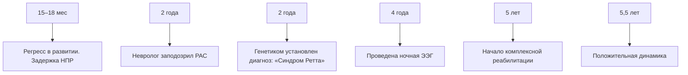

## Е.А. Коваленкова, С.А. Коваленкова, Д.С. Крутиков

Смоленский государственный медицинский университет, Смоленск, Российская Федерация

# Клинический случай синдрома Ретта: опыт наблюдений за ребенком старшего дошкольного возраста

Автор, ответственный за переписку:

Коваленкова Софья Андреевна, студентка 5-го курса педиатрического факультета ФГБОУ ВО Смоленский государственный медицинский университет

Адрес: 214019, Смоленск, ул. Крупской, д. 28, тел.: +7 (915) 633-06-03, e-mail: kovalenkova.sofya@mail.ru

Обоснование. Синдром Ретта — редкое нейропсихическое нарушение, которое связано со спорадическими мута- циями Х-сцепленного гена метил-CpG-связывающего белка 2 (MECP2). Учитывая высокую значимость ранней диа- гностики, необходимость в мультидисциплинарном подходе к лечению и поддержке таких детей, исследование кли- нических случаев синдрома Ретта имеет особое значение для повышения осведомленности и улучшения качества жизни пациентов и их семей. Описание клинического случая. В статье описана клиническая картина синдрома Ретта у девочки П., родившейся от вторых естественных родов на 40-й нед с массой тела при рождении 3200 г. До дебюта заболевания отклонений в формировании психомоторных навыков у ребенка не отмечалось. Однако к двум годам начали проявляться характерные симптомы: потеря речи, стереотипные движения, эквинусная поход- ка, бруксизм, общение взглядом. Диагноз синдрома Ретта был подтвержден при молекулярно-генетическом иссле- довании: выявлена мутация Х-сцепленного гена метил-CpG-связывающего белка 2 (MECP2). Заключение. Данный клинический случай демонстрирует необходимость информированности врачей для своевременного выявления заболевания и мультидисциплинарного подхода к его диагностике и коррекции. Использование ДНК-скрининга для раннего выявления заболеваний значительно повышает шансы на эффективное лечение и реабилитацию.

Ключевые слова: синдром Ретта, старший дошкольный возраст, нейропсихическое нарушение, мутация

Для цитирования: Коваленкова Е.А., Коваленкова С.А., Крутиков Д.С. Клинический случай синдрома Ретта: опыт наблюдений за ребенком старшего дошкольного возраста. Педиатрическая фармакология. 2025;22(2):184–188. doi: https://doi.org/10.15690/pf.v22i2.2872

## ОБОСНОВАНИЕ

Синдром Ретта является орфанным прогрессирую- щим генетическим нейропсихическим заболеванием. Частота синдрома Ретта, по данным исследований, составляет примерно от 5 до 10 случаев на 100 тыс. девочек по всему миру [1]. Это заболевание, как прави- ло, проявляется в возрасте от 6 до 18 мес, когда у детей отмечаются регресс ранее приобретенных навыков и развитие множества специфических симптомов, таких как замедление роста окружности головы, нару- шения походки, потеря целенаправленных движений рук, которые часто заменяются стереотипными движениями, а также потеря речи и нарушения дыхания [2].

Синдром Ретта классифицируется на типичную, ати- пичную и вариативную формы, что свидетельствует о сложном фенотипе заболевания, примерно в 90% заре- гистрированных случаев болезнь вызывается мутация- ми в гене метил-CpG-связывающего белка 2 (MECP2) [2].

## Ekaterina A. Kovalenkova, Sofya A. Kovalenkova, Dmitry S. Krutikov

Smolensk State Medical University, Smolensk, Russian Federation

# Сlinical Case of Rett Syndrome: the Experience of Observing Older Preschooler

Background. Rett syndrome is a rare neuropsychiatric disorder associated with sporadic mutations in the X-linked methyl-CpG binding protein 2 (MECP2) gene. Considering the cruciality of early diagnosis, the necessity of multidisciplinary approach in the management and support of such children, the study of Rett syndrome clinical cases is essential to raise awareness and improve the patients and their families’ quality of life. Clinical case description. This article describes the clinical picture of Rett syndrome in girl P., born from second natural delivery at the 40th week of gestation, weight at birth – 3200 g. There were no deviations in psychomotor skills development before disease onset. However, classic manifestations have appeared by the age of two: alalia, motor stereotypy, equinus gait, bruxism, communication via sight. The Rett syndrome was confirmed via molecular genetic study: mutation in the X-linked methyl-CpG binding protein 2 (MECP2) gene was revealed. Conclusion. This clinical case demonstrates the importance to inform doctors about timely disease detection and multidisciplinary approach to its diagnosis and management. The use of DNA screening for early disease detection greatly improves the chances of effective treatment and rehabilitation.

Keywords: Rett syndrome, older preschool age, psychoneurological disorders, mutation

For citation: Kovalenkova Ekaterina A., Kovalenkova Sofya A., Krutikov Dmitry S. Сlinical Case of Rett Syndrome: the Experience of Observing Older Preschooler. Pediatricheskaya farmakologiya — Pediatric pharmacology. 2025;22(2):184–188. (In Russ). doi: https://doi.org/10.15690/pf.v22i2.2872

Мутации приводят к нарушению развития нейронов и образованию аксодендритных связей, что объясняет широкий спектр неврологических и неневрологических проявлений, включая аномалии дыхательной, сердеч- но-сосудистой, пищеварительной, скелетной и других систем [3].

Первое описание мозга при синдроме Ретта было сде- лано К. Джеллингером (K. Jellinger) и Ф. Зайтельбергером (F. Seitelberger) в 1986 г. Они отметили, что мозг был маленьким и что в компактной части черной субстанции было меньше меланина, чем в мозге здоровых людей [4, 5].

Хотя традиционно считалось, что это заболевание поражает только девочек, в настоящее время заре- гистрированы случаи проявления синдрома Ретта и у мальчиков, у которых обнаруживают те же мутации, что и у девочек, однако они совместимы с жизнью при условии мозаицизма хромосомного набора при син- дроме Клайнфельтера (кариотип 47,XXY/46,XY) или сома- тического мозаицизма по МЕСР2-мутации [6, 7].

При синдроме Ретта возникает необходимость в меж- дисциплинарном подходе к лечению, так как болезнь затрагивает функции не только нервной системы, но и других органов, что требует внимания со стороны специалистов разных профилей. Важны раннее выявле- ние и комплексная реабилитация, чтобы максимально улучшить качество жизни пациентов и их семей.

Уникальность представляемого в статье клиниче- ского случая заключается в своевременной диагности- ке заболевания у пациента со значительной регрессией навыков. Цель описания — проанализировать течение синдрома Ретта и оценить эффективность реабилитаци- онных мероприятий.

## КЛИНИЧЕСКИЙ ПРИМЕР

## О пациенте

Пациентка П., 5 лет. Дата рождения: 29.03.2018. Из анамнеза известно, что ребенок родился от вторых своевременных родов, оценка по шкале APGAR — 9/9. Масса тела при рождении составила 3200 г, длина — 50 см. Грудное вскармливание продолжалось до года. В течение первых 12 мес жизни девочка развивалась по возрасту: сидела с 6 мес, ходила с 1 года 1 мес, произ- носила первые простые осознанные слова (мама, папа, баба) и активно слушала чтение.

Однако к 1,5 годам у пациентки начался регресс в развитии: она перестала произносить слова, слу- шать чтение, выбирать игрушки и собирать пирамидку. Увлечение ограничилось только просмотром мультфиль- мов. В возрасте 2 лет девочка была направлена к невро- логу в связи с задержкой нервно-психического развития. Первоначально было заподозрено расстройство аутисти- ческого спектра, однако после консультации с генетиком и сдачи анализов был подтвержден синдром Ретта.

## Физикальная диагностика

При обследовании у девочки наблюдались следующие симптомы: потеря речи и навыков общения, стереотип- ные движения рук, эквинусная походка, бруксизм; пси- хомоторное развитие значительно отставало от нормы. По остальным органам и системам — без особенностей.

## Предварительный диагноз

Синдром Ретта.

## Диагностические процедуры

В возрасте 2 лет педиатр обратил внимание на задержку нервно-психического развития и направил девочку к неврологу. Невролог заподозрил расстрой- ство аутистического спектра, направил на консультацию к генетику. Генетик предположил синдром Ретта и напра- вил на генетический анализ. При молекулярно-генети- ческом исследовании выявлена мутация Х-сцепленного гена MECP2 — мутация с.468C>G (p.D156E) в гетеро- зиготном состоянии, что позволило установить диагноз синдрома Ретта.

20.10.2022 (в возрасте 4 лет) была проведена электроэнцефалография (ЭЭГ) в состоянии ночного сна. Выявлено нарастание эпилептиформной актив- ности на начальной стадии сна. Наблюдаются парок- сизмы, сопровождающиеся повторяющимися двига- тельными стереотипиями и плачем, которые трактуются как фокальные эпилептические приступы.

При обследовании на дефицит витамина D был сдан анализ на уровень 25-(OH)D, значения в пределах нормы.

## Клинический диагноз

Синдром Ретта, связанный со спорадическими мута- циями Х-сцепленного гена метил-CpG-связывающего белка 2 (MECP2).

## Дифференциальная диагностика

В диагностическом аспекте важно проводить тща- тельную дифференциальную диагностику синдрома Ретта и других расстройств, таких как синдром Ангельмана, аутизм, детский церебральный паралич, врожденные нарушения обмена веществ, тяжелый интеллектуальный дефицит и эпилепсия, особенно при наличии эпилеп- тических приступов и стереотипных движений [8, 9]. Также следует учитывать возможность наличия вариан- тов в гене VAMP2 у пациентов с похожими клиническими проявлениями, что может быть значимым для уточнения диагноза [10].

## Медицинские вмешательства

Пациентка получает следующую терапию, назначен- ную неврологом: рисперидон 1% — краткосрочное сим- птоматическое лечение непрекращающейся агрессии по 0,5 мл 2 раза в день для стабилизации психического состояния; толперизон 50 мг 1/2 таблетки при возбуди- мости и мышечных спазмах; макрогол по необходимо- сти — при возникновении запора.

Проведены занятия с логопедом, физиотерапевтом, назначены курсы массажа. Реабилитационные меропри- ятия проводились 3 раза в неделю в течение 6 мес.

## Динамика и исходы

На момент обследования у пациентки отмечается грубая задержка психоречевого развития. После регрес- са навыков, произошедшего в 1,5 года, наблюдается полная утрата речи с сохранением невербальных форм коммуникации (эмоциональные реакции, зрительный контакт). Когнитивные функции характеризуются частич- ным пониманием простых бытовых инструкций, способ- ностью узнавать близких и проявлять к ним привязан- ность, однако целенаправленная игровая деятельность полностью отсутствует.

На фоне комплексной терапии достигнуты положи- тельные изменения. В неврологическом статусе отме- чаются улучшение координации движений, проявляю- щееся в более уверенном захвате предметов, а также снижение частоты стереотипных движений в периоды бодрствования. По данным ЭЭГ, удалось добиться кон- троля эпилептической активности, которая в настоящее время регистрируется только в начальной стадии сна.

В эмоционально-поведенческой сфере наблюдается уменьшение эпизодов раздражительности и агрессии, что связано с эффектом рисперидона.

Однако сохраняются неврологические симптомы: сте- реотипные движения рук, эквинусная походка, бруксизм. Продолжают отмечаться фокальные эпилептические приступы во сне. Когнитивные функции остаются зна- чительно сниженными, хотя сохраняются элементарные формы коммуникации.

Динамика на фоне проводимой терапии демонстри- рует положительную тенденцию. Симптоматическое лечение в сочетании с реабилитационными мероприя- тиями позволило добиться улучшения моторики и ста- билизации эмоционального состояния. В ходе 6-месяч- ной реабилитационной программы отмечена следующая динамика: в первые 2 мес наблюдались усиление стерео- типий и эмоциональная лабильность как проявление адаптационного периода, однако к 3-му мес улучшилась координация и снизилась частота стереотипных движе- ний.

Перспективы дальнейшего наблюдения включают в себя продолжение медикаментозной терапии с регу- лярным ЭЭГ-мониторингом и комплекса реабилитаци- онных мероприятий в соответствии с индивидуальными потребностями пациентки.

## Прогноз

Прогноз для пациентки с синдромом Ретта зависит от нескольких факторов. В аспекте здоровья важными являются факторы риска, такие как возраст начала реабилитации и степень регрессии. Раннее вмеша- тельство может улучшить исходы, в то время как более выраженные нарушения могут затруднить восстанов- ление. Факторы благоприятного прогноза включают в себя активное участие в реабилитационных програм- мах и поддержку семьи, что может способствовать улуч- шению моторных и речевых навыков. В аспекте соци- альной адаптации также имеются свои особенности. Факторы риска включают в себя социальную изоляцию и возможные психоэмоциональные расстройства, кото- рые могут негативно сказаться на социальных навы- ках. В то же время факторы благоприятного прогноза, такие как участие в инклюзивных образовательных программах и групповая терапия, могут способствовать развитию социальных навыков и улучшению общения. Прогноз в аспекте жизни пациентки варьирует — также в зависимости от различных факторов. В данном случае к факторам риска относятся сопутствующие медицин- ские проблемы и уровень поддержки, так как недо- статочная поддержка со стороны семьи и медицинских работников может снизить качество жизни. Факторы благоприятного прогноза включают в себя доступ к специализированной помощи и позитивную динамику в реабилитации, что может улучшить качество жизни и уверенность в будущем.

Таким образом, прогноз для пациентки с синдро- мом Ретта остается неопределенным. Важно учитывать как рисковые, так и благоприятные предикторы, что- бы максимально эффективно планировать дальней- шие шаги в реабилитации и социальной адаптации. Регулярный мониторинг состояния и адаптация про- грамм лечения помогут улучшить качество жизни паци- ентки и ее интеграцию в общество.

## Временная шкала

Хронология течения болезни пациентки П. и ее клю- чевые события представлены на рисунке.

## ОБСУЖДЕНИЕ

Клинический случай с пациенткой, страдающей син- дромом Ретта, имеет несколько ключевых особенно- стей. Положительные результаты ведения пациента включают в себя вмешательство, которое способство- вало улучшению моторных и речевых навыков, а также интенсивную реабилитацию, благодаря которой достиг- нута положительная динамика в развитии пациентки, в том числе частичное восстановление речевых навы- ков. Важным аспектом является поддержка семьи, которая помогла пациентке адаптироваться к условиям реабилитации.

Однако имеются и недостатки оказанной медицин- ской помощи. Во-первых, программа реабилитации не всегда была индивидуализирована, что могло замед- лить прогресс. Во-вторых, ограниченные ресурсы в реа- билитационном центре снижали доступ к необходимым методам лечения. В-третьих, наблюдались трудности в управлении эмоциональными реакциями пациентки, что требовало дополнительной поддержки.

Обсуждая результаты, можно отметить, что поло- жительные изменения объясняются механизмами ней- ропластичности и адаптации мозга, активируемыми при раннем вмешательстве. Исследования показывают, что интенсивная реабилитация может способствовать улучшению моторных и когнитивных функций у детей с синдромом Ретта [11]. Однако недостатки в оказанной помощи подчеркивают необходимость индивидуаль- ного подхода, что подтверждается данными наблюда- тельных исследований, где успешные результаты были связаны с адаптацией программ под конкретные нужды пациентов.

flowchart

Рисунок. Пациентка П.: хронология течения болезни, ключевые события 
Примечание. НПР — нервно-психическое развитие; РАС — расстройство аутистического спектра; ЭЭГ — электроэнцефалография. 
Figure. Patient P.: disease course and key events 
Note. NPD (НПР) — neuropsychic development; ASD (РАС) — autism spectrum disorder; EEG (ЭЭГ) — electroencephalography.

## ЗАКЛЮЧЕНИЕ

Синдром Ретта требует мультидисциплинарного подхода к лечению, включающего работу неврологов, психиатров, логопедов и физиотерапевтов, что позво- ляет более эффективно контролировать симптомы и улучшать качество жизни пациентов. Что касается рекомендаций, можно выделить необходимость инди- видуализации реабилитационных программ с учетом уникальных потребностей каждого пациента, увели- чения ресурсов для обеспечения доступа к специали- зированным методам лечения, внедрения программ психоэмоциональной поддержки для пациентов и их семей, а также повышения информированности меди- цинского персонала в области диагностики и лечения синдрома Ретта.

Кроме того, по причине отсутствия специфическо- го лечения рекомендованы симптоматическая тера- пия, а также комплексная реабилитация: дефектолог, бассейн, лечебная физкультура, массаж, иппотера- пия.

Важно отметить, что выводы, которые можно сделать, опираясь на данный клинический случай, не следует экстраполировать на всех пациентов — без учета инди- видуальных особенностей и контекста. Каждое клини- ческое наблюдение должно быть рассмотрено в рамках более широких исследований для получения достовер- ных и обоснованных рекомендаций.

## ИНФОРМИРОВАННОЕ СОГЛАСИЕ

От родителей получено письменное информирован- ное добровольное согласие на публикацию описания клинического случая (дата подписания: 12.01.2025).

## INFORMED CONSENT

Patient’s parents have signed informed voluntary consent on the publication of clinical case description (signed on 12.01.2025).

## ВЫРАЖЕНИЕ ПРИЗНАТЕЛЬНОСТИ

Авторы выражают признательность научному руково- дителю проекта и родителям ребенка.

## ACKNOWLEDGEMENTS

The authors express gratitude to the project supervisor and child’s parents.

## СПИСОК ЛИТЕРАТУРЫ / REFERENCES

1. Petriti U, Dudman DC, Scosyrev E, Lopez-Leon S. Global prevalence of Rett syndrome: systematic review and meta-analysis. Syst Rev. 2023;12(1):5. doi: https://doi.org/10.1186/s13643- 023-02169-6 
2. Chahil G, Bollu PC. Rett Syndrome. 2023 Aug 8. In: StatPearls [Internet]. Treasure Island (FL): StatPearls Publishing; 2025. 
3. Borloz E, Villard L, Roux JC. Rett syndrome: think outside the (skull) box. Fac Rev. 2021;10:59. doi: https://doi.org/10.12703/r/10-59 
4. Armstrong DD. Rett syndrome neuropathology review 2000. Brain Dev. 2001;23 Suppl 1:S72–S76. doi: https://doi.org/10.1016/ s0387-7604(01)00332-1 
5. Jellinger K, Seitelberger F. Neuropathology of Rett syndrome. Am J Med Genet Suppl. 1986;1:259–288. doi: https://doi. org/10.1002/ajmg.1320250528 
6. Leonard H, Silberstein J, Falk R, et al. Occurrence of Rett syndrome in boys. J Child Neurol. 2001;16(5):333–338. doi: https:// doi.org/10.1177/088307380101600505

## ВКЛАД АВТОРОВ

Е.А. Коваленкова — сбор анамнеза у родителей, анализ медицинской документации, осмотр пациента в динамике, систематизация и анализ данных, изучение отечественной и зарубежной литературы, поисково-ана- литическая работа для написания статьи, написание тек- ста статьи, редактирование текста статьи, графическое представление результатов.

С.А. Коваленкова — сбор анамнеза у родителей, анализ медицинской документации, осмотр пациента в динамике, систематизация и анализ данных, изучение отечественной и зарубежной литературы, поисково-ана- литическая работа для написания статьи, написание текста статьи, редактирование текста статьи, ведение переписки с редакторами.

Д.С. Крутиков — поисково-аналитическая работа для написания статьи, обоснование стратегии фармако- терапии, участие в написании и редактировании статьи, систематизация и анализ данных.

## AUTHORS’ CONTRIBUTION

Ekaterina A. Kovalenkova — history taking from parents, medical documentation analysis, patient’s follow-up, data systematization and analysis, study of Russian and foreign literature, search and analytical work for manuscript writing, manuscript writing, manuscript editing, graphical presentation of results.

Sofya A. Kovalenkova — history taking from parents, medical documentation analysis, patient’s follow-up, data systematization and analysis, study of Russian and foreign literature, search and analytical work for manuscript writing, manuscript writing, manuscript editing, correspondence with editors.

Dmitry S. Krutikov — search and analytical work for manuscript writing, drug therapy validation, manuscript writing and editing, data systematization and analysis.

## ИСТОЧНИК ФИНАНСИРОВАНИЯ

Отсутствует.

## FINANCING SOURCE

Not specified.

## РАСКРЫТИЕ ИНТЕРЕСОВ

Авторы статьи подтвердили отсутствие конфликта интересов, о котором необходимо сообщить.

## DISCLOSURE OF INTERESTS

Not declared.

## ORCID

## С.А. Коваленкова

https://orcid.org/0009-0004-4154-1521

7. Воинова В.Ю., Юров И.Ю., Ворсанова С.Г., Юров Ю.Б. Умственная отсталость и хромосома Х: монография. — М.: Издательский дом Академии Естествознания; 2016. — 219 с. [Voinova VYu, Yurov IYu, Vorsanova SG, Yurov YuB. Umstvennaya otstalost’ i khromosoma X: monograph. Moscow: Publishing House of the Academy of Natural Sciences; 2016. 219 p. (In Russ).] 
8. Малинина Е.В., Забозлаева И.В. Синдром Ретта: трудности диагностики (клинико-психопатологические аспекты) // Русский журнал детской неврологии. — 2016. — Т. 11. — № 3. — 
С. 49–56. — doi: https://doi.org/10.17650/2073-8803-2016- 11-3-49-56 [Malinina EV, Zabozlaeva IV. Rett syndrome: difficulties of diagnostics (clinical and psychopathological aspects). Russian Journal of Child Neurology. 2016;11(3):49–56. (In Russ). doi: https://doi.org/10.17650/2073-8803-2016-11-3-49-56] 
9. Бобылова М.Ю., Иванова И.В., Некрасова И.В. и др. Особенности течения и развития эпилепсии у детей с типичным вариантом синдрома Ретта, вызванного мутацией // Журнал

неврологии и психиатрии им. С.С. Корсакова. Спецвыпуски. — 2017. — Т. 117. — № 11-2. — С. 54–61. — doi: https:// doi.org/10.17116/jnevro201711711254-61 [Bobylova MIu, Ivanova IV, Nekrasova IV, et al. The course and the development of epilepsy in patients with typical variant of Rett syndrome and mutations. S.S. Korsakov Journal of Neurology and Psychiatry. 2017;117(11-2):54–61. (In Russ.) doi: https://doi.org/10.17116/ jnevro201711711254-61]

10. Bogue D, Ryan G, Wassmer E, et al. VAMP2 Gene-Related Neurodevelopmental Disorder: A Differential Diagnosis for Rett/Angelman-Type Spectrum of Disorders. Mol Syndromol. 2023;14(5):449–456. doi: https://doi.org/10.1159/000530150 11. Lim J, Greenspoon D, Hunt A, McAdam L. Rehabilitation interventions in Rett syndrome: a scoping review. Dev Med Child Neurol. 2020;62(8):906–916. doi: https://doi.org/10.1111/ dmcn.14565

Статья поступила: 07.02.2025, принята к печати: 16.04.2025

The article was submitted 07.02.2025, accepted for publication 16.04.2025

## ИНФОРМАЦИЯ ОБ АВТОРАХ / ABOUT THE AUTHORS

Коваленкова Софья Андреевна, студентка [Sofya A. Kovalenkova, student]; адрес: 214019, г. Смоленск, ул. Крупской, д. 28 [address: 28, Krupskoy Str., Smolensk, 214019, Russian Federation]; телефон: +7 (915) 633-06-03; e-mail: kovalenkova.sofya@mail.ru

Коваленкова Екатерина Андреевна, студентка [Ekaterina A. Kovalenkova, student]; e-mail: katerina\_kovalenkova@mail.ru

Крутиков Дмитрий Сергеевич, студент [Dmitry S. Krutikov, student]; e-mail: krutikovdima1@mail.ru