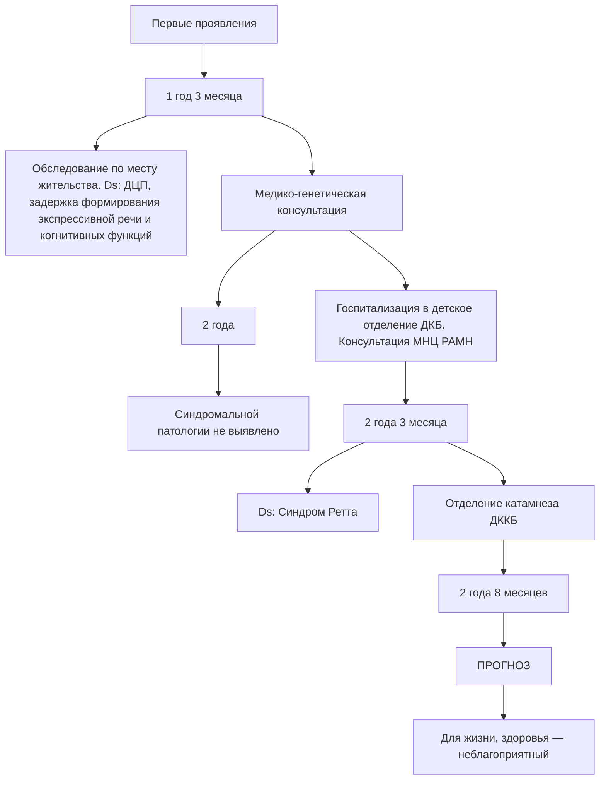

https://doi.org/10.25207/1608-6228-2021-28-1-116-124

© Коллектив авторов, 2021

# СИНДРОМ РЕТТА: КЛИНИЧЕСКИЙ СЛУЧАЙ

А.В. Бурлуцкая, А.С. Иваненко, А.В. Статова\*

Федеральное государственное бюджетное образовательное учреждение высшего образования «Кубанский государственный медицинский университет» Министерства здравоохранения Российской Федерации
ул. им. Митрофана Седина, д. 4, г. Краснодар, 350063, Россия

## АННОТАЦИЯ

Введение. Синдром Ретта — редкое генетическое заболевание, имеющее множество «масок», что приводит к затруднению своевременной диагностики и постановки диагноза. Несмотря на то что за последние два десятилетия объем знаний по этой патологии значительно увеличился, существуют фенотипически подобные заболевания, требующие соответствующего диагностического поиска для определения стратегии лечения.

Описание клинического случая. Девочка 3 лет поступила с жалобами на утрату полученных ранее моторных навыков. Из анамнеза известно, что с 2 месяцев жизни наблюдалась у невролога по поводу задержки психомоторного развития, проводились курсы нейротропной, восстановительной терапии без эффекта. В 1 год 6 месяцев был установлен диагноз «детский церебральный паралич, резидуальный период, атонически-атактическая форма, 3-й степени тяжести», проводилась реабилитационная терапия, положительного эффекта не отмечалось. В связи с прогрессированием симптомов (утратой моторных навыков) девочка была направлена в федеральное государственное бюджетное научное учреждение «Медико-генетический научный центр имени академика Н.П. Бочкова», где было проведено молекулярно-генетическое исследование, методом прямого автоматического секвенирования гена МЕСР2 проведен поиск мутаций, в ходе которого обнаружена мутация с.468C>G (р.Д156Е) в гетерозиготном состоянии, установлен диагноз «синдром Ретта». Прогноз синдрома Ретта неблагоприятный, так как у таких больных прогрессируют двигательные и неврологические нарушения, заболевание ведет к тяжелой умственной отсталости. Пациенты с данной патологией при соответствующем уходе могут иметь продолжительность жизни до 40–50 лет, однако риск внезапной смерти у них достаточно высок.

Заключение. Синдром Ретта относится к редким заболеваниям, проявляется утратой ранее сформированных двигательных и речевых навыков. Статья наглядно описывает заболевание. Данный клинический случай демонстрирует сложности диагностики синдрома Ретта, отсутствие специфических изменений при параклиническом исследовании затрудняет диагностический поиск. Возможности молекулярно-генетического исследования позволяют установить диагноз и оценить прогноз при данной патологии.

Ключевые слова: синдром Ретта, прогрессирующее дегенеративное заболевание центральной нервной системы, дети, редкий наследственный синдром

Конфликт интересов: авторы заявляют об отсутствии конфликта интересов.

Для цитирования: Бурлуцкая А.В., Иваненко А.С., Статова А.В. Синдром Ретта: клинический случай. Кубанский научный медицинский вестник. 2021; 28(1): 116–124. https://doi.org/10.25207/1608-6228-2021-28-1-116-124

Поступила 08.11.2020
Принята после доработки 20.12.2020
Опубликована 25.02.2021

# RETT SYNDROME: A CLINICAL CASE

Alla V. Burlutskaya, Alina S. Ivanenko, Ananstasia V. Statova\*

Kuban State Medical University

Mitrofana Sedina str., 4, Krasnodar, 350063, Russia

## ABSTRACT

Background. Rett syndrome is a rare genetic disorder often mimicked by variant other illnesses, which hampers its timely diagnosis. Although knowledge of this pathology has grown remarkably over the past two decades, an appropriate diagnosis is necessary to exclude similar disease phenotypes and select an applicable therapy.

Clinical Case Description. A 3-yo girl was admitted with a loss of earlier motor skills. The girl had neurological monitoring since month 2 of age for a delayed psychomotor development and had courses of neurotropic and reconstructive therapy, ineffective. At 18 months she was diagnosed with infantile cerebral palsy, residual period, atonic-astatic form, grade 3, rehabilitation therapy ineffective. With the disease progression and loss of motor skills, the girl was referred to the Bochkov Research Centre for Medical Genetics for sequence genotyping of the MECP2 gene, which determined a heterozygous single-nucleotide polymorphism c.468C>G (p.D156E) diagnostic of the Rett syndrome. The Rett syndrome has poor prognosis for progressive motor and neurological deficiency and eventual severe mental retardation. Patients with the Rett syndrome can have life expectancy of up to 40—50 years with appropriate care but incur a high risk of sudden death.

Conclusion. The Rett syndrome is a rare disorder manifested by loss of earlier developed motor and speech skills. This report provides a clear case description and illustrates the difficulty of the syndrome timely diagnosis aggravated by a lack of specific paraclinical signatures. Molecular genotyping techniques allow a proper diagnosis and prognosis assessment in this pathology.

Keywords: Rett syndrome, progressive degenerative disease of central nervous system, children, rare inherited syndrome

Conflict of interest: the authors declare no conflict of interest.

Для цитирования: Burlutskaya A.V., Ivanenko A.S., Statova A.V. Rett syndrome: a clinical case. Kubanskii Nauchnyi Meditsinskii Vestnik. 2021; 28(1): 116–124. (In Russ., English abstract). https://doi.org/10.25207/1608-6228-2021-28-1-116-124

Submitted 08.11.2020

Revised 20.12.2020

Published 25.02.2021

## ВВЕДЕНИЕ

Синдром Ретта (MIM 312750) — Х-сцепленное генетическое заболевание с преимущественным поражением лиц женского пола, приводящее к регрессу психомоторных навыков, социальной аутизации, когнитивному дефициту, с возможным развитием эпилепсии. Распространенность у девочек составляет 1:10000–15000, у мальчиков встречается крайне редко [1].

Впервые болезнь была описана австрийским неврологом Андреасом Реттом в 1966 году. В 1954 году этот врач обследовал двух девочек и отметил у них, кроме регресса психического развития, особые стереотипные движения в виде «сжимания рук» или напоминающие «мытье рук». В своих записях он отыскал несколько подобных случаев, что натолкнуло его на мысль об уникальности заболевания. Отсяяв на видеопленку своих пациенток, доктор Ретт отправился по всей Европе в поисках детей с похожими симптомами. В 1966 году в Австрии он опубликовал свои исследования в нескольких журналах, но они не получили всемирной известности даже после публикации на английском языке в 1977 году. Лишь в 1983 году, после публикации шведского исследователя Dr. Bengt Hagberg и его коллег в журнале «Анналы неврологии», заболевание было выделено в отдельную нозологическую единицу и названо в честь своего первооткрывателя «синдромом Ретта» [2].

В 1999 году сотрудники университета Бэйлор (Хьюстон, Техас) открыли мутацию в гене МЕСР2, расположенного на участке Xq28 X-хромосомы. В результате мутации гена нарушается синтез метил-CpG-связывающего белка 2, который регулирует работу нейротрансмиттеров, участвующих в образовании нейронных ассоциативных связей. МЕСР2 участвует в регуляции синаптической передачи нервного импульса, пре- и постнатального развития головного мозга. В настоящее время до конца не раскрыт механизм регрессии, однако есть предположения, что регрессия связана с прекращением миграции нейронов и нарушением формирования синапсов [3].

Мальчики с мутациями в гене МЕСР2 часто умирают во младенчестве. Однако у небольшого числа мальчиков с мутациями в гене МЕСР2 развиваются признаки и симптомы, аналогичные синдрому Ретта. У мужчин это состояние описывается как МЕСР2-related severe неонатальная энцефалопатия. Признаки и симптомы у некоторых мужчин с мутацией гена МЕСР2 клинически менее выражены, чем у девочек. Помимо синдрома Ретта с мутациями в данном гене выделяют следующие синдромы: РРМ–Х синдром, МЕСР2 duplication syndrome, которые встречаются преимущественно у лиц мужского пола [4, 5].

У пациентов с атипичными формами синдрома Ретта выявлены мутации и в других генах: FOXG1 (forkhead box protein G1), картированном в участке 14q12, CDKL5 (cycline-dependent kinase like 5) в участке Xp22.13; субмикроскопические делеции в участке Xq28, затрагивающие ген МЕСР2, которые невозможно обнаружить только с использованием молекулярно-генетических методов [6, 7].

Пациенты с классическим синдромом Ретта до 6–18 месяцев развиваются в соответствии с возрастными нормами, после наблюдается потеря ранее приобретенных речевых и двигательных навыков. Целенаправленные движения руками замещаются стереотипными выкручивающими, моющими, хлопающими движениями, также отмечены различного рода вокализации, гиперсаливация, периоды апноэ и гипервентиляции [8, 9].

В 2010 году при поддержке Международного фонда синдрома Ретта были пересмотрены имеющиеся диагностические критерии. Для диагностики типичного синдрома Ретта достаточно четырех основных диагностических критериев: частичная или полная потеря приобретенных движений рук; частичная или полная потеря приобретенных навыков речи (экспрессивной); аномалии походки; стереотипные движения рук хлопающего, сдавливающего, моющего характера.

Дополнительные диагностические критерии: дыхательные расстройства: апноэ в период бодрствования, гипервентиляция, форсированное изгнание слюны и воздуха; судорожные приступы; спастичность, часто сочетающаяся с дистонией и атрофией мышц; периферические вазомоторные расстройства; сколиоз; задержка роста; гипертрофические маленькие ступни; электроэнцефалографические нарушения.

Критерии исключения: повреждение головного мозга в пери- или постнательном периоде результате травмы, нейрометаболических заболеваний или тяжелой инфекции, которые приводят к неврологическому дефициту; нарушения психомоторного развития в первые 6 месяцев жизни [10, 11].

Выделяют атипичные формы синдрома Ретта, их диагностика основана на диагностических критериях, выделенных в 1994 году В. Hagberg.

1. Вариант Ганафильда (Hanafeld) — характеризуется появлением эпиприпадков в первые месяцы жизни с последующим развитием классических симптомов синдрома Ретта. 
2. Вариант Роландо — наиболее тяжелая форма с развитием в первые 3 месяца жизни классической клинической картины. 
3. Форма с поздним началом фазы регресса, нормальной окружностью головы и поздней утратой двигательный и речевых навыков. 
4. PSD, или форма Зоппела, — характеризуется сохранностью речи, с более полной социальной адаптацией [12, 13].

Специфического лечения не разработано, применяют симптоматическую терапию при эпилептических приступах, мышечной ригидности,
нарушении сна, дыхательных расстройствах.
Важным аспектом является рациональное питание при отсутствии прибавки массы тела. Ортопедическое лечение при смещении суставов
и развитии сколиоза. Необходимо акцентировать
внимание на организацию социальной и психологической поддержки семьи как одного из аспектов терапии [14].

Прогноз при этой наследственной патологии неблагоприятный, зависит от тяжести течения заболевания. Синдром Ретта очень часто сопровождается судорогами (до 70% случаев), нарушениями дыхания (гиповентиляция, гиперкапния, апноэ), сколиозом, желудочно-пищеводным рефлюксом, удлиненным интервалом QT на ЭКГ. Большинство пациентов умирают в детском или юношеском возрасте, ряд больных достигает возраста 20–30 лет и даже более [15].

## КЛИНИЧЕСКИЙ ПРИМЕР

## Информация о пациенте

Девочка Г. 3-х лет находилась на обследовании в неврологическом отделении государственного бюджетного учреждения здравоохранения «Детская краевая клиническая больница» Министерства здравоохранения Краснодарского края (ГБУЗ ДККБ). Мама девочки обратилась с жалобами на задержку речи у ребенка, нарушение походки, отставание в развитии от сверстников, потерю имеющихся навыков (стала плохо удерживать игрушки, падать назад при ходьбе).

Из анамнеза заболевания известно, что первые симптомы заболевания мать стала отмечать с возраста 1 года 3 месяцев, когда у ребенка появилась незначительная регрессия двигательных навыков (стала плохо удерживать предметы руками, появилась неуверенная и шаткая походка), задержка речевого развития. Обратились к педиатру по месту жительства, проведены следующие исследования: биохимические показатели (печеночные трансаминазы, билирубин, мочевина, креатинин), гормонограмма (спектр тиреоидных гормонов) соответствовал возрастной норме. Ребенок направлен на дополнительное обследование в отделение генетики консультативно-диагностического центра государственного бюджетного учреждения здравоохранения «Научно-исследовательский институт — Краевая клиническая больница № 1 имени профессора С. В. Очаповского» Министерства здравоохранения Краснодарского края, генетической патологии не было выявлено.

В возрасте 2 лет 3 месяцев девочка была обследована и прошла лечение в неврологическом отделении ГБУЗ ДККБ, проведены необходимые исследования, на основании которых установлен диагноз «детский церебральный паралич, резидуальный период, атонически-атактическая форма, 3-й степени тяжести; задержка формирования экспрессивной речи и когнитивных функций». Ребенку рекомендовано комплексное реабилитационное лечение, включающее сосудистые препараты, ноотропы, массаж, физиотерапевтическое лечение. На фоне проводимой терапии положительной динамики не отмечалось.

В связи с отсутствием эффекта от проводимой терапии и прогрессированием жалоб ребенок повторно госпитализирован в неврологическое отделение ГБУЗ ДККБ для проведения дополнительного исследования и определения тактики дальнейшего лечения.

Анамнез жизни. Девочка родилась от первой беременности, протекавшей на фоне острой ре- спираторной инфекции в 6 недель, с 27-й недели беременности — гестационный диабет у матери. Роды первые срочные, масса при рождении 3260 г, длина тела 52 см, оценка по шкале Апгар 8–8 баллов. Ребенок закричал после отсасывания слизи из верхних дыхательных путей, к груди приложена на 5-е сутки в связи с аспирационным синдромом, гипоксией 2-й степени. В раннем неонатальном периоде отмечались приступы апноэ, девочка переведена на второй этап выхаживания, выписана на 18-е сутки с диагнозом: перинатальная церебральная ишемия 2-й степени, синдром вегето-висцеральной дисфункции.

Ребенок с 3-х месяцев стал самостоятельно удерживать голову, с 6-ти месяцев — сидеть, с 13-ти месяцев — ходить, с 4-х месяцев появилось гуление, с 6-ти месяцев — лепет, к году — первые слова в количестве 5–6.

Находилась на грудном вскармливании до года. Привита по возрасту.

Наследственность со слов родителей, не отягощена. Мать и отец девочки здоровы, в семье есть здоровые младший брат и сестра, бабушка по материнской линии страдает артериальной гипертензией, дедушка по отцовской линии — сахарным диабетом 2-го типа.

Аллергологический анамнез: диатеза в грудном возрасте не было, аллергические реакции на продукты питания, лекарственные препараты, вакцины не регистрировались.

## Физикальная диагностика

Кожные покровы розовой окраски, умеренно влажные, чистые. Пальпируются единичные подчелюстные, подмышечные и паховые лимфоузлы, размером до 0,5 см, безболезненные, эластичные, не спаяны между собой и окружающей тканью. Голова обычной формы, деформаций черепа не отмечено. Грудная клетка цилиндрической формы. При аускультации легких отмечается пуэрильное дыхание, частота дыхательных движений 46 в минуту; тоны сердца ясные ритмичные, частота сердечных сокращений 116 ударов в минуту. Пальпаторно живот мягкий, безболезненный, умерено вздут. Печень при пальпации выступает из-под края реберной дуги на 1,5 см, безболезненная, эластичная. Физическое развитие ниже среднего, гармоничное.

Девочка самостоятельно не стоит, ноги согнуты в коленных суставах, отмечаются стереотипные движения руками моющего характера. Речь затруднена.

Психоневрологический статус: психические реакции не соответствуют возрасту, уплощены.

flowchart

Рис. Пациентка Г., 3-х лет. Хронология развития болезни, ключевые события и прогноз. 
Fig. Patient G., 3-year old. Sequence of disease progression, key events and prognosis.

Обращенную речь понимает избирательно. Инструкции не выполняет. Речь на уровне звуковых комплексов. Интеллект резко снижен. Черепные нервы: лицо гипомимично, отмечается редкая смена взора. Альтернирующее косоглазие. Мышечный тонус снижен по типу диффузной мышечной гипотонии. Интенция, дизметрия, туловищная атаксия. Ходит у опоры. Сухожильные рефлексы высокие S=D. Навыками самообслуживания не владеет.

## Предварительный диагноз

На основании жалоб, анамнеза заболевания, данных неврологического осмотра девочки установлен диагноз «детский церебральный паралич, резидуальный период, атонически-атактическая форма, 3-й степени тяжести; задержка формирования экспрессивной речи и когнитивных функций».

## Временная шкала

Хронология развития болезни, ключевые события и прогноз у пациентки Г. представлены на рисунке.

## Диагностические процедуры

(проведены в первую неделю госпитализации)

## Лабораторные исследования

Общий анализ крови и мочи: в пределах возрастной нормы.

Биохимическое исследование крови: общий белок 69 г/л (норма 60–80 г/л), глюкоза 4,8 ммоль/л (норма 3,3–5,5, ммоль/л), холестерин 4,3 ммоль/л (норма 2,9–5,2 ммоль/л), общий билирубин 5,2 мкмоль/л (норма 3,4–20 мкмоль/л), АЛТ 24 ЕД/л (норма до 22 ЕД/л), АСТ 30 ЕД/л (норма до 31 ЕД/л), креатинин 52 мкмоль/л (норма 27–62 мкмоль/л), мочевина 3,1 ммоль/л норма 1,8–6,4 ммоль/л), креатинифосфокиназа 82 ЕД/л (норма 20–200 ЕД/л).

Иммуноферментный анализ крови: для исключения гипотиреоза проведено исследование тиреоидных гормонов крови: ТТГ — 2,54 мкЕД/л (норма 0,4–4 мкЕД/л), сТ4–11,99 пмоль/л (норма 13–23 пмоль/л), сТ3–5,9 пмоль/л (норма 3,6 пмоль/л), АТ-ТПО 0 ЕД/л (норма до 5 ЕД/л), на основании которого признаков изменения функции щитовидной железы не выявлено.

Флюорометрическим методом определен уровень фенилаланина 1,6 мг/дл (норма до 2 мг/дл), что позволяет исключить фенилке-тонурию.

Молекулярно-генетическое исследование выполнено в федеральном государственном бюджетном научном учреждении «Медико-генетический научный центр имени академика Н.П. Бочкова» (г. Москва): методом прямого автоматического секвенирования гена МЕСР2 проведен поиск мутаций, в ходе которого обнаружена мутация с. 468C>G (р.Д156Е) в гетерозиготном состоянии.

## Инструментальные исследования

По данным ультразвукового исследования сердца, печени, селезенки, почек структурных изменений не было выявлено.

Электромиография: определены признаки снижения проведения импульса по моторным волокнам смешанного типа.

Электроэнцефалограмма (ЭЭГ): отмечаются выраженные изменения биоэлектрической активности с пароксизмальной активностью, ком- плексы эпилептиформной активности в виде комплексов спайк-волна по правым лобно-височным отведениям с А 293 мкВ.

Видеомониторинг ЭЭГ в состоянии бодрствования, с записью ночного сна и проведением функциональных проб в течение часа зарегистрировал региональную эпилептиформную активность с акцентом на центральный регион и правую височную область.

Компьютерная томография головного мозга: расширение височного рога левого бокового желудочка.

Консультация окулиста: глазное дно без патологических изменений.

## Клинический диагноз

На основании результатов молекулярногенетического исследования, мутации гена МЕСР2 с. 468C>G (р.Д156Е), установлен диагноз «синдром Ретта» (F84.2).

## Дифференциальная диагностика

Синдром Ретта характеризуется прогрессирующими дегенеративными изменениями ЦНС, проявляющимися частичной или полной утратой речи, локомоторных навыков и навыков пользования руками. В поведенческой реакции присутствует аутоподобное поведение, вследствие чего необходимо проводить дифференциальную диагностику редкого генетического синдрома с аутизмом. В клинической картине при синдроме Ретта преобладают нарастание когнитивного дефицита, признаки прогредиентности, присоединение неврологических симптомов. При аутизме — признаки искаженного психического развития, отсутствие прогредиентности. К сожалению, инструментальные методы диагностики малоинформативны. Диагноз синдрома Ретта позволяет установить молекулярно-генетический анализ с выявлением мутаций гена МЕСР2.

## Медицинские вмешательства

Так как специфического лечения данной патологии нет, ребенку рекомендовано симптоматическое: с применением препаратов, улучшающих мозговое кровообращение (фенибут по 0,125 г 3 раза в день на 4 недели, пантогам по 0,25 г 3 раза в день на 3 месяца); реабилитационное: с курсами массажа, физиотерапии, разработанным комплексом лечебной физкультуры, логопедическое лечение. Неотъемлемой частью реабилитации является использование психосоциальных и психообразовательных программ для больного и всех членов его семьи.

## Динамика и исходы

На фоне проводимой терапии отмечалась незначительная положительная динамика: удержание предметов кистью, улучшение звукопроизношения. Для дальнейшей реабилитации ребенку рекомендовано наблюдение в «Кабинете наблюдения за детьми с нервно-мышечными болезнями» ГБУЗ ДККБ.

## Прогноз

Прогноз синдрома Ретта неблагоприятный, так как у таких больных прогрессируют двигательные и неврологические нарушения, заболевание ведет к тяжелой умственной отсталости. Пациенты с данной патологией при соответствующем уходе могут иметь продолжительность жизни до 40–50 лет, однако риск внезапной смерти у них достаточно высок. Ухудшает прогноз наличие пороков развития внутренних органов, при этом причиной летального исхода могут быть дыхательная или полиорганная недостаточность, высок риск развития инсульта.

## ОБСУЖДЕНИЕ

Данный клинический случай демонстрирует сложности диагностики синдрома Ретта, отсутствие специфических изменений при параклиническом исследовании затрудняет диагностический поиск. Возможности молекулярно-генетического исследования позволяют установить диагноз и оценить прогноз при данной патологии.

Одной из нерешенных проблем при синдроме Ретта является отсутствие специфического лечения. Однако исследования последних 3 лет, направленные на изучение терапевтических возможностей, частично нашли свое подтверждение в нейробиологических и биохимических работах [11]. Анализ клеточных и молекулярных изменений в нейронах головного мозга, вызванных нарушением гена МЕСР2, является приоритетным направлением изучения синдрома Ретта [12].

Представленный клинический случай синдрома Ретта будет полезен специалистам в области редких генетических заболеваний, врачам (педиатрам, генетикам, неврологам, психиатрам), которые наблюдают этих больных в клинической практике.

В России создана ассоциация синдрома Ретта «Солнечный ангел», ее цель — оказание информационной и консультативной помощи семьям, в которых есть дети с синдромом Ретта. Для привлечения внимания общества к проблемам детей с этой редкой патологией и большего осведомления о данном синдроме 22 октября объявлен днем «Голубого неба».

## ЗАКЛЮЧЕНИЕ

Представленный клинический случай синдрома Ретта демонстрирует длительность и сложность диагностического поиска для постановки окончательного диагноза. Современные методики генетического обследования детей с прогрессирующей утратой ранее приобретенных навыков позволяют установить диагноз, определить тактику лечения, реабилитации и прогноз.

## ИНФОРМИРОВАННОЕ СОГЛАСИЕ

От официальных представителей пациента (родителей) получено информированное добровольное согласие на публикацию опи- сания клинического случая (дата подписания 25.09.2019 г.)

## INFORMED CONSENT

A free informed consent was obtained from the patient's parents for publication of the clinical case description and photographs (signed on 25.09.2019).

## ИСТОЧНИК ФИНАНСИРОВАНИЯ

Авторы заявляют об отсутствии спонсорской поддержки при проведении исследования.

## FINANCING SOURCE

The authors declare that no funding was received for this study.

## СПИСОК ЛИТЕРАТУРЫ

1. Percy A.K. Progress in Rett Syndrome: from discovery to clinical trials. Wien. Med. Wochenschr. 2016;166(11–12):325–332. DOI: 10.1007/s10354-016-0491-9 
2. Ворсанова С.Г., Юров Ю.Б., Воинова В.Ю., Юров И.Ю. Синдром Ретта в России и зарубежом: научный исторический обзор. Российский вестник перинатологии и педиатрии. 2020;65:(3):25–31. DOI: 10.21508/1027-4065-2020-65-3-25-31 
3. Воинова В.Ю., Ворсанова С.Г., Юров Ю.Б., Юров И.Ю. Алгоритм диагностики Х-сцепленных форм умственной отсталости у детей. Российский вестник перинатологии и педиатрии. 2016; 61(5): 34–41. DOI: 10.21508/1027-4065-2016-61-5-34-41 
4. Gold W.A., Krishnarajy R., Ellaway C., Christodoulou J. Rett Syndrome: A Genetic Update and Clinical Review Focusing on Comorbidities. ACS Chem. Neurosci. 2018; 9(2): 167–176. DOI: 10.1021/acschemneuro.7b00346 
5. Leonard H., Cobb S., Downs J. Clinical and biological progress over 50 years in Rett syndrome. Nat. Rev. Neurol. 2017; 13(1): 37–51. DOI: 10.1038/nrneurol.2016.186 
6. Fehr S., Downs J., Ho G., de Klerk N., Forbes D., Christodoulou J., Williams S., Leonard H. Functional abilities in children and adults with the CDKL5 disorder. Am. J. Med. Genet. A. 2016; 170(11): 2860–2869. DOI: 10.1002/ajmg.a.37851 
7. Lyst M.J., Bird A. Rett syndrome: a complex disorder with simple roots. Nat. Rev. Genet. 2015; 16(5): 261–275. DOI: 10.1038/nrg3897 
8. Qiu Z. Deciphering MECP2–associated disorders: disrupted circuits and the hope for repair. Curr. Opin. Neurobiol. 2018; 48: 30–36. DOI: 10.1016/j.conb.2017.09.004 
9. Lopes F., Barbosa M., Ameur A., Soares G., de Sá J., Dias A.I., Oliveira G., Cabral P., Temudo T., Calado E., Cruz I.F., Vieira J.P., Oliveira R., Esteves S., Sauer S., Jonasson I., Syvänen A.C., Gyllensten U., Pinto D., Maciel P. Identification of novel genetic causes of Rett syndrome-like phenotypes. J. Med. Genet. 2016;53(3):190–199. DOI: 10.1136/jmedgenet-2015-103568 
10. Малинина Е.В., Забозлаева И.В. Синдром Ретта: трудности диагностики (клинико-психопатологические аспекты). Русский журнал детской неврологии. 2016; 11(3): 49–56. DOI: 10.17650/2073-8803-2016-11-3-49-56 
11. Fonzo M., Sirico F., Corrado B. Evidence-Based Physical Therapy for Individuals with Rett Syndrome: A Systematic Review. Brain. Sci. 2020; 10(7): 410. DOI: 10.3390/brainsci10070410 
12. Gogliotti R.G., Niswender C.M. A Coordinated Attack: Rett Syndrome Therapeutic Development. Trends. Pharmacol. Sci. 2019; 40(4): 233–236. DOI: 10.1016/j.tips.2019.02.007 
13. Sajan S.A., Jhangiani S.N., Muzny D.M., Gibbs R.A., Lupski J.R., Glaze D.G., Kaufmann W.E., Skinner S.A., Annese F., Friez M.J., Lane J., Percy A.K., Neul J.L. Enrichment of mutations in chromatin regulators in people with Rett syndrome lacking mutations in MECP2. Genet. Med. 2017; 19(1): 13–19. DOI: 10.1038/gim.2016.42 
14. Townend G.S., Ehrhart F., van Kranen H.J., Wilkinson M., Jacobsen A., Roos M., Willighagen E.L., van Enckevort D., Evelo C.T., Curfs L.M.G.. MECP2 variation in Rett syndrome-An overview of current coverage of genetic and phenotype data within existing databases. Hum. Mutat. 2018; 39(7): 914–924. DOI: 10.1002/humu.23542 
15. Ehrhart F., Sangani N.B., Curfs L.M.G. Current developments in the genetics of Rett and Rett-like syndrome. Curr. Opin. Psychiatry. 2018; 31(2): 103–108. DOI: 10.1097/YCO.0000000000000389

## REFERENCES

1. Percy A.K. Progress in Rett Syndrome: from discovery to clinical trials. Wien. Med. Wochenschr. 2016; 166(11–12): 325–332. DOI: 10.1007/s10354-016-0491-9 
2. Vorsanova S.G., Yurov Yu.B., Voinova V.Yu., Yurov I.Yu. Rett syndrome in russia and abroad: a scientific historical review. Russian Bulletin of Perinatology and Pediatrics. 2020; 65: (3): 25–31 (In Russ., English abstract). DOI: 10.21508/1027-4065-2020-65-3-25-31 
3. Voinova V.Yu., Vorsanova S.G., Yurov Yu.B., Yurov I.Yu. An algorithm for the diagnosis of X-linked intellectual disability in children. Ros. Vestn. Perinatol. I Pediatr. 2016; 61(5): 34–41 (In Russ., English abstract). DOI: 10.21508/1027-4065-2016-61-5-34-41 
4. Gold W.A., Krishnarajy R., Ellaway C., Christodoulou J. Rett Syndrome: A Genetic Update and Clinical Review Focusing on Comorbidities. ACS Chem. Neurosci. 2018; 9(2): 167–176. DOI: 10.1021/acschemneuro.7b00346 
5. Leonard H., Cobb S., Downs J. Clinical and biological progress over 50 years in Rett syndrome. Nat. Rev. Neurol. 2017; 13(1): 37–51. DOI: 10.1038/nrneurol.2016.186 
6. Fehr S., Downs J., Ho G., de Klerk N., Forbes D., Christodoulou J., Williams S., Leonard H. Functional abilities in children and adults with the CDKL5 disorder. Am. J. Med. Genet. A. 2016; 170(11): 2860–2869. DOI: 10.1002/ajmg.a.37851 
7. Lyst M.J., Bird A. Rett syndrome: a complex disorder with simple roots. Nat. Rev. Genet. 2015; 16(5): 261–275. DOI: 10.1038/nrg3897 
8. Qiu Z. Deciphering MECP2-associated disorders: disrupted circuits and the hope for repair. Curr. Opin. Neurobiol. 2018; 48: 30–36. DOI: 10.1016/j.conb.2017.09.004 
9. Lopes F., Barbosa M., Ameur A., Soares G., de Sá J., Dias A.I., Oliveira G., Cabral P., Temudo T., Cala- 
do E., Cruz I.F., Vieira J.P., Oliveira R., Esteves S., Sauer S., Jonasson I., Syvänen A.C., Gyllensten U., Pinto D., Maciel P. Identification of novel genetic causes of Rett syndrome-like phenotypes. J. Med. Genet. 2016; 53(3): 190–199. DOI: 10.1136/jmedgen-et-2015-103568 
10. Malinina E.V., Zabozlaeva I.V. Rett syndrome: difficulties of diagnostics (clinical and psychopathological aspects). Russian Journal of Child Neurology. 2016; 11(3): 49–56 (In Russ., English abstract). DOI: 10.17650/2073-8803-2016-11-3-49-56 
11. Fonzo M., Sirico F., Corrado B. Evidence-Based Physical Therapy for Individuals with Rett Syndrome: A Systematic Review. Brain. Sci. 2020; 10(7): 410. DOI: 10.3390/brainsci10070410 
12. Gogliotti R.G., Niswender C.M. A Coordinated Attack: Rett Syndrome Therapeutic Development. Trends. Pharmacol. Sci. 2019; 40(4): 233–236. DOI: 10.1016/j.tips.2019.02.007 
13. Sajan S.A., Jhangiani S.N., Muzny D.M., Gibbs R.A., Lupski J.R., Glaze D.G., Kaufmann W.E., Skinner S.A., Annese F., Friez M.J., Lane J., Percy A.K., Neul J.L. Enrichment of mutations in chromatin regulators in people with Rett syndrome lacking mutations in MECP2. Genet. Med. 2017; 19(1): 13–19. DOI: 10.1038/gim.2016.42 
14. Townend G.S., Ehrhart F., van Kranen H.J., Wilkinson M., Jacobsen A., Roos M., Willighagen E.L., van Enckevort D., Evelo C.T., Curfs L.M.G.. MECP2 variation in Rett syndrome-An overview of current coverage of genetic and phenotype data within existing databases. Hum. Mutat. 2018; 39(7): 914–924. DOI: 10.1002/humu.23542 
15. Ehrhart F., Sangani N.B., Curfs L.M.G. Current developments in the genetics of Rett and Rett-like syndrome. Curr. Opin. Psychiatry. 2018;31(2):103–108. DOI: 10.1097/YCO.0000000000000389

## ВКЛАД АВТОРОВ

## Бурлуцкая А.В.

Разработка концепции — развитие ключевых целей и задач.

Проведение исследования — сбор и анализ полученных данных.

Подготовка и редактирование текста — критический пересмотр черновика рукописи с внесением ценного замечания интеллектуального содержания.

Утверждение окончательного варианта статьи — принятие ответственности за все аспекты работы, целостность всех частей статьи и ее окончательный вариант.

## Иваненко А.С.

Разработка концепции — формирование идеи; развитие ключевых целей и задач.

Проведение исследования — анализ и интерпретация полученных данных.

Подготовка и редактирование текста — составление черновика рукописи, его критический пересмотр с внесением ценного замечания интеллектуального содержания; участие в научном дизайне.

Утверждение окончательного варианта статьи — принятие ответственности за все аспекты работы и ее окончательный вариант.

## Статова А.В.

Разработка концепции — формирование идеи; развитие ключевых целей и задач.

Проведение исследования — анализ и интерпретация полученных данных.

Подготовка и редактирование текста — составление черновика рукописи, его критический пересмотр с внесением ценного интеллектуального содержания; участие в научном дизайне.

Утверждение окончательного варианта статьи — принятие ответственности за все аспекты работы и ее окончательный вариант.

Ресурсное обеспечение исследования — предоставление пациента для исследования.

## AUTHOR CONTRIBUTIONS

## Burlutskaya A.V.

Conceptualisation — development of key goals and objectives.

Conducting research — data collection and analysis.

Text preparation and editing — critical revision of the manuscript draft with a valuable intellectual investment.

Approval of the final manuscript — acceptance of responsibility for all aspects of the work, integrity of all parts of the article and its final version.

## Ivanenko A.S.

Conceptualisation — concept statement, development of key goals and objectives.

Conducting research — data analysis and interpretation.

Text preparation and editing — drafting of the manuscript, its critical revision with a valuable intellectual investment; contribution to the scientific layout.

Approval of the final manuscript — acceptance of responsibility for all aspects of the work and its final version.

## Statova A.V.

Conceptualisation — concept statement; development of key goals and objectives.

Conducting research — data analysis and interpretation.

Text preparation and editing — drafting of the manuscript, its critical revision with a valuable intellectual investment; contribution to the scientific layout.

Approval of the final manuscript — acceptance of responsibility for all aspects of the work and its final version.

## СВЕДЕНИЯ ОБ АВТОРАХ / INFORMATION ABOUT THE AUTHORS

Бурлуцкая Алла Владимировна — заведующая кафедрой педиатрии № 2 федерального государственного бюджетного образовательного учреждения высшего образования «Кубанский государственный медицинский университет» Министерства здравоохранения Российской Федерации, Краснодар, Россия.

https://orcid.org/0000-0002-9653-6365

Иваненко Алина Сергеевна — студентка 6-го курса педиатрического факультета федерального государственного бюджетного образовательного учреждения высшего образования «Кубанский государственный медицинский университет» Министерства здравоохранения Российской Федерации, Краснодар, Россия.

https://orcid.org/0000-0003-0606-5836

Статова Анастасия Васильевна — доцент кафедры педиатрии № 2 федерального государственного бюджетного образовательного учреждения высшего образования «Кубанский государственный медицинский университет» Министерства здравоохранения Российской Федерации, Краснодар, Россия.

https://orcid.org/0000-0003-3632-1386

Контактная информация: e-mail: astatova@yandex.ru; тел.: +7 (918) 172-53-46;

ул. КИМ, д. 147, кв. 4, г. Краснодар, 350040, Россия.

Alla V. Burlutskaya — Head of the Chair of Paediatrics No. 2, Kuban State Medical University.

https://orcid.org/0000-0002-9653-6365

Alina S. Ivanenko — graduate student (6 year), Faculty of Paediatrics, Kuban State Medical University.

https://orcid.org/0000-0003-0606-5836

Ananstasia V. Statova — Assoc. Prof., Chair of Paediatrics No. 2, Kuban State Medical University.

https://orcid.org/0000-0003-3632-1386

Contact information: e-mail: astatova@yandex.ru; tel.: +7 (918) 172-53-46;

KIM str. 147-4, Krasnodar, 350063, Russia.