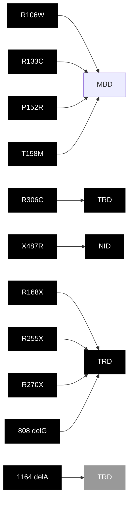

T.C.

## HACETTEPE ÜNİVERSİTESİ

## TIP FAKÜLTESİ

## ÇOCUK SAĞLIĞI VE HASTALIKLARI

## ANABİLİM DALI

# RETT SENDROMLU HASTALARIN

# KLİNİK VE MOLEKÜLER DEĞERLENDİRMESİ VE

# GENOTİP-FENOTİP KORELASYONUNUN ARAŞTIRILMASI

Dr. Pınar ZENGİN AKKUŞ

UZMANLIK TEZİ

Olarak Hazırlanmıştır.

ANKARA

2015

T.C.

## HACETTEPE ÜNİVERSİTESİ

## TIP FAKÜLTESİ

## ÇOCUK SAĞLIĞI VE HASTALIKLARI

## ANABİLİM DALI

# RETT SENDROMLU HASTALARIN

# KLİNİK VE MOLEKÜLER DEĞERLENDİRMESİ VE

# GENOTİP-FENOTİP KORELASYONUNUN ARAŞTIRILMASI

Dr. Pınar ZENGİN AKKUŞ

UZMANLIK TEZİ

TEZ DANIŞMANI

Prof. Dr. Gülen Eda UTİNE

ANKARA

2015

## TEŞEKKÜR

Tez çalışmamın her basamağında tecrübe ve bilgisini benimle paylaşan, desteğini esirgemeyen, örnek aldığım değerli tez danışmanım

Prof. Dr. Gülen Eda UTİNE' ye,

Tez çalışmam süresince desteklerini esirgemeyen,

bana yol gösteren değerli hocalarım

Prof. Dr. Göknur HALİLOĞLU, Doç. Dr. Pelin Özlem ŞİMŞEK KİPER, Prof. Dr. Mehmet ALİKAŞİFOĞLU, Prof. Dr. Koray BODUROĞLU'na

Uzmanlık eğitimim süresince bana yol gösteren değerli hocalarıma, beraber çalışmaktan mutluluk duyduğum asistan arkadaşlarına,

Hayatım boyunca desteklerini ve sevgilerini yürekten hissettiğim, kızları olmaktan gurur duyduğum

annem Melahat ZENGİN'e ve babam Yaşanur ZENGİN'e,

her zaman yanımda olan sevgili eşim Yiğit AKKUŞ'a

ve

varlığıyla hayatımı aydınlatan kızım Arya AKKUŞ'a sonsuz teşekkürlerimi sunarım.

Dr. Pınar ZENGİN AKKUŞ

Ankara, 2015

## ÖZET

Zengin Akkuş, Pınar, Rett Sendromlu Hastaların Klinik ve Moleküler Değerlendirmesi ve Genotip-Fenotip Korelasyonunun Araştırılması, Hacettepe Üniversitesi, Tıp Fakültesi, Çocuk Sağlığı ve Hastalıkları Tezi. Ankara, 2015. Rett sendromu normal gelişim basamaklarını takiben erken nörolojik regresyon ile tanınan ve kızlarda görülen nörogelişimsel bir hastalıktır. Edinilmiş bilişsel, ince ve kaba motor, sözel basamaklar ve iletişim yetileri kaybedilir, otonomik disfonksiyon ve nöbetler izlenir. MECP2 genindeki mutasyonlar sonucu oluşan Rett sendromunda tanı klinik olarak konur, ancak MECP2 mutasyonları tanıyı destekler. Bu çalışmada Rett sendromu klinik tanısı alan ve moleküler incelemeyle MECP2 mutasyonu saptanan 16 hasta değerlendirilmiştir. Hastaların ortanca yaşı 6,5 (2,5-22) bulunmuştur. Hastaların gelişimsel anormallik kuşkusuyla ilk kez bir hekim, bir çocuk nörolojisi hekimi ve bir çocuk genetik hekimi tarafından değerlendirilmesinde ortanca yaşlar sırasıyla 1,5, 1,5 ve 3 yaştır. Tanının ilk kez düşünülmesinde ortanca 2,5 yaştır. Tanıdaki gecikme ortanca 1 yıldır ve bu fark istatistiksel olarak anlamlıdır (p<0.05). Üç hastada tanıda hiç gecikme olmamıştır. Klinik tanıdaki gecikme bulguların ortaya çıkmasındaki ve klinik seyirdeki değişkenlikle ve hekimlerin ayırıcı tanı için harcadıkları zaman nedeniyle olabilir. 2002'de oluşturulan ve 2010'da yeniden düzenlenen tanı kriterlerine göre sırasıyla 7 ve 2 hasta ana kriterleri karşılamamaktadır. MBD bölgesinde missense mutasyonlar olan R106W üç, R133C, R152R ve T158M birer hastada; interdomain bölgede nonsense R168X mutasyonu üç hastada; TRD bölgesinde nonsense mutasyonlar R255X ve R270X ile missense mutasyonlar R306C ve 808delG birer hastada; C-terminalinde non-stop mutasyon X487R, çerçeve kaymasına yol açan 1164delA ve ekzon 3-4 delesyonu birer hastada bulunmuştur. Klinik şiddet göstergesi olan Pineda skoru tüm grupta 6-23 (ortanca 11), MBD mutasyonu olanlarda 9-15 (ortanca 10,5), interdomain mutasyonu olanlarda 10-17 (ortanca 12), TRD mutasyonu olanlarda 10-23 (ortanca 12,5), C-terminal mutasyonu olanlarda 6 ile 11 ve ekzon 3-4 delesyonu olan hastada 8 bulunmuş, mutasyonlara göre puanlarda istatistiksel olarak anlamlı fark bulunmamıştır (p>0,05). Genotip fenotip korelasyonu kurulması için daha fazla sayıda hastaya gereksinim vardır.

Anahtar kelimeler: Rett sendromu, MECP2, genotip-fenotip korelasyonu

## ABSTRACT

Zengin Akkuş, Pınar, Clinical and Molecular Aspects of Rett Syndrome and Evaluation of Genotype-Phenotype Correlation, Hacettepe University, Faculty of Medicine, Thesis in Pediatrics. Ankara, 2015. Rett syndrome is a neurodevelopmental disorder characterized by early neurological regression following a seemingly normal early development, which is seen almost exclusively in females. Acquired fine and gross motor functions, language and communication skills are lost, with coexisting autonomic dysfunction and seizures. Rett syndrome occurs due to mutations in MECP2 gene and is a clinical diagnosis, however, molecular testing is supportive. In this study, 16 patients who were clinically diagnosed with Rett syndrome and had MECP2 mutations have been evaluated. Median age of the patients was 6.5 years (2.5-22 years). Following the onset of regression leading to hospital admission, median ages of clinical evaluation by a physician, a pediatric neurologist and a geneticist were 1.5, 1.5 and 3 years, respectively. Median age of onset was 1.5 years and median age at clinical diagnosis was 2.5 years. The difference indicated a clinical diagnostic delay of median 1 year and was statistically significant (p<0.05). In three patients, there was no diagnostic delay. Clinical diagnostic delay may be related to variability in presentation of initial findings and clinical course in patients, as well as time spent during testing for differential diagnosis. According to consensus criteria regulated in 2002 and revised in 2010, seven and two patients did not match main criteria, respectively. In MBD region missense mutations R106W (3), R133C (1), R152R (1) and T158M (1); in interdomain region nonsense mutation R168X (3); in TRD region nonsense mutations R255X (1) and R270X (1) and missense mutations R306C (1) and 808delG (1); at C terminal non-stop mutation X487R (1), frameshift mutation 1164delA (1) and exon 3-4 deletion (1) were detected. Pineda score for clinical severity was 6-23 (median 11) in the whole group, 9-15 (median 10.5) in MBD group, 10-17 (median 12) in interdomain group, 10-23 (median 12.5) in TRD group, 6 and 11 in C terminal group and 8 in exon 3-4 deletion, the difference being statistically insignificant (p>0.05). Establishment of genotype phenotype correlation would require a larger patient group.

Keywords: Rett syndrome, MECP2, genotype-phenotype correlation

## iÇİNDEKİLER

## Sayfa

## TEŞEKKÜR ....iii

## ÖZET iv

## ABSTRACT......v

## İÇİNDEKİLER......vi

## SIMGELER VE KISALTMALAR ix

## TABLOLAR....x

## ŞEKİLLER....xi

1. GİRİŞ VE AMAÇ 1 
2. GENEL BİLGİLER....3 
2.1. Tanım 3 
2.2. Epidemiyoloji....3 
2.3. Klinik Özellikler.... 3 
2.3.1. Büyüme Geriliği 4 
2.3.2. Beslenme Sorunları 5 
2.3.3. Konuşma Yetisinin Kaybı 6 
2.3.4. Motor Hareketlerde Bozulma....6 
2.3.5. Epilepsi....7 
2.3.6. Uyku Bozukluğu....7 
2.3.7. Kardiyak ve Solunumsal Sorunlar 8 
2.3.8. İskelet ve Kas Sistemi Sorunları 9 
2.4. Tanı.... 10 
2.4.1. Klasik (Tipik) ve Atipik (Varyant) Rett Sendromu.... 10 
2.4.2. Rett Sendromu Varyantları 13 
2.4.2.1. Zapella Varyanti 13 
2.4.2.2. Hanefeld Varyanti.... 14 
2.4.2.3. Rolando Varyanti.... 15 
2.4.2.4. Forme Fruste Varyanti 15 
2.4.2.5. Geç Regresyon Varyantı.... 15 
2.5. Ayırıcı Tanı...... 16 
2.6. Klinik Yaklaşım 18

2.6.1. Öykü ve Fizik Muayene.... 18 
2.6.2. Genetik İnceleme.... 19 
2.6.3. Diğer İncelemeler 19 
2.7. Hastalığın Klinik Şiddeti ve Evrelendirmesi 20 
2.8. Genetik Temel ...... 23 
2.8.1. MECP2 Geni ve Mutasyonları 23 
2.8.2. Genotip-Fenotip Korelasyonu.... 24 
2.9. Hasta İzlemi ve Yönetimi 27 
2.9.1. Büyümenin ve Beslenmenin İzlemi.... 27 
2.9.2. Zihinsel Gelişimin Desteklenmesi 27 
2.9.3. Hareket ve Duruş Bozukluklarına Yaklaşım 28 
2.9.4. Epileptik Nöbetlerin İzlemi ve Yönetimi 29 
2.9.5. Uyku Sorunlarına Yaklaşım 30 
2.9.6. Kardiyak ve Solunumsal Sorunlara Yaklaşım 30 
2.9.7. Kas ve İskelet Sistemi Sorunlarına Yaklaşım.... 32 
2.10. Prognoz 32 
2.11. Gelecek tedaviler 32 
3. GEREÇ VE YÖNTEM.... 34 
3.1. Çalışma Planı ve Hasta Seçimi.... 34 
3.2. Çalışmanın Yürütülmesi ve Yöntem 34 
3.2.1. Periferik Kandan Genomik DNA İzolasyonu ve DNA Kalite Analizi...... 34 
3.2.2. Sanger yöntemi ile MECP2 geni DNA dizi analizi 35 
3.2.3. Multipleks Ligasyon-bağımlı Prob Amplifikasyonu (MLPA) 35 
3.3. İstatistiksel Yöntem 36 
4. BULGULAR....38 
4.1. Demografik Özellikler ve Başvuru Zamanına İlişkin Özellikler 38 
4.2. Hastaların Klinik Bulguları 39 
4.2.1. Büyüme Özellikleri 39 
4.2.2. Motor ve Mental Gelişim ve Dışlama Kriterleri 39 
4.2.3. Ana Kriterler 41 
4.2.4. Destekleyici Kriterler.... 42 
4.3. Mutasyon İncelemeleri 44 
4.4. Hastalığın Klinik Şiddeti 45

5. TARTIŞMA 46 
6. SONUÇLAR....56

KAYNAKLAR 58

EK-1: Hasta Dökümü

## SİMGELER VE KISALTMALAR

<table><tr><td>BDNF</td><td>Brain-derived neurotrophic factor; beyin kökenli nörotrofik faktör</td></tr><tr><td>DNA</td><td>Deoksiribonükleik asit</td></tr><tr><td>EDTA</td><td>Etilen diamin tetraasetik asit</td></tr><tr><td>EEG</td><td>Elektroensefalografi</td></tr><tr><td>EKG</td><td>Elektrokardiyogram</td></tr><tr><td>FISH</td><td>Fluoresan in situ hibridizasyon</td></tr><tr><td>IGF-1</td><td>Insulin-like growth factor-1; insülin benzeri büyüme faktörü-1</td></tr><tr><td>MBD</td><td>Methyl-CpG binding domain</td></tr><tr><td>MLPA</td><td>Multiplex ligation-dependent probe amplification</td></tr><tr><td>NID</td><td>Nükleer reseptör interaksiyon domain</td></tr><tr><td>PCR</td><td>Polymerase chain reaction; polimeraz zincir reaksiyonu</td></tr><tr><td>RNA</td><td>Ribonükleik asit</td></tr><tr><td>TRD</td><td>Transcriptional repression domain</td></tr></table>

## TABLOLAR

## Sayfa

Tablo 2.1 2002 Yılında Oluşturulan Rett Sendromu Tanı Kriterleri...... 11

Tablo 2.2 2010 Yılında Yeniden Düzenlenen Rett Sendromu Tanı Kriterleri...... 12

Tablo 2.3 Pineda Skorlaması....22

Tablo 3.1 Amplifikasyon Koşulları....36

Tablo 4.1 Hastaların Klinik Özelliklerine, Tanı Kriterlerine, Mutasyon Tiplerine ve Pineda Skorlarına İlişkin Bilgiler .... 40

## ŞEKİLLER

## Sayfa

Şekil 4.1 Hastaların çocuk nörolojisi ve çocuk genetik hastalıkları bölümlerine ilk başvurularındaki yaş dağılımı....38

Şekil 4.2 Ana kriterlere ilişkin yaş dağılımı 41

Şekil 4.3 Hasta grubunda bulunan mutasyonların MECP2 geninin bölgelerine göre dağılımı....44

## 1. GİRİŞ VE AMAÇ

Rett sendromu normal gelişim basamaklarını takiben erken nörolojik regresyon ile tanınan ve kızlarda görülen nörogelişimsel bir hastalıktır. Başta edinilmiş bilişsel, ince ve kaba motor, sözel basamaklar ve iletişim yetileri kaybedilir, otonomik disfonksiyon izlenir ve sıklıkla nöbetler eşlik eder. [1] Bu hastalık tüm toplumlarda benzer sıklıkta ve yaklaşık 15.000-20.000 canlı kız doğumda bir görülmektedir. [2-6] MECP2 genindeki mutasyonlar sonucu oluşan [7] Rett sendromunda tanı klinik olarak konur, ancak MECP2 mutasyonları tanıyı destekler. [8]

Rett sendromu klasik (tipik) ve atipik (varyant) olmak üzere ikiye ayrılır. Bu iki tip Rett sendromuna 2002 yılında oluşturulan ve 2010 yılında gözden geçirilen tanı kriterleriyle klinik tanı konabilmektedir. [8, 9] Ayrıca atipik (varyant) Rett sendromunun da beş ayrı türü tanımlanmıştır [10-16]. Bu tablolar klinikte birbirinden ayırt edilebilir.

Rett sendromu tanısı için MECP2 mutasyonu gösterilmesinin gerekli olmamasına ve klinik alt tipleri birbirinden ayırt edilebilir olmasına karşın, hastalığın tanı kriterlerinin görece yeni belirlenmiş ve sadece 5 yıl önce gözden geçirilmesi gereği duyulmuş olması nedeniyle hastaların başvuru yakınmalarının, klinik bulgularının ve izlemlerinin değerlendirilmesi, MECP2 geninde sorumlu mutasyonların aranması ve genetik temelinin klinikteki fenotiple ilişkilendirilmesi için yapılan çalışmalar henüz güncelliğini korumaktadır.

Sık görülen bu hastalıkta genotip ve fenotip ilişkisi üzerinde birçok çalışma yapılmış ancak genel kabul görmüş bulgulara henüz ulaşılamamıştır. Rett sendromuna yönelik moleküler incelemenin geçtiğimiz bir yıl içerisinde Hacettepe Üniversitesi Tıp Fakültesi, Çocuk Sağlığı ve Hastalıkları Anabilim Dalı, Çocuk Genetik Hastalıkları Bilim Dalı'nda olanaklı hale gelmesi nedeniyle, bu çalışmada bir referans merkezi olarak bölümümüze yönlendirilen Rett sendromlu hastaların klinik başvurularının ve seyirlerinin incelenmesi ve yeterli sayıda hastaya ulaşılabilirse genotip ve fenotip korelasyonunun araştırılması planlanmıştır.

Görece yeni tanımlanmış ve genetik temeli gösterilmiş olan bu hastalıkta başvuru bulgularının çocukluk çağının başka hastalıklarıyla da örtüşmesi nedeniyle çocuk hekimlerinin hastalığı tanıması ve tanı kriterlerine aşina olmalarının da bu tür çalışmalar aracılığıyla artırılabileceği düşünülebilir. Hastalık hakkındaki farkındalığın artması hastaların daha hızlı tanı almalarını ve gereksiz tanısal tetkiklerden kaçınılmasını sağlayacaktır. Ayrıca erken dönemde tanı verilmesi, hastalığa bağlı sorunlara ve komplikasyonlara uygun şekilde multidisipliner yaklaşımın sağlanmasıında önemli olacaktır.

## 2. GENEL BİLGİLER

## 2.1. Tanım

Rett sendromu kızlarda görülen nörogelişimsel yetersizliğin en önemli nedenlerindendir. Bilişsel, sözel, ince ve kaba motor yetilerle iletişimin kaybı, otonomik disfonksiyon ve sıklıkla nöbetlerin de eşlik ettiği erken nörolojik regresyon ile karakterize genetik bir hastalıktır.

Avusturyalı bir pediatrist olan Dr. Andreas Rett, bekleme salonunda benzer tuhaf hareketler sergileyen iki kız hastayı gözlemledikten sonra, 1966 yılında Rett sendromunu tanımlamıştır. [17]

## 2.2. Epidemiyoloji

Rett sendromu tüm etnik gruplarda ve büyük çoğunlukla kızlarda görülen bir hastalıktır. Tüm etnik gruplarda benzer oranlarda görülür. [6, 18]

Texas Rett sendromu veritabanı tüm dünyadaki vakaların ve potansiyel vakaların en geniş toplum bazlı veritabanıdır. Bu veritabanına göre 2 ile 18 yaş arasındaki kızlarda Rett sendromu prevalansına yönelik en yakın tahmin 22.800'de birdir. (0,44/10.000) [18] Fransa'da yapılan 424 kadın vakanın incelendiği büyük bir epidemiyolojik çalışmada prevalans 10.000 kızda 0,578 vaka olarak tahmin edilmiştir ve bu sıklık diğer Avrupa epidemiyoloji çalışmaları ile uyumlu olarak bulunmuştur. [2] Bundan daha önceki diğer çalışmalarda prevalans Hagberg tarafından Güneybatı İsveç'te 10.000 kızda 0,65, Kerr ve Stephenson tarafından Batı İskoçya'da 0,67, Talvik ve arkadaşları tarafından Estonya'da 0,67 olarak saptanmıştır. [3, 4]

Avrupa dışında da benzer sıklıklar bildirilmiş, örneğin Avustralya'da prevalans 10.000 kızda 0,72 olarak saptanmıştır. [5] Japonya'da da, farklı bölgelerde farklı bildirilmekle birlikte, prevalans 0,5-0,67/10.000 aralığındadır. [6]

## 2.3. Klinik Özellikler

Rett sendromlu hastalar genellikle sorunsuz bir gebelik sonrasında zamanında doğar. Genellikle ilk altı ayda gelişim normaldir. Gelişim problemleri ve baş çevresi persentil tablosunda düşme altıncı aydan sonra başlar. Normal gelişim basamakları klasik Rett sendromu için önemli kriterlerden olmasına rağmen, bazı araştırmacılaragöre, doğumdan hemen sonra bazı gelişim bozuklukları saptanabilir. [8, 19]

Einspieler ve arkadaşlarının yaptığı bir çalışmada, dikkatli bir inceleme ile, Rett sendromlu hastalarda hayatın ilk ayında anormal vücut hareketleri (%100), dil protrüzyonu (%62), postural katılık (%58), asimetrik göz açıp kapama hareketleri (%56), anormal parmak hareketleri (%52), el stereotipileri (%42), anormal yüz ifadesi atakları (%42), tuhaf gülümseme (%32), tremor (%28) ve stereotipik vücut hareketleri (%15) saptanmıştır. [19]

Baş çevresi persentilinde düşme ilk 2-3 ayda ortaya çıkabilir ve genellikle ilk bulgu olması nedeniyle 2002 yılında tanı kriteri olarak kabul edilmiştir. Ancak hastaların hepsinde görülmemesi nedeniyle daha sonra tanı kriterlerinden çıkarılmıştır. [8]

Genellikle 12-18 aydan sonra hastalar konuşma yetisini ve amaçlı el hareketlerini kaybeder. Ayrıca stereotipik el hareketleri ve duruş anormallikleri, epileptik nöbetler, otistik davranışlar, beslenme ve uyku düzeninde bozulmalar, aralıklı solunum anormallikleri ortaya çıkmaya başlar. [1, 20]

## 2.3.1. Büyüme Geriliği

Tarquinio ve arkadaşlarının yaptığı bir çalışmada, Rett sendromlu hastalarda karakteristik olarak baş çevresi persentilinde erken dönemde düşme, takiben boy ve vücut ağırlığı persentilinde düşme gözlenir. Baş çevresi persentilinde erken dönemde düşme, tanı için artık gerekli olmamakla beraber, Rett sendromunun en erken göstergelerinden birisi olabilmektedir. [21]

Tarquinio ve arkadaşlarının, 726'sı Klasik Rett sendromu, 90'ı atipik Rett sendromu tanısı alan 816 Rett sendromlu kız hastayı kapsayan bu çalışmalarında, baş çevresi ortalamasının ilk ayda normal popülasyon ortalamasının altına düştüğü, iki yaşına gelindiğinde ise -2 standart sapmanın altına düştüğü gözlenmiştir. Ortalama vücut ağırlığının ise 13 ayda normal popülasyon ortalamasının altına, 12,5 yaşında ise -2 standart sapmanın altına düştüğü ve ortalama boyun 17 ayda normal popülasyon ortalamasının altına, 12 yaşta ise -2 standart sapmanın altına düştüğü saptanmıştır. Bununla beraber hastalarda boy dağılımı değişken bulunmuştur ve hastaların %8'inde boy 98 persentilin üzerinde saptanmıştır. [21] Hastalarda ergenlik döneminde boy uzaması ve kilo alımı olduğu görülmüştür. Büyüme geriliğinin şiddeti ile hastalık şiddeti ilişkili olarak bulunmuştur. [21]

Çalışmada ayrıca tipik Rett sendromu olan hastaların %33'ünde mikrosefaliye eşlik eden ağır büyüme geriliği olduğu, %30'unda büyüme geriliğinin eşlik etmediği mikrosefali, %19'unda mikrosefaliye eşlik eden orta derece büyüme geriliği, %14'ünde normal büyüme ve normal baş çevresi, %3'ünde ise normal baş çevresiyle beraber orta derece büyüme geriliği bulunduğu saptanmıştır. Atipik Rett sendromlu hastalarda, tipik Rett sendromlu hastalara göre büyüme daha yüksek oranda normal bulunmuştur. [21]

Rett sendromlu hastalarda ayrıca el ve ayakların da normalden küçük olduğu bildirilmiştir. Schultz ve arkadaşlarının yaptığı bir çalışmada Rett sendromlu hastalarda normal kızlara göre, el ve ayakların büyüme hızının daha yavaş olduğu ve boy yaşına göre de bakıldığında, el ve ayakların daha küçük olduğu gösterilmiştir. Boy ve ayak boyundaki büyüme geriliği, el boyundaki büyüme geriliğine göre daha belirgindir. [22]

## 2.3.2. Beslenme Sorunları

Rett sendromundaki büyüme geriliğinden büyük ölçüde beslenme sorunları sorumlu tutulmaktadır. Gastrointestinal motilite bozuklukları ve beslenme problemleri Rett sendromlu hastalarda sıklıkla görülür. Motil ve arkadaşlarına göre kabızlık, gastroözefageal reflü, kusma, yutma güçlüüğü hastaların yarısından fazlasında görülürken, kolelitiazis, biliyer diskinezi gibi safra yolları hastalıkları nadiren görülür. Alım azlığı ve enerji harcamasındaki artış nedeniyle multivitamin ve mineral desteklerine, kalori açısından destekleyici mamalara hastaların yarısından fazlası ihtiyaç duyarken, bir kısım hastada ise gastrostomi ile beslenme gereksinimi ortaya çıkar. [23]

Motil ve arkadaşlarının yaptığı bir çalışmada dokuz Rett sendromlu hasta, yedi sağlıklı kontrol ile karşılaştırılmış ve Rett sendromlu hastalarda uyku esnasında metabolik hız %23 daha düşük olarak bulunurken, uyanırken metabolik hızda farklılık saptanmamıştır. Hastalar ve kontroller karşılaştırıldığında besin alımı ve dışkıdaki yağ atılımı arasında fark saptanmamıştır. Buna karşın kontrol grubunda yağsız vücut kitlesi için gereken günlük enerji 58 +/- 22 kcal/kg iken Rett sendromlu hastalarda 55 +/- 43 kcal/kg olarak saptanmıştır. Motil ve arkadaşlarına göre enerji gereksinimindeki bu farklılık, istemsiz motor hareketlerin fazlâlığına bağlı olabilir ve büyüme geriliğini açıklamada yeterli olabilir. [24]

## 2.3.3. Konuşma Yetisinin Kaybı

Rett sendromlu hastalarda konuşma yetisi çoğunlukla kaybedilmektedir. Genellikle ilk evrede konuşma yetisi yalnızca birkaç kelime ile sınırlı kalır, ancak sonraki evrelerde iletişim sadece yüz ifadeleri ya da vücut dili ile sağlanmaya çalışılır. [25]

Woodyatt ve Ozanne yaptıkları bir incelemede tüm hastaların konuşma yetilerini kaybettiklerini, ancak iletişim kurmak amacıyla ses çıkarma, yüz ifadeleri, dokunma ve göz dikme davranışı şeklinde davranışlar sergilediklerini, ancak yaşı daha ileri olan hastalarda ise iletişim becerilerinin küçük yaştaki hastalara göre daha iyi olmadığını ortaya koymuştur. [26]

Rett sendromlu 2-36 yaş arası 41 hastanın incelendiği ve toplam sekiz çalışmadan oluşan bir derlemenin sonuçlarına göre, hastalarda iletişim amacıyla göz dikme, vücut hareketleri, el çarpma, uzanma, cisimleri atma, öfke nöbetleri şeklinde bazı davranışlar gelişmektedir. Ancak iletişim yöntemlerini ölçmek için kullanılabilecek yeterli ve uygun araçlar olmaması nedeniyle bu derlemenin sonuçlarını klinikte net olarak anlamlandırmak mümkün değildir. [27]

## 2.3.4. Motor Hareketlerde Bozulma

El çarpma, ovalama, ovuşturma, yıkama, vurma, parmaklarını bükme, sıkma, elleri ağza götürme şeklinde stereotipik el hareketleri Rett sendromlu hastalarda sıklıkla görülmektedir. Özellikle orta hattaki el hareketleri bu hastalığın karakteristik bulgularındandır. Ekstrapiramidal hareket ve duruş bozuklukları neredeyse her hastada görülmektedir. Geniş tabanlı yürüme, apraksi ve ataksi sıktır. [28]

FitzGerald ve arkadaşlarının serisinde, stereotipik hareketler ve duruş bozuklukları hastaların tamamında, bruksizm ise %97'sinde görülmüştür. Salya akıtma, okülojirik krizler, mimiklerde azalma, distoni, rijidite ve hareketlerde yavaşlama da bu seride saptanan diğer bulgulardandır. [28]

## 2.3.5. Epilepsi

Rett sendromlu hastaların çoğunda epileptik nöbetler gözlenir. [29] Bu nöbetler hastanın ve bakım veren kişinin hayat kalitesini olumsuz yönde etkiler.

Glaze ve arkadaşlarının yaptığı bir çalışmada, yaşları 8 ay ve 64 yaş arasında değişen 528 Rett sendromlu hasta incelenmiştir. Bu çalışmada hastaların %60'ında aile tarafından bildirilen nöbet öyküsü vardır ve bu sıklık tipik ve atipik Rett sendromu için benzerdir. Nöbetler genellikle iki yaşından sonra başlamaktadır ve prevalans yaşla artmaktadır. Beş yaşa kadar oran %33 iken, 30 yaş üzerinde bu oran %86'ya kadar yükselmektedir. Ancak 30 yaşından sonra bu oranda artış saptanmamıştır, bu durum da Rett sendromlu erişkinlerde geç başlangıçlı nöbetlerin sık olmadığını düşündürmektedir. [30] Aynı çalışmada hastaların nöbet sıklığı incelendiğinde, son altı ayda nöbetsiz izlenme %36, aylık nöbetler %27, haftalık nöbetler %20 ve günlük nöbetler %11 oranında bulunmuştur. [30]

Literatürde Rett sendromlu hastalarda nöbet prevalansının %94 gibi çok daha yüksek saptandığı çalışmalar da vardır. [31] Nöbet tiplerinin incelendiği bir çalışmada hastalarda absans ve klonik nöbetler dışında tüm nöbet tipleri gözlenmiştir ve en sık kompleks parsiyel, tonik klonik, tonik ve myoklonik nöbetlere rastlanmıştır. Hastaların yarısında dirençli nöbetler gözlenmiştir. [31]

Epileptik nöbetler hastalarda sıklıkla görülen stereotipik hareketlerle karışabilir ve tanınamayabilir. Epileptik nöbetlerin epileptik olmayan davranışsal hareketlerden ayrımını yapabilmek için EEG önemli bir araçtır. Rett sendromlu hastalarda nöbetler sıklıkla görülmesine rağmen EEG bulguları hakkında çok az bilgiye ulaşılabilmektedir. Epileptik nöbetlerin tedavisinde geniş spektrumlu antikonvülsanlar kullanılabilir. Dirençli vakalarda ise ketojenik diyet, vagal sinir stimulasyonu gibi yöntemler denebilir. [29]

## 2.3.6. Uyku Bozukluğu

Rett sendromlu hastaların çoğunda uyku bozuklukları görülür. Periyodik gece uyanmaları, gece ağlama, gülme ve çığlık atma atakları, uyku süresinde kısalık ve uyku düzensizliği sıkça görülür. Gece uykusunun yetersiz olması nedeniyle gündüz uykulu olma hali görülür.

Young ve arkadaşlarına göre, uyku bozuklukları yaşla ve mutasyon tipiyle değişim gösterebilir. Yaş ilerledikçe gece uykudan uyanma sıklığının ve uyku problemlerinin şiddetinin azaldığı, ancak gece gülmelerinin ve gündüz uykularının arttığı belirtilmiştir. [32]

## 2.3.7. Kardiyak ve Solunumsal Sorunlar

Rett sendromlu hastalarda özellikle heyecanlanma ya da ajitasyon sırasında hiperventilasyon atakları sıklıkla görülür. Bu ataklara stereotipik hareketler de eşlik edebilir. Uyanıklık sırasında apne meydana gelebilir. Apne izole ya da hiperventilasyon öncesinde ya da hiperventilasyonu takiben ortaya çıkabilir. Apne atakları sırasında, ağır siyanoza rağmen hastalarda stres belirtisi gözükmeyebilir.

Marcus ve arkadaşlarının yaptığı bir çalışmaya göre, bu tarz solunumsal problemler uyku sırasında görülmemektedir. Rett sendromlu hastalarda, beyin sapının solunum kontrolünün normal olduğu ancak uyanıklık sırasındaki solunum problemlerinin korteksin ventilasyon üzerindeki etkisinden kaynaklandığı iddia edilmiştir. [33]

Normal kardiyorespiratuvar yanıtlar düzgün bir nörofizyoloji ile olmaktadır. Rett sendromlu hastalarda asıl patofizyoloji karbondioksit atılımının kontrolündeki bozukluktur. Bu da solunumsal alkaloz ya da asidoza yol açmaktadır. Üç farklı solunum fenotipi vardır. İlk fenotip, parsiyel karbondioksit basıncı sabit düşük olan ve kronik solunumsal alkalozu olan zorlu solunum yapanlardır. İkinci fenotip, parsiyel karbondioksit basıncı sabit yüksek olan ve kronik solunumsal asidozu olan zayıf solunum yapanlardır. Üçüncü tip ise apnöstik solunum yapanlardır. Bu hastalarda geç ve yetersiz karbondioksit atılımı vardır. [34]

Valsalva manevrası tüm fenotipleri etkileyebilen, klinik durumun bozulmasına yol açabilen ve epileptik nöbetlerle karışabilen bir durumdur. Otonomik beyin sapı fonksiyonlarının güçlü şekilde uyarılmasından kaynaklanır. [34]

Parasempatik sistemin zayıf gelişimi nedeniyle, sempatik sistem baskındır bu durum da benzersiz bir sempatovagal dengesizliğe yol açar. Beyin sapındaki bütünleştirici inhibisyonların eksikliği nedeniyle anormal solunum sırasında uygun kardiyovasküler düzenleme yapılamaz ve bu durum da artmış kardiyovasküler olaylara yol açar. [34-36]

Rohdin ve arkadaşlarının yaptığı bir çalışmada ise, kardiyorespiratuvar anormalliklerin uyanıklık sırasında olduğu kadar uyku sırasında da olduğu saptanmıştır. Tüm hastalarda solunumsal bozukluk gösterilmekle beraber, hastaların çoğunluğunda da kalp ritm anormallikleri saptanmıştır. Uyku sırasında da ortaya çıkan bu anormallikler olası beyin sapı mekanizmaları ve otonomik disfonksiyon ile ilişkilendirilmiştir. [37]

Rett sendromlu hastalarda ani ölüm sıklığı, genel popülasyona oranla daha fazladır ve kardiyak elektriksel aktivitenin stabil olmaması bu konuda en çok suçlanan etmendir. Guideri ve arkadaşlarına göre, aynı yaştaki sağlıklı kız hastalarla karşılaştırıldıklarında, Rett sendromlu hastalarda kalp hızındaki değişkenlik azalmıştır ve elektrokardiyografide (EKG) düzeltilmiş QT aralıkları daha uzun olarak bulunmuştur. Hastalığın evresi ilerledikçe bu anormallikler de artmaktadır. Kardiyak disfonksiyona yol açan bu durumlar Rett sendromlu hastalarda ani ölümle ilişkili olabilir. [38]

Ellaway ve arkadaşları yaptıkları bir çalışmada, Rett sendromlu hastalarda kontrol grubuna göre QT aralığını belirgin derecede uzun bulmuştur ancak QT aralığındaki uzama ile hastalığın şiddeti arasında bir ilişki saptayamamıştır. [39]

Rett sendromlu hastaların yarısından fazlasında otonomik disfonksiyon ve artmış sempatik tonus görülür. Soğuk, mor el ve ayaklar bu durumun göstergesidir. [40]

## 2.3.8. İskelet ve Kas Sistemi Sorunları

Rett sendromlu hastalarda el ve ayakların normalden küçük olduğu bildirilmiştir. Ayak boyundaki büyüme geriliği, el boyundaki büyüme geriliğine göre de daha belirgindir. [22] Bundan başka, literatürde 17 Rett sendromlu hastanın radyolojik bulgularının incelendiği bir çalışmada, hastaların %65'inde kısa dördüncü veya beşinci metatarsal kemikler, %57'sinde kısa dördüncü veya beşinci metakarpal kemik ve %86'sında azalmış kemik dansitesi saptanmıştır.[41]

Skolyoz Rett sendromlu hastalarda sıkça görülmektedir ve kronik aksiyal distoninin olası bir komplikasyonu olarak düşünülmektedir. Ager ve arkadaşlarının yaptığı bir çalışmaya göre skolyoz başlangıcı için ortanca yaş 9,8 olarak saptanmıştır ve skolyoz gelişim riski yaşla beraber artmaktadır. Altı yaşta hastaların %25'inde skolyoz gelişmişken, 13 yaşa gelindiğinde bu oran %75'e yükselmektedir. [42]

Rett sendromlu hastalarda, kemik kırıkları riski topluma göre neredeyse dört kat daha fazladır. Bu durum literatürde osteopeni, ağır kliniğe yol açan mutasyonların varlığı ve antiepileptik ilaçların kullanımı ile ilişkilendirilmiştir. [43] Rett sendromunda kemik mineral dansitesinin düşük olduğu ve bunun başlıca belirleyicilerinin beslenmenin bozulmasına ve bedensel hareketliliğin azalmasına yol açan sorunlar olduğu düşünülmektedir. (Smeets E, yayınlanmamış sözel bilgi)

## 2.4. Tanı

Rett sendromu tanısı klinik bir tanıdır. Rett sendromu klasik (tipik) ve atipik (varyant) olmak üzere ikiye ayrılır ve iki durum klinikte ayırt edilir. MECP2 geninde mutasyon gösterilmesi ise tanıda destekleyici olabilir. Rett sendromu tanısı koymak için MECP2 geninde mutasyon gösterilmesi gerekli olmadığı gibi yeterli de değildir.

## 2.4.1. Klasik (Tipik) ve Atipik (Varyant) Rett Sendromu

Rett sendromu tanısının klinik bir tanı olması nedeniyle 2002 yılında Rett sendromu tanı kriterleri tekrar oluşturulmuştur. [9] Bu kriterler Tablo 2.1'de gösterilmiştir.

2002 yılı kriterlerinde, tipik Rett sendromu tanısı koyabilmek için gerekli kriterler belirlenmiştir. Kesinlikle olması gereken sekiz kriter, beş dışlama kriteri ve sekiz destekleyici kriter yer almaktadır. Kesinlikle olması gereken kriterler, normal prenatal ve perinatal öykü, hayatın ilk altı ayında genellikle normal psikomotor gelişim ya da doğumdan itibaren psikomotor gelişimde gecikme, doğumda normal baş çevresi, postnatal mikrosefali, amaçlı el hareketlerinin 6 ay-2,5 yaş arasında kaybı, elleri kívırma, sıkma, birbirine vurma, alkışlama, elleri ağza sokma, ovma şeklinde stereotipik el hareketleri, sosyal geri çekilme, iletişim bozukluğu, öğrenilmiş kelimelerin kaybı ve bilişsel geriliğin ortaya çıkması, hareket kabiliyetinin bozulması (dispraksi) ya da kaybı şeklindedir.

Sekiz destekleyici kriter ise, uyanıkken solunum anormallikleri (hiperventilasyon, nefes tutma, zorlu hava ya da tükürük çıkışı, hava yutma), diş gıcırdatma, erken bebeklik döneminden itibaren bozuk uyku düzeni, kas yıkımı ve distoni ile ilişkili anormal kas tonusu, periferik vazomotor bozukluklar, çocuklukta ilerleyen skolyoz/kifoz, büyüme geriliği, hipotrofik küçük ve soğuk ayaklar, küçük ve ince ellerdir.

Tablo 2.1 2002 Yılında Oluşturulan Rett Sendromu Tanı Kriterleri [9]

## Kesinlikle olması gereken kriterler

1. Normal prenatal ve perinatal öykü 
2. Hayatın ilk altı ayında genellikle normal psikomotor gelişim ya da doğumdan itibaren psikomotor gelişimde gecikme 
3. Doğumda normal baş çevresi 
4. Postnatal mikrosefali 
5. Amaçlı el hareketlerinin 6 ay-2,5 yaş arasında kaybı 
6. Elleri kívırma, sıkma, birbirine vurma, alkışlama, elleri ağza sokma, ovma şeklinde stereotipik el hareketleri 
7. Sosyal geri çekilme, iletişim bozukluğu, öğrenilmiş kelimelerin kaybı ve bilişsel geriliğin ortaya çıkması 
8. Hareket kabiliyetinin bozulması (dispraksi) ya da kaybı

## Destekleyici kriterler

1. Uyanıkken solunum anormallikleri (hiperventilasyon, nefes tutma, zorlu hava ya da tükürük çıkışı, hava yutma) 
2. Diş gıcırdatma 
3. Erken bebeklik döneminden itibaren bozuk uyku düzeni 
4. Kas yıkımı ve distoni ile ilişkili anormal kas tonusu 
5. Periferik vazomotor bozukluklar 
6. Çocuklukta ilerleyen skolyoz/kifoz 
7. Büyüme geriliği 
8. Hipotrofik küçük ve soğuk ayaklar, küçük ve ince eller

## Dışlama kriterleri

1. Organomegali ya da depo hastalığının diğer bulguları 
2. Retinopati, optik atrofi ya da katarakt 
3. Perinatal ya da postnatal beyin hasarı kanıtı 
4. Metabolik ya da ilerleyici nörolojik hastalık varlığı 
5. Ağır enfeksiyon ya da kafa travmasına bağlı kazanılmış nörolojik hastalıklar

## Tablo 2.2 2010 Yılında Yeniden Düzenlenen Rett Sendromu Tanı Kriterleri [8]

## Rett sendromu Tanı Kriterleri 2010

Baş çevresi büyümesinde postnatal azalma olursa Rett sendromu tanısı düşünülmelidir.

## Tipik (Klasik) Rett sendromu için gereken kriterler

1. Regresyon dönemini takiben ortaya çıkan iyileşme dönemi ya da durağan dönem 
2. Tüm ana kriterlerin sağlanması ve dışlayıcı kriterlerden hiçbirinin olmaması 
3. Tipik Rett sendromunda çoğunlukla bulunmasına rağmen destekleyici kriterlerin varlığı gerekli olmaması

## Atipik (Varyant) Rett sendromu için gereken kriterler

1. Regresyon dönemini takiben ortaya çıkan iyileşme dönemi ya da durağan dönem 
2. Dört ana kriterden en az ikisinin varlığı 
3. On bir destekleyici kriterden beşinin varlığı

## Ana kriterler

1. Amaçlı el hareketlerinin kısmen ya da tamamen kaybı 
2. Kazanılmış konuşma/kelimelerin kısmı ya da tamamen kaybı 
3. Duruş anormallikleri: Bozulma (dispraksi) ya da kaybetme 
4. Stereotipik el hareketleri (elleri kívırma, sıkma, birbirine vurma, alkışlama, elleri ağza sokma, ovma şeklinde otomatizmalar

## Tipik (Klasik) Rett sendromu için dışlama kriterleri

1. Travmaya (perinatal ya da postnatal) sekonder beyin hasarı, nörometabolik hastalıklar, nörolojik problemlere yol açacak ağır enfeksiyonlar 
2. Hayatın ilk altı ayında ağır şekilde anormal psikomotor gelişme

## Atipik (Varyant) Rett sendromu için destekleyici kriterler

1. Uyanıkken solunum anormallikleri 
2. Uyanıkken diş gıcırdatma 
3. Bozuk uyku düzeni 
4. Anormal kas tonusu 
5. Periferik vazomotor bozukluklar 
6. Skolyoz/kifoz 
7. Büyüme geriliği 
8. Küçük, soğuk el ve ayaklar 
9. Uygunsuz gülme/çığlık atma atakları 
10. Ağrıya azalmış cevap 
11. Yoğun göz teması - 'göz dikme davranışı'

Dışlama kriterleri ise organomegali ya da depo hastalığının diğer bulguları, retinopati, optik atrofi ya da katarakt, perinatal ya da postnatal beyin hasarı kanıtı, metabolik ya da ilerleyici nörolojik hastalık varlığı, ağır enfeksiyon ya da kafa travmasına bağlı kazanılmış nörolojik hastalıklardır. [9]

Hastalığın kliniğinin daha iyi anlaşılması ile kriterler 2010 yılında Neul ve arkadaşları tarafından gözden geçirilmiştir. [8] Yeniden düzenlenen bu kriterler Tablo 2.2'de gösterilmiştir.

Bu tanı kriterlerine göre klasik Rett sendromu diyebilmek için, bir regresyon dönemini izleyen ve durağan bir dönemi bulunan hastalarda kesinlikle bulunması gereken dört ana kriter belirlenmiştir. Bu kriterler amaçlı el hareketlerinin kaybı, konuşma yetisinin kaybı, duruş anormallikleri ve el stereotipileridir.

Klasik tipte hastaların gerekli tüm kriterleri karşılaması, dışlama kriterlerinden de hiçbirine sahip olmaması gerekmektedir. [8] Dışlama kriterleri ise hayatın ilk altı ayında anormal psikomotor gelişme ve nörolojik problemlere yol açan perinatal ya da postnatal travma, nörometabolik hastalıklar ya da ağır enfeksiyonların varlığıdır. [8]

Atipik ya da varyant Rett sendromunda ise tanıda regresyon dönemini izleyen durağan bir dönem öyküsü ile beraber iki ana kriterin varlığı ve 11 destekleyici kriterden beşinin varlığı gerekmektedir. Uyanıklık sırasında bruksizm, bozuk uyku düzeni, anormal kas tonusu, periferik vazomotor bozukluklar, kifoz ya da skolyoz, küçük ve soğuk el ve ayaklar, uygunsuz Gülme, bağırma atakları, ağıra duyarlılığın azalması, yoğun göz teması, göz dikme davranışı destekleyici kriterlerdir. [8]

## 2.4.2. Rett Sendromu Varyantları

Rett sendromunun bazı varyant formları da tanımlanmıştır. Bunlar konuşmanın korunduğu tip (Zapella varyant), erken başlangıçlı nöbet görülen tip (Hanefeld varyant), konjenital tip (Rolando varyant), Forme fruste varyant ve geç regresyon varyant olarak bilinen beş tiptir.

## 2.4.2.1. Zapella Varyanti

De Bona ve arkadaşları 2000 yılında, klasik Rett sendromu ile benzer özellikler gösteren ancak konuşmanın ve amaçlı el kullanımının daha iyi korunduğu, genellikle büyüme geriliği, ilerleyici skolyoz ve epilepsinin görülmediği konuşmanın korunduğu tipteki Rett sendromunu tanımlamışlardır. [10] Zapella ve arkadaşları 2001 yılında konuşmanın korunduğu tipteki 18 hastanın klinik özelliklerini ve mutasyon analizi sonuçlarını yayınlamışlardır. Bu çalışmada hastaların %55'inde MECP2 mutasyonu saptanmıştır. Hastaların hepsinde, sözel ve motor becerilerde yavaş düzelme, otistik davranışlar vardır ve baş çevresi normaldir. Bu seride altı hasta fazla kilolu bulunmuştur, ayrıca kifoz ve kaba yüz görünümleri vardır ve cümle kurma becerileri korunmuştur. Ayrıca dört hastanın büyümesi normal bulunmuştur ve konuşmaları birkaç kelime ve iki kelimelik cümleler şeklinde korunmuştur. Hastalığın gidişatı klasik Rett sendromunun evrelerine uygun olarak bulunmuştur. Bazı stereotipik el hareketlerinin hayatın ilk yıllarında görüldüğü ancak sonradan kaybolduğu saptanmıştır. [44] Zapella varyantı olan hastalarda genel olarak, mikrosefalinin daha nadir, regresyonun daha geç başlangışı, el kullanımının daha iyi olduğu, konuşmanın daha iyi korunduğu ancak otistik bulguların olduğu ve obeziteye eğilim görüldüğü saptanmıştır. Bu nedenle bu hastalık Rett sendromunun hafif formu olarak düşünülmüştür. [45]

## 2.4.2.2. Hanefeld Varyanti

Hanefeld 1985 yılında erken dönemde başlayan böbetlerin görüldüğü hastalar tanımlamıştır. [11] Bu sebeple erken başlangıçlı nöbet görülen bu tip Hanefeld varyant olarak adlandırılmıştır. İki-dört ay arasında başlayan hipsaritmi ile seyreden ve daha sonra daha silik bir Rett sendromu profili sergileyen bu varyant CDKL5 (STK9) mutasyonları ile ilişkili bulunmuştur. [46] CDKL5 mutasyonu ayrıca erken başlangıçlı epilepsi ve ağır zihinsel yetersizlikle ve West sendromu ile ilişkilendirilmiştir. Artuso ve arkadaşları yaptıkları bir çalışmada, CDKL5 mutasyonu saptanan, 10 gün ile üç ay arası epileptik nöbetlerin başladığı, antiepileptik tedaviye dirençli nöbetlerin ve aynı hastada birçok çeşit nöbetin gözlendiği, psikomotor gelişimin ağır şekilde bozulduğu, stereotipik el hareketlerinin görüldüğü, baş çevresi persentilinin doğumda ve izlemde genellikle normal olduğu hastaları değerlendirmişler ve erken başlangıçlı nöbet görülen tip olarak tanımlamışlardır. [47]

CDKL5 mutasyonu infantil spazm ve Rett sendromu benzeri fenotip ile ilişkili kabul edilmektedir. CDKL5 ilişkili hastalıklarda erken başlangıçlı ağır ve dirençli epilepsi, ağır hipotoni, ensefalopati, Rett sendromundakine benzer şekilde baş çevresi persentilinde düşme, stereotipik el hareketleri, amaçlı el hareketlerinin kaybı görülebilir. [48]

## 2.4.2.3. Rolando Varyanti

Konjenital tip (Rolando varyantı) FOXG1 genindeki mutasyonlardan kaynaklanır ve ilk 6 ayda hipotoni gibi bazı bulguların ortaya çıkması ile karakterizedir. [12, 13] Mencarelli ve arkadaşlarının yaptığı bir çalışmada FOXG1 mutasyonu saptanan hastaların hepsinde yenidoğan döneminde hipotoni, irritabilite, ağır postnatal mikrosefali, motor yetilerin ve amaçlı el hareketlerinin kaybı ve stereotipik el hareketleri olduğu ancak klasik Rett sendromundan farklı olarak göz temasının kısıtlı olduğu gözlenmiştir. [49]

## 2.4.2.4. Forme Fruste Varyanti

Hagberg ve Rasmussen 20 aylikken regresyonu başlayan, el stereotipileri geliştiren ancak amaçlı el kullanımını kaybetmeyen ve dört yaşından sonra iletişim yetilerinde artış görülen 17 yaşında bir kız hastayı ‘forme fruste’ varyant olarak tanımlamışlardır. [14] Forme fruste varyantında regresyon genellikle 1-3 yaş arasında ortaya çıkmaktadır. Amaçlı el kullanımı korunmuştur ve el stereotipileri farklı olabilmektedir ya da hiç gözlenmeyebilmektedir. Hastalar aylar yıllar sonra bazı kelimeleri ve konuşma yetisini kısmen tekrar kazanabilmektedir. Tipik Rett sendromu ile karşılaştırıldığında bulgular daha geç başlamaktadır ve daha hafif bir form olarak kabul edilmektedir. [14, 50, 51]

## 2.4.2.5. Geç Regresyon Varyantı

Motor ve dil alanındaki regresyonun daha geç görüldüğü tip olarak tanımlanır. Bu tipte regresyon okul öncesi ya da erken okul döneminde (4-10 yaş) başlar. Baş çevresi çoğunlukla normal sınırlar içerisindedir. [15, 16] Geç başlangıçlı olması nedeniyle tanıda zorluklara yol açabilmektedir.

## 2.5. Ayırıcı Tanı

Rett sendromunu kinik bir tanıdır. Bazı karakteristik klinik bulguları vardır. Ancak özellikle regresyonun yeni başladığı dönemde başvuran hastalarda ya da regresyon öyküsünün net olarak alınamadığı hastalarda tanı gecikebilir.

Öncelikle doğumsal metabolik hastalıklar, hipoksi, iskemi ya da travmaya bağlı beyin hasarı olmadığı gösterilmelidir. Normal gelişimi takiben regresyon ve sonrasında ağır zihinsel yetersizlik ve fiziksel engellilik gelişmesi halinde infantil spazm gibi epileptik sendromlar, metabolik hastalıklar, mitokondriyal hastalıklar, lizozomal depo hastalıkları, ataksik serebral palsi, ensefalit, Angelman sendromu, otizm, işitme kaybı, çocukluk psikozu düşünülmelidir. [52] Rett sendromu nörogelişimsel bir hastalıktır ve nörodejeneratif hastalıklardan ayrımı yapılmalıdır.

Postnatal mikrosefali, nöbetler, hipotoni, uyku bozukluğu, uygunsuz gülme atakları, elleri ağza götürme, konuşmanın olmaması zihinsel yetersizlik görülmesi nedeniyle Angelman sendromu ayırıcı tanıda akla gelmelidir. Angelman sendromunda regresyonun, stereotipik el hareketlerinin ve solunum anormalliklerinin olmaması, bazı atipik yüz bulguları ve sürekli mutlu yüz ifadesi olması nedeniyle Rett sendromundan ayrımı klinikte yapılabilmektedir. [53]

MECP2 duplikasyon sendromu regresyon, ağır zihinsel yetersizlik, infantil hipotoni, ataksik duruş ve yürüme yetisinin kaybı, stereotipik el hareketleri, nöbetler ile karakterize bir hastalıktır. Tekrarlayıcı pnömoni, otitis media, baş çevresinin normal olması ve erkeklerde görülmesi ile Rett sendromundan ayrılır. [54]

Pitt-Hopkins sendromu 18. kromozomun uzun kolunda TCF4 mutasyonu sonucu meydana gelmektedir. [55] Bu hastalarda özellikle ifade edici dilin tamamen ya da kısmen olmadığı zihinsel yetersizlik, hiperventilasyon/apne atakları gibi solunum anormallikleri, baş sallama, çevirme şeklinde stereotipik baş hareketleri, epileptik nöbetler, duruş anormallikleri ve ataksik yürüyüş görülmesi nedeniyle Rett sendromunun ayırıcı tanısında düşünülmesi gereken bir sendromdur. Derin yerleşimli gözler, belirgin çene yapısı, geniş aralıklı diş yapısı, kulak heliksinde anormallikler gibi atipik yüz görünümü, hafif el anormallikleri, yüksek dereceli miyopi ya da strabismus varlığıyla ve regresyonun eşlik etmemesiyle Rett sendromundan ayrılabilmektedir. [55-57]

Konuşmanın olmadığı zihinsel yetersizlik, nöbetler ve ataksik duruş, postnatal mikrosefali, motor becerilerin kaybı ve regresyon, genellikle ergenlik döneminde yürümenin kaybedilmesi, nöbetler ve bazı hastalarda görülen elleri yüzün önünde kaldırma hareketi görülmesi nedeniyle Christianson sendromu Rett sendromu ile karışabilen bir durumdur. Christianson sendromu X'e bağlı SLC9A6 mutayonu sonucu meydana gelmektedir. Horizontal ve vertikal bakış kısıtlılığı ile karakterize eksternal oftalmopleji, ilerleyici inferior serebellar vermis atrofisi ve bazı taşıyıcı kadınlar dışında erkeklerde görülen bir sendrom olması nedeniyle Rett sendromundan ayrılabilmektedir. [58-60]

Zihinsel yetersizlik, konuşmanın çok az olması ya da olmaması, hipotoni, uyku bozukluğu ve bazı hastalarda görülen regresyon öyküsü nedeniyle Rett sendromu ile karışabilen hastalıklardan biri de Kleefstra sendromudur. Kleefstra sendromu 9. kromozom uzun kolunda EHMT1 mutasyonu ile oluşmaktadır. Kardiyak, iskelet ve genitoüriner anomaliler gibi konjenital anomaliler, ortada birleşen kaşlar, orta yüz hipoplazisi, prognatizm, dilin ağız dışına çıktığı tipik yüz görünümü, obezite, kendine zarar verme, katatoni, apati gibi davranış anormallikleri olması ile Rett sendromudan ayırıcı tanısı yapılabilmektedir. [61, 62]

Orta-ağır zihinsel yetersizlik, konuşmanın çok az olması ya da olmaması, postnatal mikrosefali, nöbetler, geniş tabanlı yürüyüş, elleri ağza sokma davranışı, diş gıcırdatma görülmesi nedeniyle Rett sendromundan ayrımı yapılması gereken durumlardan biri de Mowat-Wilson sendromudur. İkinci kromozomda ZEB2 mutasyonu sonucu ortaya çıkmaktadır. Hipospadias, kardiyak anomaliler gibi konjenital anomaliler, korpus kallosum hipoplazisi, oftalmolojik anomaliler, minör iskelet anomalileri, hipertelorizm, ortaya doğru büyülen, ayrık kaşlar, ortası deprese ve kulak memesi yukarı eğimli kulaklar gibi atipik bulgular ile Rett sendromundan ayrımı yapılabilmektedir.[63, 64]

Lennox-Gastaut Sendromu, ilerleyici bilişsel ve motor kayıp, ağır ve dirençli nöbetlerle karakterize bir hastalıktır. Regresyon olmamasına rağmen nöbetlere bağlı olarak konuşma yetisi ve motor beceriler kaybedilebilmektedir, bu nedenle Rett sendromu ile karışabilmektedir. Erkeklerde de görülüyor olması, regresyon öyküsü olmadan ilerleyici bilişsel ve motor kayıp olması ayırıcı tanıda yardımcı olmaktadır. [65, 66]

## 2.6. Klinik Yaklaşım

Rett sendromu varlığından kuşku duyulan hastalarda ayrıntılı öykü alınmalı, detaylı bir fizik muayene ve nörolojik muayene yapılmalıdır. Tanı kriterleri yönünden değerlendirildikten sonra seçilen hastalarda genetik analiz yapılmalıdır. Klinik yönden ortak bulgular varsa ayırıcı tanıdaki diğer hastalıklar için tanısal incelemeler de planlanabilir. Rett sendromu tanısının doğrulandığı hastalar, hastalığın diğer manifestasyonları için tetkik edilmelidir.

## 2.6.1. Öykü ve Fizik Muayene

Rett sendromu tanısının klinik bir tanı olması nedeniyle öykü ve fizik muayene tanıda klinisyenin elindeki en önemli ve en değerli araçlardır.

Rett sendromu düşünülen bir hasta başvurusunda, hastanın ailesinden ya da bakım veren kişilerden ayrıntılı öykü alınmalıdır. Öyküde gelişim basamakları, regresyon olup olmadığı, amaçlı el hareketlerinin varlığı, kaybedilme zamanı, dil gelişimi, kelime sayısı, konuşma yetisi, kaybedildiyse zamanı, duruş bozukluklarının ortaya çıkma zamanı, hareket bozuklukları, stereotipik el hareketleri, uyku düzeni, beslenme şekli ve beslenmedeki zorluklar, nöbet öyküsi ya da nöbet benzeri hareketlerin varlığı, solunumsal anormallikler, hiperventilasyon ya da apne ataklarının varlığı, diş gıcırdatmasının olup olmadığı, ilk altı aydaki gelişim basamakları, geçirilmiş ağır enfeksiyonlar, travma öyküsü, nörometabolik hastalıklar ayrıntılı sorgulanmalıdır. Hastanın aile öyküsü sorgulanmalıdır, anne ve baba arasındaki akrabalık durumu, kardeşlerin yaşları ve sağlık durumları, ailede benzer hastalıkların olup olmadığı ayrıntılı olarak öğrenilmelidir.

Fizik muayenede baş çevresi, boy ve kilo persentilleri değerlendirilmelidir. Hastanın daha önceki aylardaki ölçümlerine ve büyüme çizelgelerine ulaşılabilirse büyüme hızı değerlendirilmelidir. Hastaların baş çevresi, boy ve kilo takibini sağlamak amacıyla persentil çizelgeleri hazırlanmalıdır.

Fizik muayene ile beraber ayrıntılı nörolojik muayene yapılmalıdır. Entellektüel kapasitede azlık, iletişim becerilerinde gerilik, stereotipik hareketler, motor hareketlerde anormallikler, duruş bozuklukları açısından değerlendirilmeli ve tüm anormal bulgular ayrıntılı olarak not edilmelidir. Hastanın daha sonraki izleminde bu bulgulardan ağırlaşanlar, değişmeden kalanlar ya da iyileşenler değerlendirilmelidir.

## 2.6.2. Genetik İnceleme

Rett sendromu ile uyumlu olduğu düşünülen hastalarda MECP2 mutasyonlarını göstermek açısından DNA analizi yapılabilir. MECP2 mutasyonu saptanan hastalarda kliniğin de uyması durumunda Rett sendromu tanısı konur. Hastalığı genetik temelinden bölüm 2.8'de söz edilecektir. MECP2 mutasyonları klasik Rett sendromunda %95 oranında saptanırken, atipik Rett sendromunda %75 oranında saptanmaktadır. [67] Rett kliniğine sahip olmadan, MECP2 mutasyonu bulunduğu gösterilmiş hastalar vardır. Bu durum MECP2 ilişkili bozukluklarda izlenir. MECP2 lokusunda yer alan duplikasyonlar da otizm ve entellektüel kapasitede azalma gibi geniş spektrumda yer alan bozukluklara yol açabilir. [8, 68] Rett sendromu kliniği olmasına rağmen MECP2 mutasyonu saptanmayan hastalarda, Rett sendromu varyantları açısından FOXG1 veya CDKL5 mutasyonları incelenebilir. [8]

## 2.6.3. Diğer İncelemeler

EEG'nin tanıda yeri olmamakla beraber, Rett sendromunda nöbetlerin sık görülmesi, epileptik aktivite sonucu ortaya çıkabilecek her hareketin aile ya da bakım veren kişi tarafından farkedilmeyebilecek olması ve bu hareketlerin stereotipik hareketlerin arkasına saklanabilecek olması nedeniyle gerekli hastalarda EEG yapılmalıdır.

Rett sendromu kliniğine sahip hastalarda, diğer intrakraniyal patolojileri ekarte etmek ya da eşlik eden durumları ortaya çıkarmak açısından kraniyal görüntüleme yapılabilir. Eşlik edebilecek işitme ve görme problemleri açısından hastalara işitme testi ve görme muayenesi yapılabilir.

Rett sendromlu hastalarda solunumsal bozuklukların yanı sıra, hastaların çoğunluğunda kalp ritim anormallikleri de saptanmıştır. [37] Rett sendromlu hastalarda kalp hızındaki değişkenlik azalmıştır ve düzeltilmiş QT aralıkları daha uzun olarak bulunmuştur. [38] Bu sebeplerle Rett sendromu tanısı konan tüm hastalara EKG çekilmeli ve uzun QT aralığı saptanması durumunda hastalar kardiyoloji hekimine yönlendirilmelidir. Eşlik edebilecek olası kalbin yapısal anomalileri açısından hastalar ekokardiyografi ve otonomik disfonksiyona bağlı gelişebilecek aritmiler açısından Holter monitorizasyonu ile değerlendirilmelidir.

Kusma, gastroözofageal reflü, kabızlık, yutma güçlüğü, beslenme bozukluğu, malnütrisyon gibi problemlerin Rett sendromlu hastalarda sıklıkla görülebileceği akılda tutulmalı ve hastalar bu açıdan değerlendirilmelidir.

Skolyoz açısından hastalar en azından altı ayda bir değerlendirilmelidir ve skolyoz kuşkusu oluştuğunda hastalar ortopedi hekimlerine yönlendirilmelidir.

Benzer kliniğe yol açabilecek hastalıkları tanımlayabilmek için, seçilmiş hastalarda metabolik tetkikler, enfeksiyöz ajanlar açısından incelemeler, kromozom analizi, FISH ve daha ileri genetik analizler yapılabilir.

## 2.7. Hastalığın Klinik Şiddeti ve Evrelendirmesi

Rett sendromunun klinik bulguları dört evrede incelenir. [20]

İlk evre altı ay ila 1,5 yaş arasında görülür ve erken başlangıçlı durgunluk dönemi olarak adlandırılır. Bebeğin iletişim davranışında özellikle ebeveynler tarafından farkedilen ani değişiklikler ile karakterizedir. Bebeğin çevreye olan ilgisi azalır. Postural gelişim devam etmektedir, ancak duraklar ve geri kalır. [1]

İkinci evre 1-4 yaş arasında görülen hızlı gelişimsel regresyon döneminde. Tiz sesli ağlama, ateş, apati gibi meningoensefaliti andıran ani gelişen bulguların ardından akut tablonun geçmesiyle çocuğun kişiliğinde belirgin değişiklikler ortaya çıkar. Göz teması korunsa bile, insanlara ve objelere ilgisi azalmıştır. Gece ağlamaları, nedensiz ateşler, febril nöbetler görülebilir. Basmakalıp el hareketleri ortaya çıkmaya başlar ve bunun ilk ifadesi de sıklıkla elin ağıza götürülmesidir. Hızlı soluma, tükürme, hipersalivasyon, hiperventilasyon, ağız kenarı ve yüzde seyirmeler görülebilir, baş çevresi persentil tablosunda düşüş görülebilir. [1]

Üçüncü evre durağan dönemdir. Eğer çocuk yürüme yetisini kazandıysa bunu sürdürebilir, hatta bazıları kazanmadıysa da öğrenebilir. Ancak amaçlı el hareketlerinin kaybı belirgindir. Tipik el stereotipileri bu hastalığın en belirgin özelligidir. El bükme ya da el yıkama hareketleri ortaya çıkar. Bu hareketlerin dışında diğer el hareketleri; el çarpma ve eli hafifçe bir yere vurma şeklindedir. Bu dönemde çocuk daha uyanık ve mutludur. İkinci evrede görülmeye başlanan solunum düzensizliği bu evrede belirginleşir. Uyku düzensizlikleri, diş gıcırdatma, ağlama atakları, gece gülmeleri ortaya çıkabilir. Yoğun göz teması ve gözünü dikme davranışı ortaya çıkar. Anormal kas tonusu, asimetrik distonik postür skolyoza neden olabilir. Periferik vazomotor bozukluklar görülebilir; soğuk, küçük el ve ayaklar karakteristik bulgulardandır. [1]

Dördüncü evre ise geç motor kötüleşme dönemidir. Bu evre genellikle 10 yaşından sonra başlar ve mobilitenin azalması ile karakterize edilir. Yürümeyi öğrenmiş hastalar, yürümeyi bırakır. Anlama yetisinde, iletişimde veya el becerilerinde herhangi bir düşüş olmaz. Stereotipik el hareketlerinde azalma olabilir. Ayaklarda renk değişiklikleri görülebilir. [1] En ileri evrede dahi göz teması, göz dikme davranışı korunur.

Rett sendromlu hastalar farklı evrelerde farklı bulgulara sahip olabilmektedir. Genotip-fenotip ilişkisini kurmaya ve klinik şiddeti belirlemeye yönelik olarak nesnel ölçütler kullanılarak hazırlanan bazı kolay skorlama sistemleri vardır. Kerr ve arkadaşları 2001 yılında doğum baş çevresi ve baş çevresindeki büyümeyi, ilk bir yıldaki gelişim basamaklarını, baş çevresi, kilo ve boy persentillerini, kas tonusu, postür, eklem kontraktürleri, motor kapasite, el stereotipileri, istemsiz diğer hareketler, amaçlı el hareketleri, beslenme güçlüğü, zihinsel yetersizlik, konuşma, epilepsi, uyanıkken bozulmuş solunum paterni, periferik vazomotor bozukluklar, ruh durumu ve uyku bozuklukları açısından hastaları değerlendirerek bir skorlama sistemi oluşturmuşlardır. [16]

Amir ve arkadaşları 2000 yılında regresyonun başlama yaşı, hareket kabiliyeti, nöbetler, solunum bozukluğu, baş çevresi büyümesi ve somatik büyüme, motor kapasite, el kullanımı, iletişim, otonomik disfonksiyon, EEG, EKG'de QTc aralığı, skolyoz, kendine zarar verme ve çığlık atma ataklarını değerlendirerek hastalara klinik şiddet değerlendirmesi yapmışlardır. [69]

Cuddapah ve arkadaşları 2014 yılında, hastalığın başlangıcını, hareket kapasitesini, otonomik semptomları, nöbetleri, el kullanımını, baş çevresi büyümesini, desteksiz oturabilmeyi, konuşmayı, sözel olmayan iletişimi, stereotipilerin başlangıcını, solunum bozukluğunu, skolyozu ve somatik değerlendirerek bir skorlama hazırlamışlardır. [67]

Tablo 2.3 Pineda Skorlaması [70]

<table><tr><td></td><td>Puan</td><td>Tanım</td></tr><tr><td rowspan="3">Başlangıç yaşı</td><td>3</td><td>0-12ay</td></tr><tr><td>2</td><td>12-24 ay</td></tr><tr><td>1</td><td>&gt;24 ay</td></tr><tr><td rowspan="2">Mikrosefali</td><td>0</td><td>Yok</td></tr><tr><td>1</td><td>Var</td></tr><tr><td rowspan="5">Desteksiz oturma</td><td>0</td><td>8 aydan önce kazanılmış</td></tr><tr><td>1</td><td>8-16 ayda kazanılmış</td></tr><tr><td>2</td><td>16 aydan sonra kazanılmış</td></tr><tr><td>3</td><td>Hiç kazanılmamış</td></tr><tr><td>1</td><td>Kazanılmış olanın kaybı</td></tr><tr><td rowspan="5">Yürüme</td><td>0</td><td>18 aydan önce kazanılmış</td></tr><tr><td>1</td><td>30 aydan önce kazanılmış</td></tr><tr><td>2</td><td>30 aydan sonra kazanılmış</td></tr><tr><td>3</td><td>Kazanılmış olanın kaybı</td></tr><tr><td>4</td><td>Hiç kazanılmamış</td></tr><tr><td rowspan="3">Kelime/konuşma</td><td>0</td><td>Korunmuş ve amaçlı</td></tr><tr><td>1</td><td>Kazanılmış olanın kaybı</td></tr><tr><td>2</td><td>Hiç kazanılmamış</td></tr><tr><td rowspan="3">Epilepsi</td><td>0</td><td>Yok</td></tr><tr><td>1</td><td>Var ancak kontrol altına alınmış</td></tr><tr><td>2</td><td>Kontrol altına alınamamış ve erken başlangıçlı</td></tr><tr><td rowspan="2">Solunum fonksiyonu</td><td>0</td><td>Bozukluk yok</td></tr><tr><td>1</td><td>Hiperventilasyon ve/veya apne</td></tr><tr><td rowspan="5">El kullanımı</td><td>0</td><td>Kazanılmış ve korunmuş</td></tr><tr><td>1</td><td>Amaçlı el hareketinin kaybı: 2-6 yaş</td></tr><tr><td>2</td><td>Amaçlı el hareketinin kaybı: &lt;2 yaş</td></tr><tr><td>3</td><td>Amaçlı el hareketinin tamamen kaybı</td></tr><tr><td>4</td><td>Hiç kazanılmamış</td></tr><tr><td rowspan="4">Stereotipilerin başlangıcı</td><td>0</td><td>10 yaşından sonra</td></tr><tr><td>1</td><td>36 aydan sonra</td></tr><tr><td>2</td><td>18-36 ay arası</td></tr><tr><td>3</td><td>18 aydan önce</td></tr></table>

Monros ve arkadaşları tarafından 2001 yılında hastalığın başlangıç yaşı, mikrosefali, desteksiz oturma, yürüme, konuşma, epilepsi, solunum bozukluğu, el kullanımı ve stereotipilerin başlangıç zamanı değerlendirilerek Pineda Skorlaması hazırlanmıştır. [70] Pineda skorlamasında kullanılan özellikler Tablo 2.3'de gösterilmiştir.

## 2.8. Genetik Temel

## 2.8.1. MECP2 Geni ve Mutasyonları

Rett sendromu MECP2 genindeki mutasyonlar sonucu ortaya çıkar. MECP2 geni Xq28 bölgesinde yer alır ve metil-CpG bağlayıcı proteini (MeCP2) kodlar. MeCP2 proteini vücutta birçok yerde bulunmasına rağmen, özellikle beyinde çok miktarda bulunur. Aktivitesi gerekmeyen dokuya özgü diğer genlerin transkripsiyonunu baskıladığı düşünülür. Hücrelerde MeCP2 fonksiyon kaybı, diğer genlerin uygunsuz ve fazla ekspresyonu ile sonuçlanır ve santral sinir sistemi olgunlaşması üzerine olumsuz etkilere yol açar.

MECP2 geni ürününün global transkripsiyonel represör olduğu düşünülürken, yeni bulgular beyin kökenli nörotrofik faktör geni BDNF gibi sinaps gelişiminde ve nöronal plastisitede rol oynayan bazı spesifik genlerin ekspresyonunu düzenlemek aracılığı ile nöronal aktiviteyi etkiliyor olabileceği düşündürmektedir. Rett sendromlu hastaların nöronlarında, MECP2 azlığı ya da yokluğu, normal beyin gelişimi için gerekli olan yapısal olgunlaşmayı ve nörotransmitter değişikliklerini olumsuz yönde etkilemektedir. [71] Dopamin, serotonin, noradrenalin, kolin asetiltransferaz, sinir büyüme faktörü, endorfinler, substance P, glutamat ve diğer aminoasitler ile bunların beyindeki reseptörlerinin düzeyinde azalma ile sonuçlanabilir. [72]

Rett sendromunun patogenezinde MECP2 geninde meydana gelen inaktivasyon mutasyonları yer alır. Bu inaktivasyon, ekspresyonu gerekmeyen genlerin susturulması işlevinde kısmı ya da tam kayıp ile sonuçlanır.

MECP2 mutasyonları klasik Rett sendromunda %95 oranında saptanırken, atipik Rett sendromunda %75 oranında saptanmaktadır. [67] Hastalarda sıklıkla R106W, R133C, T158M, R168X, R255X, R270X, R294X, R306C, ve C-terminal truncating mutasyonlar saptanır. Sekiz farklı nokta mutasyonu vakaların neredeyse %70'inden sorumludur. [73] Hastaların %10'unda C-terminal delesyonu, %6'sında ise kompleks kromozomal yeniden düzenlenmeler bulunur. Az bir kısmında ise MeCP2 proteinin splicing izoformu bulunur. [74]

Moleküler inceleme klinik olarak Rett sendromundan kuşkulanılan bir hastada tanının doğrulanması amacıyla yapılır. Klasik Rett sendromlu hastalarda, kodlayıcı bölgeyi inceleyen sekanslama teknikleri ile %90 oranında mutasyon saptanır. Ek olarak MECP2 genindeki delesyonları gösteren multipleks ligasyon-bağımlı prob amplifikasyon (MLPA) yöntemi de kullanılırsa bu oran %95'e çıkar. Mutasyon gösterilemeyen Rett sendromlu hastalarda, multipleks ligasyon-bağımlı prob amplifikasyon yöntemi kullanımı standart hale gelmiştir.

Rett sendromu vakaların neredeyse tamamında sporadik olarak görülür. [75] Martinho ve arkadaşları, Rett sendromlu hastalarda ileri anne yaşı, hastaların annelerinde spontan abortus hızında artış ya da kardeşlerinde kız erkek oranında farklılık olmadığını göstermiştir. [76] Bu mutasyonların çoğu da paternal kökenlidir. [77] Çok nadir vakalarda, anne mutasyon açısından taşıyıcı ya da mozaik olabilir. [7] Germ hücre mozaisizmine bağlı ortaya çıkan bazı ailesel vakalar da tanımlanmıştır. [78, 79]

## 2.8.2. Genotip-Fenotip Korelasyonu

Rett sendromunda genotip-fenotip korrelasyonu ile ilgili henüz net sonuçlar elde edilememiştir. [80] Rett sendromu ile ilişkili olabilecek 1000'den fazla MECP2 mutasyonu vardır. [67] Yine de en fazla öne çıkan sonuçlar, mutasyonun gen ürününün işlevini ne derece bozduğu ile ilişkili olarak, özellikle genin hangi bölgesinde oluştuğuna ve hangi tür mutasyon olduğuna göre şekillenmektedir. Mutasyonun etkisi X kromozomu inaktivasyonundan da etkilenmektedir.

Zapella ve arkadaşları daha hafif bir kliniğe sahip olan Zapella tipi hastalıkta MECP2 mutasyonunun missense ya da geç truncating mutasyon şeklinde olduğunu, R168X, R255X, R270X ve R294X gibi erken truncating mutasyonların bu tipte bulunmadığını saptamıştır. Erken truncating mutasyon daha kötü prognozla ilişkilidir. [44] Daha sonra Smeets ve arkadaşları da erken truncating mutasyonları kötü prognozla ilişkilendirmiş ve C-terminal segmentteki mutasyonlarda bilişsel fonksiyonların daha iyi korunmuş olmasına rağmen motor kapasitede hızla azalma ve hızlı ilerleyici skolyoz izlendiğini, R133C mutasyonunda otistik prezentasyon görülebileceğini ve R306C mutasyonunun yavaş progresyon ile ilişkili olduğunu saptamıştır. [81, 82]

Weaving ve arkadaşlarının yayınladıkları çalışmada hastalık şiddeti puanlarını mutasyon tipi, etkilenen bölge ya da X inaktivasyonu ile ilişkili bulunmamıştır. Ancak baş çevresi, konuşmanın korunması ve el stereotipilerine bakıldığında truncating mutasyonlar ve MBD bölgesini etkileyen mutasyonlar daha ağır hastalıkla ilişkilendirilmiştir. [83]

Rett sendromlu 85 hastayı kapsayan bir başka çalışmada, hastaların %76'sında sık görülen sekiz mutasyondan biri saptanmıştır. Nonsense mutasyona göre missense mutasyonu olanlarda hastalık şiddet puanları daha düşük olarak saptanmıştır. MBD ya da TRD bölgeleri arasında ise fark bulunmamıştır. Ancak, TRD bölgesinde yer alan missense mutasyonları olan hastaların baş çevresi, konuşma yetisi bakımından en iyi puanlara sahip oldukları saptanmıştır. R306C ise regresyonun başlangıcı, konuşmanın korunması, motor kapasitenin korunması bakımından en iyi skorlara sahip olarak saptanmıştır. [84]

Amir ve arkadaşları truncating mutasyonlar ile solunum problemleri arasında pozitif korelasyon olduğunu, missense mutasyon olduğu gösterilen vakalarda skolyozun daha sık görüldüğünü ortaya koymuşlardır. [69] Cheadle ve arkadaşlarının yaptığı çalışmada da truncating mutasyona göre, missense mutasyonu olanlarda klinik daha hafif bulunmuştur. Erkene göre, geç truncating mutasyonlarda kliniğin daha hafif seyrettiği belirtilmiştir. [85]

Geniş hasta serilerinden elde edilen bilgiye göre, R133C, R294X ve C-terminal truncating mutasyonlar daha hafif hastalıkla, R270X, R255X, R168X ve T158M mutasyonları ise daha ağır hastalıkla ilişkilendirilmiştir. [86] Neul ve arkadaşları tarafından yapılan, 245 Rett sendromlu kadın hastanın dahil olduğu çalışmada R133C mutasyonu varlığında, R168X mutasyonuna ve DNA‘da geniş delesyon varlığına hastalığın daha hafif seyirli olduğu gösterilmiştir. R168X mutasyonu varlığında ise, R294X mutasyonu ve geç karboksi uç truncating mutasyonlara göre hastalığın şiddetinin daha fazla olduğu, yürüme, amaçlı el kullanımı ve konuşmanın daha ağır şekilde etkilendiği gösterilmiştir. Karboksi uç truncating mutasyonlarda yürümenin ve konuşmanın korunmasının daha olası olduğu gösterilmiştir. R306C mutasyonunda ise klinik genellikle daha hafif olmakla beraber konuşma daha ağır şekilde etkilenmiştir. [73] R270X mutasyonu 524 hastayı kapsayan bir seride diğer mutasyonlara göre belirgin şekilde azalmış yaşam süresi ile ilişki bulunmuştur. [87] Ekzon 1'i kapsayan mutasyonlarda daha ağır klinik tablo ortaya çıktığı literatürde belirtilmiştir. [88]

Davranış ve hareket bozukluklarının mutasyon tipi ile ilişkisini araştıran çalışmalarda, R133C ve R306C mutasyonu olanlarda korkunun, R294X mutasyonu olanlarda duygudurum değişikliklerinin ve vücudu sallama gibi hareketlerin daha fazla, el stereotipilerinin daha az olduğu, R270X ya da R255X mutasyonu olanlarda el stereotipilerinin daha sık olduğu gözlemlenmiştir. [89, 90]

Hastalığın şiddetini belirleyen genetik mekanizmalar mutasyonun yeri ve tipinden ibaret değildir. Huppke ve arkadaşları aynı mutasyona sahip ancak farklı fenotipik özellikleri olan birçok hasta bildirmiştir. [91] Bu bulgular hastalığın şiddetinin, mutasyon tipi dışında bazı faktörlerce de etkilendiğini düşündürmektedir. Bunlardan birisi X kromozom inaktivasyon paterni ile ilişkili olabilir. Mutasyonu olan hastalarda avantajlı sapma gösteren X kromozom inaktivasyonuna bağlı olarak semptomlar hafif şekilde ortaya çıkabilir.

Huppke ve arkadaşları tarafından sadece ikisinde regresyon öyküsü olan amaçlı el hareketlerini ve iletişim yetisini kaybetmemiş, sadece stres altında hiperventilasyon yapan ve MECP2 mutasyonu gösterilmekle beraber ancak klasik Rett sendromu kriterlerini karşılamayan üç hasta tanımlanmıştır ve bu hastalarda rasgele X inaktivasyonundan sapma izlenmiştir. Bu bulgu X kromozom inaktivasyon paterninin klinik durumu etkileyebileceğini göstermiştir. [92]

Zoghbi ve arkadaşları ise Rett sendromlu hastalarda ve etkilenmemiş annelerinde, sağlıklı kontrollere göre sapma gösteren X kromozom inaktivasyonunun daha sık olduğunu saptamıştır. [93] Ancak Amir ve arkadaşlarının çalışmasında da klasik Rett sendromlu hastalarının %91'inde rasgele X kromozom inaktivasyonu bulunmuştur ve X kromozomu inaktivasyonunda sapmanın, nadir görülen erken truncating mutasyon da dahil, daha hafif fenotipe yol açtığı bulunmuştur. [69]

Archer ve arkadaşları R168X ve T158M mutasyonları olan hastaları karşılaştırdıklarında, aktive mutant allelin oranının artışı ile hastalığın şiddetinin istatistiksel olarak anlamlı şekilde ve orantılı olarak arttığını belirtmişlerdir. Ancak X kromozom inaktivasyonu nörolojik ve hematolojik dokularda farklılık gösterebileceğinden, lökositlerdeki X kromozom inaktivasyonu oranı ile hastalığın şiddeti ilişkili olarak bulunsa da bu konunun klinik olarak faydası belirsizdir. [94]

## 2.9. Hasta İzlemi ve Yönetimi

Hasta izlemi ve yönetiminde ilk aşama Rett sendromu tanısının doğrulanmasıdır. Tanı doğrulandıktan sonra aile hastalık hakkında ayrıntılı olarak bilgilendirilmeli ve olası riskler ve komplikasyonlar anlatılmalıdır.

Günümüzde Rett sendromuna yönelik özgül tedavi yoktur, tedavi semptomatik ve destekleyici niteliktedir. Hastalığın yönetimi, hastanın ve ailesinin hayat kalitesinin artırılması, hastalığa ilişkin komplikasyonların önlenmesi, risklerin en aza indirgenmesi ve komplikasyonlar geliştikten sonra bunların tedavisini kapsar. Hastanın izleminde multidisipliner bir yaklaşım izlenmelidir.

## 2.9.1. Büyümenin ve Beslenmenin İzlemi

Rett sendromlu hastalarda büyüme geriliği sık görüldüğü için, hastaların büyümesi yakın izlenmelidir. Beslenme problemleri de birçok Rett sendromlu hastanın hayat kalitesini olumsuz şekilde etkiler. Dengeli beslenmeye ve gereksinim duydukları yüksek kalorili diyete yönelik öneriler verilmelidir. Kilo alımı yeterli olmayan hastalarda oral ya da gastrostomi ile beslenme desteği verilmelidir.

Kusma, gastroözofageal reflü gibi problemlerin sıklıkla görülebileceği akılda tutulmalı ve hastalar bu açıdan değerlendirilmeli ve tedavi edilmelidir. Konstipasyon Rett sendromlu hastaların çoğunda ağır ve kronik bir durumdur. Hastanın beslenme düzeni bu açıdan sorgulanmalı ve bol lifli diyet, bol sıvı alımı gibi diyet önerileri verilmeli ve konstipasyon tedavi edilmelidir.

## 2.9.2. Zihinsel Gelişimin Desteklenmesi

Rett sendromu için özgül bir tedavi geliştirilene kadar mutlaka yapılması gereken zihinsel gelişimin hastanın gereksinimlerine göre tasarlanmış özel eğitimle desteklenmesidir. Nörolojik bulgular da göz önüne alınarak yapılacak ve sık sık gözden geçirilecek bu tasarım ve olanaklar uyarınca mümkün olan en erken dönemde özel eğitimin başlanması temin edilmelidir.

Rett sendromlu hastalarda zihinsel gelişimi destekleyecek ve regresyonu durduracak özgül bir tedavi yöntemi yoktur. Literatürde bazı çalışmalarda L-karnitin tedavisinin zihinsel gelişimi desteklemekte faydalı olabileceği bildirilmiştir. Ellaway ve arkadaşlarının Rett sendromlu hastalarla yaptığı plasebo kontrollü ve çift kör bir çalışmada, L-karnitin tedavisinin uyku kalitesini, göz temasını, iletişim becerilerini, konsantrasyon süresini, mobiliteyi, algılamayı ve genel iyilik halini artırdığı gösterilmiştir. [95] Mekanizması tam bilinmemekle beraber L-karnitin tedavisinin, hastaların klinik durumuna fayda sağlaması olası görülmektedir. Hastanın kliniğine sağlanacak en ufak fayda dahi hasta ve ailesinin hayat kalitesini olumlu yönde etkileyecektir, bu nedenle Rett sendromlu hastalarda L-karnitin tedavisi denenmelidir.

DNA metilasyonunun düzenlenmesi, kullanılabilir metil gruplarının artırılması, bazı CpG bölgelerinin metilasyonunun artırılması ve transkripsiyonel baskılanma sağlanması amacıyla folik asit tedavisi kullanımı literatürde bildirilmiştir. Ancak Glaze ve arkadaşlarının yaptığı çalışmaya göre folik asit ve betain kullanımı, Rett sendromlu hastalarda objektif bir iyileşme sağlayamamıştır. [96]

## 2.9.3. Hareket ve Duruş Bozukluklarına Yaklaşım

Rett sendromlu hastalarda hipotoni, ataksi, apraksi, duruş bozuklukları, kifoskolyoz, yürüyüş bozuklukları ve ayak deformiteleri sıklıkla görülür. Literatürde fizik tedavi ve rehabilitasyon uygulaması ile hastaların motor fonksiyon kapasitelerinin artırıldığı ve deformitelerin kontrol altına alınabildiği bildirilmiştir. [97]

Amaçlı el hareketlerinin kaybı, stereotipik el hareketleri, orta hat el hareketleri ve elleri ağza sokma davranışı hastalığın karakteristik özelliklerindendir. Dirsek ve elin kısıtlanması ile el stereotipileri azaltılabilir. Aron ve arkadaşlarının yaptığı bir çalışmaya göre, splint kullanımı ile hastaların stereotipik el hareketlerinde, orta hat el hareketlerinde ve elleri ağza sokma davranışında azalma ile beraber çevreye olan ilgilerinde ve sosyalleşmede de artış sağlanmıştır. [98] Splint kullanımının etkinliği daha fazla araştırılması gereken bir konudur. Rett sendromu tanısı konan tüm hastalar ergoterapiye yönlendirilmelidir, gerekli olduğu durumlarda fizyoterapi ve splint uygulaması yapılmalıdır.

## 2.9.4. Epileptik Nöbetlerin İzlemi ve Yönetimi

Epileptik nöbetler Rett sendromlu hastalarda sıklıkla görülür, hastanın ve ailesinin hayat kalitesini olumsuz yönde etkiler. Rett sendromunun özelliklerinden olan el stereotipileri, hiperventilasyon ve apne, gülme ve çığlık atma atakları, göz dikme davranışı da EEG monitorizasyonu ile dikkatle değerlendirilmezse epileptik nöbetler ile karıştırılabilir. Bazı durumlarda da epileptik nöbetler diğer bulguların arkasına gizlenebilir ya da uyku sırasında meydana gelen nöbetler bakım veren kişi tarafından farkedilemeyebilir. Bu sebeplerle Rett sendromlu tüm hastalarda EEG monitorizasyonu takibi epileptik olayların diğer bulgulardan ayrımlında ve fark edilemeyen nöbetlerin gösterilmesinde gereklidir.

Rett sendromlu hastaların epilepsi tedavisinde kullanılacak ajanlara yönelik bilgiler kısıtlıdır. Az sayıda hastayı kapsayan bazı serilerde, monoterapi ya da kombinasyon tedavisi şeklinde farklı yöntemler bildirilmesine rağmen, Rett sendromlu hastaların epilepsi tedavisinde ideal bir tedavi önerisi henüz bulunmamaktadır. Rett sendromlu hastalarda görülen epileptik nöbetlerin çoğu kolaylıkla kontrol altına alınabilir ve standart antiepileptik tedavilere cevap verir.

Krajnc ve arkadaşlarının yaptığı 19 Rett sendromlu hastayı kapsayan bir çalışmada, hastaların %84'ünde epilepsi saptanmıştır, ilk monoterapi ile hastaların %56'sında, ikinci monoterapi ile %18,5'unda epileptik nöbetler kontrol altına alınmıştır. Monoterapide en sık valproat, lamotrijin ve karbamazepin kullanılmıştır. Valproat monoterapisi ile hastaların %75'inde, lamotrijin ve karbamazepin monoterapisi ile hastaların %50'sinde tedavi başarıya ulaşmıştır. Nöbetler çoğunlukla 15 yaşından sonra remisyona girme eğilimindedir. [99]

Monoterapiye cevap vermeyen epileptik nöbetlerde çoklu antiepileptik tedavilere geçirilir. Çoklu antiepileptik tedaviye de cevap vermeyen az sayıda vakada ketojenik diyet ya da vagal sinir stimulasyonu uygulanabilir. Wilfong ve arkadaşlarının yaptığı, yaşları 1-14 arasında değişen, dirençli nöbetleri olan yedi Rett sendromlu hastayı kapsayan bir çalışmada, yedi hastanın altısında vagal sinir stimulasyonu ile nöbetlerde %50 azalma, hayat kalitesinde iyileşme sağlanmış ve vagal sinir stimulasyonu hastalar tarafından güvenle tolere edilebilmiştir. [100]

Liebhaber ve arkadaşlarının bildirdiği, dirençli epilepsisi olan ve dört yıl ketojenik diyet uygulanan Rett sendromlu bir vakada ise nöbetlerde %70 azalma, davranışlarda ve iletişim yetilerinde iyileşme gözlenmiştir.

Rett sendromlu hastalarda epileptik nöbetlerde antiepileptik tedavi seçimi, dirençli vakalarda tedavi yöntemi, vagal sinir stimulasyonu ve ketojenik diyet gibi yöntemlerin kullanımı araştırılmaya devam edilen konulardır. [101]

## 2.9.5. Uyku Sorunlarına Yaklaşım

Rett sendromlu hastaların çoğunda periyodik gece uyanmaları, gece ağlama, Gülme, çığlık atma atakları, uyku süresinde kısalık ve düzensizlik gibi uyku bozuklukları sıkça görülmektedir. Tüm hastalarda gece ve gündüz uyku kalitesi ve süresi, uykuyu etkileyen faktörler ve ailenin bu durumdan nasıl etkilendiği sorgulanmalıdır. Uyku bozukluğuna yol açabilecek tonsiller hipertrofi, gastroözefageal reflü, uyku apnesi, nöbetler gibi faktörler de araştırılmalıdır.

Uyku bozukluğunu önlemek, gece uyku süresini ve kalitesini artırmak amacıyla öncelikle davranışçı tedaviler uygulanmalıdır. Hastanın uyku saatleri düzene sokulmalı, gündüz uyku süresi ve yatakta geçirdiği süre kısıtlanmalıdır. Uyku süresini artırmak için farmakolojik ajan kullanımı normal uyku düzenini bozabilmesi ve ertesi gün devam eden etkilere yol açması nedeniyle önerilmemektedir. Literatürde melatonin kullanımının Rett sendromlu hastalarda herhangi bir yan etkiye yol açmadan uyku süresini ve kalitesini artırdığı bildirilmiştir. [102] Ancak bu konuda daha fazla sayıda ve geniş çaplı araştırmalar yapılması gerekmektedir.

## 2.9.6. Kardiyak ve Solunumsal Sorunlara Yaklaşım

Rett sendromlu hastalarda solunumsal bozukluk gösterilmekle beraber, hastaların çoğunluğunda kalp ritim anormallikleri de saptanmıştır ve bu anormallikler olası beyin sapı mekanizmaları ve otonomik disfonksiyon ile ilişkilendirilmiştir. [37] Rett sendromlu hastalarda kalp hızındaki değişkenlik azalmıştır ve düzeltilmiş QT aralıkları daha uzun bulunmuştur. Hastalığın evresi ilerledikçe bu anormallikler de artmaktadır. Kardiyak disfonksiyona yol açan bu durumlar Rett sendromlu hastalarda ani ölümle ilişkili olabilir. [38] Bu nedenlerle Rett sendromu tanısı konan tüm hastalara EKG çekilmeli ve uzun QT aralığı saptanması durumunda hastalar kardiyoloji hekimine yönlendirilmelidir. Eşlik edebilecek olası kalbin yapısal anomalileri açısından hastalar ekokardiyografiyle ve otonomik disfonksiyona bağlı gelişebilecek aritmiler açısından Holter monitorizasyonuyla değerlendirilmelidir. QT aralığında uzamaya yol açabilecek ilaçların kullanımı sırasında dikkatli olunması gerektiği de akılda tutulmalıdır.

Rett sendromlu hastalarda özellikle heyecanlanma ya da ajitasyon sırasında hiperventilasyon atakları sıklıkla görülür. Uyanıklık sırasında apne meydana gelebilir. Apne izole ya da hiperventilasyon öncesinde ya da hiperventilasyonu takiben ortaya çıkabilir. Hastalarda görülen hiperventilasyonu azaltmak amacıyla magnezyum tedavisi kullanılabileceği daha önceki yayınlarda bildirilmiştir. [103] Magnezyum tedavisi kullanılan Rett sendromlu hastalarda nöbetlerde ve hiperventilasyon sıklığında azalma ile beraber stereotipik el hareketleri ve ajitasyon davranışlarında da azalma olduğu bildirilmiştir. Magnezyumun hücre içi laktik asidozu azaltarak ve N-metil-D aspartat kanal blokeri özelliği ile fayda sağladığı ve eksitotoksik nöron hasarını azalttığı düşünülmektedir. [103]

Rett sendromlu hastalarda üç farklı solunum fenotipi vardır ve bu durumlara yönelik tedavi seçenekleri de farklıdır. Zorlu solunum yapanlarda hastaların 5 litrelik torbalara solumaları önerilmektedir. Kronik solunumsal alkalozun uzun dönem tedavisinde karbojen (oksijen içinde %5-40 karbondioksit) tedavisi önerilmektedir. Zayıf solunumu olanlarda solunumu uyarmada ilk tercih oral teofilin tedavisidir özellikle geceleri sürekli pozitif havayolu basıncı (CPAP) önerilmektedir. Bu hastalarda fazla kilo alımı önlenmelidir. Benzodiazepin türevlerinden ve opiatlardan kaçınılmalıdır. Üçüncü tip olan apnöstik solunum yapanlarda apne tedavisinde ilk tercih oral buspiron tedavisidir. Benzodiazepin türevleri ve opiatlardan kaçınılmalıdır. [34]

Üç fenotipte de görülebilen Valsalva manevrası ağır klinik tablolara yol açabilmektedir. Doğru şekilde tanınması ve beyin sapı otonomik fonksiyonların monitorize edilmesini gerektirir. Risperidon ve pipamperon tercih edilen ilaçlardandır. [34]

## 2.9.7. Kas ve İskelet Sistemi Sorunlarına Yaklaşım

Rett sendromlu hastalarda skolyoz sıklıkla görülür ve insidansı yaşla artar. Skolyoz tanısı mümkün olan en erken dönemde konmalıdır. Rett sendromlu hastalarda skolyozda ideal tedavi halen belirsizdir. 2009 yılında Rett sendromlu hastalarda skolyozun yönetimine ilişkin geniş tabanlı uzlaşma kararları yayımlanmıştır. Bu kararlara göre ömür boyunca uygulanması gereken bir yaklaşım benimsenmeli ve bu yaklaşım skolyoz gelişmeden önceki dönemi de kapsamalıdır. Skolyoz geliştikten sonra ise fizik tedavi ve rehabilitasyon, medikal ve cerrahi yöntemler planlanmalıdır. Skolyoz açısından hastalar en azından altı ayda bir değerlendirilmelidir. Skolyoz kuşkusu oluştuğunda hastalar ortopedi hekimlerine yönlendirilmelidir. Fizik tedavi ve rehabilitasyonun skolyoz gelişimini önlediğine dair bir kanıt olmamakla beraber, hareket kapasitesini ve mobiliteyi artırmaya fayda sağlayacağı için önerilmektedir. [43]

## 2.10. Prognoz

Rett sendromlu hastalar orta ve ileri yaşlara kadar yaşayabilirler, ancak yaşam beklentisi daha kısa ve ani ölüm riski topluma oranla daha fazladır. [104] Ani ölüm büyük olasılıkla beyin sapı otonomik bozukluğa bağlı olarak gelişen solunum yetmezliği, apne ve kardiyak aritmilere bağlı olarak gelişir. [105] Hastalarda solunumsal ritim bozuklukları genellikle vardır. [106]

Kerr ve arkadaşları Rett sendromlu hastalarda yıllık ölüm hızını %1,2 olarak bulmuştur, bu ölümlerin % 26'sı beklenmedik ve açıklanamayan ölümlerdir. Bu ölümlerin %48'i düşükün hastalarda gözlenirken, %13'ü doğal nedenlere, %13'ü ise ağır nöbetlere bağlanmış, %26'sı ise ani nedeni bulunamayan ölüm olarak sınıflanmıştır.

## 2.11. Gelecek tedaviler

Günümüzde Rett sendromunun özgül bir tedavisi olmamakla birlikte, bu konuda devam eden birçok çalışma vardır. MeCP2-null mutasyonu olan farelerde yapılan çalışmalarda, MeCP2'nin yeniden ekspresyonu ve etkilenmiş nöronal fonksiyonların artırılması amacıyla statin türevi ilaçlar, rekombinan insan IGF-1, kan-beyin bariyerini etkili şekilde geçebilen β2 adrenerjik reseptör agonistleri ve BDNF salınımını düzenleyen bazı enzimler üzerinde en çok çalışılan yeni ve özgül tedavi yöntemleridir. [107-113]

## 3. GEREÇ VE YÖNTEM

## 3.1. Çalışma Planı ve Hasta Seçimi

Hacettepe Üniversitesi Tıp Fakültesi, Çocuk Sağlığı ve Hastalıkları Anabilim Dalı, Çocuk Genetik Bilim Dalı'nda, Rett sendromu kuşkusuyla izlenen ve DNA dizi analizi yapılarak MECP2 mutasyonu saptanan hastalar incelemeye alınmıştır. Çalışmaya MECP2 mutasyonu saptanmış olan 16 hasta dahil edilmiştir.

Bu çalışma 10 Mart 2014 tarihinde Hacettepe Üniversitesi Tıp Fakültesi Girişimsel Olmayan Klinik Araştırmalar Etik Kurulu tarafından uygun bulunmuştur (GO 14/87-13).

## 3.2. Çalışmanın Yürütülmesi ve Yöntem

Çalışmaya kabul edilen hastaların tümü klinikte değerlendirilmiş ve aileleriyle yüz yüze görüşülmüştür. Ayrıca tıbbi bilgileri ve hastane kayıtları, arşiv dosyalarından ve Hacettepe Tıp Fakültesi İhsan Doğramacı Çocuk Hastanesi enformasyon sisteminden incelenmiştir.

Hastaların demografik özellikleri, perinatal ve postnatal öykü, anne ve baba arasında akrabalık, ailede benzer hastalık öyküsü ve gelişim basamakları sorgulanmış ve kayıtlardan taranmıştır. İlk başvuru anındaki ve izlemlerindeki sistemik ve nörolojik muayene bulguları incelenmiştir. Hastaların klinik şiddetini belirlemek ve hasta genotip ve fenotip ilişkisi yönünden değerlendirmek için elimizdeki verilere uygun olan Pineda skorlaması kullanılmıştır. [70] Hastaların Pineda skorlamasına göre klinik puanları, mutasyon tipleri ve gen üzerinde yer aldıkları bölge ile beraber değerlendirilmiştir.

## 3.2.1. Periferik Kandan Genomik DNA İzolasyonu ve DNA Kalite Analizi

Araştırmaya katılacak hastaların ailelerinden onam alınarak EDTA’lı tüplere 5-10 cc periferik venöz kan alınmıştır. DNA izolasyonu amonyum asetat tuzuyla çöktürme yöntemiyle yapılmıştır.

Genomik DNA konsantrasyonunun ve saflığının ölçümü için laboratuvarımızda bulunan NanoDrop® ND-1000 UV-Vis Spektrofotometre cihazı kullanılmıştır. DNA'nın miktar ve saflığı, spektrofotometrede 260 ve 280 nm dalga boylarında elde edilen değerlerden belirlenmektedir. DNA'nın temizliği için A260/280 ve A260/230 değerlerine bakılmaktadır. Çünkü DNA 260, protein 280 ve karbonhidratlar da 230 nm dalga boylarında pik (en yüksek değer) yapmaktadır. Temiz bir DNA' da A260/280 oranı 1,8 ile 2,0 arasında ve A260/230 oranı ise 2'den büyük olmalıdır. Bu ölçümle 1,8'in altında elde edilen A260/280 değeri protein kontaminasyonunu, 2'nin üzerinde elde edilen A260/280 değeri de RNA kontaminasyonunu işaret etmektedir.

## 3.2.2. Sanger yöntemi ile MECP2 geni DNA dizi analizi

MECP2 geni dört ekzonu ve ekzon-intron birleşme noktaları polymeraz zincir reaksiyonu (PCR; polymerase chain reaction) kullanılarak çoğaltılmıştır. Amplifikasyon için internette Primer3® programı kullanılarak (http://bioinfo.ut.ee/primer3-0.4.0/) 9 set primer tasarlanmıştır. PCR reaksiyonu için GoTaq® (Thermus aquaticus) DNA polymeraz (Promega, Madison, WI, USA) enzimi kullanılmıştır. Geneamp® PCR System 9700 termal cycler cihazında (Applied Biosystems, Foster City, CA) Tablo 3.1'de gösterilen amplifikasyon koşulları altında PCR reaksiyonu tamamlanıp, ürünler %2'lik agaroz jelde kontrol edilmiştir.

Amplifikasyonu takiben PCR ürünlerinin pürifikasyonu, Wizard® SV Gel and PCR Cleanup System kitiyle (Promega, Madison, WI, USA) üretici firmanın protokolüne göre yapılmıştır. PCR ürünlerinin sekansı (dizileme) için 4 μL pürifiye DNA, 4 μL distile su, 4 μL forward primer ve 8 μL BigDye® terminator karışımından oluşan 20 μL'lik sekans reaksiyonu hazırlanıp termal cyclerda bekletilmiştir. PCR ürünlerinin dizileme reaksiyonu için dört ekzonda forward ve gerekli olduğunda reverse primerler kullanılmıştır. Son olarak ZR® DNA Sequencing Clean-up Kit (Zymo Research, Irvine, CA, USA) ile sekans öncesi pürifikasyon yaptıktan sonra örnekler ABI PRISM® 3130 Genetic Analyzer (Applied Biosystems, Foster City, CA, USA) kullanılarak analiz edilmiştir.

## 3.2.3. Multipleks Ligasyon-bağımlı Prob Amplifikasyonu (MLPA)

Genomik DNA kullanılarak Rett sendromuna neden olan MECP2 genine ve MECP2 genine komşu L1CAM, IRAK1, SYBL1 genlerine ait ekzonlarda bir kopya sayısı değişikliği olup olmadığını test etmek amacıyla MLPA işlemi yapılmıştır. Bu çalışmada Rett sendromundan etkilenmiş olmayan sağlıklı kadın bireylerin DNA'ları, hasta kadın DNA'ları için kontrol olarak kullanılmıştır.

Tablo 3.1 Amplifikasyon Koşulları

<table><tr><td>Ekzon Adı</td><td>Amplikon Büyüklüğü (bP)</td><td>Bağlanma Sıcaklığı (°C)</td><td>Primer Adı</td><td>Primer Dizisi</td></tr><tr><td>Ekzon1</td><td>451</td><td>60</td><td>MECP2-E1F</td><td>5&#x27;-ATCTCGCCAATTGACGGCAT-3&#x27;</td></tr><tr><td></td><td></td><td></td><td>MECP2-E1R</td><td>5&#x27;-AGGGGGAGGGTAGAGAGGAG-3&#x27;</td></tr><tr><td>Ekzon2</td><td>365</td><td>52</td><td>MECP2-E2F</td><td>5&#x27;-TGTGTTTATCTTCAAAATGT-3&#x27;</td></tr><tr><td></td><td></td><td></td><td>MECP2-E2R</td><td>5&#x27;-GTTATGTCTTTAGTCTTTGG-3&#x27;</td></tr><tr><td>Ekzon3/1</td><td>340</td><td>60</td><td>MECP2-E3/1F</td><td>5&#x27;-CCTGCCTCTGCTCACTTGTT-3&#x27;</td></tr><tr><td></td><td></td><td></td><td>MECP2-E3/1R</td><td>5&#x27;-GGGGTCATCATACATGGGTC-3&#x27;</td></tr><tr><td>Ekzon3/2</td><td>337</td><td>66</td><td>MECP2-E3/2F</td><td>5&#x27;-AGCCCGTGCAGCCATCAGCC-3&#x27;</td></tr><tr><td></td><td></td><td></td><td>MECP2-E3/2R</td><td>5&#x27;-CCACCCTGGGCACATACATTT-3&#x27;</td></tr><tr><td>Ekzon4/1</td><td>353</td><td>60</td><td>MECP2-E4/1F</td><td>5&#x27;-TTTGTCAGAGCGTTGTCACC-3&#x27;</td></tr><tr><td></td><td></td><td></td><td>MECP2-E4/1R</td><td>5&#x27;-TTTCACCTGCACACCCTCT-3&#x27;</td></tr><tr><td>Ekzon4/2</td><td>380</td><td>62</td><td>MECP2-E4/2F</td><td>5&#x27;-AACCACCTAAGAAGCCCAAA-3&#x27;</td></tr><tr><td></td><td></td><td></td><td>MECP2-E4/2R</td><td>5&#x27;-CTGCACAGATCGGATAGAAGAC-3&#x27;</td></tr><tr><td>Ekzon4/3</td><td>366</td><td>65</td><td>MECP2-E4/3F</td><td>5&#x27;-GGCAGGAAGCGAAAAGCTGAG-3&#x27;</td></tr><tr><td></td><td></td><td></td><td>MECP2-E4/3R</td><td>5&#x27;-TGAGTGGTGGTGATGGTGGTGG-3&#x27;</td></tr><tr><td>Ekzon4/4</td><td>414</td><td>65</td><td>MECP2-E4/4F</td><td>5&#x27;-TGGTGAAGCCCCTGCTGGT-3&#x27;</td></tr><tr><td></td><td></td><td></td><td>MECP2-E4/4R</td><td>5&#x27;-CTCCCTCCCCTCGGTGTTTG-3&#x27;</td></tr><tr><td>Ekzon4/5</td><td>411</td><td>64</td><td>MECP2-E4/5F</td><td>5&#x27;-GGAGAAGATGCCCAGAGGAG-3&#x27;</td></tr><tr><td></td><td></td><td></td><td>MECP2-E4/5R</td><td>5&#x27;-CGGTAAGAAAAACATCCCCAA-3&#x27;</td></tr></table>

MLPA işlemi, SALSA MLPA® probemix P015C kiti kullanılarak (MRC-Holland, Amsterdam, Netherlands) ve firmanın önerdiği protokole uyularak yapılmıştır (MLPA® DNA Detection / Quantification Protocol (MRC-Holland b.v.)). Daha sonra örnekler ABI PRISM® 3130 Genetic Analyzer (Applied Biosystems, Foster City, CA, USA) kullanılarak analiz edilmiştir. Sonuçlar üretici firmanın önerisi doğrultusunda Coffalyser® programı kullanılarak analiz edilmiştir.

## 3.3. İstatistiksel Yöntem

Sonuçların istatistiksel olarak değerlendirilmesi ‘Statistical Package for the Social Sciences (SPSS) for Windows 18.0’ paket program kullanarak yapılmıştır. Tanımlayıcı istatistiklerde, nitelik belirten değişkenleri ifade etmek için sayı ve yüzde, nicelik belirten değişkenleri ifade etmek için ortalama, ortanca, standart sapma, minimum ve maksimum değerler kullanılmıştır. Kutu çizgi grafiği ile dağılımın şekli hakkında bilgi edinilmiştir. Gruplar arasında sayısal değerlerin karşılaştırılmasında Wilcoxon Signed Ranks test yöntemi ve Mann-Whitney U testi kullanılmıştır. İstatistiksel testlerde, p değerinin 0.05’in altında olması istatistiksel anlamlılık olarak kabul edilmiştir.

## 4. BULGULAR

## 4.1. Demografik Özellikler ve Başvuru Zamanına İlişkin Özellikler

Çalışma grubunda tamamı kız olan 16 hasta yer almaktadır. Hastaların yaşları 2,5 yaş ve 22 yaş arasında değişmektedir (ortanca yaş 6,5). Hastaların anormal gelişim kuşkusuyla ilk kez hekime başvuru yaşı 8 ay ile 4 yaş arasında değişmektedir (ortanca yaş 1,5).

Hastaların ilk kez herhangi bir çocuk nörolojisi bölümünce değerlendirilme yaşı 8 ay ile 4 yaş (ortanca 1,5 yaş) arasında değişmektedir. Hastaların ilk kez herhangi bir genetik bölümünce değerlendirilme yaşı ise 14 ay ile 17 yaş (ortanca yaş 3) arasında değişmektedir. Hastaların çocuk nörolojisi ve çocuk genetik hastalıkları bölümünde ilk kez değerlendirilme yaşlarının dağılımı Şekil 4.1'de gösterilmiştir.

box plot

| Çocuk nörolojisi başvuru | Yaş (yil) |
| ------------------------ | --------- |
| 3.0 | 4.0 |
| 5.0 | 10.0 |
| 17.0 | 17.0 |

Şekil 4.1 Hastaların çocuk nörolojisi ve çocuk genetik hastalıkları bölümlerine ilk başvurularındaki yaş dağılımı

Rett sendromu tanısının ilk kez herhangi bir hekim tarafından akla gelmesi hastalara klinik olarak tanı konma yaşı olarak kabul edilmiştir. Bu aralık 10 ay ile 5 yaş arasında (ortanca yaş 2,5) değişmektedir. On iki hastada tanı pediatrik nöroloji bölümünde konmuştur. İki hastada klinik tanı pediatrik genetik bölümünce, bir hastada çocuk ruh sağlığı bölümü tarafından, bir hastada da genel pediatri bölümünce konmuştur.

Hastaların semptomlarının farkedilerek ilk kez hekime götürülmeleri ile Rett sendromu tanısının ilk kez herhangi bir hekim tarafından düşünülmesi (klinik tanı konması) arasındaki fark, tanı konmadaki gecikme süresi olarak kabul edilmiştir. Hastalara tanı konmadaki gecikme süresi 0 ila 3,5 yıl arasında değişmekte olup, ortanca süre 1 yıldır. Bu fark istatistiksel olarak anlamlı bulunmuştur (p<0.05). Sadece üç hastada (5, 6 ve 13 numaralı hastalar), ilk kez anormal gelişim kuşkusu ile başvurduğu dönemde yapılan klinik değerlendirme sonucunda Rett sendromu düşünülmüş ve tanıda hiç gecikme olmamıştır. Bu üç hastadan ikisinde tanı çocuk nörolojisi, birinde çocuk ruh sağlığı bölümünce konmuştur.

Moleküler tanı konması amacıyla hastalarda MECP2 mutasyonuna yönelik DNA dizi analizi yapılma zamanı ise, laboratuvar olanakları nedeniyle, 1,5 yaş ile 21 yaş arasında değişmektedir ve ortanca 5 yaştır.

## 4.2. Hastaların Klinik Bulguları

Hastaların regresyon öykülerine, kesinlikle olması gereken ve destekleyici tanı kriterlerine, dışlama kriterlerine, mutasyon tiplerine ve Pineda skorlarına ilişkin bilgiler Tablo 4.1'de özetlenmiştir.

## 4.2.1. Büyüme Özellikleri

Hastaların doğum baş çevrelerine ve 5 ay ile 4 yaş arasındaki baş çevresi izlemlerine ilişkin bilgilere ulaşılamamıştır. Başvuru sırasında 16 hastanın 13'ünde mikrosefali vardır. Üç hastada ise baş çevresi normal sınırlar içerisindedir (4, 6 ve 14 numaralı hastalar).

## 4.2.2. Motor ve Mental Gelişim ve Dışlama Kriterleri

On altı hastanın 15'inde psikomotor gelişim ilk altı ay boyunca normaldir. Nörolojik problemlere yol açan perinatal ya da postnatal travma, nörometabolik hastalık ya da ağır enfeksiyon hastaların hiçbirinde yoktur. Ancak bir hastada hayatın ilk altı ayındaki psikomotor gelişme anormaldir (11 numaralı hasta).

On hastada hastalığın durağan olduğu dönem 2,5 yaş ile 11 yaş arasındadır (ortanca yaş 3,2). Hastaların üçünde durağan döneme girme yaşına ilişkin bilgiye ulaşılamamıştır. Hastaların üçünde (5, 8 ve 12 numaralı hastalar) ise durağan bir dönem olmadığı ve hastalığın progresyon gösterdiği öğrenilmiştir ve bu hastaların yaşları 4, 9 ve 10'dur.

Tablo 4.1 Hastaların Klinik Özelliklerine, Tanı Kriterlerine, Mutasyon Tiplerine ve Pineda Skorlarına İlişkin Bilgiler

<table><tr><td>Hasta</td><td>1</td><td>2</td><td>3</td><td>4</td><td>5</td><td>6</td><td>7</td><td>8</td><td>9</td><td>10</td><td>11</td><td>12</td><td>13</td><td>14</td><td>15</td><td>16</td></tr><tr><td>Hastanın yaşı</td><td>15</td><td>3</td><td>22</td><td>3</td><td>9</td><td>4</td><td>6</td><td>4</td><td>7</td><td>5</td><td>5</td><td>10</td><td>15</td><td>9</td><td>12</td><td>2.5</td></tr><tr><td>Regresyon hikayesi</td><td>+</td><td>+</td><td>+</td><td>+</td><td>+</td><td>+</td><td>+</td><td>+</td><td>+</td><td>+</td><td>+</td><td>+</td><td>+</td><td>+</td><td>+</td><td>+</td></tr><tr><td>Amaçlı el hareketlerinin kaybı</td><td>+</td><td>Hiç amaçlı hareketi olmamış</td><td>+</td><td>+</td><td>+</td><td>+</td><td>+</td><td>+</td><td>+</td><td>+</td><td>+</td><td>+</td><td>+</td><td>+</td><td>+</td><td>+</td></tr><tr><td>Konuşmanın / Kelimelerin Kaybı</td><td>+</td><td>+</td><td>+</td><td>+</td><td>+</td><td>+</td><td>+</td><td>+</td><td>+</td><td>+</td><td>+</td><td>+</td><td>+</td><td>+</td><td>+</td><td>+</td></tr><tr><td>Stereotipik el Hareketleri</td><td>+</td><td>+</td><td>+</td><td>+</td><td>+</td><td>+</td><td>+</td><td>+</td><td>+</td><td>+</td><td>+</td><td>+</td><td>+</td><td>+</td><td>+</td><td>+</td></tr><tr><td>Duruş anormallikleri</td><td>+</td><td>+</td><td>+</td><td>+</td><td>+</td><td>+</td><td>+</td><td>+</td><td>+</td><td>+</td><td>+</td><td>+</td><td>+</td><td>+</td><td>+</td><td>+</td></tr><tr><td>İlk altı ay normal gelişim basamakları</td><td>+</td><td>+</td><td>+</td><td>+</td><td>+</td><td>+</td><td>+</td><td>+</td><td>+</td><td>+</td><td>-</td><td>+</td><td>+</td><td>+</td><td>+</td><td>+</td></tr><tr><td>Travmaya sekonder beyin hasarı, nörometabolik hastalıklar, nörolojik problemlere yol açacak ağır enfeksiyonlar</td><td>-</td><td>-</td><td>-</td><td>-</td><td>-</td><td>-</td><td>-</td><td>-</td><td>-</td><td>-</td><td>-</td><td>-</td><td>-</td><td>-</td><td>-</td><td>-</td></tr><tr><td>Uyanıkken solunum anormallikleri</td><td>-</td><td>+</td><td>+</td><td>+</td><td>+</td><td>-</td><td>-</td><td>+</td><td>?</td><td>+</td><td>-</td><td>+</td><td>+</td><td>-</td><td>?</td><td>-</td></tr><tr><td>Uyanıkken diş gıcırdatma</td><td>+</td><td>+</td><td>-</td><td>+</td><td>+</td><td>+</td><td>?</td><td>+</td><td>?</td><td>+</td><td>+</td><td>-</td><td>+</td><td>-</td><td>?</td><td>+</td></tr><tr><td>Bozuk uyku düzeni</td><td>+</td><td>+</td><td>+</td><td>+</td><td>-</td><td>+</td><td>-</td><td>+</td><td>?</td><td>-</td><td>+</td><td>+</td><td>+</td><td>-</td><td>+</td><td>-</td></tr><tr><td>Anormal kas tonusu</td><td>+</td><td>+</td><td>+</td><td>+</td><td>+</td><td>+</td><td>+</td><td>+</td><td>+</td><td>+</td><td>+</td><td>+</td><td>+</td><td>+</td><td>+</td><td>+</td></tr><tr><td>Periferik vazomotor bozukluklar</td><td>+</td><td>+</td><td>+</td><td>+</td><td>-</td><td>-</td><td>-</td><td>+</td><td>?</td><td>-</td><td>+</td><td>+</td><td>+</td><td>?</td><td>?</td><td>-</td></tr><tr><td>Skolyoz / Kifoz</td><td>+</td><td>+</td><td>+</td><td>-</td><td>+</td><td>-</td><td>-</td><td>-</td><td>?</td><td>-</td><td>-</td><td>-</td><td>+</td><td>-</td><td>?</td><td>-</td></tr><tr><td>Büyüme geriliği</td><td>+</td><td>+</td><td>+</td><td>+</td><td>+</td><td>-</td><td>+</td><td>+</td><td>+</td><td>+</td><td>+</td><td>+</td><td>+</td><td>-</td><td>-</td><td>-</td></tr><tr><td>Küçük soğuk el ve ayaklar</td><td>+</td><td>+</td><td>+</td><td>+</td><td>-</td><td>-</td><td>?</td><td>-</td><td>?</td><td>-</td><td>+</td><td>+</td><td>+</td><td>?</td><td>?</td><td>-</td></tr><tr><td>Uygunsuz gülme / Çığlık atma atakları</td><td>-</td><td>-</td><td>-</td><td>-</td><td>-</td><td>-</td><td>-</td><td>-</td><td>-</td><td>-</td><td>-</td><td>-</td><td>-</td><td>?</td><td>-</td><td>-</td></tr><tr><td>Ağrıya azalmış cevap</td><td>+</td><td>+</td><td>+</td><td>+</td><td>+</td><td>+</td><td>?</td><td>+</td><td>?</td><td>+</td><td>+</td><td>+</td><td>+</td><td>?</td><td>+</td><td>+</td></tr><tr><td>Yoğun göz teması - &#x27;Göz dikme davranışı&#x27;</td><td>-</td><td>+</td><td>+</td><td>-</td><td>-</td><td>-</td><td>-</td><td>-</td><td>?</td><td>+</td><td>-</td><td>+</td><td>+</td><td>?</td><td>?</td><td>-</td></tr><tr><td>MECP2 mutasyonu</td><td>R168X</td><td>808delG</td><td>R133C</td><td>R168X</td><td>R255X</td><td>Ekzon 3-4 delesyonu</td><td>R270X</td><td>R106W</td><td>X487R</td><td>P152R</td><td>R106W</td><td>1164 delA</td><td>168X</td><td>T158M</td><td>R306C</td><td>R106W</td></tr><tr><td>Pineda skoru</td><td>10</td><td>23</td><td>9</td><td>17</td><td>11</td><td>8</td><td>14</td><td>12</td><td>6</td><td>15</td><td>12</td><td>11</td><td>12</td><td>9</td><td>10</td><td>9</td></tr></table>

## 4.2.3. Ana Kriterler

Hastaların tamamında duruş anormallikleri saptanmıştır ve ortaya çıkma zamanı 6 ay ile 10 yaş arasında değişmektedir (ortanca 2 yaş). Hastaların 14'ünde duruş anormallikleri 1-4 yaş arasında ortaya çıkmıştır. On altı hastanın altısı bağımsız yürüme yetisini kaybetmiştir. Duruş anormalliklerine ilişkin yaş dağılımı Şekil 4.2 (a)' da gösterilmiştir.

box plot

| Category | Min | Q1 | Median | Q3 | Max |
| --- | --- | --- | --- | --- | --- |
| Duruş anormallikleri (a) | 0.5 | 1.2 | 2.0 | 2.5 | 4.0 |
| Amaçlı el hareketlerinin kaybı (b) | 0.0 | 1.0 | 2.0 | 2.5 | 3.0 |
| Konuşmanın kaybı (c) | 0.8 | 1.5 | 1.8 | 2.0 | 3.0 |
| Stereotipik el hareketleri (d) | 0.6 | 1.2 | 1.8 | 2.0 | 3.0 |

Şekil 4.2 Ana kriterlere ilişkin yaş dağılımı; (a) Amaçlı el hareketlerinin kaybı, (b) Duruş anormallikleri, (c) Konuşma yetisinin kaybı, ve (d) Stereotipik el hareketlerinin ortaya çıkması

Tüm hastalarda iletişim ağır şekilde bozulmuştur, psikomotor gerileme vardır ve stereotipik el hareketleri ortaya çıkmıştır. On altı hastanın 15'inde kazanılmış olan amaçlı el hareketleri kaybedilmiştir. Bir hastada ise amaçlı el hareketleri hiç kazanılmamıştır (2 numaralı hasta). Amaçlı el hareketlerinin kaybı 1-9 yaş (ortanca 2 yaş) arasında değişmektedir. İki hastanın amaçlı el hareketlerinin kaybı 30 aydan sonra (5 yaş ve 9 yaş) meydana gelmiştir (sırasıyla 3 ve 12 numaralı hastalar). Amaçlı el hareketlerinin kaybına ilişkin yaş dağılımı Şekil 4.2 (b)'de gösterilmiştir.

Bir, dokuz, on ve on bir numaralı dört hastada konuşma birkaç kelime söyleme şeklinde korunmuşken, 12 hasta konuşma yetisini tamamen kaybetmiştir. Hastaların konuşma yetisini kaybetme yaşı 9 ay ile 3 (ortanca 21 ay) yaş arasında değişmektedir. Konuşma yetisinin kaybına ilişkin yaş dağılımı Şekil 4.2 (c)'de gösterilmiştir.

Stereotipik el hareketleri hastaların tamamında izlenmiştir. Bu bulgunun ortaya çıkma zamanı 8 ay ile 5 yaş (ortanca 1,5 yaş) arasında değişmektedir. Stereotipik el hareketlerinin ortaya çıkmasına ilişkin yaş dağılımı Şekil 4.2(d)'de gösterilmiştir. On altı numaralı hastada orta hat el hareketlerinin daha çok arka orta hatta olduğu gözlenmiştir.

On altı hastanın 14'ünde el yıkama ve el ovuşturma stereotipileri vardır. El yıkama ve ovuşturma stereotipileri olmayan iki ve dört numaralı iki hasta da henüz üç yaşındadır. Hastaların sekizinde alkış yapma şeklinde stereotipi vardır. El stereotipileri olan 14 hastanın dördünde bu stereotipilerin başlama yaşına ilişkin bilgi elde edilemezken diğer 10 hastada başlama yaşı 1 ile 8 yaş (ortanca 1,5 yaş) arasındadır.

Hastaların 10'unda öne geri ya da sağa sola sallanma hareketi gözlenmektedir. Hastaların ikisinde ise titreme, dördünde baş sallama hareketi vardır. Beş hastada ise dudakları açıp kapama, ağız şapırdatma şeklinde anormal ağız hareketleri saptanmıştır. Yedi hastada elleri ısırma davranışı vardır. El stereotipilerinden başka, beş hastada kalçayı kaldırma, gövdeyi sallama, tükürme davranışı şeklinde stereotipiler vardır.

## 4.2.4. Destekleyici Kriterler

Hiperventilasyon, apne gibi uyanıkken soluma anormallikleri 16 hastanın altısında hiç görülmemiştir. Uyanıkken soluma anormalliklerine ilişkin bilgiye 16 hastanın ikisinde ulaşılamamıştır. Sekiz hastada soluma anormalliklerinin başlama yaşı 8 ay ile 7 yaş (ortanca yaş 1.5) arasında değişmektedir. Bu sekiz hastanın ikisinde 2,5 yaş ve 4 yaşında soluma anormallikleri sona ermiştir (2 ve 10 numaralı hastalar).

Uyanıkken diş gıcırdatmaya ilişkin bilgiye 16 hastanın üçünde ulaşılamazken, üç hastada diş gıcırdatma yoktur. Hastaların 11'inde uyku düzeni bozuktur. Dört hastanın uykusu düzenli iken, bir hastada uyku düzenine ilişkin bilgiye ulaşılamamıştır. On altı hastanın sekizinde periferik vazomotor bozukluğa ilişkin semptomlar vardır. Beş hastada bu bulgular yokken, üç hastada da bu konuya ilişkin bilgiye ulaşılamamıştır.

Hastaların beşinde 2,5 ile 10 yaş (ortanca 8 yaş) arasında skolyoz gelişimi başlamıştır. Skolyoz gelişmeyen hastaların yaşları 3 ile 10 arasında (ortanca yaş 5) değişmektedir.

On altı hastanın dördünde büyüme geriliği saptanmamışken 12 hastada boy ve vücut ağırlığı üçüncü persentilin altındadır.

Hastaların dokuzunda uygunsuz gülme ve çiğlık atma atakları vardır. Hiçbir hastada ağrıya karşı yanıtın azaldığına ilişkin öykü alınmamıştır. On altı hastanın 13'ünde göz teması korunmuştur ve yoğun göz dikme davranışı bulunmaktadır. Bir hastada bu davranışın başlama yaşına ait bilgiye ulaşlamazken diğer 12 hastada başlangıç 1,5 ile 5 yaş arasında (ortanca yaş 3) değişmektedir. Üç hastadan ise bu konuya ilişkin bilgi edinilememiştir.

Kabızlık, yutmada zorluk, şişkinlik gastroözefageal reflü gibi gastrointestinal problemler 16 hastanın 11'inde vardır. Bir hastada gastrointestinal sisteme ait herhangi bir yakınma bulunmazken, diğer dört hastaya ait bilgiye ulaşılamamıştır.

Hastaların yedisinde henüz hiç klinik nöbet gözlenmemiştir. Kalan dokuz hastada ise nöbetlerin başlangıcı 7 ay ile 7 yaş (ortanca 4) arasında değişmektedir. On altı hastanın on üçünde hayatlarının bir döneminde EEG bozukluğu saptanmıştır. Hastaların sekizinde son altı ayda antiepileptik ilaç kullanımı vardır. Hastaların üçünde halen devam eden nöbetler gözlenmektedir.

On altı hastanın 11'inde herhangi bir kardiyolojik anormallik ya da ritim bozukluğu saptanmamıştır. Bir hastanın ekokardiyografisinde küçük atriyal septal defekt ve patent foramen ovale saptanmıştır ancak Holter incelemesinde aritmi saptanmamıştır. Dört hastaya kardiyak görüntüleme yaptırılamamıştır.

## 4.3. Mutasyon İncelemeleri

Hastaların MECP2 dizi analizleri yapılmıştır ve mutasyonlar gen üzerinde yer aldıkları bölgelere göre sınıflandırılmıştır. Mutasyonların bölgelere göre dağılımı Şekil 4.3'te gösterilmiştir. Hasta grubumuzda saptanan mutasyonların tamamı daha önce bildirilmiş ve Rett sendromu veritabanında yer alan mutasyonlardır.

flowchart

Şekil 4.3 Hasta grubunda bulunan mutasyonların MECP2 geninin bölgelerine göre dağılımı (Missense mutasyon ●, nonsense mutasyon ■, çerçeve kayması ▲, nonstop mutasyon ⬤ şekilleriyle gösterilmiştir. MBD; Methyl-CpG binding domain, TRD; Transcription repression domain, NID; nükleer reseptör interaksiyon domain)

MBD bölgesinde üç hastada heterozigot R106W mutasyonu, bir hastada heterozigot R133C mutasyonu, bir hastada heterozigot R152R mutasyonu, bir hastada heterozigot T158M mutasyonu bulunmuştur. Bu mutasyonların hepsi missense mutasyondur. Interdomain bölgesinde üç hastada heterozigot R168X mutasyonu saptanmıştır ve bu nonsense mutasyondur. TRD bölgesinde ise bir hastada bulunan heterozigot R255X mutasyonu ve diğer bir hastada bulunan heterozigot R270X mutasyonu nonsense mutasyonlardır. Bir hastada saptanan heterozigot R306C mutasyonu TRD bölgesinde NID (nükleer reseptör interaksiyon domain) bölgesinde bulunan bir missense mutasyondur. Yine TRD bölgesinde bir hastada çerçeve kaymasına yol açan heterozigot 808delG mutasyonu bulunmaktadır.

Bir hastada C-terminal bölgesinde çerçeve kayması 1164delA heterozigot mutasyonu saptanmıştır. Bir hastada ise heterozigot X487R mutasyonu yine C-terminal bölgesinde non-stop mutasyon şeklindedir. Bir başka hastada ise ekzon 3 ve 4 delesyonu vardır.

## 4.4. Hastalığın Klinik Şiddeti

Hastalar klinik şiddeti belirlemek amacıyla ve genotip-fenotip ilişkisi yönünden değerlendirilmek üzere Pineda skorlamasına göre değerlendirilmiştir. Tablo 4.1'de hastaların Pineda skorları da gösterilmiştir. Hastaların Pineda skoru 6-23 (ortalama 11,75 ve ortanca 11) arasında bulunmuştur. Hastalar mutasyonlarının olduğu gen bölgelerine göre de ortalama puanlar yönünden değerlendirilmiştir. Mutasyon bölgesinde göre hastalığın şiddetini belirleyebilecek, ağır ya da hafif hastalık olarak sınıflandırmayı sağlayabilecek bir eşik Pineda değeri bulunamamıştır. MBD bölgesinde mutasyon saptanan altı hastanın skorları 9-15 arasında (ortalama 11 ve ortanca 10,5) değişmektedir. Interdomain bölgesinde mutasyonu bulunan üç hastanın skorları 10-17 (ortalama 13 ve ortanca 12) arasında olup, TRD bölgesinde mutasyonu olan dört hastanın skorları da 10-23 arasında değişmektedir (ortalama 14,5 ve ortanca 12,5). C-terminal bölgesinde mutasyonu olan iki hasta vardır, skorları 6 ve 11'dir (ortalama 8,5). Ekzon 3 ve 4 delesyonu olan hastanın puanı ise 8 olarak hesaplanmıştır.

## 5. TARTIŞMA

Rett sendromu normal ya da normale yakın gelişim basamaklarını izleyen bir nörolojik regresyona bağlı olarak, edinilmiş bilişsel, sözel, ince ve kaba motor yetilerin ve iletişimin kaybı ile karakterize, kızlarda görülen nörogelişimsel bir hastalıktır. Bu hastalık tüm toplumlarda benzer sıklıkta ve yaklaşık 15.000-20.000 canlı kız doğumda bir görülmektedir. [2-6] Nadir görülen birçok genetik sendroma göre daha yüksek olan bu sıklığa karşın, ülkemizde Rett sendromuna ilişkin veriler, kayıt sistemindeki yetersizliklere bağlı olarak ve de çalışmaların daha çok vaka bildirimleri şeklinde olması nedeniyle kısıtlıdır. Bu çalışmada Hacettepe Üniversitesi İhsan Doğramacı Çocuk Hastanesi'nin Türkiye'deki önemli referans merkezlerinden olması değerlendirilerek, Rett sendromlu hastaların klinik ve moleküler özelliklerini derlemeye ve genotip fenotip ilişkisini araştırmaya yönelik bir inceleme yapılması amaçlanmıştır.

Hastanemize başvuran ve farklı bölümlerdeki değerlendirmeleri sonrasında gelişme geriliği, zihinsel yetersizlik, sendromik yüz görünümü gibi nedenlerle Çocuk Genetik Hastalıkları Bilim Dalı'na yönlendirilen hastalar arasından klinik olarak Rett sendromu tanısı konanlar bu çalışma için seçilmiş, bu hastalardan moleküler incelemesi yapılarak MECP2 mutasyonu gösterilmiş olan 16 hasta klinik ve moleküler değerlendirme amacıyla çalışmaya dahil edilmiştir.

Rett sendromunun toplumdaki sıklığına karşın çalışmadaki hasta sayımızın az olması çeşitli nedenlere bağlıdır. Bunlardan biri çalışmadaki hasta sayımızın hastanemize sevk edilen ve Rett sendromu tanısı düşünülüp Genetik Hastalıkları Bilim Dalı'na yönlendirilen hastalar ile sınırlı olmasıdır. Bu durum regresyon nedeniyle nörodejeneratif süreçlerle karıştırılabilen bu hastalığın klinikte yeterince tanınmamasını akla getirmektedir. Ayrıca hastalığın tanısı klinik olarak konduğu halde, mutasyon analizi laboratuvarımızda henüz bir yıldır yapıldığı için, moleküler doğrulaması henüz yapılamayan ve bu nedenle çalışma grubuna alınamayan hastalar da vardır. Moleküler tanının hastanemizde son bir yıldır yapılmaya başlandığının henüz diğer hekimler tarafından yeterince bilinmiyor oluşu da klinik tanı konan hastaların bölümümüze yönlendirilmemesine neden olabilir.

Bununla birlikte, Rett sendromu tanısının 2010 yılında yeniden düzenlenen tanı kriterleri ile klinik olarak konması nedeniyle, birçok hekimin mutasyon incelemesine gereksinim duymayarak hastaları genetik bölümlerine yönlendirmiyor olabileceği de düşünülebilir.

1966'dan beri bilinmekte olan Rett sendromu, birçok nörogelişimsel hastalıkla örtüşen klinik bulguları olması nedeniyle çocuk hekimleri ve hatta çocuk nörologları tarafından klinikte atlanma riski yüksek hastalıklardan biridir. Özellikle kız hastalarda, regresyon, bilişsel ve motor kayıplar, nöbetler, mikrosefali söz konusunda olduğunda çocuk hekimlerinin ayırıcı tanıda akılda bulundurmaları gereken bir hastalıktır. Rett sendromunda izlenen bu fenotipik bulgulardan etiyolojik olarak heterojen bir grup hastalık sorumlu olabilir. Hastalığın ayırıcı tanıda düşünülerek erken dönemde tanınmasıyla, etyolojik nedeni bulmak için gereksiz yere yapılacak, hastayı ve ailesini maddi ve manevi olarak büyük külfet altına sokacak tanısal araştırılmaların önüne geçilebilir. Aileye tanı verilmesi ayrıca prognozun tartışılabilmesini, hastayı ve ailesini bekleyen riskleri ortaya koyabilmeyi ve genetik danışma verebilmeyi sağlar.

Bu nedenle öncelikle hastalarımızın ilk semptomları ile tanı almaları arasında gecikme olup olmadığı incelenmiştir. İstatistiksel incelemede hastaların gelişimsel anormallikler nedeniyle ilk kez hekime başvuru yaşlarının 8 ay ila 4 yaş arasında (ortanca yaş 1,5) ve ilk kez herhangi bir çocuk nörolojisi bölümünce değerlendirilme yaşının da 8 ay ila 4 arasında (ortanca yaş 1,5) değiştiği izlenmiştir. Hastaların ilk kez herhangi bir genetik bölümünce değerlendirilme yaşı ise 14 ay ile 17 yaş arasında (ortanca yaş 3) değişmektedir. Bu durum hastaların ilk kez bir hekime başvurduklarında, zaman kaybetmeden çocuk nörolojisi bölümüne yönlendirildiklerini ancak genetik bölümüne daha geç dönemde yönlendirildiklerini göstermektedir. Bu bulgumuz bu hastaları değerlendiren ilk hekimlerin Rett sendromunu tanımadıkları, ancak durumun nörolojik bir hastalığa işaret ettiğini düşündükleri yönünde yorumlanabilir.

Hastaların ilk kez anormal gelişim nedeniyle hekime başvurusu ile hastada Rett sendromu tanısının ilk kez bir hekim tarafından düşünülmesi arasında geçen süre tanısal gecikme olarak kabul edilmiştir. Hasta grubumuzda Rett sendromu tanısının klinik olarak ilk kez herhangi bir hekim tarafından düşünülmesi 10 ay ile 5 yaş arasında (ortanca yaş 2,5) değişmektedir. Hastalara tanı konmadaki gecikme süresi 0-3,5 yıl arasında değişmektedir. Hastalara tanı konmasındaki gecikme süresinin ortancası bir yıldır ve bu bir yıllık gecikme istatistiksel olarak anlamlı olarak bulunmuştur (p<0.05). Sadece üç hastada, ilk kez gelişimsel anormallik kuşkusu ile başvurdukları dönemde yapılan klinik değerlendirme sonucunda Rett sendromu düşünülmüş ve tanıda hiç gecikme olmamıştır. Bu üç hastadan ikisinin tanıları çocuk nörolojisi, birinin tanısı çocuk ruh sağlığı bölümünce konmuştur.

Tanıdaki bu gecikmenin birkaç farklı nedeni olabileceği düşünülebilir. Bu nedenlerden biri erken dönemde, özellikle regresyon döneminde başvuran hastalarda klinik bulguların tam olarak oturmamış olması ya da hastaların tanı kriterlerini tam olarak karşılamıyor olmaları olabilir. Yukarıda tartışıldığı gibi, Rett sendromunun çocuk hekimlerince yeterince tanınamıyor olması da bu gecikmede rol oynayabilir. Bununla birlikte, özellikle hastalığın erken döneminde henüz tanısal bulgular tam yerleşmemişken, aynı klinik özelliklere yol açabilecek diğer hastalıklara yönelik tanısal tetkikler nedeniyle hastaların çocuk hekimlerinde zaman geçiriyor olmaları da olası bir nedendir. Ayrıca hastaların hekime ilk başvurusu farklı gerekçelerle olabileceği için, bu hastalığa tanı koymada sadece çocuk ve çocuk nörolojisi hekimlerinin değil, genel pratisyen, çocuk ruh sağlığı ve diğer branş hekimlerinin de bilgi ve farkındalık düzeyleri önem kazanmaktadır.

2002 yılında oluşturulan [9] tanı kriterleri açısından hasta grubumuz değerlendirilmiştir. Çalışmanın retrospektif özellikle olması nedeniyle bazı verilere ulaşılamamıştır. 2002 yılı kriterlerine göre ana kriterlerden biri olan doğumda normal ölçülen baş çevresinin postnatal dönemde küçük kalması, hastalarımızın doğumdaki baş çevrelerine ait tıbbi bilgilere kayıtlardan ulaşılamadığı için gösterilememiştir. Postnatal mikrosefali ise yaşları sırasıyla 3, 4 ve 9 olan 4, 6, 14 numaralı üç hastada bulunmamaktadır. Bu nedenle bu üç hasta bu kriteri karşılayamamaktadır. Amaçlı el hareketlerinin 6 ay ve 2,5 yaş arasında kaybedilmesi kriterine bakıldığında ise dört hastamızın kritere uymadığı gözlenmiştir. Üç yaşındaki 2 numaralı hastamız hiçbir zaman amaçlı el hareketleri edinememiştir. Amaçlı el hareketlerinin kaybı 3 numaralı hastada beş yaşında, 11 numaralı hastada üç yaşında, 12 numaralı hastada dokuz yaşında olmuştur. Dolayısıyla 16 hastadan yedisinin (2, 3, 4, 6, 11, 12 ve 14 numaralı hastalar) 2002 yılında oluşturulanan ana kriterleri karşılayamadıkları ve klinik tanı alamadıkları görülmüştür.

2010 yılında yeniden düzenlenen kriterlere göre [8] değerlendirildiğinde de, dört ana kriteri karşılayamayan bir hasta olduğu görülmüştür. Tüm hastaların regresyonu vardır ve ana kriterlerden duruş anormallikleri, konuşma yetisinin kaybı ve stereotipik el hareketleri tüm hastalarda bulunmaktadır. Hastaların 15'inde amaçlı el hareketleri kaybolmuştur, 2 numaralı hastada ise hiç amaçlı el hareketi gözlenmemiştir. Bu son hasta kesin olması gereken dört ana kriterden birini karşılamamaktadır, ancak Rett sendromunda ilk altı ay içindeki gelişimsel basamakların normal veya normale yakın olması gerektiği göz önüne alınarak bu hastamızın her iki tanı kriterlerine göre de hastalık yelpazesinde kabul edilebileceği düşünülebilir. Buna karşılık hayatın ilk altı ayında psikomotor gelişmenin anormal olmasının, iki önemli dışlama kriterinden biri olduğu da unutulmamalıdır. Benzer şekilde 11 numaralı hastanın hayatın ilk altı ayındaki psikomotor gelişmesi anormaldir. Bu şekilde değerlendirildiğinde 2010 yılında yeniden düzenlenen kriterlere göre 2 ve 11 numaralı iki hastamız Rett sendromu tanısı koyabilmek için gerekli koşulları karşılamamaktadır. Ancak 2002 yılında oluşturulan kriterlere göre tanı alamayan beş hastamız 2010 kriterleriyle tanı almaktadır. Bu değerlendirmemiz moleküler inceleme olanakları yaygınlaştıkça ve hastalığın klinik özellikleri daha iyi anlaşıldıkça, tanı kriterlerinin yeniden düzenlenmesinin ne kadar uygun olduğunu göstermiştir. Bunun devamı olarak, 2010 tanı kriterlerinin de iki hastamızı dışarıda bırakıyor olması, bu kriterlerin de tekrar gözden geçirilmesi gerektiğini düşündürmüştür.

Hastaların tamamında stereotipik el hareketleri ve orta hat el hareketleri gözlenmiştir. Ancak diğer hastalardan farklı olarak bir hastada (16 numaralı) orta hat el hareketlerinin arkada orta hatta olduğu gözlenmiştir. Bu durum Rett sendromunun sık rastlanan bulgularından biri olmaması nedeniyle ilginçtir.

Çalışma grubumuzda 1, 2, 3, 5 ve 13 numaralı hastalarda 2,5 ile 10 yaş (ortanca 8 yaş) arasında skolyoz gelişimi başlamıştır. Skolyoz gelişmeyen hastaların yaşları 3 ile 10 (ortanca yaş 5) arasında değişmektedir. Ager ve arkadaşlarının yaptığı bir çalışmaya göre, skolyoz başlangıcı için ortanca yaş 9,8 olarak saptanmıştır ve 6 yaşta hastaların %25'inde skolyoz saptanmaktayken, 13 yaşa gelindiğinde bu oran %75'e yükselmiştir. [42] Hasta grubumuzda skolyozu olmayan hastaların ortanca yaşının beş olması, bu hastaların yaşlarının küçük olması nedeniyle henüz skolyoz saptanmamış olabileceğini düşündürmektedir.

Çalışma grubumuzda hastaların yedisinde (4, 5, 7, 8, 9, 15 ve 16 numaralı hastalar) henüz hiç klinik nöbet gözlenmemiştir. Klinik nöbet gözlenmeyen hastaların yaşları 2,5 ile 12 arasında değişiyordu (ortanca 6 yaş). Literatürde nöbetlerin genellikle iki yaşından sonra başladığı ve prevalansın yaşla arttığı bildirilmiştir. [30] Klinik nöbeti olmayan hastalarda ortanca yaşın altı olması bu bilgi ile uyumludur. Dokuz hastanın üçünde halen devam eden nöbetler gözlenmektedir. Literatürde nöbet sıklığı çok farklı oranlarda bildirilmekle beraber hasta grubumuzda on altı hastanın on üçünde (%81) hayatlarının bir döneminde EEG bozukluğu saptanmıştır.

Numaraları 4, 6 ve 14 olan, sırasıyla 3, 4 ve 9 yaşlarındaki üç hastada mikrosefali saptanmamıştır. Rett sendromu çocuk hekimleri arasında regresyon, mikrosefali ve el stereotipilerinin olduğu bir hastalık olarak bilinmektedir. Ancak mikrosefali olması Rett sendromu tanısı için gerekli değildir. Hastaların doğumdaki baş çevrelerine ilişkin verilere ulaşamadığımız için, mikrosefalisi olmayan bu üç hastanın, baş çevresi persentili kaybı hakkında da gözlem ve yorum yapılamamıştır.

Literatüre bakıldığında hastalarda en sık R106W, R133C, T158M, R168X, R255X, R270X, R294X, R306C mutasyonları saptandığı bildirilmektedir. [73] MBD bölgesinde üç hastada heterozigot R106W mutasyonu, bir hastada heterozigot R133C mutasyonu, bir hastada heterozigot R152R mutasyonu, bir hastada heterozigot T158M mutasyonu bulunmuştur. Bu mutasyonların hepsi missense mutasyondur. Interdomain bölgesinde üç hastada heterozigot R168X mutasyonu saptanmıştır ve bu nonsense mutasyondur. TRD bölgesinde ise bir hastada bulunan heterozigot R255X mutasyonu ve diğer bir hastada bulunan heterozigot R270X mutasyonu nonsense mutasyonlardır. Bir hastada saptanan heterozigot R306C mutasyonu TRD bölgesinde NID (nükleer reseptör interaksiyon domain) bölgesinde bulunan bir missense mutasyondur. Yine TRD bölgesinde bir hastada çerçeve kaymasına yol açan heterozigot 808delG mutasyonu bulunmuştur. Bir hastada C-terminal bölgesinde çerçeve kayması 1164delA heterozigot mutasyonu saptanmıştır. Bir hastada ise heterozigot X487R mutasyonu yine C-terminal bölgesinde non-stop mutasyon şeklindedir. Bir başka hastada ise ekzon 3 ve 4 delesyonu vardır. Hasta grubumuzda bulunan R168X, R106W, R133C, R270X, R255X, T158M ve R306C mutasyonları en sık gözlenen mutasyonlar olduğu literatürde bildirilmiş mutasyonlar olması nedeniyle literatürle uyumludur. Sık görüldüğü bildirilen R294X mutasyonu ise hasta grubumuzda saptanmamıştır.

Hastalığın klinik şiddetini gösteren Pineda skoru grubumuzda 6-23 arasında (ortalama 11,75 ve ortanca 11) bulunmuştur. MBD bölgesinde mutasyon saptanan altı hastanın skorları 9-15 arasında (ortalama 11 ve ortanca 10,5) değişmektedir. Interdomain bölgesinde mutasyonu bulunan üç hastanın skorları 10-17 (ortalama 13 ve ortanca 12) arasında olup, TRD bölgesinde mutasyonu olan dört hastanın skorları da 10-23 arasında değişmektedir (ortalama 14,5 ve ortanca 12,5). C-terminal bölgesinde mutasyonu olan iki hastanın skorları 6 ve 11'dir (ortalama 8,5). Ekzon 3 ve 4 delesyonu olan hastanın puanı ise 8 olarak hesaplanmıştır. Ortalama ve ortanca puanlar arasında istatistiksel olarak anlamlı fark bulunmamıştır (p>0,05). Bu durum hasta sayımızın az olmasıyla ilişkili olmakla birlikte, hastalıkta çok açık bir genotipfenotip korelasyonu olmaması, böyle bir korelasyon olsa bile bireysel olarak hastaların kural dışı özellikler sergileyebilecekleri, korelasyonun sadece mutasyon bölgesi ve türüyle ilgili olmayıp, X kromozomu inaktivasyon profili ve benzeri birçok biyolojik mekanizmadan etkilenmesi ile de açıklanabilir. Benzer şekilde grubumuzda missense mutasyonu olan hastaların ortalama skoru 10,8 (ortanca 10), truncating mutasyonu olan hastaların ise ortalama skoru 12,4 (ortanca 11) bulunmuştur. Bu iki grup arasında istatistiksel olarak anlamlı bir fark bulunmamasına karşın (p=0,6313), missense mutasyonu olan grupta skorun daha düşük olması literatür ile uyumludur.

Literatürde hastalığın klinik şiddetini ortaya koymak amacıyla kullanılan birçok skorlama yöntemi vardır. Ancak çalışmamızın retrospektif olması ve verilere ulaşmadaki zorluğumuz nedeniyle çalışma grubumuzda, elimizdeki verilere daha uygun olan Pineda skorlamasının kullanımı tercih edilmiştir. [70] Hastaların klinik şiddetini belirlemek için bu skorlama yöntemi kullanılmış ve hasta sayısı az olmakla birlikte hastalar, genotip ve fenotip ilişkisi yönünden değerlendirilmiştir. Hastaların Pineda skorlamasına göre klinik puanları, mutasyon tipleri ve gen üzerinde yer aldıkları bölge ile beraber değerlendirilmiştir. Ancak hasta sayısının yetersiz olması nedeniyle ağır ya da hafif hastalık olarak sınıflandırmayı sağlayabilecek ve mutasyon tipini öngörebileceğimiz bir eşik Pineda değeri bulunamamıştır.

Weaving ve arkadaşlarının yayınladıkları çalışmada, MBD bölgesini etkileyen mutasyonlar daha ağır hastalıkla ilişkilendirilmiştir. [83] Literatürdeki diğer bir çalışmada ise MBD ya da TRD bölgeleri arasında fark bulunmamıştır. [84] Hasta grubumuz mutasyonlarının olduğu gen bölgelerine göre ortalama puanlar yönünden değerlendirildiğinde MDB domain bölgesinde mutasyon saptanan altı hastanın skorları 9-15 arasında (ortanca 10,5) değişmektedir. Interdomain bölgesinde mutasyonu bulunan üç hastanın skorları 10-17 (ortanca 12) arasında olup, TRD bölgesinde mutasyonu olan dört hastanın skorları da 10-23 arasında değişmektedir (ortanca 12,5). Grubumuzdaki hasta sayısı güvenilir bir istatistiksel değerlendirme için yeterli olmamakla beraber, MBD bölgesinde mutasyonu olan hastaların skorlarının TRD bölgesine göre daha yüksek olmadığı görülmüştür.

Literatürde truncating mutasyona göre, missense mutasyonu olanlarda klinik daha hafif olarak bulunmuştur. [70, 85] Erkene göre, geç truncating mutasyonlarda kliniğin daha hafif seyrettiği belirtilmiştir. [85] Bizim hasta grubumuzda missense mutasyonu olan hastaların ortalama skoru 1,8 (ortanca 10) ve truncating mutasyonu olan hastaların ise ortalama skoru 12,4 (ortanca 11) olarak bulunmuş, bu iki çok küçük grup arasındaki fark da istatistiksel olarak anlamlı bulunmamıştır (p=0,6313).

Zapella ve arkadaşları, daha hafif bir kliniğe sahip olan Zapella tipi hastalıkta MECP2 mutasyonunun missense ya da geç truncating mutasyon şeklinde olduğunu, R168X, R255X, R270X ve R294X gibi erken truncating mutasyonların bu hastalık tipinde izlenmediğini saptamıştır. Erken truncating mutasyon daha kötü prognozla ilişkilidir. [44] Hasta grubumuzda 1, 4 ve 13 numaralı hastalarda R168X, 5 numaralı hastada R255X ve 7 numaralı hastada R270X mutasyonları vardır. Skorları numara sırasına göre 10, 17, 11, 14 ve 12 (ortanca 12) şeklindedir. Bu hastalar klik Rett sendromu tanısı için gerekli kriterleri karşılayan hastalardır ve bulguları daha hafif seyreden Zapella varyantı ile uyumlu değildir, dolayısıyla erken truncating mutasyonla uyumlu olan daha ağır fenotipi sergilemektedirler.

Smeets ve arkadaşları da erken truncating mutasyonları kötü prognozla ilişkilendirmişlerdir. Ayrıca C-terminal segmentteki mutasyonlarda daha iyi korunmuş bilişsel fonksiyonlara karşın motor kapasitede hızla azalma ve hızlı ilerleyici skolyoz, R133C mutasyonunda otistik prezentasyon ve R306C mutasyonunda yavaş progresyon gözlendiğini bildirmiştir. [81, 82] C-terminal bölgede 1164delA mutasyonu bulunan 12 numaralı hastamızda bilişsel fonksiyonlar diğer hastalara göre daha iyiyken bağımsız yürüme kaybedilmiştir, ancak skolyoz bulunmamaktadır. Pineda skoru 11 olarak hesaplanmıştır. Yine aynı bölgede yer alan X487 mutasyonuna sahip 9 numaralı hastada ise skolyoz hakkında bilgiye edinilememiştir, konuşma birkaç kelime ile sınırlanmıştır ve skor 6 olarak hesaplanmıştır. Hasta sayımız istatistiksel anlamlılık açısından değerlendirmek için yeterli olmamasına karşın, C-terminal bölge mutasyonlarında skor (ortanca 8,5) yüksek saptanmamıştır. R306C mutasyonu olan 15 numaralı hastanın regresyonunun iki yaşından sonra başlaması ve ilk kez hekime başvurusunun dört yaşında olması yavaş regresyonla ilişkilendirilebilir. R133C mutasyonu gösterilmiş olan 3 numaralı hastada ise herhangi bir otistik bulgu yoktur.

Geniş hasta serilerinden elde edilen bilgiye göre, R133C, R294X ve C-terminal truncating mutasyonlar daha hafif hastalıkla, R270X, R255X, R168X ve T158M mutasyonları ise daha ağır hastalıkla ilişkilendirilmiştir. [86] Davranış ve hareket bozukluklarının mutasyon tipi ile ilişkisini açıklamaya çalışan çalışmalarda, R133C ve R306C mutasyonu olanlarda korkuların daha fazla görüldüğü, R294X mutasyonu olanlarda duygudurum değişikliklerinin ve vücudu sallama gibi hareketlerin fazla ve el stereotipilerinin daha az olduğu, R270X ya da R255X mutasyonu olanlarda el stereotipilerinin daha sık gözlendiği bildirilmiştir. [89, 90] Hasta grubumuzda R255X mutasyonu olan 5 numaralı hastada elleri ağza götürme ve ellerini ovuşturma şeklinde el stereotipileri ve öne geriye sallanma hareketi vardır. R270X mutasyonu olan 7 numaralı hastamızda da ellerini ağzına sokma ve para sayma şekilde el stereotipileri, ayrıca ellerini ısırma ve öne geri sallanma hareketi vardır. Hastaların literatürdeki bu bilgiler yönünden değerlendirilebilmeleri için, bu hareketlerin sıklıklarının ve sürelerinin hesaplanması ve daha geniş hasta gruplarında istatistiksel analiz yapılması gereklidir.

Neul ve arkadaşları tarafından yapılan ve 245 Rett sendromlu kadın hastanın dâhil edildiği çalışmada R133C mutasyonu varlığında, R168X mutasyonuna ve geniş delesyona göre hastalığın daha hafif seyirli olduğu gösterilmiştir. R168X mutasyonu varlığında ise, R294X mutasyonu ve geç karboksi uç truncating mutasyonlara göre hastalığın şiddetinin daha fazla olduğu, yürüme, amaçlı el kullanımı ve konuşmanın daha ağır şekilde etkilendiği gösterilmiştir. Karboksi uç truncating mutasyonlarda yürümenin ve konuşmanın korunmasının daha olası olduğu gösterilmiştir. R306C mutasyonunda ise klinik genellikle daha hafif olmakla beraber konuşma daha ağır şekilde etkilenmiştir. [73] Hasta grubumuzda R133C mutasyonuna sahip hastanın klinik şiddet skoru 9 olarak bulunmuştur. R168X mutasyonu bulunan 1, 4 ve 13 numaralı üç hastanın ise skorları 10, 12 ve 17'dir. R306C mutasyonu olan 15 numaralı hastada ise klinik skor 10 olarak bulunmuştur ve kelimeler tamamen kaybolmuştur. Hasta sayısının az olması nedeniyle bu sonuçlar istatistiksel yönden değerlendirilememiştir, ancak skorlar literatürdeki bilgi ile uyumlu bulunmuştur.

Çalışmamızdaki başlıca kısıtlılık, tıbbi arşivleme ve belgeleme sistemlerimizdeki yetersizlikler nedeniyle, hastalara ilişkin retrospektif özellikteki verilerin çoğunu ailelerin verdiği özgeçmiş öyküye dayalı olarak toplamak zorunda kalmamızdır. Ailelerden istenen bazı tıbbi bilgiler uzun süre öncesine ilişkin olduğu için hatırlama konusunda eksikler ve hatalar söz konusu olabilir. Bunun dışında hasta sayısının Rett sendromu ile ilgili genelleme yapmak ya da sonuçların istatistiksel anlamlılığını değerlendirmek için yetersiz olması da çalışmamızın önemli bir kısıtlılığı olmuştur. Daha önce tartışıldığı gibi bu yetersizliğin hastaların bölümümüze yönlendirilmesindeki çeşitli sorunlardan, daha önceden Rett sendromu tanısıyla hastanemizde takipli hastaların tamamına ulaşamamızdan ve mutasyon incelemesinin yapılmaya yeni başlamasından kaynaklandığı düşünülmüştür. Hastanemizin bir referans hastane olması ve MECP2 mutasyon analizinin artık çalışılabiliyor olması nedeniyle gelecek yıllar içinde hastalığa ilişkin verilerimizin artacağı düşünülmektedir. Çalışmamızdaki diğer bir kısıtlılık da, X kromozomu inaktivasyon çalışmalarının yapılamamış olmasıdır. Amir ve arkadaşlarının çalışmasında klasik Rett sendromlu hastalarının %91'inde rasgele X kromozom inaktivasyonu bulunmuştur. [69] Bunun aksini gösteren çalışmalar da vardır. [93] Ayrıca X kromozom inaktivasyon profili nörolojik ve hematolojik dokularda farklılık gösterebileceğinden, lökositlerdeki X kromozom inaktivasyonu oranı ile hastalığın şiddeti arasında ilişki kurmanın zorlukları ve kullanışsız olacağı da bildirilmiştir. [94] Yine de, X kromozomu inaktivasyonunda sapmanın, nadir görülen erken truncating mutasyon da dahil, daha hafif fenotipe yol açtığı da bulunduğundan, X kromozomu üzerinde taşınan bu hastalığın klinik şiddetinin incelenmesinde X kromozomu inaktivasyonunun rasgele olması veya sapma göstermesi mutlaka göz önüne alınmalıdır.

Çalışmamızdaki en önemli sonuçlar arasında, klinik olarak Rett sendromu tanısı alan ve MECP2 mutasyonu gösterilen 16 hastadan onüçünde hekime ilk kez başvurmalarıyla tanı almaları arasında geçen bir tanısal gecikme süresi bulunması ve klinik özellikleri dört dörtlük sergilemeyen ve hatta mikrosefali gibi sık görülen birtakım klinik bulguları taşımayan bazı hastalar olabileceğinin gösterilmesidir. Özellikle erken dönemde başvuran hastalarda klinik bulguların henüz tam olarak ortaya çıkmamış olabileceği unutulmamalı ve benzer klinik bulguları sergileyen diğer hastalıkların ayırıcı tanısında Rett sendromu akılda tutulmalıdır. Hastalığın tanısını erken dönemde koyabilmek ve gereksiz yere yapılabilecek tanısal tetkiklerin önüne geçebilmek için hekimler arasında Rett sendromuna ilişkin farkındalığın artması gerekmektedir. Çalışmamızda az sayıda hasta incelenmekle birlikte, 2010 kriterlerinin 2002 kriterlerine göre daha kapsayıcı olduğu da görülmüştür. Ayrıca, hastalarımızın bulguları literatürde bildirilen genotip-fenotip ilişkisi ile uyumlu olmakla birlikte, hasta sayımızın az olması nedeniyle genotip-fenotip ilişkisi daha ayrıntılı değerlendirilememiştir. Bu ilişkinin daha iyi değerlendirilebilmesi için geniş hasta gruplarından oluşan daha ileri çalışmalar gerekmektedir. Ayrıca hastalar bireysel olarak değerlendirildiğinde, hastaların tanı kriterlerini tam olarak karşılamayabilecekleri gibi, genotip-fenotip ilişkisi yönünden literatür ile uyumlu olmayan hastaların bulunabileceği de görülmüştür.

Hastalığın erken dönemde tanınması hastaları, ailelerini ve hekimleri birçok gereksiz maddi ve manevi yükten kurtaracaktır. Zaman içerisinde Rett sendromu hekimlerce daha kolay tanınabilir hale geldikçe ve hastanemize klinik ve moleküler tanı amacıyla sevk edilen hasta sayısı arttıkça hasta grubumuzdaki veriler artacak, böylelikle hastalığın klinik seyrini ve genotip-fenotip ilişkisini incelemek ve daha ileri çalışmalar yapmak mümkün olacaktır.

## 6. SONUÇLAR

Çalışmamızda şu sonuçlara ulaşılmıştır:

1. Klinik olarak Rett sendromu tanısı alan ve ayrıca MECP2 mutasyonu gösterilerek çalışmaya katılan 16 hastanın yaşları 2,5 yaş ve 22 yaş (ortanca yaş 6,5) arasında değişmektedir. 
2. Hastaların gelişimsel anormallik kuşkusuyla ilk kez hekime başvurma yaşları 8 ay-4 yaş (ortanca yaş 1,5) arasındadır. Hastaların ilk kez nöroloji bölümünce değerlendirilme yaşları 8 ay-4 yaş (ortanca yaş 1,5) arasında, ilk kez genetik bölümünce değerlendirilme yaşları 14 ay-17 yaş (ortanca yaş 3) arasında değişmektedir. 
3. Rett sendromu tanısının ilk kez herhangi bir hekim tarafından akla gelme zamanı 10 ay-5 yaş arasında (ortanca yaş 2,5) değişmektedir. Hastaların semptomlarının farkedilerek ilk kez hekime götürülmeleri ile Rett sendromu tanısının ilk kez herhangi bir hekim tarafından düşünülmesi arasındaki fark (tanı konmadaki gecikme süresi) 0-3,5 yıl arasında değişmekte olup, ortanca süre 1 yıldır. Bu fark istatistiksel olarak anlamlı bulunmuştur (p<0.05). 
4. İki, 1,5 ve 2 yaşlarındaki üç hastada, gelişimsel anormallik kuşkusu ile ilk başvurularında yapılan klinik değerlendirme sonucunda Rett sendromu düşünülmüş ve tanıda hiç gecikme olmamıştır. 
5. Klinik tanı iki hastada pediatrik genetik, bir hastada çocuk ruh sağlığı, bir hastada da genel pediatri bölümlerinde, diğer 12 hastada ise pediatrik nöroloji bölümünde konmuştur. 
6. 2002 yılında oluşturulan [9] tanı kriterleri açısından hasta grubu değerlendirildiğinde 16 hastadan yedisinin (2, 3, 4, 6, 11, 12 ve 14 numaralı hastalar) ana kriterleri karşılamadıkları görülmüştür. 2010 yılında revize edilen kriterlere göre [8] değerlendirildiğinde 2 ve 11 numaralı iki hasta Rett sendromu tanısı koyabilmek için gerekli kriterlerini karşılamamaktadır. 
7. MBD bölgesinde üç hastada heterozigot R106W mutasyonu, bir hastada heterozigot R133C mutasyonu, bir hastada heterozigot R152R mutasyonu, bir hastada heterozigot T158M mutasyonu bulunmuştur. Bu mutasyonların hepsi missense mutasyondur. Interdomain bölgesinde üç hastada heterozigot R168X mutasyonu saptanmıştır ve bu nonsense mutasyondur. TRD

bölgesinde ise bir hastada bulunan heterozigot R255X mutasyonu ve diğer bir hastada bulunan heterozigot R270X mutasyonu nonsense mutasyonlardır. Bir hastada saptanan heterozigot R306C mutasyonu TRD bölgesinde NID (nükleer reseptör interaksiyon domain) bölgesinde bulunan bir missense mutasyondur. Yine TRD bölgesinde bir hastada çerçeve kaymasına yol açan heterozigot 808delG mutasyonu bulunmuştur. Bir hastada C-terminal bölgesinde çerçeve kayması 1164delA heterozigot mutasyonu saptanmıştır. Bir hastada ise heterozigot X487R mutasyonu yine C-terminal bölgesinde non-stop mutasyon şeklindedir. Bir başka hastada ise ekzon 3 ve 4 delesyonu vardır. Hasta grubumuzda bulunan R168X, R106W, R133C, R270X, R255X, T158M ve R306C mutasyonları en sık gözlenen mutasyonlar olduğu literatürde bildirilmiş mutasyonlar olması nedeniyle literatürle uyumludur. Sık görüldüğü bildirilen R294X mutasyonu ise hasta grubumuzda saptanmamıştır.

8. Hastalığın klinik şiddetini gösteren Pineda skoru grubumuzda 6-23 arasında (ortalama 11,75 ve ortanca 11) bulunmuştur. MBD bölgesinde mutasyon saptanan altı hastanın skorları 9-15 arasında (ortalama 11 ve ortanca 10,5) değişmektedir. Interdomain bölgesinde mutasyonu bulunan üç hastanın skorları 10-17 (ortalama 13 ve ortanca 12) arasında olup, TRD bölgesinde mutasyonu olan dört hastanın skorları da 10-23 arasında değişmektedir (ortalama 14,5 ve ortanca 12,5). C-terminal bölgesinde mutasyonu olan iki hastanın skorları 6 ve 11'dir (ortalama 8,5). Ekzon 3 ve 4 delesyonu olan hastanın puanı ise 8 olarak hesaplanmıştır. Ortalama ve ortanca puanlar arasında istatistiksel olarak anlamlı fark bulunmamıştır (p>0,05).

9. Hasta grubumuzda missense mutasyonu olan hastaların ortalama skoru 10,8 (ortanca 10), truncating mutasyonu olan hastaların ise ortalama skoru 12,4 (ortanca 11) olarak bulunmuştur. Bu iki grup arasında istatistiksel olarak anlamlı bir fark bulunmamasına karşın (p=0,6313), ortalama ve ortanca skorlar literatür ile uyumludur. Ancak hasta sayımızın çok az olması bu değerlendirmenin gücünü azaltmaktadır.

## KAYNAKLAR

1. Smeets, E.E.J., K. Pelc, and B. Dan, Rett Syndrome. Molecular Syndromology, 2011. 2(3-5): p. 113-127. 
2. Bienvenu, T., et al., The incidence of Rett syndrome in France. Pediatr Neurol, 2006. 34(5): p. 372-5. 
3. Hagberg, B., Rett's syndrome: prevalence and impact on progressive severe mental retardation in girls. Acta Paediatr Scand, 1985. 74(3): p. 405-8. 
4. Kerr, A.M. and J.B. Stephenson, Rett's syndrome in the west of Scotland. Br Med J (Clin Res Ed), 1985. 291(6495): p. 579-82. 
5. Leonard, H., C. Bower, and D. English, The prevalence and incidence of Rett syndrome in Australia. Eur Child Adolesc Psychiatry, 1997. 6 Suppl 1: p. 8-10. 
6. Suzuki, H., Y. Hirayama, and M. Arima, [Prevalence of Rett syndrome in Tokyo]. No To Hattatsu, 1989. 21(5): p. 430-3. 
7. Amir, R.E., et al., Rett syndrome is caused by mutations in X-linked MECP2, encoding methyl-CpG-binding protein 2. Nat Genet, 1999. 23(2): p. 185-8. 
8. Neul, J.L., et al., Rett syndrome: revised diagnostic criteria and nomenclature. Ann Neurol, 2010. 68(6): p. 944-50. 
9. Hagberg, B., et al., An update on clinically applicable diagnostic criteria in Rett syndrome. Comments to Rett Syndrome Clinical Criteria Consensus Panel Satellite to European Paediatric Neurology Society Meeting, Baden Baden, Germany, 11 September 2001. Eur J Paediatr Neurol, 2002. 6(5): p. 293-7. 
10. De Bona, C., et al., Preserved speech variant is allelic of classic Rett syndrome. Eur J Hum Genet, 2000. 8(5): p. 325-30. 
11. Hanefeld, F., The clinical pattern of the Rett syndrome. Brain Dev, 1985. 7(3): p. 320-5. 
12. Ariani, F., et al., FOXG1 is responsible for the congenital variant of Rett syndrome. Am J Hum Genet, 2008. 83(1): p. 89-93. 
13. Philippe, C., et al., Phenotypic variability in Rett syndrome associated with FOXG1 mutations in females. J Med Genet, 2010. 47(1): p. 59-65. 
14. Hagberg, B. and P. Rasmussen, "Forme fruste" of Rett syndrome--a case report. Am J Med Genet Suppl, 1986. 1: p. 175-81. 
15. Hagberg, B., et al., Rett syndrome: criteria for inclusion and exclusion. Brain Dev, 1985. 7(3): p. 372-3. 
16. Kerr, A.M., et al., Guidelines for reporting clinical features in cases with MECP2 mutations. Brain Dev, 2001. 23(4): p. 208-11. 
17. Rett, A., [On a unusual brain atrophy syndrome in hyperammonemia in childhood]. Wien Med Wochenschr, 1966. 116(37): p. 723-6. 
18. Kozinetz, C.A., et al., Epidemiology of Rett syndrome: a population-based registry. Pediatrics, 1993. 91(2): p. 445-50. 
19. Einspieler, C., A.M. Kerr, and H.F. Prechtl, Is the early development of girls with Rett disorder really normal? Pediatr Res, 2005. 57(5 Pt 1): p. 696-700. 
20. Hagberg, B. and I. Witt-Engerstrom, Rett syndrome: a suggested staging system for describing impairment profile with increasing age towards adolescence. Am J Med Genet Suppl, 1986. 1: p. 47-59. 
21. Tarquinio, D.C., et al., Growth failure and outcome in Rett syndrome: specific growth references. Neurology, 2012. 79(16): p. 1653-61. 
22. Schultz, R., et al., Hand and foot growth failure in Rett syndrome. J Child Neurol, 1998. 13(2): p. 71-4. 
23. Motil, K.J., et al., Gastrointestinal and nutritional problems occur frequently throughout life in girls and women with Rett syndrome. J Pediatr Gastroenterol Nutr, 2012. 55(3): p. 292-8. 
24. Motil, K.J., et al., Altered energy balance may account for growth failure in Rett syndrome. J Child Neurol, 1994. 9(3): p. 315-9. 
25. Budden, S., M. Meek, and C. Henighan, Communication and oral-motor function in Rett syndrome. Dev Med Child Neurol, 1990. 32(1): p. 51-5. 
26. Woodyatt, G. and A. Ozanne, Communication abilities and Rett syndrome. J Autism Dev Disord, 1992. 22(2): p. 155-73. 
27. Sigafoos, J., et al., Communication assessment for individuals with Rett syndrome: A systematic review. Research in Autism Spectrum Disorders, 2011. 5(2): p. 692-700. 
28. FitzGerald, P.M., J. Jankovic, and A.K. Percy, Rett syndrome and associated movement disorders. Mov Disord, 1990. 5(3): p. 195-202. 
29. Dolce, A., et al., Rett syndrome and epilepsy: an update for child neurologists. Pediatr Neurol, 2013. 48(5): p. 337-45. 
30. Glaze, D.G., et al., Epilepsy and the natural history of Rett syndrome. Neurology, 2010. 74(11): p. 909-12. 
31. Steffenburg, U., G. Hagberg, and B. Hagberg, Epilepsy in a representative series of Rett syndrome. Acta Paediatr, 2001. 90(1): p. 34-9. 
32. Young, D., et al., Sleep problems in Rett syndrome. Brain Dev, 2007. 29(10): p. 609-16. 
33. Marcus, C.L., et al., Polysomnographic characteristics of patients with Rett syndrome. J Pediatr, 1994. 125(2): p. 218-24. 
34. Julu, P.O., et al., Characterisation of breathing and associated central autonomic dysfunction in the Rett disorder. Arch Dis Child, 2001. 85(1): p. 29-37. 
35. Julu, P.O.O., et al., Cardiorespiratory challenges in Rett's syndrome. The Lancet. 371(9629): p. 1981-1983. 
36. Julu, P.O., et al., Immaturity of medullary cardiorespiratory neurones leading to inappropriate autonomic reactions as a likely cause of sudden death in Rett's syndrome. Arch Dis Child, 1997. 77(5): p. 464-5. 
37. Rohdin, M., et al., Disturbances in cardiorespiratory function during day and night in Rett syndrome. Pediatr Neurol, 2007. 37(5): p. 338-44. 
38. Guideri, F., et al., Reduced heart rate variability in patients affected with Rett syndrome. A possible explanation for sudden death. Neuropediatrics, 1999. 30(3): p. 146-8. 
39. Ellaway, C.J., et al., Prolonged QT interval in Rett syndrome. Arch Dis Child, 1999. 80(5): p. 470-2. 
40. Naidu, S., et al., Rett syndrome: new observations. Brain Dev, 1987. 9(5): p. 525-8. 
41. Leonard, H., et al., Skeletal abnormalities in Rett syndrome: increasing evidence for dysmorphogenetic defects. Am J Med Genet, 1995. 58(3): p. 282-5. 
42. Ager, S., et al., Predictors of scoliosis in Rett syndrome. J Child Neurol, 2006. 21(9): p. 809-13. 
43. Downs, J., et al., Early determinants of fractures in Rett syndrome. Pediatrics, 2008. 121(3): p. 540-6. 
44. Zappella, M., et al., Preserved speech variants of the Rett syndrome: molecular and clinical analysis. Am J Med Genet, 2001. 104(1): p. 14-22. 
45. Renieri, A., et al., Diagnostic criteria for the Zappella variant of Rett syndrome (the preserved speech variant). Brain Dev, 2009. 31(3): p. 208-16. 
46. Tao, J., et al., Mutations in the X-linked cyclin-dependent kinase-like 5 (CDKL5/STK9) gene are associated with severe neurodevelopmental retardation. Am J Hum Genet, 2004. 75(6): p. 1149-54. 
47. Artuso, R., et al., Early-onset seizure variant of Rett syndrome: definition of the clinical diagnostic criteria. Brain Dev, 2010. 32(1): p. 17-24. 
48. Bahi-Buisson, N., et al., Key clinical features to identify girls with CDKL5 mutations. Brain, 2008. 131(Pt 10): p. 2647-61. 
49. Mencarelli, M.A., et al., Novel FOXG1 mutations associated with the congenital variant of Rett syndrome. J Med Genet, 2010. 47(1): p. 49-53. 
50. Chahrour, M. and H.Y. Zoghbi, The story of Rett syndrome: from clinic to neurobiology. Neuron, 2007. 56(3): p. 422-37. 
51. Zappella, M., The Rett girls with preserved speech. Brain Dev, 1992. 14(2): p. 98-101. 
52. Ellaway, C. and J. Christodoulou, Rett syndrome: clinical update and review of recent genetic advances. J Paediatr Child Health, 1999. 35(5): p. 419-26. 
53. Tan, W.H., et al., If not Angelman, what is it? A review of Angelman-like syndromes. Am J Med Genet A, 2014. 164a(4): p. 975-92. 
54. Ramocki, M.B., Y.J. Tavyev, and S.U. Peters, The MECP2 duplication syndrome. Am J Med Genet A, 2010. 152a(5): p. 1079-88. 
55. Giurgea, I., et al., TCF4 deletions in Pitt-Hopkins Syndrome. Hum Mutat, 2008. 29(11): p. E242-51. 
56. Zweier, C., et al., Further delineation of Pitt-Hopkins syndrome: phenotypic and genotypic description of 16 novel patients. J Med Genet, 2008. 45(11): p. 738-44. 
57. Marangi, G., et al., Proposal of a clinical score for the molecular test for Pitt-Hopkins syndrome. Am J Med Genet A, 2012. 158a(7): p. 1604-11. 
58. Christianson, A.L., et al., X linked severe mental retardation, craniofacial dysmorphology, epilepsy, ophthalmoplegia, and cerebellar atrophy in a large South African kindred is localised to Xq24-q27. J Med Genet, 1999. 36(10): p. 759-66. 
59. Schroer, R.J., et al., Natural history of Christianson syndrome. Am J Med Genet A, 2010. 152a(11): p. 2775-83. 
60. Gilfillan, G.D., et al., SLC9A6 mutations cause X-linked mental retardation, microcephaly, epilepsy, and ataxia, a phenotype mimicking Angelman syndrome. Am J Hum Genet, 2008. 82(4): p. 1003-10. 
61. Kleefstra, T., et al., Further clinical and molecular delineation of the 9q subtelomeric deletion syndrome supports a major contribution of EHMT1 haploinsufficiency to the core phenotype. J Med Genet, 2009. 46(9): p. 598-606. 
62. Willemsen, M.H., et al., Update on Kleefstra Syndrome. Mol Syndromol, 2012. 2(3-5): p. 202-212. 
63. Garavelli, L. and P.C. Mainardi, Mowat-Wilson syndrome. Orphanet J Rare Dis, 2007. 2: p. 42. 
64. Evans, E., et al., The behavioral phenotype of Mowat-Wilson syndrome. Am J Med Genet A, 2012. 158a(2): p. 358-66. 
65. Lund, C., E. Brodkorb, and K.O. Nakken, [Lennox-Gastaut syndrome--course and treatment]. Tidsskr Nor Laegeforen, 2011. 131(1): p. 24-7. 
66. Dulac, O. and T. N'Guyen, The Lennox-Gastaut syndrome. Epilepsia, 1993. 34 Suppl 7: p. S7-17. 
67. Cuddapah, V.A., et al., Methyl-CpG-binding protein 2 (MECP2) mutation type is associated with disease severity in Rett syndrome. J Med Genet, 2014. 51(3): p. 152-8. 
68. Adegbola, A.A., et al., A novel hypomorphic MECP2 point mutation is associated with a neuropsychiatric phenotype. Hum Genet, 2009. 124(6): p. 615-23. 
69. Amir, R.E., et al., Influence of mutation type and X chromosome inactivation on Rett syndrome phenotypes. Ann Neurol, 2000. 47(5): p. 670-9. 
70. Monros, E., et al., Rett syndrome in Spain: mutation analysis and clinical correlations. Brain Dev, 2001. 23 Suppl 1: p. S251-3. 
71. Armstrong, D.D., Can we relate MeCP2 deficiency to the structural and chemical abnormalities in the Rett brain? Brain Dev, 2005. 27 Suppl 1: p. S72-s76. 
72. Jellinger, K.A., Rett Syndrome -- an update. J Neural Transm, 2003. 110(6): p. 681-701. 
73. Neul, J.L., et al., Specific mutations in methyl-CpG-binding protein 2 confer different severity in Rett syndrome. Neurology, 2008. 70(16): p. 1313-21. 
74. Buyse, I.M., et al., Diagnostic testing for Rett syndrome by DHPLC and direct sequencing analysis of the MECP2 gene: identification of several novel mutations and polymorphisms. Am J Hum Genet, 2000. 67(6): p. 1428-36. 
75. Percy, A.K., et al., Rett syndrome diagnostic criteria: lessons from the Natural History Study. Ann Neurol, 2010. 68(6): p. 951-5. 
76. Martinho, P.S., et al., In search of a genetic basis for the Rett syndrome. Hum Genet, 1990. 86(2): p. 131-4. 
77. Trappe, R., et al., MECP2 mutations in sporadic cases of Rett syndrome are almost exclusively of paternal origin. Am J Hum Genet, 2001. 68(5): p. 1093-101. 
78. Evans, J.C., et al., Germline mosaicism for a MECP2 mutation in a man with two Rett daughters. Clin Genet, 2006. 70(4): p. 336-8. 
79. Venancio, M., et al., An explanation for another familial case of Rett syndrome: maternal germline mosaicism. Eur J Hum Genet, 2007. 15(8): p. 902-4. 
80. Christodoulou, J. and G. Ho, MECP2-Related Disorders, in GeneReviews(R), R.A. Pagon, et al., Editors. 1993, University of Washington, Seattle

University of Washington, Seattle. All rights reserved.: Seattle (WA).

81. Smeets, E., et al., Rett syndrome in adolescent and adult females: clinical and molecular genetic findings. Am J Med Genet A, 2003. 122a(3): p. 227-33.

82. Smeets, E., et al., Rett syndrome in females with CTS hot spot deletions: a disorder profile. Am J Med Genet A, 2005. 132a(2): p. 117-20.

83. Weaving, L.S., et al., Effects of MECP2 mutation type, location and X-inactivation in modulating Rett syndrome phenotype. Am J Med Genet A, 2003. 118a(2): p. 103-14.

84. Schanen, C., et al., Phenotypic manifestations of MECP2 mutations in classical and atypical Rett syndrome. Am J Med Genet A, 2004. 126a(2): p. 129-40.

85. Cheadle, J.P., et al., Long-read sequence analysis of the MECP2 gene in Rett syndrome patients: correlation of disease severity with mutation type and location. Hum Mol Genet, 2000. 9(7): p. 1119-29.

86. Colvin, L., et al., Refining the phenotype of common mutations in Rett syndrome. J Med Genet, 2004. 41(1): p. 25-30.

87. Jian, L., et al., p.R270X MECP2 mutation and mortality in Rett syndrome. Eur J Hum Genet, 2005. 13(11): p. 1235-8.

88. Bartholdi, D., et al., Clinical profiles of four patients with Rett syndrome carrying a novel exon 1 mutation or genomic rearrangement in the MECP2 gene. Clin Genet, 2006. 69(4): p. 319-26.

89. Robertson, L., et al., The association between behavior and genotype in Rett syndrome using the Australian Rett Syndrome Database. Am J Med Genet B Neuropsychiatr Genet, 2006. 141b(2): p. 177-83.

90. Mount, R.H., et al., The Rett Syndrome Behaviour Questionnaire (RSBQ): refining the behavioural phenotype of Rett syndrome. J Child Psychol Psychiatry, 2002. 43(8): p. 1099-110. 
91. Huppke, P. and J. Gartner, Molecular diagnosis of Rett syndrome. J Child Neurol, 2005. 20(9): p. 732-6. 
92. Huppke, P., et al., Very mild cases of Rett syndrome with skewed X inactivation. J Med Genet, 2006. 43(10): p. 814-6. 
93. Zoghbi, H.Y., et al., Patterns of X chromosome inactivation in the Rett syndrome. Brain Dev, 1990. 12(1): p. 131-5. 
94. Archer, H., et al., Correlation between clinical severity in patients with Rett syndrome with a p.R168X or p.T158M MECP2 mutation, and the direction and degree of skewing of X-chromosome inactivation. J Med Genet, 2007. 44(2): p. 148-52. 
95. Ellaway, C.J., et al., Medium-term open label trial of L-carnitine in Rett syndrome. Brain Dev, 2001. 23 Suppl 1: p. S85-9. 
96. Glaze, D.G., et al., A study of the treatment of Rett syndrome with folate and betaine. J Child Neurol, 2009. 24(5): p. 551-6. 
97. Hanks, S.B., Motor disabilities in the Rett syndrome and physical therapy strategies. Brain Dev, 1990. 12(1): p. 157-61. 
98. Aron, M., The use and effectiveness of elbow splints in the Rett syndrome. Brain Dev, 1990. 12(1): p. 162-3. 
99. Krajnc, N., N. Zupancic, and J. Orazem, Epilepsy treatment in Rett syndrome. J Child Neurol, 2011. 26(11): p. 1429-33. 
100. Wilfong, A.A. and R.J. Schultz, Vagus nerve stimulation for treatment of epilepsy in Rett syndrome. Dev Med Child Neurol, 2006. 48(8): p. 683-6. 
101. Liebhaber, G.M., E. Riemann, and F.A. Baumeister, Ketogenic diet in Rett syndrome. J Child Neurol, 2003. 18(1): p. 74-5. 
102. McArthur, A.J. and S.S. Budden, Sleep dysfunction in Rett syndrome: a trial of exogenous melatonin treatment. Dev Med Child Neurol, 1998. 40(3): p. 186-92. 
103. Egger, J., et al., Magnesium for hyperventilation in Rett's syndrome. Lancet, 1992. 340(8819): p. 621-2. 
104. Driscoll, D.J. and W.D. Edwards, Sudden unexpected death in children and adolescents. J Am Coll Cardiol, 1985. 5(6 Suppl): p. 118b-121b. 
105. Byard, R.W., Forensic issues and possible mechanisms of sudden death in Rett syndrome. J Clin Forensic Med, 2006. 13(2): p. 96-9. 
106. Kerr, A.M., et al., Rett syndrome: analysis of deaths in the British survey. Eur Child Adolesc Psychiatry, 1997. 6 Suppl 1: p. 71-4. 
107. Buchovecky, C.M., et al., A suppressor screen in Mecp2 mutant mice implicates cholesterol metabolism in Rett syndrome. Nat Genet, 2013. 45(9): p. 1013-20. 
108. Pfrieger, F.W., Role of cholesterol in synapse formation and function. Biochim Biophys Acta, 2003. 1610(2): p. 271-80. 
109. Sticozzi, C., et al., Scavenger receptor B1 post-translational modifications in Rett syndrome. FEBS Lett, 2013. 587(14): p. 2199-204. 
110. Castro, J., et al., Functional recovery with recombinant human IGF1 treatment in a mouse model of Rett Syndrome. Proc Natl Acad Sci U S A, 2014. 111(27): p. 9941-6. 
111. Ide, S., M. Itoh, and Y. Goto, Defect in normal developmental increase of the brain biogenic amine concentrations in the mecp2-null mouse. Neurosci Lett, 2005. 386(1): p. 14-7. 
112. Mellios, N., et al., beta2-Adrenergic receptor agonist ameliorates phenotypes and corrects microRNA-mediated IGF1 deficits in a mouse model of Rett syndrome. Proc Natl Acad Sci U S A, 2014. 111(27): p. 9947-52. 
113. Xu, X., A.P. Kozikowski, and L. Pozzo-Miller, A selective histone deacetylase-6 inhibitor improves BDNF trafficking in hippocampal neurons from Mecp2 knockout mice: implications for Rett syndrome. Front Cell Neurosci, 2014. 8: p. 68.

EK 1 Hastaların Dökümü

<table><tr><td>Sıra No</td><td>Hasta adı</td><td>Dosya No</td><td>Genetik No</td><td>Yaş</td><td>Cinsiyet</td><td>İlk kez hekime başvuru yaşı</td><td>İlk kez çocuk nörolojisi bölümüne başvuru yaşı</td><td>İlk kez genetik bölümüne başvuru yaşı</td><td>Tanı konma yaşı</td><td>Tanının conduğu bölüm</td><td>Moleküler analizin yapılma yaşı</td><td>İlk altı ay normal gelişim basamakları</td><td>Nörolojik problemlere yol açabilecek travma, nörometabolik hastalık, enfeksiyon hikayesi</td></tr><tr><td>1</td><td>İM</td><td>2631001</td><td>58228</td><td>15</td><td>K</td><td>2</td><td>2</td><td>10</td><td>3</td><td>Çocuk Nörolojisi</td><td>10</td><td>+</td><td>-</td></tr><tr><td>2</td><td>ND</td><td>3878796</td><td>64377</td><td>3</td><td>K</td><td>8/12</td><td>8/12</td><td> $1^{2/12}$ </td><td>10/12</td><td>Çocuk Nörolojisi</td><td>2</td><td>+</td><td>-</td></tr><tr><td>3</td><td>FP</td><td>1094695</td><td>53685</td><td>22</td><td>K</td><td>3</td><td>3</td><td>17</td><td>4</td><td>Çocuk Nörolojisi</td><td>21</td><td>+</td><td>-</td></tr><tr><td>4</td><td>EY</td><td>3942983</td><td>65375</td><td>3</td><td>K</td><td>1</td><td> $1^{3/12}$ </td><td> $1^{6/12}$ </td><td> $1^{6/12}$ </td><td>Çocuk Sağlığı ve Hast.</td><td> $1^{6/12}$ </td><td>+</td><td>-</td></tr><tr><td>5</td><td>AÇ</td><td>3060768</td><td>58134</td><td>9</td><td>K</td><td>2</td><td>2</td><td>2</td><td>2</td><td>Çocuk Ruh Sağlığı</td><td>8</td><td>+</td><td>-</td></tr><tr><td>6</td><td>ZG</td><td>3823049</td><td>64666</td><td>4</td><td>K</td><td> $1^{6/12}$ </td><td> $1^{6/12}$ </td><td> $2^{6/12}$ </td><td> $1^{6/12}$ </td><td>Çocuk Nörolojisi</td><td> $3^{6/12}$ </td><td>+</td><td>-</td></tr><tr><td>7</td><td>MA</td><td>3635358</td><td>58579</td><td>6</td><td>K</td><td>1</td><td> $1^{6/12}$ </td><td> $2^{6/12}$ </td><td> $1^{6/12}$ </td><td>Çocuk Nörolojisi</td><td>5</td><td>+</td><td>-</td></tr><tr><td>8</td><td>BE</td><td>3842073</td><td>63778</td><td>4</td><td>K</td><td> $1^{6/12}$ </td><td>2</td><td> $2^{6/12}$ </td><td> $2^{6/12}$ </td><td>Çocuk Genetik</td><td>3</td><td>+</td><td>-</td></tr><tr><td>9</td><td>HD</td><td>3049754</td><td>53933</td><td>7</td><td>K</td><td> $1^{6/12}$ </td><td> $1^{6/12}$ </td><td> $2^{6/12}$ </td><td> $2^{6/12}$ </td><td>Çocuk Nörolojisi</td><td>6</td><td>+</td><td>-</td></tr><tr><td>10</td><td>NB</td><td>3792595</td><td>62721</td><td>5</td><td>K</td><td>1</td><td>1</td><td> $3^{6/12}$ </td><td> $3^{6/12}$ </td><td>Çocuk Nörolojisi</td><td>4</td><td>+</td><td>-</td></tr><tr><td>11</td><td>DSA</td><td>3882459</td><td>64368</td><td>5</td><td>K</td><td>2</td><td> $2^{6/12}$ </td><td>4</td><td>4</td><td>Çocuk Nörolojisi</td><td> $4^{6/12}$ </td><td>Geri</td><td>-</td></tr><tr><td>12</td><td>TSG</td><td>2603539</td><td>50873</td><td>10</td><td>K</td><td>3</td><td>3</td><td>4</td><td>5</td><td>Çocuk Nörolojisi</td><td>5</td><td>+</td><td>-</td></tr><tr><td>13</td><td>NŞ</td><td>2494988</td><td>38172</td><td>15</td><td>K</td><td>2</td><td>2</td><td>5</td><td>2</td><td>Çocuk Nörolojisi</td><td>14</td><td>+</td><td>-</td></tr><tr><td>14</td><td>HüK</td><td>3094949</td><td>58765</td><td>9</td><td>K</td><td> $1^{6/12}$ </td><td> $1^{6/12}$ </td><td>5</td><td>5</td><td>Çocuk Genetik</td><td>8</td><td>+</td><td>-</td></tr><tr><td>15</td><td>HaK</td><td>2836187</td><td>46856</td><td>12</td><td>K</td><td>4</td><td>4</td><td>5</td><td>5</td><td>Çocuk Nörolojisi</td><td>11</td><td>+</td><td>-</td></tr><tr><td>16</td><td>ES</td><td>4073372</td><td>67847</td><td>2.5</td><td>K</td><td> $1^{6/12}$ </td><td> $1^{6/12}$ </td><td> $2^{6/12}$ </td><td> $2^{6/12}$ </td><td>Çocuk Nörolojisi</td><td> $2^{6/12}$ </td><td>+</td><td>-</td></tr></table>

<table><tr><td>Sıra No</td><td>Regresyon yaşı</td><td>Durağan olduğu yaş</td><td>Duruş anormalliklerinin başlama yaşı</td><td>Amaçlı el hareketlerinin kaybolma yaşı</td><td>Konuşmanın/ kelimelerin kaybedilme yaşı</td><td>Stereotipik el hareketlerinin ortaya çıkma yaşı</td><td>Uyanıkken soluma anormalliklerinin ortaya çıkma yaşı</td><td>Uyanıkken dış geçirdatma</td><td>Bozuk uyku düzeni</td><td>Anormal kas tonusu</td><td>Periferik vazomotor bozukluklar</td><td>Skolyoz/ kifoz ortaya çıkma yaşı</td><td>Büyüme geriliği</td><td>Küçük soğuk el ve ayaklar</td><td>Uygunsuz gülme ve çğlık atma atakları</td><td>Ağnya azalmış cevap</td><td>Yoğun göz teması (göz dikme davranışı)</td></tr><tr><td>1</td><td>2</td><td>4</td><td>3</td><td> $2^{6/12}$ </td><td>2</td><td>2</td><td>-</td><td>+</td><td>+</td><td>+</td><td>+</td><td>8</td><td>+</td><td>+</td><td>-</td><td>-</td><td>+</td></tr><tr><td>2</td><td>8/12</td><td> $2^{6/12}$ </td><td>6/12</td><td>Hiç olmamış</td><td>9/12</td><td>8/12</td><td> $8/12-2^{6/12}$ </td><td>+</td><td>+</td><td>+</td><td>+</td><td> $2^{6/12}$ </td><td>+</td><td>+</td><td>+</td><td>-</td><td>+</td></tr><tr><td>3</td><td> $2^{6/12}$ </td><td>11</td><td>10</td><td>5</td><td>3</td><td>5</td><td>7</td><td>-</td><td>+</td><td>+</td><td>+</td><td>10</td><td>+</td><td>+</td><td>+</td><td>-</td><td>+</td></tr><tr><td>4</td><td>7/12</td><td>3</td><td>1</td><td>1</td><td>1</td><td>1</td><td>1</td><td>+</td><td>+</td><td>+</td><td>+</td><td>-</td><td>+</td><td>+</td><td>+</td><td>-</td><td>+</td></tr><tr><td>5</td><td>2</td><td>-</td><td>2</td><td>2</td><td>2</td><td>2</td><td>2</td><td>+</td><td>-</td><td>+</td><td>-</td><td>6</td><td>+</td><td>-</td><td>-</td><td>-</td><td>+</td></tr><tr><td>6</td><td> $1^{6/12}$ </td><td> $3^{6/12}$ </td><td> $1^{6/12}$ </td><td> $1^{6/12}$ </td><td> $1^{6/12}$ </td><td> $1^{6/12}$ </td><td>-</td><td>+</td><td>+</td><td>+</td><td>-</td><td>-</td><td>-</td><td>-</td><td>+</td><td>-</td><td>+</td></tr><tr><td>7</td><td>1</td><td>?</td><td>1</td><td>1</td><td>1</td><td>1</td><td>-</td><td>?</td><td>-</td><td>+</td><td>-</td><td>-</td><td>+</td><td>?</td><td>-</td><td>-</td><td>?</td></tr><tr><td>8</td><td> $1^{6/12}$ </td><td>-</td><td> $1^{6/12}$ </td><td> $1^{6/12}$ </td><td> $1^{6/12}$ </td><td> $1^{6/12}$ </td><td>2</td><td>+</td><td>+</td><td>+</td><td>+</td><td>-</td><td>+</td><td>-</td><td>+</td><td>-</td><td>+</td></tr><tr><td>9</td><td> $1^{6/12}$ </td><td> $2^{6/12}$ </td><td>2</td><td>2</td><td>2</td><td>2</td><td>?</td><td>?</td><td>?</td><td>+</td><td>?</td><td>?</td><td>+</td><td>?</td><td>+</td><td>-</td><td>?</td></tr><tr><td>10</td><td>1</td><td>4</td><td>1</td><td>1</td><td>1</td><td>1</td><td>1-4</td><td>+</td><td>-</td><td>+</td><td>-</td><td>-</td><td>+</td><td>-</td><td>-</td><td>-</td><td>+</td></tr><tr><td>11</td><td> $1^{6/12}$ </td><td> $4^{6/12}$ </td><td>3</td><td>3</td><td>2</td><td>3</td><td>-</td><td>+</td><td>+</td><td>+</td><td>+</td><td>-</td><td>+</td><td>+</td><td>+</td><td>-</td><td>+</td></tr><tr><td>12</td><td>2</td><td>-</td><td>4</td><td>9</td><td>2</td><td> $2^{6/12}$ </td><td>4</td><td>-</td><td>+</td><td>+</td><td>+</td><td>-</td><td>+</td><td>+</td><td>+</td><td>-</td><td>+</td></tr><tr><td>13</td><td>1</td><td> $2^{6/12}$ </td><td>2</td><td>2</td><td>1</td><td>1</td><td>1</td><td>+</td><td>+</td><td>+</td><td>+</td><td>8</td><td>+</td><td>+</td><td>-</td><td>-</td><td>+</td></tr><tr><td>14</td><td>2</td><td>?</td><td>2</td><td>2</td><td>2</td><td>2</td><td>-</td><td>-</td><td>-</td><td>+</td><td>?</td><td>-</td><td>-</td><td>?</td><td>?</td><td>?</td><td>?</td></tr><tr><td>15</td><td>2</td><td>?</td><td>2</td><td>2</td><td>2</td><td>2</td><td>?</td><td>?</td><td>+</td><td>+</td><td>?</td><td>?</td><td>-</td><td>?</td><td>+</td><td>-</td><td>+</td></tr><tr><td>16</td><td> $1^{6/12}$ </td><td> $2^{6/12}$ </td><td> $1^{6/12}$ </td><td> $1^{6/12}$ </td><td> $1^{6/12}$ </td><td> $1^{6/12}$ </td><td>-</td><td>+</td><td>-</td><td>+</td><td>-</td><td>-</td><td>-</td><td>-</td><td>-</td><td>-</td><td>+</td></tr></table>

<table><tr><td>Sıra No</td><td>Anksiyete (uyaranlarlakorkulu yüz ifadesi, nefesalıp vermede değişikliklerinıkması, stereotipiler)</td><td>El yıkama/ovuşturma</td><td>Alkış yapma</td><td>Titreme</td><td>Başsallama</td><td>Anormal ağızhareketleri</td><td>Kendine zararverme (başınavurma, elleriniisırma)</td><td>Sallanma</td><td>Kabızlık</td><td>Yutmaproblemleri</td><td>Gaz veşişkinlikşikayetleri</td><td>Gastroözofagealreflü</td><td>Nöbetlerinbaşlama yaşı</td><td>Şu anda kliniknöbetvarlığı</td><td>Son altı aydakiantiepileptikkullanımı</td><td>Göz dikmedavranışınınbaşlama yaşı</td><td>Başkontrolü</td></tr><tr><td>1</td><td>-</td><td> $2^{6/12}$ </td><td> $2^{6/12}$ </td><td>-</td><td>-</td><td>-</td><td>-</td><td>-</td><td>+</td><td>-</td><td>+</td><td>-</td><td>4</td><td>+</td><td>Sodyum valproat</td><td>4</td><td>3/12</td></tr><tr><td>2</td><td>+</td><td>-</td><td>-</td><td>-</td><td>-</td><td>-</td><td>-</td><td>-</td><td>+</td><td>-</td><td>+</td><td>-</td><td>7/12</td><td>+</td><td>Levatirasetam,pirasetam</td><td> $1^{6/12}$ </td><td>2/12</td></tr><tr><td>3</td><td>3</td><td>5</td><td>5</td><td>+</td><td>-</td><td>Dudakları açpkapama</td><td>+</td><td>+</td><td>+</td><td>-</td><td>+</td><td>-</td><td>7</td><td>-</td><td>Sodyum valproat,karbamazepintopiramat</td><td>5</td><td>2/12</td></tr><tr><td>4</td><td>-</td><td>-</td><td>-</td><td>-</td><td>-</td><td>Dudakları öneuzatıp geriyeçekme</td><td>-</td><td>+</td><td>+</td><td>-</td><td>+</td><td>-</td><td>-</td><td>-</td><td>-</td><td>2</td><td>4/12</td></tr><tr><td>5</td><td>-</td><td>2</td><td>2</td><td>-</td><td>-</td><td>-</td><td>+</td><td>+</td><td>+</td><td>-</td><td>-</td><td>-</td><td>-</td><td>-</td><td>-</td><td>3</td><td>2/12</td></tr><tr><td>6</td><td>-</td><td> $1^{6/12}$ </td><td>+</td><td>-</td><td>+</td><td>Dilini şaklatma</td><td>+</td><td>+</td><td>+</td><td>+</td><td>+</td><td>-</td><td>3</td><td>-</td><td>-</td><td>2</td><td>2/12</td></tr><tr><td>7</td><td>-</td><td>+</td><td>-</td><td>-</td><td>+</td><td>-</td><td>-</td><td>+</td><td>?</td><td>?</td><td>?</td><td>?</td><td>-</td><td>-</td><td>-</td><td>?</td><td>2/12</td></tr><tr><td>8</td><td>-</td><td> $1^{6/12}$ </td><td> $1^{6/12}$ </td><td>-</td><td>-</td><td>-</td><td>+</td><td>+</td><td>+</td><td>-</td><td>-</td><td>-</td><td>-</td><td>-</td><td>-</td><td>Karbamazepin</td><td>3</td></tr><tr><td>9</td><td>?</td><td> $1^{6/12}$ </td><td> $1^{6/12}$ </td><td>-</td><td>-</td><td>-</td><td>+</td><td>-</td><td>?</td><td>?</td><td>?</td><td>?</td><td>-</td><td>-</td><td>-</td><td>?</td><td>3/12</td></tr><tr><td>10</td><td>+</td><td>1</td><td>1</td><td>+</td><td>+</td><td>Ağız şapırdatma</td><td>+</td><td>+</td><td>+</td><td>-</td><td>-</td><td>-</td><td>1</td><td>-</td><td>-</td><td>3</td><td>3/12</td></tr><tr><td>11</td><td>-</td><td>3</td><td>-</td><td>-</td><td>+</td><td>-</td><td>-</td><td>+</td><td>+</td><td>-</td><td>-</td><td>-</td><td>4</td><td>-</td><td>-</td><td>4</td><td>3/12</td></tr><tr><td>12</td><td> $2^{6/12}$ </td><td>8</td><td>-</td><td>-</td><td>-</td><td>-</td><td>-</td><td>-</td><td>-</td><td>-</td><td>-</td><td>-</td><td>5</td><td>+</td><td>Levatirasetam,klobazam, fenitoin,sodyum valproat</td><td>4</td><td>2/12</td></tr><tr><td>13</td><td>+</td><td>+</td><td>+</td><td>-</td><td>-</td><td>-</td><td>+</td><td>-</td><td>+</td><td>-</td><td>+</td><td>-</td><td>5</td><td>-</td><td>Lamotrijin,okskarbazepin</td><td>+</td><td>4/12</td></tr><tr><td>14</td><td>?</td><td>+</td><td>-</td><td>-</td><td>-</td><td>-</td><td>-</td><td>-</td><td>?</td><td>?</td><td>?</td><td>?</td><td> $1^{6/12}$ </td><td>-</td><td>Sodyum valproat</td><td>?</td><td>2/12</td></tr><tr><td>15</td><td>?</td><td>+</td><td>-</td><td>-</td><td>-</td><td>-</td><td>-</td><td>+</td><td>?</td><td>?</td><td>?</td><td>?</td><td>-</td><td>-</td><td>Karbamazepin</td><td>4</td><td>?</td></tr><tr><td>16</td><td>-</td><td>+</td><td>-</td><td>-</td><td>-</td><td>Dudaklarışapırdatma</td><td>-</td><td>+</td><td>+</td><td>-</td><td>-</td><td>-</td><td>-</td><td>-</td><td>-</td><td> $2^{6/12}$ </td><td>2/12</td></tr></table>

<table><tr><td>Sıra No</td><td>Destekli oturma</td><td>Desteksiz oturma</td><td>Yürüme</td><td>Heceleme</td><td>Konuşma</td><td>Mikrosefali</td><td>Vücut ağırlığı</td><td>Boy</td><td>Skolyoz</td><td>Yürüyüş</td><td>Stereotipiler</td><td>Tonus artışı, hiperaktif refleksler</td><td>EEG bulgulan</td><td>EKO-Holter</td><td>Mutasyon</td></tr><tr><td>1</td><td>8/12</td><td>9/12</td><td> $1^{6/12}$ </td><td>1</td><td>Birkaç kelime</td><td>+</td><td>&lt;3p</td><td>&lt;3p</td><td>+</td><td>Parmak ucunda ve küçük adımlarla yürüme</td><td>Sağa ve sola sallanma</td><td>+(üst ekstremitede refleksler canlı, alt ekstremitede belirgin tonus artışı, extrapiramidal rijidite)</td><td>Epileptiform anomali görülmemiştir.</td><td>Normal</td><td>MECP2 heterozigot R168X mutasyonu</td></tr><tr><td>2</td><td>6/12</td><td>-</td><td>-</td><td>-</td><td>-</td><td>+</td><td>75-90p</td><td>50-75p</td><td>-</td><td>Ayakları üzerine ağrılık verebiliyor ancak desteksi z ayakta duramıyor.</td><td>Sık sık baş düşürme hareketi, sağ elini ağzına götürme</td><td>+</td><td>Uyku sırasında sağ sentro-pariyetalde epileptik bulgular</td><td>Normal</td><td>MECP2 heterozigot 808delG mutasyonu</td></tr><tr><td>3</td><td>6/12</td><td>8/12</td><td> $1^{7/12}$ </td><td>1</td><td>-</td><td>+</td><td>3-10p</td><td>10-25p</td><td>+</td><td>Kısa küçük adımlarla yürüme</td><td>Sağ eliyle sol elin iç kısmına seri olarak vurma, el ovuşturma, sol elini ağzına sokma</td><td>+</td><td>Serebral biyoelektrik aktivitenin parasagital ve sol hemisfer fronto-santral kesimlerinde paroksizmal zemin ritmi düzensizliği</td><td>Normal</td><td>MECP2 heterozigot R133C mutasyonu</td></tr><tr><td>4</td><td>1</td><td>-</td><td>-</td><td>1</td><td>-</td><td>-(3-10p)</td><td>&lt;3p</td><td>&lt;3p</td><td>-</td><td>-</td><td>Elleri ağza götürme, ellerini orta hatta birleştirme, parmakları bükme</td><td>+</td><td>Sağ hemisferde paroksizmal epileptiform bozukluk</td><td>Normal</td><td>MECP2 heterozigot R168X mutasyonu</td></tr><tr><td>5</td><td>6/12</td><td>9/12</td><td> $1^{6/12}$ </td><td>1</td><td>-</td><td>+</td><td>25p</td><td>50p</td><td>+</td><td>Geniş tabanlı ve parmak ucunda yürüyüş</td><td>Elleri ağza götürme ve ellerini ovuşturma şeklinde el stereotipileri ve öne geriye sallanma hareketi</td><td>+</td><td>Uyku sırasında hemisferlerin ön kesimlerinde epileptik bulgular, sıçrama eşliğinde jeneralize epileptiform bulgular</td><td>Normal</td><td>MECP2 heterozigot R255X mutasyonu</td></tr><tr><td>6</td><td>5/12</td><td>7/12</td><td>1</td><td>1</td><td>-</td><td>-(10-25p)</td><td>90p</td><td>90p</td><td>-</td><td>Dengesiz yürüyüş</td><td>Sağ elini ovuşturma, sol elini ağza götürme</td><td>+</td><td>Epileptiform anomali görülmemiştir.</td><td>Normal</td><td>Ekzon 3-4 delesyonu</td></tr><tr><td>7</td><td>6/12</td><td>8/12</td><td>1</td><td>1</td><td>-</td><td>+</td><td>&lt;3p</td><td>3-10p</td><td>-</td><td>Bağımsız yürüyemiyor, geniş tabanlı ataksık yürüyüş</td><td>Ellerini ağzına sokma, para sayar şekilde el stereotipileri, ellerini isirma, öne geri sallanma</td><td>+</td><td>?</td><td>?</td><td>MECP2 heterozigot R270X mutasyonu</td></tr><tr><td>8</td><td>6/12</td><td>8/12</td><td> $1^{2/12}$ </td><td>-</td><td>-</td><td>+</td><td>&lt;3p</td><td>10-25p</td><td>-</td><td>Geniş tabanlı ataksık yürüyüş</td><td>Dil çevirme, sağ eli ağza götürme, sol eli sağa sola vurma, sağ eli emme, eli başına vurma, sağa sola salinma, genital bölge ile oynama</td><td>-</td><td>Epileptiform anomali görülmemiştir.</td><td>Normal</td><td>MECP2 heterozigot R106W mutasyonu</td></tr><tr><td>9</td><td>5/12</td><td>7/12</td><td>1</td><td>1</td><td>Birkaç kelime</td><td>+</td><td>3-10p</td><td>10-25p</td><td>?</td><td>Geniş tabanlı ataksık yürüyüş</td><td>Elleri ağza sokma, elleri orta hatta birleştirme</td><td>-</td><td>?</td><td>?</td><td>MECP2 heterozigot X487R mutasyonu</td></tr><tr><td>10</td><td>6/12</td><td>2</td><td>3</td><td>1</td><td>Birkaç kelime</td><td>+</td><td>10-25p</td><td>3-10p</td><td>-</td><td>Geniş tabanlı ataksık yürüyüş</td><td>Titübasyon, sol eli ağza götürme, sağa sola sallanma, &#x27;baba,dede&#x27; şeklinde tekrarlayan kelimeler, bacaklan kasp yukarı kaldırma ve sonrasında uykuya dalma, ağır sapıratma</td><td>+</td><td>Epileptiform anomali görülmemiştir.</td><td>Normal</td><td>MECP2 heterozigot P152R mutasyonu</td></tr><tr><td>11</td><td>7/12</td><td>9/12</td><td>-</td><td> $1^{6/12}$ </td><td>Birkaç kelime</td><td>+</td><td>&lt;3p</td><td>&lt;3p</td><td>-</td><td>-</td><td>Sağ eliyle dilini tutma, parmak uçlarını biribirine vurma, elleriyle göğsüne vurma</td><td></td><td>Multifokal , çok aktif epileptik bulgulara uyku döneminde rastlanmış , uyanik dönemde belirgin azalma görülmüştür.</td><td>EKO: küçük ASD ve PFO, Holter: normal</td><td>MECP2 heterozigot R106W mutasyonu</td></tr><tr><td>12</td><td>4/12</td><td>6/12</td><td>1</td><td>8/12</td><td>-</td><td>+</td><td>75-90p</td><td>50-75p</td><td>-</td><td>Bağımsız yürüyemiyor, destekle geniş tabanlı ataksık yürüyüş</td><td>İki el baş parmaklarını ağzına sokma, parmakları bükme ve kıvrma</td><td>+</td><td>?</td><td>?</td><td>MECP2 heterozigot 1164 delA mutasyonu</td></tr><tr><td>13</td><td>6/12</td><td>1</td><td> $1^{6/12}$ </td><td>1</td><td>-</td><td>+</td><td>&lt;3p</td><td>25p</td><td>+</td><td>Geniş kaideli ataksık yürüyüş</td><td>Parmakları kıvrma ve elleri çrpma, bağımsız ayakta dururken sağa sola salinma hareketi</td><td>+(sağda daha fazla olmak üzere alt ekstremitede belirgin tonus artışı, diz ve dirseklerde kontraktür)</td><td>Zemin aktivitesi düzensizliği görülmüş, epileptik bulgu izlenmemiştir.</td><td>Normal</td><td>MECP2 heterozigot R168W mutasyonu</td></tr><tr><td>14</td><td>6/12</td><td>8/12</td><td> $1^{6/12}$ </td><td>1</td><td>-</td><td>-</td><td>90-97p</td><td>50-75p</td><td>?</td><td>?</td><td>El çrpma, el ovuşturma ve el sallama</td><td>+</td><td>Sol hemisfer temporal bölgede belirgin diken dalga aktivitesi</td><td>?</td><td>MECP2 heterozigot T158M mutasyonu</td></tr><tr><td>15</td><td>1</td><td> $1^{6/12}$ </td><td>2</td><td> $1^{6/12}$ </td><td>-</td><td>+</td><td>25-50p</td><td>25-50p</td><td>-</td><td>?</td><td>Ayakta durunca sallanma, el çrpma ve tükürme hareketi</td><td>+</td><td>Yaygın zemin ritmi düzensizliğinin yanı sıra her iki hemisfer de birbirlerinden bağımsız, multifokal, oldukça aktif epileptiform anormalliklerin varlığı</td><td>Normal</td><td>MECP2 heterozigot R306C mutasyonu</td></tr><tr><td>16</td><td>7/12</td><td>9/12</td><td>1</td><td>1</td><td>-</td><td>+</td><td>25-50p</td><td>25-50p</td><td>-</td><td>Geniş tabanlı ataksik yürüyüş, trunkal ataksi</td><td>Arkada daha çok olmak üzere orta hat el hareketi</td><td>+</td><td>Epileptiform anomali görülmemiştir.</td><td>Normal</td><td>MECP2 heterozigot R106W mutasyonu</td></tr></table>