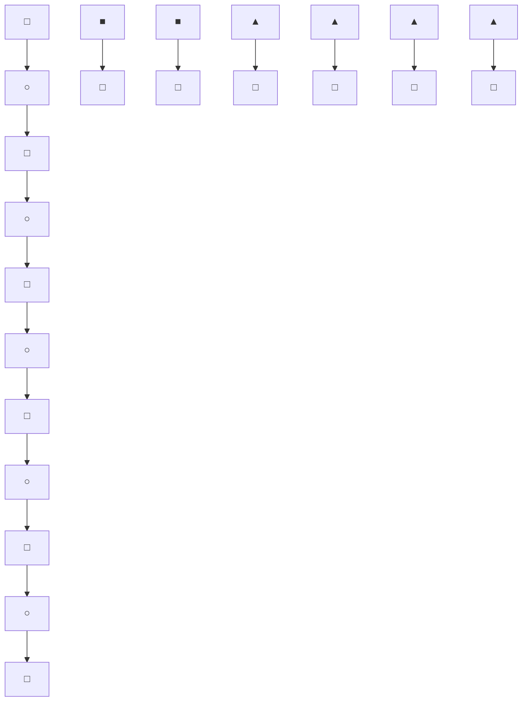

Raabe A, et al. Outcome after Hunt and Hess grade V subarachnoid hemorrhage: a comparison of precoiling era (1980-1995) versus post-ISAT era (2005- 2014). J Neurosurg 2017; 128: 100-10.

6. Headache Classification Committee of the International Headache Society (IHS). The International Classification of Headache Disorders, 3rd edition. Cephalalgia 2018; 38: 1-211. 
7. Wang IC, Tsai JD, Lin CL, Shen TC, Li TC, Wei CC. Allergic rhinitis and associated risk of migraine among children: a nationwide population-based cohort study. Int Forum Allergy Rhinol 2016; 6: 322-7. 
8. The Editors of Encyclopaedia Britannica. Books of Kings. URL: https://www.britannica.com/topic/books-of-Kings. [05.07.2019].

## Síndrome de duplicación MECP2 familiar

Aída M. Gutiérrez-Sánchez, Marta Marín-Andrés, Amparo López-Lafuente, Lorena Monge-Galindo, Javier López-Pisón, José Luis Peña-Segura

Unidad de Neuropediatría. Servicio de Pediatría. Hospital Universitario Miguel Servet. Zaragoza, España.

Correspondencia: Dra. Aída María Gutiérrez Sánchez. Unidad de Neuropediatría. Servicio de Pediatría. Hospital Universitario Miguel Servet. Paseo Isabel la Católica, 1-3. E-50009 Zaragoza.

E-mail: [redacted-email]

Aceptado tras revisión externa: 02.01.20

Cómo citar este artículo: Gutiérrez-Sánchez AM, Marín-Andrés M, López-Lafuente A, Monge-Galindo L, López-Pisón J, Peña-Segura JL. Síndrome de duplicación MECP2 familiar. Rev Neurol 2020; 70: 309-10. doi: 10.33588/ rn.7008.2019457.

© 2020 Revista de Neurología

El gen MECP2 es un ‘regulador’ responsable de indicar a los genes que controla cuándo deben estar inactivos. El funcionamiento inadecuado de este gen permite a otros genes expresarse o permanecer activos de forma inapropiada, alterando el patrón de regulación necesario para el correcto desarrollo del sistema nervioso central.

Distintas mutaciones en MECP2 causan una sobreproducción, un déficit o una ausencia de una proteína o unas enzimas necesarias para el neurodesarrollo, y se afectan las funciones cognitivas, sensoriales, emocionales y motoras. El desarrollo puede ser normal inicialmente, hasta el momento en el que la maduración del sistema nervioso central se ve alterada. La proteí- na MeCP2 (methil CpG binding protein 2), aunque es más abundante en el cerebro, se encuentra en todas las células del organismo, por lo que también podrán verse afectados otros órganos y sistemas.

Cuando hay una duplicación en el brazo largo del cromosoma X (Xq28) que incluya el gen MECP2, se produce un exceso de proteína MeCP2, que originará el síndrome de duplicación MECP2, el cual afecta principalmente a los varones. Deleciones y mutaciones en MECP2 producirán el síndrome de Rett, que padecen fundamentalmente las mujeres.

El síndrome de duplicación MECP2 se ha descrito en la bibliografía como un trastorno del neurodesarrollo asociado a hipotonía, retraso psicomotor y regresión de los hitos del desarrollo, rasgos del espectro autista, escaso desarrollo del lenguaje, discapacidad intelectual de moderada a grave, epilepsia en un 50% de los casos, infecciones respiratorias recurrentes, espasticidad progresiva, estereotipias de las manos, reflujo gastroesofágico, estreñimiento, bruxismo y sialorrea, entre otros [1,2]. Aunque la mayoría de mujeres parecen ser portadoras asintomáticas o mostrar síntomas psiquiátricos, como ansiedad y depresión, también se han descrito fenotipos similares a los de los varones [3,4]. El 50% de los sujetos fallece antes de los 25 años, frecuentemente por infecciones respiratorias.

La mayoría de los varones con síndrome de duplicación MECP2 hereda la duplicación de su madre; sin embargo, se han encontrado casos de novo [5]. Las mujeres portadoras transmitirán la duplicación al 50% de sus hijos, quienes se verán afectados, mientras que el 50% de sus hijas portará la duplicación. En las mujeres, debido al proceso de inactivación de uno de los dos cromosomas X, el cromosoma anormal a menudo se inactiva de forma preferencial en muchas o en todas las células, lo que impide que el material genético adicional esté activo, por lo que generalmente las mujeres no desarrollarán el síndrome o presentarán síntomas neuropsiquiátricos leves [6,7].

Aunque todavía se desconoce la prevalencia real de este síndrome, se estima que constituye el 1-2% de todos los casos de discapacidad intelectual ligada al cromosoma X [8]. En un reciente estudio llevado a cabo en Australia, se ha descrito una prevalencia de nacimientos de niños con síndrome de duplicación MECP2 de 0,65 por cada 100.000 nacidos vivos [9].

Se describen dos casos de síndrome de duplicación MECP2, pertenecientes a una misma familia, en seguimiento en la unidad de neuropediatría del Hospital Universitario Miguel Servet de Zaragoza.

flowchart

Figura. Árbol genético familiar de los casos 1 y 2.

Caso 1. Lactante de 6 meses remitido a la consulta de neuropediatría por retraso del desarrollo psicomotor. Hijo único de padres sanos no consanguíneos. Embarazo, parto y período neonatal sin incidencias. Cribado neonatal normal. Sin antecedentes personales ni familiares de interés.

A esa edad presenta hipotonía axial y tendencia a mantener aducido e incluido el primer dedo de ambas manos. En el seguimiento clínico se observa un importante retraso del desarrollo psicomotor: sedestación estable a los 11- 12 meses; con 14 meses consigue bipedestación con apoyo bimanual, utiliza poco las manos, no señala y presenta balbuceo escaso; a los 20 meses consigue una marcha autónoma inestable. En la actualidad, con 4 años, no hay lenguaje propositivo, pasa de manera ininterrumpida de una acción a otra y presenta estereotipias manuales.

Se solicitan las siguientes pruebas complementarias: ecografía transfontanelar a los 6 meses de vida, normal; tomografía axial computarizada craneal a los 9 meses (en el contexto del ingreso hospitalario en la unidad de cuidados intensivos por un cuadro de meningitis vírica), sin objetivarse hallazgos de interés; estudio neurometabólico en la sangre (hormonas tiroideas, ácido fólico, vitamina B , creatincinasa, cobre, ceruloplasmina, homocisteína y transferrina deficiente en carbohidratos), con resultado normal. A los 20 meses se descarta X frágil y se realiza array-CGH que objetiva una duplicación patógena de la banda cromosómica Xq28 que podría alterar la dosis del gen MECP2.

Tras conocer el diagnóstico, se amplía el estudio genético familiar y se encuentra que la madre, las dos tías maternas y la abuela materna del caso 1 son portadoras asintomáticas, y un primo hermano con retraso del desarrollo psicomotor también presenta dicha duplicación (caso 2). En la figura puede observarse el árbol genético familiar.

Caso 2. Lactante de 13 meses remitido a la consulta de neuropediatría para estudio por retraso psicomotor. Hermana cuatro años mayor y hermano gemelo sanos. Primo hermano con síndrome de duplicación MECP2 (caso 1). Madre portadora de dicha duplicación. Embarazo gemelar dicoriónico diamniótico. Parto vaginal a las 35 + 6 semanas de edad gestacional. Peso al nacer: 1.740 g. Cribado neonatal normal. Ingresado en el nacimiento, durante dos semanas, por prematuridad, bajo peso e hipoglucemias; al mes y medio de vida por bronquiolitis, y a los 4, 8 y 10 meses por bronquitis.

Desarrollo psicomotor: sonrisa social con 1 mes, sostén cefálico a los 8 meses, prensión de objetos a los 9 meses; sedestación autónoma con 11-12 meses, gateo con 19-20 meses, a los 23 meses no consigue aún deambulación autó- noma, no señala, no hay bisílabos propositivos y presenta bruxismo.

Se solicita array-CGH y se objetiva una duplicación patógena de 416 kb de la banda cromosómica Xq28, identificada previamente en el primo (caso 1), la madre, dos tías maternas y la abuela materna.

El síndrome de duplicación MECP2 fue descrito en la bibliografía por primera vez en 2005 [10]. Desde entonces se han estudiado más a fondo las características morfológicas y neurológicas de este síndrome [2,11].

Los individuos afectos presentan determinados rasgos dismórficos: hipoplasia mediofacial, puente nasal estrecho, labio inferior grueso, orejas grandes y prominentes, cabello grueso, dedos cónicos y pies pequeños. La hipotonía temprana y el retraso global del desarrollo son constantes, con un porcentaje variable de pacientes que son incapaces de caminar. La mayoría no desarrolla lenguaje expresivo. La epilepsia aparece en el 50-80% de los casos, en muchas ocasiones refractaria al tratamiento antiepiléptico. Otros problemas frecuentes son estreñimiento, escoliosis, estrabismo divergente e hipermetropía, movimientos estereotipados e infecciones respiratorias recurrentes. La hipertensión pulmonar se ha descrito como causa de muerte precoz en estos pacientes, por lo que deberían ser controlados en consultas de neumología pediátrica para su detección precoz.

Actualmente no existe un tratamiento curativo. El tratamiento se basa en los signos y síntomas presentes en cada individuo, con abordaje de los problemas respiratorios y de nutrición y los trastornos del comportamiento, y la inclusión en programas de atención temprana y rehabilitación. Los grupos de apoyo y las organizaciones de ayuda pueden ser de utilidad para conectar con otros pacientes y familias.

En conclusión, MECP2 es un gen regulador fundamental en el buen desarrollo del sistema nervioso central. Duplicaciones en este gen dan lugar al síndrome de duplicación MECP2, trastorno del neurodesarrollo ligado a X que afecta sobre todo a los varones. El fenotipo clínico cursa con retraso psicomotor, epilepsia, escaso desarrollo del lenguaje, movimientos estereotipados de las manos, rasgos del espectro autista, discapacidad intelectual y dificultad para la marcha con espasticidad, entre otros. Es importante llegar al diagnóstico etiológico en estos pacientes, ya que eso favorecerá un mejor seguimiento y dar un adecuado consejo genético.

## Bibliografía

Ramocki MB, Peters SU, Tavyev YJ, Zhang F, Carvalho CM, Schaaf CP, et al. Autism and other neuropsychiatric symptoms are prevalent in individuals with MeCP2 duplication syndrome. Ann Neurol 2009; 66: 771-82. 
2. Lim Z, Downs J, Wong K, Ellaway C, Leonard H. Expanding the clinical picture of the MECP2 duplication syndrome. Clin Genet 2017; 91: 557-63. 
3. Yi Z, Pan H, Li L, Wu H, Wang S, Ma Y, et al. Chromosome Xq28 duplication encompassing MECP2: clinical and molecular analysis of 16 new patients from 10 families in China. Eur J Med Genet 2016; 59: 347-53. 
4. Shimada S, Okamoto N, Ito M, Arai Y, Momosaki K, Togawa M, et al. MECP2 duplication syndrome in both genders. Brain Dev 2013; 35: 411-9. 
Sanlaville D, Prieur M, De Blois MC, Genevieve D, Lapierre JM, Ozilou C, et al. Functional disomy of the Xq28 chromosome region. Eur J Hum Genet 2005; 13: 579-85. 
6. Bijlsma EK, Collins A, Papa FT, Tejada MI, Wheeler P, Peeters EAJ, et al. Xq28 duplications including MECP2 in five females: expanding the phenotype to severe mental retardation. Eur J Med Genet 2012; 55: 404-13. 
7. El Chehadeh S, Touraine R, Prieur F, Reardon W, Bienvenu T, Chantot-Bastaraud S, et al. Xq28 duplication including MECP2 in six unreported affected females: what can we learn for diagnosis and genetic counselling? Clin Genet 2017; 91: 576-88. 
Lugtenberg D, Kleefstra T, Oudakker AR, Nillesen WM, Yntema HG, Tzschach A, et al. Structural variation in Xq28: MECP2 duplications in 1% of patients with unexplained XLMR and in 2% of male patients with severe encephalopathy. Eur J Hum Genet 2009; 17: 444-53. 
9. Giudice-Nairn P, Downs J, Wong K, Wilson D, Ta D, Gattas M, et al. The incidence, prevalence and clinical features of MECP2 duplication syndrome in Australian children. J Paediatr Child Health 2019; 55: 1315-22. 
10. Van Esch H, Bauters M, Ignatius J, Jansen M, Raynaud M, Hollanders K, et al. Duplication of the MECP2 region is a frequent cause of severe mental retardation and progressive neurological symptoms in males. Am J Hum Genet 2005; 77: 442-53. 
11. Miguet M, Faivre L, Amiel J, Nizon M, Touraine R, Prieur F, et al. Further delineation of the MECP2 duplication syndrome phenotype in 59 French male patients, with a particular focus on morphological and neurological features. J Med Genet 2018; 55: 359-71.