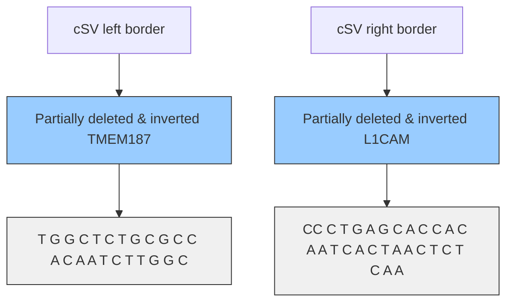
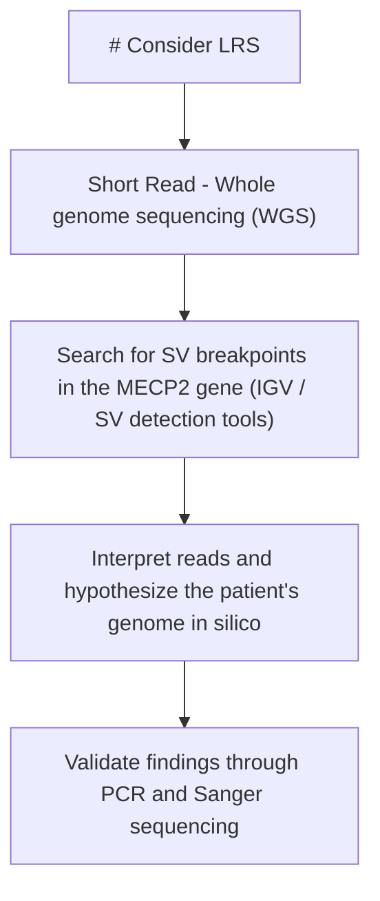

# Unraveling MECP2 structural variants in previously elusive Rett syndrome cases through IGV interpretation

Check for updates

Tomer Poleg 1 , Noam Hadar 1 , Gali Heimer2,3, Vadim Dolgin 1 , Ilana Aminov1 , Amit Safran1 , Nadav Agam1 , Matan M. Jean 1 , Ofek Freund1 , Simran Kaur4,5, John Christodoulou 4,5, Bruria Ben-Zeev2,3 & Ohad S. Birk 1,6,7

Rett syndrome (RTT) is a severe neurodevelopmental disorder, with MECP2 mutations accounting for 90–95% of classic and 50–70% of atypical cases. However, many clinically diagnosed RTT patients remain without molecular diagnoses. While point mutations and large rearrangements in MECP2 are well studied, the role of small-intermediate structural variants (SVs) remains mostly elusive. Using standard short-read whole genome sequencing, we identified novel de novo SVs in three out of three previously unresolved RTT cases: a complex SV with two deletions ( \~ 5Kbp and \~60Kbp) and a \~105Kbp inversion; a \~200Kbp translocation; and a \~3Kbp deletion. These findings suggest that such elusive SVs might be a common cause for “MECP2-negative” RTT. Incorporating SV detection into routine genetic testing through bioinformatic analysis of short-read sequencing or manual review using IGV could improve diagnostic rates and expand our understanding of RTT and similar disorders.

Rett syndrome (RTT) is a rare severe neurodevelopmental disorder, that stands as the second most common cause of genetic neurodevelopmental disorder in females1,2 . It is characterized by normal development followed by motor and cognitive skills regression3 . Individuals with RTT exhibit neurodevelopmental and motor delay, loss of hand usage, hand stereotypes, seizures, and autonomic symptoms including breathing abnormalities and social withdrawal3,4 .

RTT exemplifies the role of epigenetic mechanisms in disease pathology. Its etiology is primarily linked to mutations in MECP2, which encodes methyl-CpG binding protein 2 - a key epigenetic modulator in the brain that controls gene expression and modulates chromatin architecture through binding to methylated DNA5 . The association between MECP2 and RTT is evident, as pathogenic variants in that gene have been identified in 90–95% of classic RTT cases and 50–70% of atypical RTT cases6,7 . However, a significant number of clinically diagnosed Rett patients lack a genetic diagnosis8–10. Rett-like syndrome, exhibiting a phenotypic resemblance to classical RTT, also represents a considerable proportion of undiagnosed genetic cases11–14. The mutations underlying these genetically unsolved cases remain elusive in routine screening of RTT or RTT-like patients. It is often presumed that a second gene or locus may be involved13, or that mutations are situated within regulatory non-coding regions of MECP2, which are not routinely screened15. Another possibility is the occurrence of SVs that may go undetected by routine PCR-based screening approaches and sequencing, particularly if a breakpoint extends beyond the genomic positions targeted by commonly used PCR primers16,17.

We now successfully identify and clearly define three novel SVs within MECP2 in three distinct RTT patients who lacked a genetic diagnosis for many years. We emphasize the need to routinely search for SVs in RTT patients and other genetically unsolved diseases.

## Results

## Clinical findings

We studied three cases of typical Rett syndrome whose underlying mutations remained elusive despite extensive clinical genetic testing.

Case 1: A 7.5-year-old girl born following a normal pregnancy, delivered via cesarean section due to placenta previa. The initial year of her life was marked by tranquility, alongside episodes of gastroesophageal reflux. However, at age one year, behavioral changes were noticed, with restlessness, frequent crying spells, and disrupted sleep patterns. These manifestations were coupled with a temporary decline in eye contact, which was regained at the age of three to the level of intense eye-pointing. She experienced delays in developmental milestones: walking at 20 months with

1 Faculty of Health Sciences, Ben-Gurion University of the Negev, Be’er Sheva, Israel. 2 Edmond and Lily Safra Children’s Hospital, Sheba Medical Center, Ramat Gan, Israel. 3 Tel Aviv University School of Medicine, Tel-Aviv, Israel. 4 Brain and Mitochondrial Research Group, Murdoch Children’s Research Institute, Melbourne, Australia. 5 Department of Paediatrics, University of Melbourne, Melbourne, Australia. 6 Genetics Institute, Soroka University Medical Center, Be’er Sheva, Israel. 7 The Danek Gertner Institute of Human Genetics, Sheba Medical Center, Ramat Gan, Israel. e-mail: [redacted-email]

a wide-based apraxic and ataxic gait, and limited verbal communication skills, using only a few words, which she primarily used during moments of stress. A formal diagnosis of autism spectrum disorder was made at the age of 18 months. By the age of 4.5 years, a decline in hand usage became evident, with minimal manipulation of objects observed, except for holding a bottle. Concurrently, she developed rapid, non-simultaneous hand tapping (left > right), predominantly on her abdomen and other surfaces, impairing her hand function. She developed daytime bruxism, and her sleep quality deteriorated, characterized by prolonged periods of sleep disruption, marked by crying or laughing episodes. Moreover, she displayed anxiety in diverse situations, resulting in episodes of freezing, especially when facing changes in her environment, such as navigating stairs or encountering different ground surfaces. She displayed a preference for human faces over objects and demonstrated heightened sensitivity to emotional fluctuations in her surroundings.

At the age of 6.5 years, she developed episodes of hyperventilation and short breath-holding. Although she used a few words, her intense tapping persisted, synchronizing with bilateral central spikes observed on video EEG recordings, which ceased when the tapping hand was restrained. Nocturnal spike activity persisted, intensifying during sleep to a degree that raised suspicion of electrical status epilepticus during sleep (ESES). This prompted a trial of Sulthiame combined with Clobazam, resulting in a decrease in the frequency of sleep spikes and potentially improving her sleep patterns. Physical examination at that point revealed a head circumference of 51 cm (50th percentile) with no dysmorphic features, intense eye contact, continuous one-hand tapping on her abdomen, apraxic atactic gait while wandering aimlessly in the room, mild hypotonia, and no evidence of cold extremities. MRI yielded normal results.

The diagnostic evaluation, which included chromosomal microarray analysis (CMA) and trio exome sequencing, returned negative results. Subsequent investigation, which involved testing for Rett syndromeassociated genes through an Invitae panel and Multiplex ligation-dependent probe amplification (MLPA) to detect copy number variations (CNVs) within MECP2, also yielded negative findings. Despite these outcomes, the clinical features strongly suggested Rett syndrome (atypical preserved speech variant). Thus, driven by this compelling clinical suspicion, we decided to pursue Whole Genome Sequencing (WGS) to explore noncoding regions and identify potential hidden structural variants.

Case 2: A 5-year-old girl who was initially evaluated at age 2 years. She was born following a normal pregnancy and delivery. During her first year, she exhibited hypotonia, feeding difficulties, and poor weight gain, all of which were accompanied by developmental delays. At the age of 2, her head circumference measured 45 cm. Despite being a visually appealing child who could sit independently and stand with support, she did not achieve independent walking. Instead, she demonstrated progress through “bunny jumping”. Hand usage, initially reasonable, declined in the second year, and was limited primarily to holding a bottle. Intense hand stereotypes emerged, including hand washing, hand tapping on the mouth, and clapping. Additionally, she experienced pronounced daytime bruxism. While eye contact was lost toward the end of her first year, it was regained a few months later, albeit intermittently accompanied by bilateral squint. Other issues included poor chewing and swallowing, mild constipation, and disrupted sleep patterns, though her sleep improved using melatonin. By the age of 3, she began experiencing hyperventilation and breath-holding episodes, alongside the onset of epileptic seizures consistent with focal with partial unawareness seizures. Repeated EEGs revealed mildly slow background activity and increased frequency of central asynchronous spikes during sleep, typical for RTT patients. These seizures were effectively managed with Valproic acid. MRI imaging was normal. Despite negative results from chromosomal microarray analysis (CMA), trio whole-exome sequencing (WES), and an RTT-like genes panel by Invitae, her clinical presentation strongly suggested RTT.

Case 3: A 19-year-old female, the fifth child in a family of ten, was born after a normal pregnancy with early contractures. Her birth weight was 3750 grams, and her perinatal course was uneventful. She exhibited motor and generalized developmental delays: she sat at 1 year, crawled at 13 months, and stood and walked around furniture at 30 months. She lost the ability to walk at 4 years old but regained the ability to walk with a walker a few years later. At 13 months, she had a vocabulary of few words, which she lost by 21 months, but demonstrated a high level of communication using eye-gaze equipment. She could reach for toys and transfer objects between hands until around 24 months when she developed hand stereotypes. Awake bruxism, mild tremors, and eye-rolling events, non-epileptic and typical for RTT patients, also appeared. Her head growth decelerated from the 50th percentile at birth to below the 3rd percentile by 18 months. MRI was normal, and EEG showed a slow background without epileptiform activity. She had mild breathing abnormalities (hyperventilation alternating with apneas), a good appetite, and severe constipation. At her last clinic visit (age 18 years), she was wheelchair-bound, had consistent hand stereotypes requiring bracing, mild to moderate lower limb spasticity, and scoliosis. She is treated with Valproic acid for infrequent generalized tonic-clonic seizures that began at age 10 years. Her phenotype was consistent with typical RTT syndrome; however, MECP2 sequencing, CMA, MECP2 MLPA, and trio exome sequencing were negative.

## Molecular genetic analysis

Case 1: We conducted trio WGS to identify relevant variants within MECP2. Using MANTA software (https://github.com/Illumina/manta), we detected two points flagged as potentially bordering an SV within MECP2 (hg38: chrX:154,032,101, chrX:154,032,109). Visualization of this region using IGV revealed that approximately 50% of the reads surrounding a specific point (hg38: chrX:154,032,104) were aligned towards this center point. Upon utilizing the ‘view as pair’ option in IGV, we observed that the reads positioned to the left of this point had their pairs located on chromosome 6 (hg38: chr6:162,662,479), while those on the right also had their pairs on chromosome 6, albeit approximately 200Kbp distant (hg38: chr6:162,862,870). These two points on chromosome 6 were located within genes, PRKN and PACRG, respectively (Fig. 1A). The reads on chromosome X were directed towards their paired counterparts on chromosome 6, suggesting a plausible scenario where they are indeed situated adjacently on the mutated allele. Upon visualizing the direction and location of the reads, we inferred that the most plausible explanation was a translocation of 200,391 bp from chromosome 6 to chromosome X, disrupting the MECP2 gene between exons 3 and 4 (Fig. 1A, B). PCR amplification using primers surrounding both SV borders, yielded amplification only in the affected individual’s DNA and not in either parent’s or two other siblings’ DNA. Sanger sequencing of the amplicon accurately identified the precise entry site and borders of the SV (Fig. 1B).

Case 2: WGS was performed for the affected individual to identify mutations within MECP2. Using MANTA software, a specific possible breakpoint was identified between exons 2 and 3 of MECP2 (hg38: ChrX:154,040,681). Upon visualization in IGV, it became apparent that approximately 50% of the reads in this region had dis-concordant paired reads located approximately 170Kbp away (hg38: ChrX:153,873,102) within the L1CAM gene, also situated on chromosome X. Notably, the reads at both points were directed towards the downstream region of chromosome X. Further investigation involved checking for additional points identified on chromosome X by MANTA. Another point was detected within TMEM187 (hg38: ChrX:153,980,877), approximately 60Kbp away from the suspected MECP2 breakpoint. IGV visualization of this TMEM187 point similarly revealed approximately 50% aberrant reads. Upon examining the pairs, it was observed that all suspected reads had pairs located on the L1CAM gene (hg38: ChrX:153,867,860), with the reads pointing in the same direction, towards the upstream of chromosome X (Fig. 2A). By visualizing all the abnormal split reads and interpreting the unusual distances and orientations between the paired-end reads, we inferred the presence of a complex structural variant (cSV). The logical deduction was that two distinct deletion sites, along with an inversion site between them, might account for our observations in MANTA and IGV (Fig. 2A). To validate this hypothesis, we examined on IGV the proposed deleted regions, and indeed noted the presence of only homozygous SNPs, accompanied by a decreased read depth, thereby reinforcing our hypothesis of deleted areas. For molecular validation, we conducted PCR amplification on both border sides of the complex structural cSV, operating under the assumption of both a deletion and an inversion. We successfully obtained an amplicon only from the affected family member, and not from the parents or the two healthy siblings. Subsequently, we confirmed and precisely defined the borders through Sanger sequencing (Fig. 2B).


<details>
<summary>flowchart</summary>

```mermaid
graph TD
 A["Chr6"] --> B["12 PRKN"]
 B --> C["11"]
 C --> D["10"]
 D --> E["9"]
 E --> F["8"]
 F --> G["7"]
 G --> H["6"]
 H --> I["5"]
 I --> J["4"]
 J --> K["3"]
 K --> L["2"]
 L --> M["1"]
 M --> N["1"]
 N --> O["2"]
 O --> P["162,662,479"]
 O --> Q["162,862,870"]
 O --> R["163,000,000"]
 R --> S["3-4 PACRG"]
 S --> T["5"]
 
 subgraph Translocation_A
 U["ChrX"] --> V["3' UTR"]
 V --> W["4 MECP2"]
 W --> X["3"]
 X --> Y["2"]
 Y --> Z["1"]
 Z --> AA["1"]
 AA --> AB["2"]
 AB --> AC["154,032,104"]
 AC --> AD["154,060,000"]
 AD --> AE["154,080,000"]
 AE --> AF["154,080,000"]
 AF --> AG["154,080,000"]
 AG --> AH["154,080,000"]
 AH --> AI["154,080,000"]
 AI --> AJ["154,080,000"]
 AJ --> AK["154,080,000"]
 AK --> AL["154,080,000"]
 AL --> AM["154,080,000"]
 AM --> AN["154,080,000"]
 AN --> AO["154,080,000"]
 AO --> AP["154,080,000"]
 AP --> AQ["154,080,000"]
 AQ --> AR["154,080,000"]
 AR --> AS["154,080,000"]
 AS --> AT["154,080,000"]
 AT --> AU["154,080,000"]
 AU --> AV["154,080,000"]
 AV --> AW["154,080,000"]
 AW --> AX["154,080,000"]
 AX --> AY["154,080,000"]
 AY --> AZ["154,080,000"]
 AZ --> BA["154,080,000"]
 BA --> BB["154,080,000"]
 BB --> BC["154,080,000"]
 BC --> BD["154,080,000"]
 BD --> BE["154,080,000"]
 BE --> BF["154,080,000"]
 BF --> BG["154,080,000"]
 BG --> BH["154,080,000"]
 BH --> BI["154,080,000"]
 BI --> BJ["154,080,000"]
 BJ --> BK["154,080,000"]
 BK --> BL["154,080,000"]
 BL --> BM["154,080,000"]
 BM --> BN["154,080,000"]
 BN --> BO["154,080,000"]
 BO --> BP["154, 154, 154, 154"]
 BP --> BQ["154, 154, 154, 154"]
 BQ --> BR["154, 154, 154, 154"]
 BR --> BS["154, 154, 154, 154"]
 BS --> BT["154, 154, 154, 154"]
 BT --> BU["154, 154, 154, 154"]
 BU --> BV["154, 154, 154, 154"]
 BV --> BW["154, 154, 154, 154"]
 BW --> BX["154, 154, 154, 154"]
 BX --> BY["154, 154, 154, 154"]
 BY --> BZ["154, 154, 154, 154"]
 BZ --> CA["154, 154, 154, 154"]
 CA --> CB["154, 154, 154, 154"]
 CB --> CC["154, 154, 154, 154"]
 CC --> CD["154, 154, 154, 154"]
 CD --> CE["154, 154, 154, 154"]
 CE --> CF["154, 154, 154, 154"]
 CF --> CG["154, 154, 154, 154"]
 CG --> CH["154, 154, 154, 154"]
 CH --> CI["154, 154, 154, 154"]
 CI --> CJ["154, 154, 154, 154"]
 CJ --> CK["154, 154, 154, 154"]
 CK --> CL["154, 154, 154, 154"]
 CL --> CM["154, 154, 154, 154"]
 CM --> CN["154, 154, 154, 154"]
 CN --> CO["154, 154, 154, 154"]
 CO --> CP["154, 154, 154, 154"]
 CP --> CQ["154, 154, 154, 154"]
 CQ --> CR["154, 154, 154, 154"]
 CR --> CS["154, 154, 154, 154"]
 CS --> CT["154, 154, 154, 154"]
 CT --> CU["154, 154, 154, 154"]
 CU --> CV["154, 154, 154, 154"]
 CV --> CW["154, 154, 154, 154"]
 CW --> CX["154, 154, 154, 154"]
 CX --> CY["154, 154, 154, 154"]
 CY --> CZ["154, 154, 154, 154"]
 CZ --> DA["3' UTR MECP2"]
 end
 
 %% Translocation_B
 subgraph Translocation_A
 B
 subgraph Translocation_A
 C
 subgraph Translocation_A
 D
 subgraph Translocation_A
 E
 subgraph Translocation_A
 F
 subgraph Translocation_A
 G
 subgraph Translocation_A
 H
 subgraph Translocation_A
 I
 subgraph Translocation_A
 J
 subgraph Translocation_A
 K
 subgraph Translocation_A
 L
 subgraph Translocation_A
 M
 subgraph Translocation_A
 N
 subgraph Translocation_A
 O
 subgraph Translocation_A
 P
 subgraph Translocation_A
 Q
 subgraph Translocation_A
 R
 subgraph Translocation_A
 S
 subgraph Translocation_A
 T
 subgraph Translocation_A
 U
 subgraph Translocation_A
 V
 subgraph Translocation_A
 W
 subgraph Translocation_A
 X
 subgraph Translocation_A
 Y
 subgraph Translocation_A
 Z
 subgraph Translocation_A
 AA
 subgraph Translocation_A
 AB
 subgraph Translocation_A
 AC
 subgraph Translocation_A
 AD
 subgraph Translocation_A
 AE
 subgraph Translocation_A
 AF
 subgraph Translocation_A
 AG
 subgraph Translocation_A
 AH
 subgraph Translocation_A
 AI
 subgraph Translocation_A
 AJ
 subgraph Translocation_A
 AK
 subgraph Translocation_A
 AL
 subgraph Translocation_A
 AM
 subgraph Translocation_A
 AN
 subgraph Translocation_A
 AO
 subgraph Translocation_A
 AP
 subgraph Translocation_A
 AQ
 subgraph Translocation_A
 AR
 subgraph Translocation_A
 AS
 subgraph Translocation_A
 AT
 subgraph Translocation_A
 AU
 subgraph Translocation_A
 AV
 subgraph Translocation_A
 AW
 subgraph Translocation_A
 AX
 subgraph Translocation_A
 AY
 subgraph Translocation_A
 AZ
 subgraph Translocation_A
 BA
 subgraph Translocation_A
 BB
 subgraph Translocation_A
 BC
 subgraph Translocation_A
 BD
 subgraph Translocation_A
 BE
 subgraph Translocation_A
 BF
 subgraph Translocation_A
 BG
 subgraph Translocation_A
 BH
 subgraph Translocation_A
 BI
 subgraph Translocation_A
 BJ
 subgraph Translocation_A
 BK
 subgraph Translocation_A
 BL
 subgraph Translocation_A
 BM
 subgraph Translocation_A
 BN
 subgraph Translocation_A
 BO
 subgraph Translocation_A
 BP
 subgraph Translocation_A
 BQ
 subgraph Translocation_A
 CA
 subgraph Translocation_A
 CB
 subgraph Translocation_A
 CC
 subgraph Translocation_A
 DC
 subgraph Translocation_A
 DEA
```
</details>

Fig. 1 | Case 1: A \~ 200 kbp translocation from chromosome 6 into MECP2. A Schematic representation of the translocation breakpoints in the reference wildtype genome. Red square marks the translocated region from chromosome 6. Each color represents a distinct gene: green for PACRG, blue for PRKN, and pink for MECP2. The red arrow highlights the translocation from chromosome 6 to chromosome X. IGV visualization shows: Brown reads span the translocation entry site on chromosome X, Yellow reads flank the translocated borders on chromosome 6. 
B Schematic representation of the predicted mutated patient genome. The red square identifies the translocated region from chromosome 6, which encompasses two genes: green for PACRG and blue for PRKN. Paired-read visualization illustrates the directions of the aligned reads: brown reads (aligned to ChrX) are adjacent to and directed toward yellow reads (aligned to Chr6). Sanger sequencing confirms the SV breakpoints. Figure created using biorender.com.

Case 3: We conducted WGS of the affected family member to identify variants within MECP2. In this instance, we independently scanned MECP2 using IGV software, without utilizing MANTA. Two suspicious points (hg38: ChrX:154,027,486 and ChrX:154,030,665) were identified, each with 50% colored dis-concordant reads in the respective regions. Reads from both sides were found to be paired with each other in the right direction towards each other, and the distance between the two points was approximately 3200 bp. Additionally, we observed a drop in depth in WGS reads of around 50% in the region between these two sites, suggesting a potential heterozygous deletion. The deleted region includes a significant coding portion of exon 4 and a large segment of the 3’ end of the MECP2 gene (Fig. 3A). Afterward, we conducted PCR amplification using primers targeting both sides of the suspected deleted region, which generated an amplicon only in the affected individual, who carries the deletion SV, and not in any other family member. Subsequent Sanger sequencing accurately pinpointed the exact deletion site (Fig. 3B).

## Discussion

Causative mutations in MECP2 have been identified in 90–95% of classic RTT cases and 50–70% of atypical RTT cases6,7 . However, many clinically evident RTT or RTT-like cases remain with no molecular diagnosis. Identifying the genetic basis of RTT cases is crucial, as it provides families with a definitive diagnosis of their child’s condition, alleviates uncertainty and anxiety regarding future pregnancies, and allows for appropriate medical management tailored to the underlying genetic cause – including opening opportunities to participate in clinical trials targeting MECP2-specific pathways. Many other clinical conditions can imitate cases of Rett syndrome18,19, and misdiagnosis may lead to ineffective or potentially harmful treatments. Thus, uncovering the genetic underpinnings of these cases is essential for optimizing patient care and advancing prevention and treatment strategies.

At the Israeli Rett clinic at Sheba Medical Center, 225 patients with a clinical diagnosis consistent with Rett syndrome are being followed20,21. Among these, 10 patients have remained without a molecular diagnosis for years. We set out to solve the genetic riddle of 3 of these cases: two with typical RTT and one with the atypical preserved speech variant (PSV). These patients were meticulously clinically diagnosed by a highly experienced pediatric neurologist specializing in Rett syndrome, but had no genetic diagnosis despite extensive testing over many years. We solved all three cases using WGS, revealing that each was caused by a distinct SV within MECP2.


<details>
<summary>text_image</summary>

A
Deletion site
153,867,860 153,873,102
Inversion site
153,900,000 153,950,000
153,980,877
154,000,000
154,040,681
Deletion site
154,050,000
L1CAM
TMEM187
3' UTR - 4 - 3
MECP2
2 - 1
</details>


<details>
<summary>flowchart</summary>


</details>

Fig. 2 | Case 2: A complex structural variant (cSV) disrupting MECP2. A Schematic representation of the cSV breakpoints in wild-type genome. Each color represents a distinct gene: Yellow for L1CAM, Green for TMEM187 and Pink for MECP2. Each colored square represent distinct variant type: Blue square for inversion region, Red square for two deletion sites and Green square for the unaffected regions. IGV visualization shows the analyzed reads directions by Cyan, and 
Blue arrows. B Schematic representation of the predicted mutated patient genome. Visualization of the paired-read directions aligned to the mutated allele: cyan represents the left border of the cSV, and blue represents the right border. Sanger sequencing confirms the cSV breakpoints. Purple squares indicate unrelated insertions within the cSV breakpoints. Figure created using biorender.com.

We demonstrated that all three RTT cases were caused by disrupting both of the main isoforms of MECP2: MECP2\_e1 (NM\_004992.4) and MECP2\_e2 (NM\_001110792.3)22. In Case 1, we identified a \~ 200 Kbp translocation from chromosome 6 to the X chromosome; t(6;X)(q26;q28). The translocation breakpoint within MECP2 (hg38: chrX:154,032,104) is located between exons 3 and 4 (Fig. 1). This \~200 kbp insertion encompasses the complete exons 1 and 2 of PACRG and the entire exon 1 of PRKN (Fig. 1). We hypothesize that this translocation may disrupt normal splicing, potentially triggering nonsense-mediated decay (NMD) or leading to the production of an aberrant MECP2 protein. We consider it highly unlikely that this insertion within the core region of MECP2 would result in the synthesis of a normal WT protein. In Case 2, we found a cSV involving a large deletion that removes the entire downstream portion of both MECP2 isoforms, including exons 3 and 4, as well as the entire 3’ UTR (Fig. 2). This likely results in the transcript undergoing NMD, preventing protein production. In Case 3, we identified an approximately 3,200 bp deletion in the downstream region of MECP2 (NC\_000023.11:g.154027486\_154030665del). This deletion removes the terminal portion of exon 4, resulting in a stop-loss mutation and it also includes a 2,889 bp of the 3’ UTR (Fig. 3). The deletion affects amino acids 397 to 498 and causes a frameshift, generating a novel amino acid sequence of 149 residues before encountering a premature stop codon.

SVs are genetic structural alterations, typically defined as genomic variants larger than 50 bps. These variations can include deletions, duplications, insertions, inversions, and translocations, which may impact gene function and regulation. SVs can significantly impact health by disrupting gene function, leading to a wide range of diseases, including developmental disorders, intellectual disabilities, and various congenital conditions23–25. Small-intermediate SVs typically range from 50 bp to 50kbp in size, whereas large SVs encompass alterations exceeding 50kbp26,27.

Small-intermediate SVs pose a unique challenge in detection compared to single nucleotide variants (SNVs), indels, and large SVs, as they fall within a range where conventional sequencing methods may fail to accurately identify and characterize due to limitations in read length and resolution methods23,28, 29. Short read sequencing (SRS), in particular, encounters significant difficulties in detecting small-intermediate SVs29,30. This is because it often fails to span the exact SV breakpoints and map them accurately, hindering the detection of such variants, especially those located in noncoding regions or characterized by combinations of structural changes, known as cSVs30. Additionally, relying solely on SV detection software is complex, as it typically identifies thousands of SVs per genome, many of which are false positives or inaccurately predicted variants31,32.

Since the discovery of Rett syndrome by Andreas Rett in 1966, numerous cases caused by MECP2 mutations have been solved using conventional methods. SNVs, indels, and copy number variants (CNVs) were mostly detected via routine genetic panels, whole exome sequencing (WES), and directed targeted sequencing of MECP233–39. Large SVs were primarily detected using chromosomal microarray (CMA) or fluorescence in situ hybridization (FISH)40–46. Multiplex ligation-dependent probe amplification (MLPA) identifies large deletions35,47, that might be missed by routine PCR-based screening strategies. For example, one group succeeded in detecting deletions ranging from 1235 bp to 85 kb within MECP2 using


<details>
<summary>other</summary>

| Position | Value |
| -------- | ----------- |
| 3' UTR | 154,027,486 |
| 4 | 154,030,665 |
| 1 | 154,027,486 |
</details>

Fig. 3 | Case 3: A \~3Kbp heterozygous deletion within MECP2. A Red square illustrates the c-terminal deletion site within MECP2. IGV visualization shows the deletion borders. Brown reads represents the paired-reads encompassing the deleted 
area. B Sanger sequencing validated the deleted region borders. Figure created using biorender.com.

MLPA48; but, to characterize the rearrangements and locate the exact nucleotide positions of the breakpoints, they had to use real-time quantitative PCR (qPCR) and long-range PCR. Therefore, it is understandable that general screening of the Human Gene Mutation Database (HGMD)49 has shown these small to intermediate SVs to be much less recognized over the years compared to other types of mutations.

We present an effective approach that allowed us to uncover novel disease-causing SVs in MECP2 using conventional short-read WGS. In two of the three cases (Cases 1,2), MANTA software facilitated the identification of potential SV breakpoints within MECP2. MANTA software can detect discordant read pairs, split reads, and abnormal read depth, which are indicative of various SVs such as deletions, duplications, inversions, and translocations. By integrating these different types of evidence, MANTA can suggest genomic loci suspected to be SVs breakpoint borders. However, due to MANTA’s tendency to produce false positives and its limitations in predicting exact SV subtypes, especially cSVs, we found it necessary to directly analyze and visualize the BAM file alignment in the regions that MANTA recognized. We utilized the IGV to visualize read mapping, which enabled us to interpret and hypothesize what were the distinct SV types in each case, and accurately determine their respective boundaries. The utility of IGV was highlighted when Case 3 was resolved solely through visualizing MECP2 on IGV, bypassing the need for MANTA. Eventually, the borders of identified SVs that we hypothesized to exist were verified by PCR and Sanger sequencing. That approach enabled us to detect pathogenic novel, elusive small to intermediate SVs within MECP2, that evaded detection using any other diagnostic tool (such as CMA, Trio exome, RTT-like genes panel, MLPA, etc.).

It is worth noting that cSVs pose great challenges in SRS mapping interpretation, beyond those in simple SVs. The presence of multiple SVs within the same genomic region can obscure and impede their identification. For instance, in case 2, the deletion sites were not apparent in the BAM visualization due to the presence of the inversion between them. We could infer the presence of deletions only by speculating on what would be logical and how the paired-reads might align, assuming there might be an inversion. Our findings highlight the importance of direct searching for SVs when conventional methods prove insufficient in detecting any mutations in MECP2 in RTT cases48,49.

Long-read sequencing (LRS) is effective in identifying diseaseassociated SVs and cSVs50. However, its high cost makes it impractical for routine genetic testing. As we demonstrate, such cases can be effectively resolved through advanced cost-effective bioinformatics analysis tools designed to detect SVs in SRS data. Our findings are consistent with a previous report that identified a 2.6 kb intronic insertion variant within MECP2 using MANTA software51. Additionally, our results demonstrate that even manually scanning IGV with a targeted focus on a specific gene can lead to the identification of SVs. We have shown that simply visualizing and carefully examining the MECP2 gene in the patient’s BAM file using IGV software can reveal inappropriately mapped reads that may indicate the presence of a disease-causing SV. Despite the obvious need for such software, there are currently no user-friendly and reliable bioinformatics tools available for routine use in identifying SVs in MECP2, nor is there a standard practice for directly examining the MECP2 gene in BAM files from Rett patients. This gap highlights the need for developing cost-effective and accessible techniques to improve the diagnostic process for SV detection.

The clinical phenotypes associated with MECP2 mutations exhibit significant variability, and prior studies have explored whether this variability is influenced by the type and location of the mutation52–54 Bebbington et al. developed a phenotypic profile of C-terminal deletions in Rett syndrome, finding that such cases often present with milder disease phenotypes55. These individuals are more likely to have normal head circumference and weight, a later onset of stereotypies, and earlier acquisition of walking skills. Additionally, deletions occurring downstream within the MECP2 gene were associated with lower average severity scores compared to those occurring upstream55. However, the phenotypes observed in our cases diverge from this typical profile; in Case 3, we identified a deletion at the C-terminus of MECP2 (Fig. 3), resulting in a frameshift that alters the protein sequence starting at amino acid 397 and introduces a stop codon at position 545. Despite this C-terminal mutation, the patient’s phenotype aligns with classic Rett syndrome, except for the absence of seizures. She presented with microcephaly and has not achieved independent walking, which contrasts with the typically milder phenotype associated with C-terminal mutations. Similarly, in Case 2, the mutation involved a cSV, with a larger deletion encompassing exons 3 and 4 and the entire 3’ UTR (Fig. 2), and the patient also exhibited features consistent with classic Rett syndrome. Interestingly, in Case 1, the patient was diagnosed as PSV, a milder phenotype previously described in the literature56. Given the large translocation identified in this case, a classic Rett syndrome phenotype might have been expected. While there are occasional genotype-phenotype correlations linked to the position of the mutation, other factors—such as the X-inactivation ratio, modifier genes, and additional, less well-known epigenetic influences—also contribute to phenotypic differences and severity57–59.

Clinical RTT without a discernable MECP2 mutation→Investigate for SVs 


<details>
<summary>flowchart</summary>


</details>

Fig. 4 | Approach for uncovering elusive novel disease-causing structural variants (SVs) in genetically unsolved Rett syndrome (RTT) cases. LRS; Long-read sequencing. SVs; Structural variants. IGV; Integrative Genomics Viewer.

Case 1 also raises the question of whether the two disrupted genes on chromosome 6 contribute to the patient’s phenotype. As described, the balanced translocation breakpoints in this case are located within two genes on chromosome 6: PRKN and PACRG. PRKN is primarily associated with Parkinson’s disease in the biallelic state; in this case, however, it is disrupted in a heterozygous state, which is not typically linked to the disease. Similarly, according to OMIM60, PACRG has not been associated with any disease in the heterozygous state. The translocation site within MECP2, however, lies in a critical region that likely impacts the MECP2 transcript relevant to Rett syndrome (NM\_004992.4, MECP2\_e1), suggesting it is a primary contributor to the patient’s phenotype.

To date, dozens of variants in several genes have been suggested to be causative of Rett and Rett-like syndrome in cases where no MECP2 mutation was found13,14,61,62. It is plausible that some of those proposed variants are not disease-causing, as causative small or intermediate SVs within MECP2 have possibly eluded detection, or because there may be a double diagnosis involving both MECP2 SVs changes and a pathogenic mutation in another gene, leading to a more complex phenotype.

We propose the following approach to address elusive SVs and cSVs cases (Fig. 4): in clinically diagnosed RTT cases without a detectable MECP2 mutation, it is crucial to investigate the presence of SVs. LRS or WGS should be considered as diagnostic tools. If feasible, LRS is preferred. When using WGS, SV breakpoints should be sought within the MECP2 gene. The patient’s BAM file can either be manually scanned or analyzed with SV detection tools such as MANTA, Delly, and others. Visualizing read mapping by IGV may uncover subtle clues within the SRS data that aid in accurately identifying SV boundaries. Finally, these identified SV breakpoints can be validated through PCR and Sanger sequencing.

This methodology enabled us to successfully resolve all three investigated RTT cases. We believe that this approach could be valuable for resolving SV cases in other diseases, as these types of variants are not exclusive to Rett syndrome. We suggest that this approach should be considered for any genetic case exhibiting a distinctive phenotype with a limited number of related genes, or where there is a confined linkage area. In such instances, it would be feasible to avoid thousands of false positive variants and to investigate small to intermediate SVs within these specific loci or genes.

As we investigated 3 cases with a clear RTT phenotype, unraveling causative SVs in all 3 cases, it is plausible that SVs possibly constitute a common cause of RTT in yet unresolved cases. We have succeeded in elucidating the pathogenic SVs through tedious work using existing software and IGV visualization and interpretation. However, this process can be greatly facilitated through the generation of user-friendly clinical analysis software that would enable clinicians of various disciplines, not necessarily geneticists, to easily filter VCF files in search of SVs. We propose that it may be feasible to develop such software by integrating different programs capable of identifying suspected SV regions and combining them with the ability to filter by various loci, genes, or related phenotypes using databases such as OMIM or HPO. Such software could be routinely used and facilitate the resolution of many elusive SV and cSV cases, not only in Rett syndrome but also in other monogenic diseases.

## Methods

## Clinical phenotyping

The study was approved by the Soroka Medical Center Institutional Review Board (IRB; approval #5071 G) and the Israel Ministry of Health National Helsinki Committee (approval #920100319). Written informed consent was obtained from all individuals studied or their legal guardians. The phenotyping was conducted by senior neurologist and geneticist.

## Molecular genetic analysis

DNA was extracted from peripheral blood leukocytes using the E.Z.N.A Blood DNA kit (Omega Bio-tek, Nor-cross, GA, USA) as was previously described63. Whole-genome sequencing was performed by Macrogen® using Illumina’s NovaSeq X with TruSeq PCR-free kit generating 150 bp pair-end reads. Raw data reads were aligned to GRCh38 reference genome using BWA-MEM. Variant calling was done using GATK 4.3.0.0, and Manta 1.6.064. Data were analyzed using VARista (https://VARista.link) 65 and Genoox analysis software, Franklin (https://franklin.genoox.com/ clinical-db/home). The Integrative Genomics Viewer (IGV) was employed to visualize and interpret the mapped reads and to investigate the variants within MECP2. Segregation analysis of the structural variants within the studied kindreds was done through PCR amplification and gel electrophoresis using primers flanking the junction points of the SVs regions: Case 1: Left side of the SV border- Forward 5′-CCTTTGC TCACCCTTCTCATGG-3′, Reverse 5′-CCAACCCAAGCCTTTG-GAACAG-3′. (733 bp amplicon; annealing temperature 60 °C; extension time 44 s). Right side: Forward 5’- GAGATGCCTGAAAAGGCAACGG-3’. Reverse 5’ CCGCTCTGCTGGGAAGTATGAT-3’ (575 bp amplicon; annealing temperature 60 °C; extension time 35 s). Case 2: Left side of the cSV border: Forward 5’ TGAGGGTGGTAGAGGTCTGG-3’, Reverse 5’- AGGAAGAAGCCACGTGGAAG-3’. (880 bp amplicon; annealing temperature 60 °C; extension time 53 s). Right side: Forward 5’-GGAG CTTACTATGTCCCCTGC-3’, Reverse 5’-GTACACTGAGGTCTGTT GGCAT-3’. (635 bp amplicon; annealing temperature 60 °C; extension time 38 s). Case 3: Forward 5’-CAGGAGACCGTACTCCCCAT-3’, Reverse 5’-AAGGCGACTGACTCGTGATG-3’ (498 bp amplicon; annealing temperature 60 °C; extension time 30 s). Sanger sequencing of all the amplicons confirmed the precise junction points and the borders of the SVs.

## Data availability

Data beyond those given in the manuscript are available from the corresponding author upon reasonable request. The data are not publicly available because they contain information that could compromise research participant privacy/consent.

Received: 18 August 2024; Accepted: 14 February 2025;

Published online:13March 2025

## References

1. Smeets, E. E. J., Pelc, K. & Dan, B. Rett syndrome. Mol. Syndromol. 2, 113–127 (2011). 
2. Ellaway, C. & Christodoulou, J. Rett syndrome: clinical characteristics and recent genetic advances. Disabil. Rehabil. 23, 98–106 (2001). 
3. Diagnostic criteria for rett syndrome. Ann. Neurol. 23, 425–428 (1988). 
4. Chahrour, M. & Zoghbi, H. Y. The story of Rett syndrome: from clinic to neurobiology. Neuron 56, 422–437 (2007). 
5. Shahbazian, M. D. & Zoghbi, H. Y. REVIEW ARTICLE Rett Syndrome and MeCP2: Linking Epigenetics and Neuronal Function. Am. J. Hum. Genet. 71 (2002). 
6. Weaving, L. S. et al. Mutations of CDKL5 Cause a Severe Neurodevelopmental Disorder with Infantile Spasms and Mental Retardation. Am. J. Hum. Genet. 75 (2004). 
7. Byun, C. K. et al. FOXG1 Mutation is a Low-Incidence Genetic Cause in Atypical Rett Syndrome. Child Neurol. Open 2, 2329048X1456815 (2015). 
8. Ip, J. P. K., Mellios, N. & Sur, M. Rett syndrome: Insights into genetic, molecular and circuit mechanisms. Nat. Rev. Neurosci. 19, 368–382 (2018). 
9. Liyanage, V. R. B. & Rastegar, M. Rett syndrome and MeCP2. Neuromol. Med 16, 231–264 (2014). 
10. Neul, J. L. et al. Rett syndrome: Revised diagnostic criteria and nomenclature. Ann. Neurol. 68, 944–950 (2010). 
11. Cogliati, F. et al. Pathogenic variants in STXBP1 and in genes for GABAa receptor subunities cause atypical rett/rett-like phenotypes. Int J. Mol. Sci. 20, 3621 (2019). 
12. Schönewolf-Greulich, B. et al. Clinician's guide to genes associated with Rett-like phenotypes-Investigation of a Danish cohort and review of the literature. Clin. Genet. 95, 221–230 (2019). 
13. Lopes, F. et al. Identification of novel genetic causes of Rett syndrome-like phenotypes. J. Med Genet 53, 190–199 (2016). 
14. Ehrhart, F., Sangani, N. B. & Curfs, L. M. G. Current developments in the genetics of Rett and Rett-like syndrome. Curr. Opin. Psychiat. 31, 103–108 (2018). 
15. Liu, J. J. & Francke, U. Identification of cis-regulatory elements for MECP2 expression. Hum. Mol. Genet 15, 1769–1782 (2006). 
16. Schollen, E., Smeets, E., Deflem, E., Fryns, J. P. & Matthijs, G. Gross rearrangements in the MECP2 gene in three patients with Rett syndrome: Implications for routine diagnosis of Rett syndrome. Hum. Mutat. 22, 116–120 (2003). 
17. Archer, H. L. et al. Gross rearrangements of the MECP2 gene are found in both classical and atypical Rett syndrome patients. J. Med Genet 43, 451–456 (2006). 
18. Srivastava, S. et al. Monogenic disorders that mimic the phenotype of Rett syndrome. Neurogenetics 19, 41–47 (2018). 
19. Neul, J. L. The relationship of Rett syndrome and MECP2 disorders to autism. Dialog. Clin. Neurosci. 14, 253–262 (2012). 
20. Frullanti, E. et al. Analysis of the Phenotypes in the Rett Networked Database. Int J. Genom. 2019, 6956934 (2019). 
21. Grillo, E. et al. Rett networked database: An integrated clinical and genetic network of rett syndrome databases. Hum. Mutat. 33, 1031–1036 (2012). 
22. Good, K. V., Vincent, J. B. & Ausió, J. MeCP2: The Genetic Driver of Rett Syndrome Epigenetics. Front. Genet. 12, 620859 (2021). 
23. Feuk, L., Marshall, C. R., Wintle, R. F. & Scherer, S. W. Structural variants: changing the landscape of chromosomes and design of disease studies. Human Mol. Genet. 15, R57–R66 (2006). 
24. Carvalho, C. M. B. & Lupski, J. R. Mechanisms underlying structural variant formation in genomic disorders. Nat. Rev. Genet. 17, 224–238 (2016). 
25. Weischenfeldt, J., Symmons, O., Spitz, F. & Korbel, J. O. Phenotypic impact of genomic structural variation: Insights from and for human disease. Nat. Rev. Genet. 14, 125–138 (2013). 
26. Feuk, L., Carson, A. R. & Scherer, S. W. Structural variation in the human genome. Nat. Rev. Genet. 7, 85–97 (2006). 
27. Tuzun, E. et al. Fine-scale structural variation of the human genome. Nat. Genet. 37, 727–732 (2005). 
28. Tattini, L., D'Aurizio, R. & Magi, A. Detection of genomic structural variants from next-generation sequencing data. Front. Bioengineer. Biotechnol. 3, 92 (2015). 
29. Balachandran, P. & Beck, C. R. Structural variant identification and characterization. Chrom. Res. 28, 31–47 (2020). 
30. Mahmoud, M. et al. Structural variant calling: The long and the short of it. Gen. Biol. 20, 246 (2019). 
31. Gong, T., Hayes, V. M. & Chan, E. K. F. Detection of somatic structural variants from short-read next-generation sequencing data. Brief. Bioinform 22, bbaa056 (2021). 
32. Cameron, D. L., Di Stefano, L. & Papenfuss, A. T. Comprehensive evaluation and characterisation of short read general-purpose structural variant calling software. Nat. Commun. 10, 3240 (2019). 
33. Kharrat, M. et al. A Novel Mutation p.A59P in N-Terminal Domain of Methyl-CpG-Binding Protein 2 Confers Phenotypic Variability in 3 Cases of Tunisian Rett Patients. J. Child Neurol. 30, 1715–1721 (2015). 
34. Gu, Y. et al. Three intellectual disability-associated de novo mutations in MECP2 identified by trio-WES analysis. BMC Med Genet 21, 99 (2020). 
35. Scala, E. et al. MECP2 deletions and genotype-phenotype correlation in Rett syndrome. Am. J. Med Genet A 143, 2775–2784 (2007). 
36. Fukuda, T. et al. Methyl-CpG binding protein 2 gene (MECP2) variations in Japanese patients with Rett syndrome: Pathological mutations and polymorphisms. Brain Dev. 27, 211–217 (Elsevier, 2005). 
37. Nasiri, J. et al. Genetic Analysis of MECP2 Gene in Iranian Patients with Rett Syndrome Iran. J. Child Neurol. Summer. 13, http://sift.jcvi. org/ (2019). 
38. Erlandson, A. et al. Multiplex Ligation-Dependent Probe Amplification (MLPA) Detects Large Deletions in the MECP2 Gene of Swedish Rett Syndrome Patients. GENETIC TESTING 7, www.liebertpub.com (2003). 
39. Matijevic, T. et al. The MECP2 gene mutation screening in Rett syndrome patients from Croatia. Ann. N.Y. Acad. Sci. 1091, 225–232 (2006). 
40. Auber, B. et al. An unbalanced translocation resulting in a duplication of Xq28 causes a Rett syndrome-like phenotype in a female patient. Clin. Genet. 77, 593–597 (2010). 
41. Aradhya, S. et al. Exon-level array CGH in a large clinical cohort demonstrates increased sensitivity of diagnostic testing for Mendelian disorders. Genet. Med. 14, 594–603 (2012). 
42. Bijlsma, E. K. et al. Xq28 duplications including MECP2 in five females: Expanding the phenotype to severe mental retardation. Eur. J. Med. Genet. 55, 404–413 (2012). 
43. Shimada, S. et al. Clinical manifestations of Xq28 functional disomy involving MECP2 in one female and two male patients. Am. J. Med Genet A 161, 1779–1785 (2013). 
44. Lin, D. S. et al. De novo MECP2 duplication derived from paternal germ line result in dysmorphism and developmental delay. Gene 533, 78–85 (2014). 
45. Vieira, J. P. et al. Variant Rett syndrome in a girl with a pericentric X-chromosome inversion leading to epigenetic changes and overexpression of the MECP2 gene. Int. J. Dev. Neurosci. 46, 82–87 (2015). 
46. El Chehadeh, S. et al. Large national series of patients with Xq28 duplication involving MECP2: Delineation of brain MRI abnormalities in 30 affected patients. Am. J. Med Genet A 170, 116–129 (2016). 
47. Artuso, R. et al. Investigation of modifier genes within copy number variations in Rett syndrome. J. Hum. Genet. 56, 508–515 (2011). 
48. Vidal, S. et al. Characterization of large deletions of the MECP2 gene in Rett syndrome patients by gene dosage analysis. Mol. Genet Genom. Med 7, e793 (2019). 
49. Stenson, P. D. et al. The Human Gene Mutation Database (HGMDr): optimizing its use in a clinical diagnostic or research setting. Hum. Genet. 139, 1197–1207 (2020). 
50. Merker, J. D. et al. Long-read genome sequencing identifies causal structural variation in a Mendelian disease. Genet. Med. 20, 159–163 (2018). 
51. Lunke, S. et al. Integrated multi-omics for rapid rare disease diagnosis on a national scale. Nat. Med. 29, 1681–1691 (2023). 
52. Weaving, L. S. et al. Effects of MECP2 mutation type, location and Xinactivation in modulating Rett syndrome phenotype. Am. J. Med Genet A 118A, 103–114 (2003). 
53. Rauchman, M. et al. Preserved speech variants of the Rett syndrome: Molecular and clinical analysis. Am. J. Med Genet 104, 14–22 (2001). 
54. Zappella, M. et al. Study of MECP2 gene in Rett syndrome variants and autistic girls. Am. J. Med. Genet. Part B: Neuropsychiatr. Genet. 119B, 102–107 (2003). 
55. Bebbington, A. et al. Updating the profile of C-terminal MECP2 deletions in Rett syndrome. J. Med Genet 47, 242–248 (2010). 
56. De Bona, C. et al. Preserved Speech Variant Is Allelic of Classic Rett Syndrome. Eur. J. Human Genet. 8, www.nature.com/ejhg (2000). 
57. Amir, R. E. et al. Influence of Mutation Type and X Chromosome Inactivation on Rett Syndrome Phenotypes. Ann Neurol vol. 47 (2000). 
58. Zeev, B. Ben et al. The Common BDNF Polymorphism May Be a Modifier of Disease Severity in Rett Syndrome (2009). 
59. Renieri, A. et al. Rett syndrome: The complex nature of a monogenic disease. J. Mol. Med. 81, 346–354 (2003). 
60. Amberger, J. S., Bocchini, C. A., Scott, A. F. & Hamosh, A. OMIM.org: Leveraging knowledge across phenotype-gene relationships. Nucleic Acids Res 47, D1038–D1043 (2019). 
61. Vidal, S. et al. Genetic landscape of rett syndrome spectrum: Improvements and challenges. Int. J. Mol. Sci. 20, 3925 (2019). 
62. Wang, J. et al. Rett and Rett-like syndrome: Expanding the genetic spectrum to KIF1A and GRIN1 gene. Mol. Genet Genom. Med 7, e968 (2019). 
63. Poleg, T. et al. Novel BRAT1 Deep Intronic Variant Affects Splicing Regulatory Elements Causing Cerebellar Hypoplasia Syndrome: Genotypic and Phenotypic Expansion. Clin. Genet https://doi.org/10. 1111/cge.14653 (2024). 
64. Chen, X. et al. Manta: Rapid detection of structural variants and indels for germline and cancer sequencing applications. Bioinformatics 32, 1220–1222 (2016).

65. Hadar, N. et al. VARista: a free web platform for streamlined wholegenome variant analysis across T2T, hg38, and hg19. Hum. Genet https://doi.org/10.1007/s00439-024-02671-4 (2024).

## Acknowledgements

We thank the patients and their families for their efforts and collaboration in the study. BioRender was used to construct the figures after obtaining a paid license for publication authorization. The study was funded by: Israel Science Foundation (grant no. 2463/23; OSB); The Morris Kahn Family Foundation (OSB); The Israel Ministry of Science, Technology and Space, through the National Knowledge Center for Rare/Orphan Diseases, Ben-Gurion University of the Negev, Beer-Sheva, Israel (OSB)

## Author contributions

Conceptualization: T.P., B.B.Z., O.S.B. Investigation: T.P., N.H., G.H., V.D., I.A., A.S., N.A., M.M.J., O.F., S.K., J.C., B.B.Z., O.S.B. Funding acquisition and supervision: O.S.B. Writing the manuscript: T.P., B.B.Z., O.S.B., with comments and consent of all authors. All authors reviewed the manuscript.

## Competing interests

The authors declare no competing interests.

## Additional information

Correspondence and requests for materials should be addressed to Ohad S. Birk.

Reprints and permissions information is available at http://www.nature.com/reprints

Publisher’s note Springer Nature remains neutral with regard to jurisdictional claims in published maps and institutional affiliations.

Open Access This article is licensed under a Creative Commons Attribution-NonCommercial-NoDerivatives 4.0 International License, which permits any non-commercial use, sharing, distribution and reproduction in any medium or format, as long as you give appropriate credit to the original author(s) and the source, provide a link to the Creative Commons licence, and indicate if you modified the licensed material. You do not have permission under this licence to share adapted material derived from this article or parts of it. The images or other third party material in this article are included in the article’s Creative Commons licence, unless indicated otherwise in a credit line to the material. If material is not included in the article’s Creative Commons licence and your intended use is not permitted by statutory regulation or exceeds the permitted use, you will need to obtain permission directly from the copyright holder. To view a copy of this licence, visit http://creativecommons.org/licenses/bync-nd/4.0/.

© The Author(s) 2025