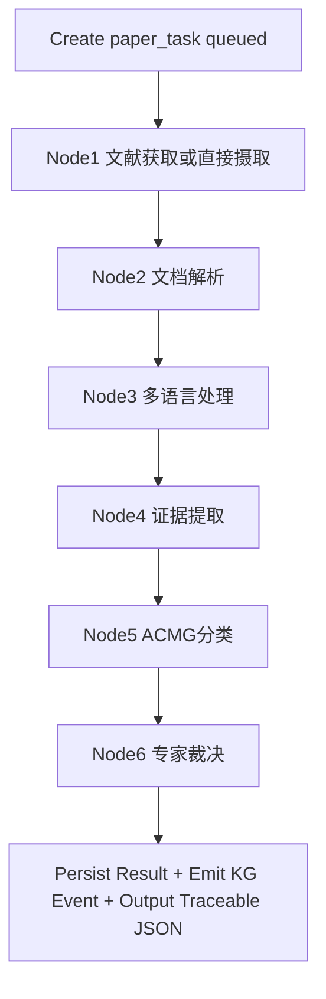

# ACMG-Lingua 应用流程（APP_FLOW）

## 1. 总览
系统由两个工作流组成：
1. 主工作流（业务闭环）：任务澄清 -> 请求确认 -> 分支摄取 -> 文档解析 -> 多语言处理 -> 证据提取 -> ACMG 分类 -> 专家裁决
2. KG 工作流（独立服务）：从 PostgreSQL 读取结构化证据，构建/更新 Neo4j 图谱

主工作流的请求级锚点是 `request_id`，单篇文献仍以 `paper_task_id` 作为最小执行单元。前端当前通过 `/tasks/new` 创建请求，通过 `/requests/:requestId` 监控请求，再按需进入 `/documents/:documentId` 和 `/graph`。

## 2. 前端入口与导航流程

### 2.1 `/tasks/new`：任务澄清与确认
1. 用户进入 `/tasks/new`。
2. 交互 Agent 最多追问 2 轮，生成结构化任务单（目标、疾病、国家、语种）。
3. 用户确认任务单后，后端持久化请求并返回 `request_id`。
4. 确认成功后，页面开放三条 intake 分支：upload、PubMed、web crawl。

### 2.2 三条 intake 分支
1. **Upload 分支**：用户上传 PDF / DOCX，调用 `/api/v1/tasks/requests/upload`。
2. **PubMed 分支**：用户跳转 `/tasks/pubmed/candidates`，检索候选文献并提交选中的 PMID。
3. **Web crawl 分支**：用户在 `/tasks/new` 直接提交 URL 列表，调用 `/api/v1/tasks/requests/web/crawl`。

无论从哪条分支进入，前端成功提交后都会跳转到 `/requests/:requestId`，保持统一的请求级监控体验。

## 3. `/requests/:requestId`：请求级监控中心
1. 请求监控页负责展示请求整体状态与所属 paper tasks。
2. 页面通过 `/api/v1/tasks/requests/{request_id}` 读取聚合状态。
3. 页面可进一步读取 `/api/v1/tasks/requests/{request_id}/source-stats` 展示来源命中与 fallback 信息。
4. 当某篇文献完成后，用户从请求页进入 `/documents/:documentId` 查看单文档证据。
5. 请求级实时更新通过 `WS /api/v1/stream/requests/{request_id}` 提供。

## 4. `/documents/:documentId`：单文档证据查看
1. 文档页调用 `/api/v1/evidence/document/{document_id}`。
2. 页面展示原文、译文、PS3/BS3 证据结构与图谱片段。
3. 文档页不承担请求级轮询，而是消费已完成的文档证据数据。

## 5. `/graph`：图谱检索与控制页
1. `/graph` 当前不是旧的分析页替代品，而是独立的 evidence graph 页面。
2. 页面主入口使用 `POST /api/v1/evidence/search` 执行图谱搜索。
3. 页面同时保留 `GET /api/v1/evidence/graph/stats` 统计能力。
4. 页面保留 `POST /api/v1/evidence/sync/document/{document_id}` 用于单文档图谱重同步。

## 6. 主工作流（单篇文献）

## 7. 节点执行细则
### 7.1 Node1 文献获取 / 摄取
- Upload 分支：已上传 PDF/DOCX，跳过外部检索，直接进入解析。
- PubMed 分支：通过候选检索与选中 PMID 构建 paper tasks。
- Web crawl 分支：以 URL 为输入创建 paper tasks，并记录 web source trace。
- 国家无命中：`FETCH_NO_RESULT`。
- 全文不可得：标记 `fulltext_unavailable`，降级摘要证据继续。

### 7.2 Node2 文档解析（`pdf-parser-service`）
- 输入：PDF/DOCX。
- PDF：优先 MinerU，失败回退 PaddleOCR-VL-1.5。
- DOCX：解析失败直接 `PARSE_FAILED`。
- 输出：结构化 `md` 与抽取图片 `jpg`，写入 MinIO。

### 7.3 Node3 多语言处理（`translation-service`）
- 原文英文：直接跳过。
- 非英文：全文翻译为英文。
- 输出：英文 `md` 写入 MinIO。
- 向量化：`BGE-M3` 写入 Qdrant。
- 对齐信息：写入 PostgreSQL alignment 表。

### 7.4 Node4 证据提取（`evidence-extraction-service`）
- 基础框架：`scispaCy + LlamaIndex`。
- 实体识别：基因、变异、蛋白、疾病、实验术语。
- 关系抽取：基因-变异-疾病关系。
- 实验信息抽取：方法、结果、结论。
- 检索策略：关键词检索 + 向量检索 + 精排。

### 7.5 Node5 ACMG 分类
- 基于 ACMG 指南知识库（RAG）进行分类。
- 输出分类结果、关键证据与推理过程。
- v1.0 范围：仅 PS3/BS3。

### 7.6 Node6 专家裁决
- 基于 RAG 汇总多源证据。
- 输出证据强度与裁决说明。

## 8. 请求级状态聚合
### 8.1 状态集合
- `queued`
- `running`
- `partial_failed`
- `failed`
- `success`

### 8.2 判定规则
1. `partial_failed`：至少 1 篇成功且至少 1 篇失败。
2. `success`：全部文献成功，或全部为 `FILE_DUPLICATE` 成功跳过。
3. `failed`：无成功文献且存在失败。

## 9. 错误与日志链路
1. API 失败响应固定：`failed + error_code + log_link`。
2. `log_link` 为签名 URL，24h 有效。
3. 过期后可重签发。
4. 重签发限流：每 `request_id` / `task_id` 按接口规则控制。

## 10. 当前前端路由结论
1. 当前 canonical flow 是 `/tasks/new` -> `/requests/:requestId` -> `/documents/:documentId`。
2. `/tasks/pubmed/candidates` 是确认后 PubMed 分支页，不是独立主入口。
3. Web crawl 是 `/tasks/new` 下的第三条 intake 分支，不需要单独旧分析页。
4. `/graph` 使用 evidence API，对齐当前图谱检索和同步能力。