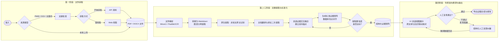
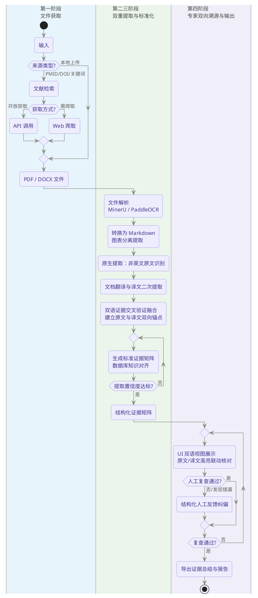

# APP_FLOW — ACMG Lingua Application Flow

## 1. End-to-End Business Flow

```text
User Input (PMID / DOI / keyword / local PDF / local DOCX)
        │
        ▼
┌─────────────────────────────────────────────────────────────┐
│ Phase 1: Literature Acquisition & Digitization              │
│ - Literature Agent fetches PMID/DOI/keyword-selected files   │
│ - Upload workflow accepts local PDF/DOCX                     │
│ - Metadata extraction before full parsing                    │
│ - MinerU/PaddleOCR converts PDF to MD/HTML                   │
│ - DOCX parser extracts text, tables, images                  │
│ - Layout analysis extracts tables, figures, bbox anchors     │
└──────────────────────────────┬──────────────────────────────┘
                               ▼
┌─────────────────────────────────────────────────────────────┐
│ Phase 2: Dual Cross-Lingual Evidence Extraction             │
│ - Coarse filtering locates evidence-bearing regions          │
│ - Original-language native extraction produces native JSON   │
│ - Translation produces English/Chinese review text           │
│ - Translated-text secondary extraction produces translated JSON│
│ - Fusion compares, deduplicates, and anchors both passes     │
└──────────────────────────────┬──────────────────────────────┘
                               ▼
┌─────────────────────────────────────────────────────────────┐
│ Phase 3: Entity Standardization & Knowledge Alignment        │
│ - HGNC / ClinVar / dbSNP / OMIM / HPO / ClinGen matching     │
│ - Exact match → synonym → vector fuzzy → conflict resolver   │
│ - Store standardized evidence matrix with bilingual anchors  │
└──────────────────────────────┬──────────────────────────────┘
                               ▼
┌─────────────────────────────────────────────────────────────┐
│ Phase 4: Bilingual Visualization & Expert Loop               │
│ - Side-by-side original/translated evidence review           │
│ - Click evidence → highlight original and translated spans   │
│ - Structured expert feedback and correction capture          │
│ - PDF/DOCX evidence summary report export                    │
│ - Curated original-translation-evidence dataset for tuning   │
└─────────────────────────────────────────────────────────────┘
```

ACMG Lingua's current product scope ends at structured evidence extraction, standardization, bilingual review, and evidence summary export. Downstream medical rating can consume the evidence matrix, but final ACMG/GDV classification is out of current MVP scope.

## 2. Phase 1: Literature Acquisition and Digitization

### 2.1 Input Routing

`POST /api/v1/tasks` is the authoritative task creation endpoint.

```text
User Input
    ├── Local PDF ─────────────► POST /api/v1/tasks multipart ─► Document parsing
    ├── Local DOCX ────────────► POST /api/v1/tasks multipart ─► Document parsing
    ├── PMID ─────────────────► POST /api/v1/tasks JSON ───────► Fetch literature
    ├── DOI ──────────────────► POST /api/v1/tasks JSON ───────► Fetch literature
    └── Keyword
          │
          ├── Search first: GET /api/v1/literature/search
          │
          └── User selects analyzable candidate
                └── POST /api/v1/tasks with selected_candidate
```

For keyword-created tasks, `selected_candidate` must include:

- `provider`
- `title`
- `canonical_id` when available (`doi`, `pmid`, or URL)
- `selected_download_url`

A keyword candidate must expose a downloadable document URL before it can enter analysis.

### 2.2 Document Parsing Pipeline

```text
PDF/DOCX Input
    │
    ├── Metadata extraction
    │     └── DOI, PMID, authors, year, journal, candidate source quality
    │
    ├── PDF path
    │     ├── MinerU primary parse
    │     └── PaddleOCR fallback when MinerU fails
    │
    ├── DOCX path
    │     └── Structured text/table/image extraction
    │
    ├── Layout analysis
    │     ├── Markdown/HTML text
    │     ├── Table JSON/CSV
    │     ├── Figure/pedigree/plot image regions
    │     └── VLM descriptions for medically relevant images
    │
    └── Traceability gate
          ├── page + section/line + source_anchor + bbox available → continue
          └── no source anchors/bbox-backed spans → fail task clearly
```

Evidence extraction requires traceable source anchors or bbox-backed spans. Output that cannot support source-linked review cannot enter the standardized evidence matrix.

### 2.3 Chunking Strategy

1. Split rendered document by logical sections when headings are available: abstract, methods, results, discussion, tables, figures, supplementary material.
2. Split each section by paragraph, table row, or figure panel.
3. Estimate token size for each chunk.
4. Split oversized paragraphs by sentence; split oversized sentences by character window.
5. Merge adjacent chunks within `max_tokens` while preserving source span mapping.

### 2.4 Cache Reuse

Every request creates a new `task_id`, even when previous outputs are reused.

Cache keys include:

- PDF/DOCX SHA256 hash.
- PMID.
- DOI.
- Parser version.
- Translation version.
- Native extraction prompt/model version.
- Translated extraction prompt/model version.
- Fusion prompt/model version.

The frontend receives normal processing-stage updates and does not need a cache-hit marker.

## 3. Phase 2: Cross-Lingual Processing and Dual Evidence Extraction

### 3.1 Why Dual Extraction Is Required

Medical genetics evidence depends on exact strings and context: HGVS variants, gene names, HPO phenotypes, family segregation, assay thresholds, figure labels, and table values. Translation can distort these details, but translated text is still valuable for reviewer comprehension and secondary extraction. ACMG Lingua therefore uses dual extraction and cross-validation:

```text
Source-language document chunk
    │
    ▼
Coarse evidence filtering
    │   identifies chunks likely containing phenotype, variant, segregation,
    │   functional assay, population frequency, method, or result evidence
    ▼
Original-language native extraction
    │   extracts native JSON + original source anchors
    ▼
Translation to English/Chinese
    │   translates evidence-bearing chunks or document sections
    ▼
Translated-text secondary extraction
    │   extracts translated JSON + translated source anchors
    ▼
Fusion and cross-validation
    │   compares native JSON vs translated JSON
    │   deduplicates equivalent items
    │   flags disagreement/missing evidence
    │   creates original↔translated anchor pairs
    ▼
Standard Evidence Item
    │   original_value + translated_value + bilingual_spans + confidence + fusion_status
```

Full translated renderings are generated for reviewer convenience and for secondary extraction. Extraction-critical data must retain both original source anchors and translated-text anchors when translated text exists.

### 3.2 Target Evidence Types

```text
Dual Evidence Extraction Output
    ├── Document metadata
    │     └── DOI, PMID, authors, year, journal, language
    ├── Variant data
    │     └── gene, HGVS, transcript, genomic coordinates, original mention
    ├── Disease and phenotype data
    │     └── disease name, HPO terms, clinical descriptors
    ├── Functional/experimental data
    │     └── assay method, material, controls, thresholds, quantitative result, conclusion
    ├── Genetic data
    │     └── segregation, de novo, case-control, proband count when present
    ├── Population data
    │     └── frequency, ancestry subset, source
    ├── Computational data
    │     └── conservation, protein predictors, splicing predictors when reported
    ├── Fusion status
    │     └── native_only / translated_only / agreed / conflict / manually_corrected
    └── Bi-directional traceability
          └── original page/line/bbox + translated page/line/bbox + table/figure IDs
```

Each evidence field has a confidence score and fusion status. Missing original anchoring, missing translated anchoring, or disagreement between extraction passes must be visible in downstream review.

## 4. Phase 3: Entity Standardization and Knowledge Alignment

```text
Fused Evidence JSON
    │
    ├── Gene mentions ─────────────► HGNC exact/synonym match
    ├── Disease mentions ──────────► OMIM / MONDO / HPO match
    ├── Phenotype mentions ────────► HPO match
    ├── Variant mentions ─────────► HGVS normalization → ClinVar / dbSNP
    ├── Population frequency ─────► gnomAD lookup when available
    ├── Gene-disease context ─────► ClinGen / OMIM support context when available
    │
    ▼
Match decision
    ├── Exact match → accept
    ├── Synonym match → accept with source
    ├── Single high-similarity vector match → accept with score
    ├── Multiple plausible candidates → conflict resolver Agent
    └── No reliable match → keep original and flag unstandardized
    │
    ▼
Standard Evidence Matrix
    └── original_value + translated_value + standardized_value
        + source_db + match_status + rationale + bilingual_spans
```

Ambiguous aliases are resolved using article context, co-mentioned disease, variant coordinates, organism/species, original-language terms, translated terms, and surrounding biomedical terms.

## 5. Phase 4: Bilingual Evidence Visualization and Expert Loop

### 5.1 Processing Status

The frontend connects to `WS /api/v1/tasks/{task_id}/ws` after task creation. Final results are fetched with `GET /api/v1/tasks/{task_id}/result`.

```json
{ "type": "status", "step": "acquisition", "progress": 20 }
{ "type": "status", "step": "parsing", "progress": 45 }
{ "type": "status", "step": "native_extraction", "progress": 58 }
{ "type": "status", "step": "translation", "progress": 68 }
{ "type": "status", "step": "translated_extraction", "progress": 76 }
{ "type": "status", "step": "fusion", "progress": 84 }
{ "type": "status", "step": "standardization", "progress": 92 }
{ "type": "status", "step": "report_preparation", "progress": 97 }
{ "type": "complete", "task_id": "xxx" }
{ "type": "error", "step": "parsing", "message": "Traceable parsing failed" }
```

### 5.2 Evidence Review UI

```text
┌────────────────────────────────────────────────────────────────────────────┐
│ Topbar: task, status, fusion warnings, export                             │
├──────────────────────────────┬──────────────────────────────┬─────────────┤
│ Original Document Panel      │ Translated Document Panel    │ Evidence    │
│                              │                              │ Panel       │
│ Original MD/HTML             │ English/Chinese MD/HTML      │ Matrix rows │
│ Original tables/figures      │ Translated tables/figures    │ Fusion      │
│ Highlighted original span    │ Highlighted translated span  │ Confidence  │
│ linked by original anchor    │ linked by translated anchor  │ Feedback    │
└──────────────────────────────┴──────────────────────────────┴─────────────┘
```

Clicking an evidence item scrolls both the original document and translated document to the corresponding highlighted spans. Table and figure evidence should highlight row/cell/region in both views when available.

### 5.3 Human Feedback Targets

Expert feedback is structured by target type:

- `native_extraction`: original-language extraction is wrong.
- `translated_extraction`: translated-text extraction is wrong or missing.
- `translation`: translated structured field/snippet is wrong.
- `fusion`: native and translated outputs were incorrectly merged, split, or deduplicated.
- `entity`: standardized gene/disease/variant/phenotype mapping is wrong.
- `evidence_item`: extracted evidence is missing, wrong, or over-interpreted.
- `missed_evidence`: important phenotype, method, or result was not extracted.
- `report`: evidence summary wording/commentary issue.

Feedback is persisted for audit and future dataset construction. Current-stage feedback does not directly mutate evidence rows unless a reviewed correction workflow is implemented.

### 5.4 Report Export Content

Evidence summary report exports include:

1. Report title and non-diagnostic disclaimer.
2. Document metadata and source list.
3. Standardized evidence matrix.
4. Native extraction JSON summary and translated extraction JSON summary.
5. Fusion status: agreed, native-only, translated-only, conflict, manually corrected.
6. Extracted phenotype, method, experiment result, population, and computational evidence.
7. Entity standardization table with match status/rationale.
8. Original snippets and translated snippets.
9. Table/figure references and VLM descriptions.
10. Confidence scores and low-confidence/fusion-conflict flags.
11. Expert comments and structured feedback.
12. Appendix with original anchors, translated anchors, page/line references, and bbox/table/figure IDs.

## 6. API Flow Summary

```text
Frontend (Next.js)
    │
    ├── /api/v1/* proxy via next.config.ts
    ▼
Backend (FastAPI)
    ├── POST /api/v1/auth/register
    ├── POST /api/v1/auth/verify-email
    ├── POST /api/v1/auth/login
    ├── GET  /api/v1/literature/search
    ├── POST /api/v1/tasks
    ├── GET  /api/v1/tasks/{task_id}
    ├── WS   /api/v1/tasks/{task_id}/ws
    ├── GET  /api/v1/tasks/{task_id}/result
    ├── POST /api/v1/tasks/{task_id}/comments
    ├── POST /api/v1/tasks/{task_id}/export
    ├── GET  /api/v1/evidence          # P1/future
    └── GET  /api/v1/health
```

Task/result reads are public in the current MVP. Comments/feedback require login. Deployed task creation should require login; local development may allow unrestricted task creation.

## 7. Business Topology




