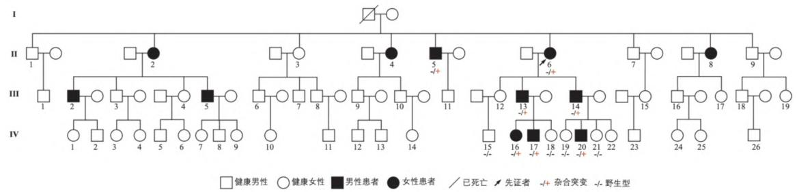
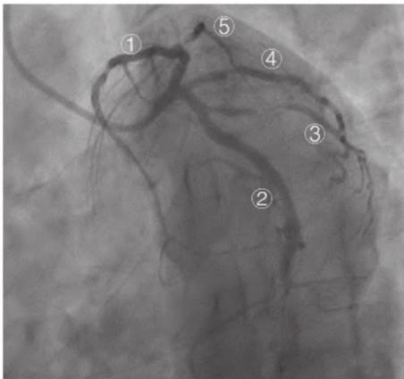
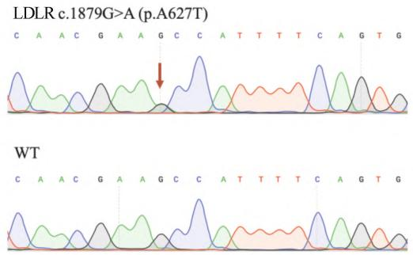

# 基因检测早期诊断家族性高胆固醇血症一家系临床及遗传特点分析

徐峰ʰ,林凯俊¹，丁远亮},曹春艳,²,杨康¹,王柠¹,林珉婷'

1.福建医科大学附属第一医院神经内科,福建 福州 35000;2.河南科技大学第一附属医院神经内科,河南 洛阳 471000

[摘要]目的通过基因检测早期诊断家族性高胆固醇血症(familial hypercholesterolemia,FH)一家系，旨在提高临床医生对FH的识别及诊断能力,早期进行干预治疗。方法收集就诊于福建医科大学附属第一医院神经内科高胆固醇血症家系的临床资料，并进行基因测序分析。结果家系成员中有7例发现存在高血胆固醇、高血低密度脂蛋白胆固醇(LDL-C),患者年龄8\~59岁。I5 因反复心绞痛,检查发现冠脉狭窄行冠状动脉支架置入术。基因检测发现所有患者均存在LDLR基因$\operatorname { E x o n 1 3 \ c . } 1 8 7 9 \ \operatorname { G } \mathrm { > A } ( \mathrm { p . ~ A } 6 2 7 \mathrm { T } )$ 位点杂合突变,最终诊断为FH。结论FH起病隐匿，早期无明显临床症状,极易漏诊。基因检测技术对FH患者及其亲属进行遗传筛查,不仅有助于早期诊断,还可根据基因型进行个体化治疗,特别是对儿童患者的预防性治疗具有重要意义

[关键词]家族性高胆固醇血症;基因检测;LDLR[中图分类号]R589.2 [文献标志码]A [文章编号]1672-6170(2024)05-0017-05

Genetic testing for early diagnosis of familial hypercholesterolemia and analysis of clinical and genetic characteristics of a family with familial hypercholesterolemiaXU Feng'， LIN Kaijun'，DING Yuan-liang'，CAO Chun-yan1.2， YANG Kang'，WANG Ning'，LIN Ming-ting'1. Department of Neurology，The First Affiliated HospitalofFujian Medical University，Fuzhou 35Oooo,China;2.Department of Neurology，The First Afiliated Hospital of Henan University of Science and Technology，Luoyang 471000， China

# [Corresponding author] LIN Ming-ting

[Abstract]ObjectiveToearlydiagnoseafamilywithfamilial hypercholesterolemia（FH）through genetic testing inorderto improveheabilityofclinicianstoidentifyanddiagnoseFHandprovideteearlyinterventionandtreatment.MethodsClincaldata werecolectedfromafamilywithhypercholesterolemiatreatedinourhospital.Geneticsequencinganalysisasconductedonthefamily members.ResultsSevenfmilymembers，gedbetween8and59years，wereidentifiedwithincreasedlevelsofcholesterolandLDLC.IndividualI5suferedcoronaryarterystenosisandadcoronarystentimplantationduetorepeatedangna pctoris.Genetictesting identified a heterozygous mutation at the LDLR gene Exon 13 c.1879 $\mathrm { G } { > } \mathrm { A }$ （p.A627T）in all affected members.The diagnosis of FH wasconfirmed.ConclusionsTheonsetofFHisinsidious.Therearenoobvious clinicalsymptomsintheearlystage，sothaitis easilymissedGenetictestingtecholgyforgneticsreningofFHpatientsndteirelativesnotolyhelpsarlydiagosis,ualso provides personalized treatmentbasedon genotype.It is especially important forpreventive treatmentof pediatric patients.

[Key words]Familial Hypercholesterolemia; Genetic Testing;LDLR

家族性高胆固醇血症（familialhypercholesterolemia,FH)是一种常见的常染色体显性遗传病,以血浆低密度脂蛋白胆固醇(low densitylipoproteincholesterol,LDL-C)升高、外周组织黄色瘤以及脂质角膜环为临床特征。在中国,FH患者出现早发冠状动脉粥样硬化性疾病(CAD)的风险是非FH患者的五倍[1],流行病学研究表明,全球 FH的总体患病率约为1/500,FH纯合子患病率约为$1 / 1 0 0$ 万[2],但是绝大部分国家和地区FH患者诊断率却小于 $1 \% ^ { [ 3 ] }$ 。FH是一种严重危及生命的疾病，从突变形式上分为杂合突变 HeFH 和纯合突变HoFH两种类型,纯合子FH(HoFH)患者通常在30岁之前死亡,杂合子FH(HeFH)40 岁的男性和 50岁的女性患者出现了一系列卒中的临床事件,其中约 $7 . 1 \%$ 的早发心肌梗死(MI)病例由FH引起[1]。FH发病率高,并发症风险高,但FH的患者早期不具有明显的临床特征,多数是在体检时候发现血脂异常升高而就诊,此时患者可能LDL-C已升高多年,增加了动脉粥样硬化、心血管疾病的发生和死亡的风险[4]。欧洲[5]和美国[6的FH指南中建议尽早确诊FH患者,以便可以在生命早期进行降 LDL-C 治疗,改善患者预后。本研究通过基因检测早期诊断了家族性高胆固醇血症一家系进行报道,以便临床医生及早识别及诊断家族性高胆固醇血症，早期进行干预治疗。

# 1资料与方法

1.1一般资料收集 2021年12月就诊于福建医科大学附属第一医院神经内科的FH一家系的临床资料,包括血脂、心电图、心脏及颈动脉彩超等检查，以及进行基因测序。所有患者均签署知情同意书,包括先证者（Ⅱ6)以及先证者的二哥（Ⅱ5）、儿子（Ⅲ13 和Ⅲ14）、孙子（IV15、V17、V20）、孙女（IV16、V18、IV19 和IV21)共11名,家系图见图1。本研究获得福建医科大学附属第一医院伦理委员会批准（FYYY2006-01-19-01）。

  
图1家族性高胆固醇血症的家系谱图

# 1.2方法

1.2.1临床资料采集详细记录先证者及家系成员常规体格检查及血脂、心电图、心脏彩超及颈动脉彩超检查：先证者（Ⅱ6）先证者的二哥（Ⅱ5）、先证者大儿子（Ⅲ13）、先证者小儿子（Ⅲ14）、先证者孙女（IV16）、先证者孙子（IV17和V20)等家属成员进行详细体格检查。根据先证者及其家系的血缘关系绘制家系图。

1.2.2外周血基因组DNA 提取及检测在征求患者知情同意后，抽取先证者及其家属的外周静脉血样 $5 ~ \mathrm { m l }$ ,EDTA 抗凝,使用“天根T-Guide M16”自动核酸提取仪提取先证者及家属外周血DNA,用微量分光光度计（Thermo Scientific NanoDrop 2O00）进行DNA 浓度及纯度的测定。保证所有的DNA样品浓度 ${ > } 1 0 0 \ \mathrm { n g / \mu l }$ ,A260/A280 在 $1 . 8 \sim 2 . 0$ 。

1.2.3基因测序和 PCR 扩增和测序对先证者进行全外显子测序,方法参照既往的文章[7]。参照Ensemble数据库中LDLR基因（NM_00527.4）相关序列,用 SnapGene 设计引物,并在 Primer designingtool数据库上验证引物特异性。分别对LDLR基因第13外显子进行扩增,引物F：TGGCCTGTGTCT-CATCCCAGTGTTTAACGG，引物 R：CCCATTTGA-CAGATGAGCAGAGAGAGGCTC。PCR反应体系25$\mu \mathrm { l }$ ,反应体系包括 $9 ~ \mu \mathrm { l }$ PCR水, $1 2 . 5 ~ \mu \mathrm { l }$ KOD MIXONE(东洋纺（上海)生物科技有限公司）,引物各$0 . 7 5 ~ \mu \mathrm { l } , 2 ~ \mu \mathrm { l }$ DNA( ${ > } 1 0 0 \ \mathrm { n g / \mu l }$ ， $\mathrm { A } 2 6 0 / \mathrm { A } 2 8 0$ 在1.8$\sim 2 . 0 $ 。PCR扩增反应条件： $9 5 ~ \mathrm { { 9 C } }$ 预变性 $1 \ \mathrm { m i n }$ ,进入35个反应循环， $9 5 \ \mathrm { { ~ ‰ ~ } }$ 变性 $1 5 \textrm { s } , 5 5 \textrm { ‰}$ 退火， $7 2 \ \mathrm { ~ \textdegree C }$ 延伸 $3 0 \textrm { s } , 7 2 \textrm { ‰}$ 延伸 $7 ~ \mathrm { m i n }$ 。PCR产物经 $2 \%$ 的琼脂糖凝胶电泳检测,对片段大小符合要求的产物进行测序分析。测序结果参照Ensemble 数据库中LDLR基因（NM_00527.4)序列进行比对。对Ⅱ6、5、13、Ⅲ14、IV15、V16、V17、V18、V19、IV20和IV21等家系成员进行基因检测。

# 2结果

2.1临床表型先证者及患者的临床表型、血脂及辅助检查详见表1。先证者（II6）,女,57岁。患者于48岁体检发现血浆LDL-C $7 \sim 8 \ \mathrm { m m o l / L }$ ,间断服用阿托伐他汀钙片（ $4 0 \ \mathrm { \ m g / }$ 天)，自行停药1年,LDL-C再次升高至 $1 2 . 4 4 \mathrm { \ m m o l / L }$ ；颈动脉彩超提示双侧颈动脉斑块形成、右侧锁骨下动脉起始部斑块形成;心电图正常;心脏彩超示：二尖瓣少量反流。查体未发现黄色瘤和脂质角膜环,父母非近亲结婚,家系成员有多位成员有高脂血症病史。实验室检查：Ⅱ6、Ⅱ5、Ⅲ13、Ⅲ14、V16、V17和IV20 的血脂检查均发现LDL-C、总胆固醇(TC)均有不同程度的升高。颈动脉彩超发现II6、II5和III13颈动脉或锁骨下动脉斑块形成。Ⅱ5在50岁左右出现反复胸闷症状（长期口服阿托伐他汀）,心电图表现为Ⅲ导联Q波,行冠脉造影提示左冠状动脉多处狭窄（图2），并先后于56岁和59岁行“冠状动脉支架植人术”。

表1家族性高胆固醇血症一家系成员临床表型、血脂及辅助检查结果  

<table><tr><td>指标</td><td>6</td><td>I5</td><td>Ⅲ13</td><td>Ⅲ14</td><td>V16</td><td>V17</td><td>IV20</td></tr><tr><td>年龄</td><td>57</td><td>59</td><td>37</td><td>34</td><td>10</td><td>8</td><td>10</td></tr><tr><td>性别</td><td>女</td><td>男</td><td>男</td><td>男</td><td>女</td><td>男</td><td>男</td></tr><tr><td>黄色瘤</td><td>无</td><td>无</td><td>无</td><td>无</td><td>无</td><td>无</td><td>无</td></tr><tr><td>角膜环</td><td>无</td><td>无</td><td>无</td><td>无</td><td>无</td><td>无</td><td>无</td></tr><tr><td>指标</td><td>I6</td><td>Ⅱ5</td><td>Ⅲ13</td><td>Ⅲ14</td><td>V16</td><td>V17</td><td>V20</td></tr><tr><td>TC(mmol/L)</td><td>12. 44</td><td>6.24</td><td>7. 17</td><td>7.31</td><td>7.82</td><td>8.16</td><td>8.35</td></tr><tr><td>LDL-C(mmol/L)</td><td>10.45</td><td>4.51</td><td>5.78</td><td>5.93</td><td>7. 01</td><td>6.57</td><td>7. 42</td></tr><tr><td>TG(mmol/L)</td><td>1. 22</td><td>1. 99</td><td>0.71</td><td>0.99</td><td>0.84</td><td>0. 99</td><td>0. 66</td></tr><tr><td>HDL-C(mmol/L)</td><td>0.13</td><td>1. 03</td><td>1. 29</td><td>1.31</td><td>1.53</td><td>1. 57</td><td>1. 61</td></tr><tr><td>Ap0-A1(g/L)</td><td>1.49</td><td>1. 18</td><td>1. 23</td><td>1. 23</td><td>1.43</td><td>1. 48</td><td>1. 55</td></tr><tr><td>Apo-B(g/L)</td><td>3.06</td><td>1.52</td><td>1. 67</td><td>1. 61</td><td>1.80</td><td>1. 70</td><td>1.80</td></tr><tr><td>心电图</td><td>正常</td><td>窦性心动过缓</td><td>窦性心动过缓</td><td>窦性心动过缓</td><td>正常</td><td>窦性心律不齐窦性心律不齐</td><td></td></tr><tr><td>颈动脉斑块</td><td>存在</td><td>存在</td><td>存在</td><td>存在</td><td>无</td><td>无</td><td>无</td></tr><tr><td>心脏彩超</td><td>二尖瓣反流</td><td>主动脉反流</td><td>正常</td><td>二尖瓣反流</td><td>正常</td><td>正常</td><td>正常</td></tr></table>

TC：总胆固醇；TG：三酰甘油；LDL-C：低密度脂蛋白胆固醇；HDL-C：高密度脂蛋白胆固醇；Apo-A1：载脂蛋白A1；Apo-B：载脂蛋白B

  
图2Ⅱ5患者的冠脉造影图 $\textcircled{1}$ 左前降支LAD; $\textcircled{2}$ 左回旋支 LCX; $\textcircled{3}$ 钝缘支OM； $\textcircled{4}$ 中间支RI; $\textcircled{5}$ 对角支D

2.2Sanger测序结果先证者II6全外显子测序测序结果显示在LDLR基因的第13 号外显子存在c. 1879 $\mathrm { G } > \mathrm { A }$ (p.A627T)杂合变异。家系中先证者二哥（Ⅱ5）、先证者大儿子（Ⅲ13）、先证者小儿子（ⅢI14）先证者孙女（IV16）、先证者孙子（IV17）、先证者孙子(IV20)均存在该位点杂合突变,且均存在高胆固醇血症的临床表型,而其他血脂正常家系成员该位点为野生型,因此符合家系共分离（图3），诊断为家族性高胆固醇血症。

  
图3患者和家系成员LDLR 基因测序图

2.3变异的致病性分析遗传变异的致病性依据美国医学遗传学与基因组学学会（American collegeof medical genetics and genomics and the associationformolecularpathology,ACMG-AMP）遗传变异分类标准与指南[8]，采用CADD、SIFT、Polyphen2、Mutation Taster 软件结合人工判读[9]。LDLR基因c. 1879 $\mathrm { G } > \mathrm { A }$ （p.A627T)为错义突变,导致密码子627位的丙氨酸替换为苏氨酸，该丙氨酸残基高度保守,位于LDLR蛋白表皮生长因子前体结构域,该变异降低了LDLR 蛋白与LDL-C 的结合能力，从而影响LDL-C 的肝细胞转运,使血清LDL-C 水平升高。该位点软件预测：CADD 评分27.2分,SIFT（Damaging），Polyphen2HVAR（ Probablydamaging），MutationTaster（Diseasecausing）。OMIM收录编码252101。确定该突变位点c.1879G${ > } \mathrm { A }$ （p.A627T)为家族性高胆固醇血症致病突变位点。

# 3讨论

LDLR基因突变在临床确诊的FH患者中是最常见的突变类型,另有 $2 0 \% \sim 3 5 \%$ 为非 LDLR 基因突变[10]。LDLR基因位于染色体 $1 9 \mathrm { p } 1 3 . 2$ ，由18个外显子和17个内含子组成,包含5个不同的功能域,当外显子发生突变可使LDLR蛋白相应的功能域不同程度受损,导致LDLR 蛋白的功能障碍，目前已知 FH患者中共检测出了3000 多种基因突变，包括缺失、插入、无义突变、错义突变、拷贝数变异等[11\~14]。LDLR 蛋白广泛分布于肝脏、动脉壁平滑肌、血管内皮细胞和白细胞,通过受体介导的内吞作用特异结合并内吞含apoB100 或apoE 的脂蛋白，从而清除血中的 LDL-C[10]。LDLR 基因突变导致细胞膜表面LDLR蛋白结构功能异常，不能有效代谢体内LDL-C,导致LDL-C 因清除障碍而在血液或其他组织中过度淤积引发高胆固醇血症[12,15,16]。

本文报道了FH一家系,其中先证者因LDL-C升高就诊，随后对其家系成员进行血脂筛查及遗传筛查发现家系中高胆固醇血症成员均存在LDLR基因杂合突变,诊断为HeFH。本文中家系中临床表型差异大,先证者二哥(Ⅱ5)反复出现心绞痛症状,行冠脉造影发现冠状动脉多处狭窄，并行冠状动脉支架植入术。但其他的 HeFH 患者，除了LDL-C 和高胆固醇血症的实验室检查结果外，无其他明显的临床指征,这对临床诊断带来了很大的困难,很容易误诊、漏诊。根据家系成员杂合突变的儿童的血脂情况推测该患者可能自幼年起即存在高脂血症，长时间暴露于高脂血症而造成严重的心血管疾病的发生[17]。我们通过先证者实验室检查,家族史分析,和进一步的基因检测,分别在短时间内对家系成员确诊了疾病。基因检测分析对该病的诊断和治疗扮演着重要角色，尤其是对儿童患者的诊断和预防性的治疗有着重要的意义。目前国内外对于FH 的筛查诊断尚无统一共识,但普遍认为家系筛查是一种高性价比的方案[18]。而且部分人群虽携带致病突变,存在表型外显率低的情况,如LDL-C水平虽然升高,但并未达到FH的诊断标准[19]。通过采用基因检测技术的临床筛查较传统的临床检查诊断的检出率明显升高[20]。

基因检测技术不仅对FH的早期诊断具有重要价值,而且对HeFH或HoFH患者治疗方案的制定有重要价值。FH的治疗首先改善生活方式和饮食控制,还有药物治疗、脂蛋白血浆置换以及肝脏移植等治疗方法[2I]。一旦确诊FH,就应该立即改变生活方式,HeFH患者经他汀类药物治疗可有效降低低密度脂蛋白胆固醇(LDL-C)浓度,从而降低大多数患者的心血管风险。但HoFH患者应用他汀类药物的疗效较差，因为这些患者较少或没有低密度脂蛋白受体上调,需要进行脂蛋白血浆置换以及肝脏移植等治疗方案[2I]。本研究家系中经过基因检测诊断为HeFH,先证者的二哥（ⅡI5)已经出现了高脂血症的严重并发症,冠状动脉狭窄病变并行支架植入术,先证者（Ⅱ6)以及先证者的儿子（Ⅲ13）、儿子(Ⅲ14)也已经存在颈动脉粥样硬化斑块的并发症,随时可能出现卒中血管事件的风险。先证者口服阿托伐他汀片血脂能降至满意,但自行停用后，仅靠饮食和锻炼，血胆固醇再次升高,故仍需继续应用阿托伐他汀口服,监测血脂及肝功情况。对于无症状的HeFH儿童,首先调整饮食与运动,必要时加用阿托伐他汀片药物,监测血脂及肝功情况，尽量减少高脂血症引起的并发症。

综上所述,FH起病隐匿,早期无其他明显的临床症状,极易漏诊,基因检测技术对FH患者及其亲属,特别对于儿童,进行遗传筛查不仅对早期诊断起到十分重要的作用,而且还可根据患者的基因型进行个体化治疗。通过基因诊断确诊后，尤其是对幼年儿童们的进行提前干预,避免长期暴露于高脂血症而造成严重的心脑血管疾病等血管事件的发生。

#

[参考文献]   
[1]Li S,Zhang Y,Zhu CG,etal.Identification of familial hypercholesterolemia in patients with myocardial infarction：A Chinese cohort study[J].J Clin Lipidol,2016,10(6):1344-1352.   
[2] Wang H,Yang H,Liu Z,et al. Targeted Genetic Analysis in a ChineseCohortof208PatientsRelatedtoFamilial Hypercholesterolemia[J].JAtheroscler Thromb，2020,27（12）: 1288-1298.   
[3]Cui Y，Li S，ZhangF，et al．Prevalence of familial hypercholesterolemia in patients with premature myocardial infarction [J].Clin Cardiol,2019,42(3）:385-390.   
[4]Takeji Y,Tada H,Takamura M,et al．Prevalence and Clinical Characteristics of Familial Hypercholesterolemia in Patients with Acute Coronary Syndrome according to the Current Japanese Guidelines:Insight from the EXPLORE-J study[J].JAtheroscler Thromb,2024，Epub ahead of print.   
[5]Piepoli MF,Hoes AW,Agewall S,et al. 2016 European Guidelines on cardiovascular disease prevention in clinical practice：The Sixth Joint Task Force of the European Society of Cardiology and Other Societies on Cardiovascular Disease Prevention in Clinical Practice (constituted by representativesof 10 societiesand by invited experts）Developed with the special contribution of the European Association for Cardiovascular Prevention & Rehabilitation（EACPR) [J]．Eur Heart J,2016,37(29): 2315-2381.   
[6]Grundy SM，Stone NJ，Bailey AL，et al. 2018 AHA/ACC/ AACVPR/AAPA/ABC/ACPM/ADA/AGS/APhA/ASPC/NLA/ PCNA Guideline on the Management of Blood Cholesterol：A Report of the American College of Cardiology/American Heart Association Task Force on Clinical Practice Guidelines[J].JAm Coll Cardiol, 2019,73(24) :e285-e350.   
[7] Yao XP,Cheng X,Wang C,et al.Biallelic Mutations in MYORG Cause Autosomal Recessive Primary Familial Brain Calcification[J]. Neuron,2018,98(6) : 1116-1123.   
[8]Richards S,Aziz N,Bale S,et al.Standards and guidelines for the interpretationofsequencevariants:ajointconsensus recommendation of the American College of Medical Genetics and Genomics and the Association for Molecular Pathology[J]．Genet Med,2015,17(5): 405-424.   
[9]Li Q,Wang K.InterVar: Clinical Interpretation of Genetic Variants by the 2015 ACMG-AMP Guidelines[J].Am JHum Genet,2017, 100(2): 267-280.   
[10]孟晓露，司钴，申育奇，等．九例家族性高胆固醇血症患者的 基因突变检测[J]．中华医学遗传学杂志,2018,35（6)： 783-786.   
[11]Nordestgaard BG,Chapman MJ,Humphries SE,et al. Familial hypercholesterolaemia isunderdiagnosed and undertreated in the general population：guidance for clinicians to prevent coronary heart disease:consensus statement of the European Atherosclerosis Society [J]．Eur Heart J,2013,34(45): 3478-3490.   
[12]Landrum MJ,Lee JM,Benson M,et al.ClinVar:public archive of interpretations of clinically relevant variants[J].Nucleic Acids Res， 2016,44(D1):D862-868.   
[13]Iacocca MA,Hegele RA．Role of DNA copy number variation in dyslipidemias[J]．Curr OpinLipidol,2018,29(2)：125-132.   
[14]Defesche JC,Gidding SS,Harada-Shiba M,etal.Familial hypercholesterolaemia[J].Nat Rev Dis Primers,2017,3：17093.   
[15]Yamamoto T，Davis CG，Brown MS，et al.The human LDL receptor：a cysteine-rich protein with multiple Alu sequences in its mRNA[J].Cell,1984,39(1):27-38.   
[16]Heath KE,Gahan M，Whittall RA，et al.Low-density lipoprotein receptor gene（LDLR）world-wide website in familial hypercholesterolaemia：update,new features and mutation analysis[J].Atherosclerosis，2001,154(1):243-246.   
[17]Funabashi S,Kataoka Y,Hori M,et al.Asymptomatic Intracranial Artery Stenosis/Occlusion in Heterozygous Familial Hypercholesterolemia：Its Frequency and Implications for Cerebrovascular and Cardiovascular Events[J].JAmHeart Assoc，2024，13 (15):e033972.   
[18]Rosso A，Pitini E，D'Andrea E，et al．The Cost-effectiveness of Genetic Screening for Familial Hypercholesterolemia：a Systematic Review[J]．AnnIg，2017,29(5):464-480.   
[19]Garcia-Garcia AB,Ivorra C，Martinez-Hervas S,et al．Reduced penetrance of autosomal dominant hypercholesterolemia in a high percentage of families：importance of genetic testing in the entire family[J]．Atherosclerosis，2011,218(2）:423-430.   
[20]VrablikM，VaclováM，TichyL，etal．Familial hypercholesterolemia in the Czech Republic：more than 17 years of systematic screening within the MedPed project[J].Physiol Res, 2017,66(Suppl1):S1-s9.   
[21]Reijman MD,Kusters DM,Wiegman A．Advances in familial hypercholesterolaemia in children[J]．Lancet Child Adolesc Health, 2021,5(9):652-661. （收稿日期：2024-07-27;修回日期：2024-08-14) (本文编辑:林赞)

# 《实用医院临床杂志》论文撰写要求

1文题：力求简明、醒目,反映文章的主题。中文文题以20个汉字以内为宜,必要时可加副标题,题名中应避免使用非公知公用的缩略语、字符、代号及结构式和公式。

2 作者：作者姓名在文题下按序排列,排序在投稿时确定,在编排过程中不再变更。中国作者姓名的汉语拼音采用姓前名后,中间为空格,姓氏的全部字母大写,复姓连写。外国作者姓名写法遵照国际惯例。作者单位名称(列出科室)、地址及邮编列于作者姓名之下一行。不同单位的作者,在姓名右上角加注不同的阿拉伯数字序号,工作单位序号与作者序号应一致。作者简介附在文后,文章的第一作者可按以下顺序简介：姓名、性别、学历/学位、职称、主要社会兼职及研究方向。

3摘要：论著须附中外文摘要，摘要（Abstract）必须包括目的（Objective）、方法（Methods）、结果（Results）、结论(Conclusion)四部分,采用第三人称叙述,不用“本文”等主语。中文摘要不超过300字。英文摘要应与中文摘要一致,400 个实词左右。

4关键词：中外文摘要下分别列关键词。尽量采用美国国立医学图书馆编辑的《Index Medicus》的医学主题词表(MeSH)中所列的词。一般列出3\~8个关键词,各词汇之间空一格,用分号“；”隔开。

5文内标题层次;使用国际通用的阿拉伯数字分级连续编号的国际层次序号表示法。不同层次的数字之间用小圆点“.”相隔,末位数字后不加点号,各层次的序号均左顶格起排书写,后空一个字接写标题。

6医学名词：以全国科学技术名词审定委员会(原全国自然科学名词审定委员会)审定、公布,科学出版社出版的《医学名词》和相关学科的名词为准。尚未公布者以人民卫生出版社《英汉医学词汇》为准。文章所用中外文医学名词,应使用全名;用简称者,在文章首次出现处加括号注明。

7计量单位：参考《中华人民共和国法定计量单位》,并以单位符号表示。血压计量单位使用毫米汞柱$\mathrm { ( m m H g ) }$ 。首次出现时用括号加注与 $\mathrm { k P a }$ 换算系数。单位符号中表示相除的斜线不能多于一条,如 $\mathrm { m g / k g / }$ d应为 $\mathbf { m g } / ( \mathbf { k g } \cdot \mathbf { d } )$ 。中药计量单位,1钱以 $3 \mathrm { g }$ 计,1两以 $3 0 \mathrm { g }$ 计。

8数字：按《出版物上数字用法的规定》。公历世纪、年代、年、月、日、时刻和计数、计量均用阿拉伯数字。书写百分数范围,前一个数字的百分符号不能省略，如 $5 \% \sim 3 0 \%$ ,不要写成 $5 \sim 3 0 \%$ 。书写百分数的公差，中心值与公差用圆括号括起,其后写“ $\%$ ”,如： $( 6 5 \pm 2 ) \%$ ，不得写作“ $6 5 \pm 2 \%$ ”。附带尺寸单位的数值相乘，按下列方式书写： $4 \mathrm { c m } { \times } 3 \mathrm { c m } { \times } 5 \ \mathrm { c m }$ ,而不用 $4 \times 3 \times 5 \mathrm { c m } ^ { 3 }$ 。